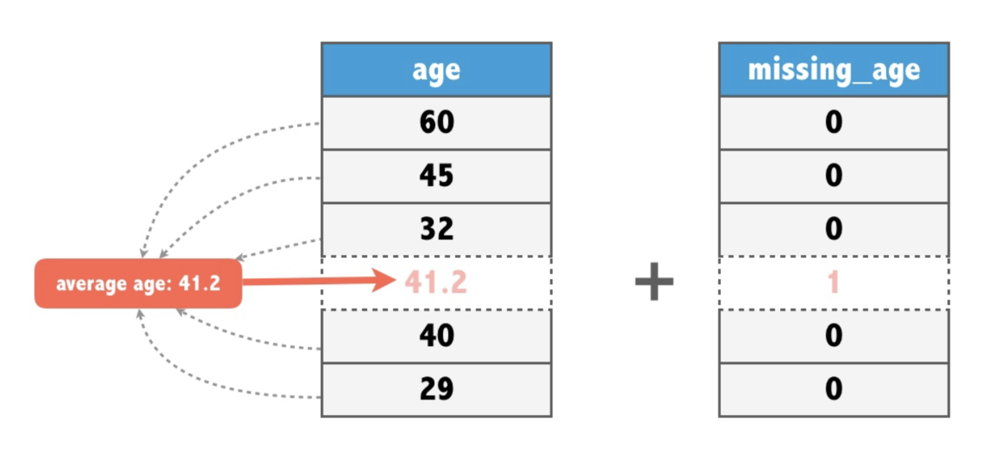
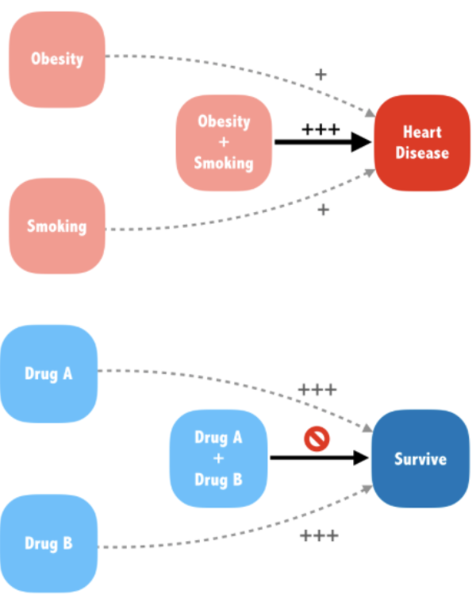
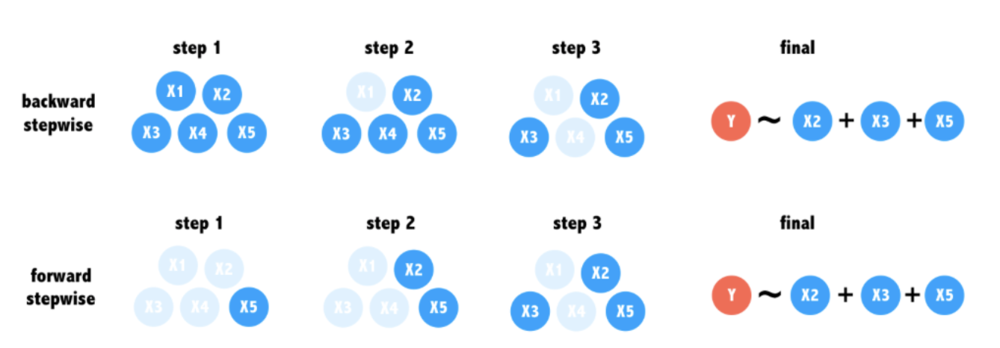

```{r setup, include=FALSE}
knitr::opts_chunk$set(echo = TRUE)
```

### Логистическая регрессия

Набор данных доноров содержит 93 462 примера людей, отправленных по почте в ходе сбора средств для парализованных военных ветеранов. Столбец пожертвований равен 1, если человек сделал пожертвование в ответ на рассылку, и 0 в противном случае. Этот двоичный результат будет зависимой переменной для модели логистической регрессии.

Остальные столбцы - это характеристики потенциальных доноров, которые могут влиять на их поведение в отношении пожертвований. Это независимые переменные модели.

При построении регрессионной модели часто полезно сформировать гипотезу о том, какие независимые переменные будут предиктивными для зависимой переменной. Столбец bad_address, для которого недопустимый почтовый адрес равен 1, в противном случае - 0, похоже, что он может уменьшить вероятность пожертвования. Точно так же можно подозревать, что религиозный интерес (Interest_religion) и интерес к делам ветеранов (Interest_veterans) будут связаны с большей благотворительностью.

```{r message=FALSE}
library(readr)
donors <- read_csv('donors.csv')
```

Смотрим как выглядит табличка и  смотрим на баланс классов.

```{r}
str(donors)
table(donors$donated)
```

Строим модель с помощью функции `glm`. Параметр `family = "binomial"` означает, что мы хотим обучить линейную регрессию. СДЕЛАТЬ ФУНКЦИЮ, ЧТОБЫ НЕ ЗАПОМИНАТЬ ЭТОТ binomial

```{r}
donation_model <- glm(formula = donated ~ bad_address + interest_religion +
                                          interest_veterans, 
                      data = donors, family = "binomial")
summary(donation_model)
```

Сделаем прогноз в виде с помощью функции `predict`, параметр `type = "response"` означает, что мы хотим получить прогноз в виде вероятности.

```{r}
donors$donation_prob <- predict(donation_model, type = "response")
```

Теперь выбрав порог поставим метки 1 или 0. И посчитаем `accuracy`.

```{r}
donors$donation_pred <- ifelse(donors$donation_prob > 0.0504, 1, 0)
mean(donors$donation_pred == donors$donated)
```

Получилось около 80%. Говорит ли нам это о том, что алгоритм хорошо работает? Давайте попробуем найти какой был бы accuracy, если бы у нас был алгоритм, который выдавал только 0.

```{r}
mean(donors$donated == 0)
```

0.95! То есть наш алогритм работает хуже, чем константный алгоритм.

### ROC-AUC

Подгружаем пакет, вычисляем ROC-кривую, рисуем ее и считаем AUC.

```{r}
# Load the pROC package
library('pROC')

# Create a ROC curve
ROC <- roc(donors$donated, donors$donation_prob)

# Plot the ROC curve
plot(ROC, col = 'blue')

# Calculate the area under the curve (AUC)
auc(ROC)
```

Теперь видим, что модель не лучше чем обычный алгоритм.

AUC не всегда означает, что одна модель лучше другой. Для разных задач все может быть по-разному.

### Дамми переменные, пропущенные значения и эффект.


#### Дамми переменные

Все переменные должны быть числовыми. То есть все категориальные переменные нужно представить в виде цифр.
Пропущенные значения тоже мешают, так как мы не можем вычислить прогноз.

glm автоматически переводит категориальные переменные в числовые(Лучше показать OHE)

```{r}
# Convert the wealth rating to a factor
donors$wealth_rating <- factor(donors$wealth_rating, levels = 0:3, 
                                labels = c('Unknown', 'Low', 'Medium', 'High'))

# Use relevel() to change reference category
donors$wealth_rating <- relevel(donors$wealth_rating, ref = 'Medium')

# See how our factor coding impacts the model
summary(glm(donated~wealth_rating, data = donors, 
            family = "binomial"))
```

releval сделал medium более важной

#### пропущенные значения

пропущенные данные можно заполнить средним значением по этой переменной и создать еще одну переменную, в которой мы укажем, что это значение отсутствовало и мы его заменили средним



```{r}
# Find the average age among non-missing values
summary(donors$age)

# Impute missing age values with the mean age
donors$imputed_age <- ifelse(is.na(donors$age), round(mean(donors$age, na.rm=TRUE),2), donors$age)

# Create missing value indicator for age
donors$missing_age <- ifelse(is.na(donors$age),1,0)
```

#### Эффект

Иногда взаимодействие переменных может дать резльут лучше чем отдельные переменные или наоборот ничего не дать.



Сделаем модель с эффектом

```{r}
# Build a recency, frequency, and money (RFM) model
rfm_model <- glm(formula = donated ~ money + recency*frequency,
                  data = donors,
                  family='binomial')

# Summarize the RFM model to see how the parameters were coded
summary(rfm_model)

# Compute predicted probabilities for the RFM model
rfm_prob <- predict(rfm_model, type = "response")

# Plot the ROC curve and find AUC for the new model
library(pROC)
ROC <- roc(donors$donated, rfm_prob)
plot(ROC, col = "red")
auc(ROC)
```

### Автоматический отбор признаков



Вот такие методы есть

они не всегда дают одинаковые результаты

Опасности ступенчатой регрессии
Несмотря на свою полезность для выбора признаков, ступенчатая регрессия не часто используется в дисциплинах вне машинного обучения из-за некоторых важных предостережений. Что из этого НЕ является одной из этих проблем?

1
Не гарантируется найти лучшую модель

2
Прогнозам ступенчатой модели нельзя доверять

3
Процедура ступенчатой регрессии нарушает некоторые статистические допущения

4
Это может привести к модели, которая имеет мало смысла в реальном мире

Ответ:2 Верный! Хотя ступенчатая регрессия осуждается, она все же может быть полезна для построения прогностических моделей при отсутствии другого стартового места.

Попробуем добавлять предикторы по одному

Примените step () к этим моделям, чтобы выполнить пошаговую регрессию вперед. Установите для первого аргумента значение null_model и установите direction = "forward". Это может занять некоторое время (до 10 или 15 секунд), так как ваш компьютер должен соответствовать нескольким различным моделям для выполнения пошагового выбора.

```{r}
# Specify a null model with no predictors
null_model <- glm(donated ~ 1, data = donors, family = "binomial")

# Specify the full model using all of the potential predictors
full_model <- glm(donated ~ ., data = donors, family = "binomial")

# Use a forward stepwise algorithm to build a parsimonious model
step_model <- step(null_model, scope = list(lower = null_model, upper = full_model), direction = "forward")

# Estimate the stepwise donation probability
step_prob <- predict(step_model, type = 'response')

# Plot the ROC of the stepwise model
library(pROC)
ROC <- roc(donors$donated, step_prob)
plot(ROC, col = "red")
auc(ROC)
```

Наложить график полной модели