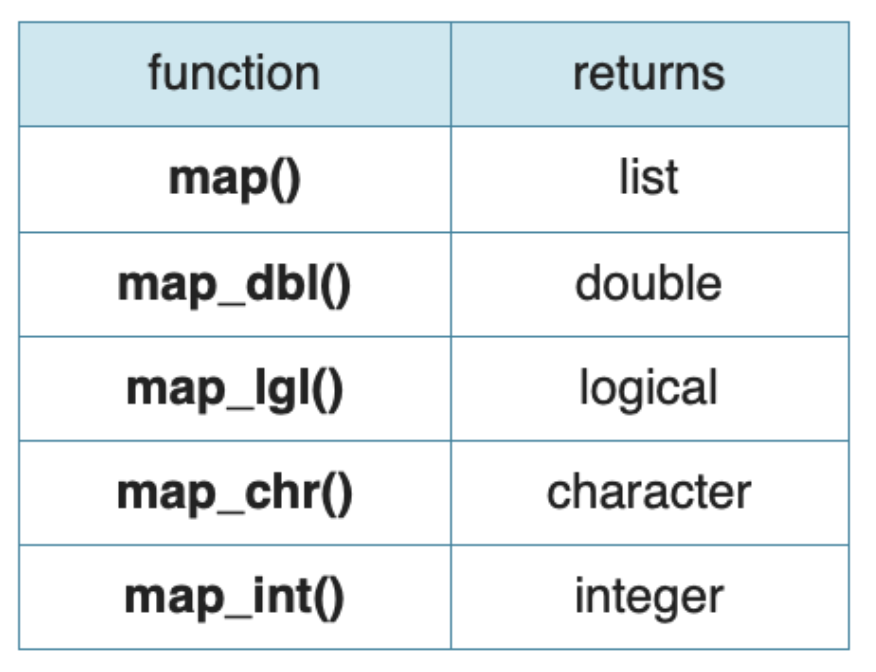
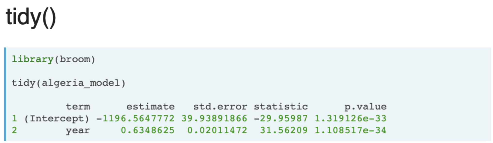

```{r setup, include=FALSE}
knitr::opts_chunk$set(echo = TRUE, error = TRUE)
```

https://www.datacamp.com/courses/machine-learning-in-the-tidyverse

### nest()

```{r}
# install.packages('dslabs')
library(dslabs)
library(dplyr)
```

Эта функция создает новый df, где колонка data содержит все данные для переменной по которой группируем.


```{r}
# Explore gapminder
head(gapminder)

# Prepare the nested dataframe gap_nested
library(tidyverse)
gap_nested <- gapminder %>% 
  group_by(country) %>% 
  nest()

# Explore gap_nested
head(gap_nested)
```

C помощью функции unnest() можно вернуться к изначальному df
Фнукция identical() сравнивает 2 объекта

```{r}
# Create the unnested dataframe called gap_unnnested
gap_unnested <- gap_nested %>% 
                unnest(data)
  
# Confirm that your data was not modified  
identical(gap_unnested, gapminder)
```

К колонке data можно обращаться следующим образом
То есть вытаскивать df и работать с ним как с обычным

```{r}
# Extract the data of Algeria
algeria_df <- gap_nested$data[[1]]
# Calculate the minimum of the population vector
min(algeria_df$population)
# Calculate the maximum of the population vector
max(algeria_df$population)
# Calculate the mean of the population vector
mean(algeria_df$population)
```

### map()


Можно высчитывать не только среднее для одного df, а сразу для всех с помощью map

```{r}
# Calculate the mean population for each country
pop_nested <- gap_nested %>%
  mutate(mean_pop = map(data, ~mean(.x$population)))

# Take a look at pop_nested
head(pop_nested)

# Extract the mean_pop value by using unnest
pop_mean <- pop_nested %>% 
  unnest(mean_pop)

# Take a look at pop_mean
head(pop_mean)
```

map возращает лись, поэтому приходится применять unnest()
Чтобы избежать этого, можно сразу использовать семейство функций map_*(map_dbl)




```{r}
# Calculate mean population and store result as a double
pop_mean <- gap_nested %>%
  mutate(mean_pop = map_dbl(data, ~mean(.x$population)))

# Take a look at pop_mean
head(pop_mean)
```

С помощью map можно засовывать результаты линейной регрессии

```{r}
# Build a linear model for each country
gap_models <- gap_nested %>%
    mutate(model = map(data, ~lm(formula = life_expectancy~year, data = .x)))
    
# Extract the model for Algeria    
algeria_model <- gap_models$model[[1]]

# View the summary for the Algeria model
summary(algeria_model)
```

### пакет broom

есть три основные функции


#### tidy()



Информация о коэффициентах

```{r}
library(broom)

# Extract the coefficients of the algeria_model as a dataframe
tidy(algeria_model)
```

#### glance()


Информация о статистиках(R^2)

```{r}
# Extract the statistics of the algeria_model as a dataframe
glance(algeria_model)
```


#### augment()


Информация о реальных значениях, о предсказанных об ошибках

```{r}
algeria_fitted <- augment(algeria_model)
```


График линии модели и данных

```{r}
library(ggplot2)
algeria_fitted %>% 
  ggplot(mapping = aes(x = year)) +
  geom_point(mapping = aes(y = life_expectancy)) +
  geom_line(mapping = aes(y = .fitted), color = "red")
```

### tidy + map

Можно применить функцию tidy для всех стран и записать их в табличку

```{r}
# Extract the coefficient statistics of each model into nested dataframes
model_coef_nested <- gap_models %>% 
    mutate(coef = map(model, ~tidy(.x)))
    
# Simplify the coef dataframes for each model    
model_coef <- model_coef_nested %>%
    unnest(coef)
```

После чего можно работать с этой табличкой
Например нарисовать гистограмму распределения коэффициента при переменной year

```{r}
model_coef %>% 
  filter(term == "year") %>% 
  ggplot(aes(x = estimate)) +
  geom_histogram()
```

### glance + map

Получим статистики по всем странам

```{r}
# Extract the fit statistics of each model into dataframes
model_perf_nested <- gap_models %>% 
    mutate(fit = map(model, ~glance(.x)))

# Simplify the fit dataframes for each model    
model_perf <- model_perf_nested %>% 
    unnest(fit)
    
# Look at the first six rows of model_perf
head(model_perf)
```

Потом можно уже работать с этой табличкой

Построить гистограмму R2

```{r}
model_perf %>% 
  ggplot(aes(x = r.squared)) + 
  geom_histogram()  
```

Выбрать топ-4 лудших и худших моделей

```{r}
# Extract the 4 best fitting models
best_fit <- model_perf %>% 
  top_n(n = 4, wt = r.squared)

# Extract the 4 models with the worst fit
worst_fit <- model_perf %>% 
  top_n(n = 4, wt = -r.squared)
```

### augment + map

Это дает возможность легко рисовать графики для всех стран

сделаем таблички для лучших и худших стран

```{r}
best_augmented <- best_fit %>% 
  # Build the augmented dataframe for each country model
  mutate(augmented = map(.x = model, ~augment(.x))) %>% 
  # Expand the augmented dataframes
  unnest(augmented)

worst_augmented <- worst_fit %>% 
  # Build the augmented dataframe for each country model
  mutate(augmented = map(.x = model, ~augment(.x))) %>% 
  # Expand the augmented dataframes
  unnest(augmented)
```


Графики для лучших
```{r}
# Compare the predicted values with the actual values of life expectancy 
# for the top 4 best fitting models
best_augmented %>% 
  ggplot(aes(x = year)) +
  geom_point(aes(y = life_expectancy)) + 
  geom_line(aes(y = .fitted), color = "red") +
  facet_wrap(~country, scales = "free_y")
```

Графики для худших
```{r}
# Compare the predicted values with the actual values of life expectancy 
# for the top 4 worst fitting models
worst_augmented %>% 
  ggplot(aes(x = year)) +
  geom_point(aes(y = life_expectancy)) + 
  geom_line(aes(y = .fitted), color = "red") +
  facet_wrap(~country, scales = "free_y")
```

### Улучшение качества моделей

Сделаем не парную а мультирегерссию

```{r}
# Build a linear model for each country using all features
gap_fullmodel <- gap_nested %>% 
  mutate(model = map(data, ~lm(formula = life_expectancy ~ ., data = .x)))

fullmodel_perf <- gap_fullmodel %>% 
  # Extract the fit statistics of each model into dataframes
  mutate(fit = map(model, ~glance(.x))) %>% 
  # Simplify the fit dataframes for each model
  unnest(fit)
  
# View the performance for the four countries with the worst fitting 
# four simple models you looked at before
fullmodel_perf %>% 
  filter(country %in% worst_fit$country) %>% 
  select(country, adj.r.squared)
```

### train-test split + cross validation

Все функции для деления в пакете `rsample`

```{r message=FALSE}
# install.packages('rsample')
library(rsample)
```

Деление на train  и test в пропорции 3 к 4

```{r}
set.seed(42)
# Prepare the initial split object
gap_split <- initial_split(gapminder, prop = 0.75)
# Extract the training dataframe
training_data <- training(gap_split)
# Extract the testing dataframe
testing_data <- testing(gap_split)
# Calculate the dimensions of both training_data and testing_data
dim(training_data)
dim(testing_data)
```

Теперь используем кросс валидацию

```{r}
set.seed(42)

# Prepare the dataframe containing the cross validation partitions
cv_split <- vfold_cv(training_data, v = 5)

cv_data <- cv_split %>% 
  mutate(
    # Extract the train dataframe for each split
    train = map(splits, ~training(.x)), 
    # Extract the validate dataframe for each split
    validate = map(splits, ~testing(.x))
  )

# Use head() to preview cv_data
head(cv_data)
```

### Построение модели и расчет метрики

Обучаем модели на каждом фолде

```{r}
# Build a model using the train data for each fold of the cross validation
cv_models_lm <- cv_data %>% 
  mutate(model = map(.x = train, ~lm(formula = life_expectancy ~ ., data = .x)))
```

Вытаскиваем настоящие значения и делаем прогноз

```{r}
cv_prep_lm <- cv_models_lm %>% 
  mutate(
    # Extract the recorded life expectancy for the records in the validate dataframes
    validate_actual = map(validate, ~.x$life_expectancy),
    # Predict life expectancy for each validate set using its corresponding model
    validate_predicted = map2(.x = model, .y = validate, ~predict(.x, .y))
  )
```

разные метрики есть в пакете `Metrics`

```{r message=FALSE}
# install.packages("Metrics")
library(Metrics)
```

считаем метрику для каждого фолда, а потом среднее

```{r}
library(Metrics)
# Calculate the mean absolute error for each validate fold       
cv_eval_lm <- cv_prep_lm %>% 
  mutate(validate_mae = map2_dbl(validate_actual, validate_predicted, ~mae(actual = .x, predicted = .y)))

# Print the validate_mae column
cv_eval_lm$validate_mae

# Calculate the mean of validate_mae column
mean(cv_eval_lm$validate_mae)
```

### Random Forest

находится в пакете `ranger`

```{r message=FALSE}
# install.packages('ranger')
library(ranger)
```

Обучим и посмотрим 

```{r}
# Build a random forest model for each fold
cv_models_rf <- cv_data %>% 
  mutate(model = map(train, ~ranger(formula = life_expectancy~., data = .x,
                                    num.trees = 100, seed = 42)))

# Generate predictions using the random forest model
cv_prep_rf <- cv_models_rf %>% 
  mutate(validate_predicted = map2(.x = model, .y = validate, ~predict(.x, .y)$predictions))
```

теперь померием метрику

```{r}
# Calculate validate MAE for each fold
cv_eval_rf <- cv_prep_rf %>% 
  mutate(validate_mae = map2_dbl(validate_actual, validate_predicted, ~mae(actual = .x, predicted = .y)))

# Print the validate_mae column
print(cv_eval_rf$validate_mae)

# Calculate the mean of validate_mae column
mean(cv_eval_rf$validate_mae)
```

она меньше чем у LR

Тюним модель по параметру mtry

```{r}
# Prepare for tuning your cross validation folds by varying mtry
cv_tune <- cv_data %>% 
  crossing(mtry = 2:5) 

# Build a model for each fold & mtry combination
cv_model_tunerf <- cv_tune %>% 
  mutate(model = map2(.x = train, .y = mtry, ~ranger(formula = life_expectancy~., 
                                           data = .x, mtry = .y, 
                                           num.trees = 100, seed = 42)))
```


Делаем предикт и Смотрим для какого параметра модель лучше

```{r}
# Generate validate predictions for each model
cv_prep_tunerf <- cv_model_tunerf %>% 
  mutate(validate_predicted = map2(.x = model, .y = validate, ~predict(.x, .y)$predictions))

# Calculate validate MAE for each fold and mtry combination
cv_eval_tunerf <- cv_prep_tunerf %>% 
  mutate(validate_mae = map2_dbl(.x = validate_actual, .y = validate_predicted, ~mae(actual = .x, predicted = .y)))

# Calculate the mean validate_mae for each mtry used  
cv_eval_tunerf %>% 
  group_by(mtry) %>% 
  summarise(mean_mae = mean(validate_mae))
```

Для параметра 4!

Поняли, какая модель лучшая, поэтому обучаем ее на все train и делаем predict на test

```{r}
best_model <- ranger(formula = life_expectancy~., data = training_data,
                     mtry = 4, num.trees = 100, seed = 42)
test_actual <- testing_data$life_expectancy
test_predict <- predict(best_model, testing_data)$predictions
mae(test_actual, test_predict)
```


### Задача классификации
