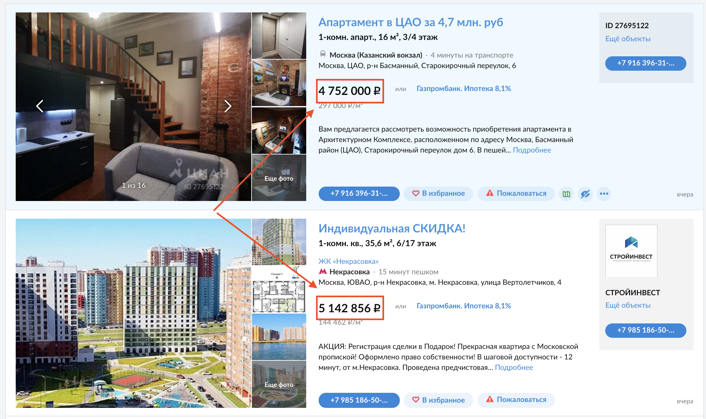

<style>
h1,
h2,
h3,
h4,
h5,
h6  {
  color: #317eac;
}
</style>
---
```{r setup, include=FALSE}
knitr::opts_chunk$set(echo = TRUE, warning=FALSE, message=FALSE)
```

### Правила игры

1. Вы должны оформить КР в R Markdown или обычном R скрипте.
2. Вы можете не комментировать ваш код там, где этого не просят.
3. Вы можете пользоваться скриптами, которые находятся на моем репозитории. 
4. Скрипт с решением сдается в AnyTask.
5. Если я замечаю, что у вас открыт какой-либо сайт, не считая моего и AnyTask, вы получаете 0 баллов за экзамен..
6. За любые разговоры вы так же получаете 0 баллов за экзамен.

<center>
{width=400px}
</center>
---

### Задание №0 (1 балл)

Подгрузите следующие пакеты.

```{r eval=FALSE}
packages <- c('readr', 'dplyr', 'tidyr', 'ggplot2', 'fastDummies',
              'rvest', 'stringr', 'naniar', 'tibble', 'Metrics', 'readr')
# install.packages(packages)
library(readr)
library(dplyr)
library(tidyr)
library(ggplot2)
library(rvest)
library(stringr)
library(naniar)
library(tibble)
library(Metrics)
library(fastDummies)
library(readr)
```

### Задание №1 (24 балла)

Нужно спарсить одну страницу сайта [ЦИАН](https://www.cian.ru/). Запрос можно оставить как на картинке или сделать какой-то свой.

<center>
{width=800px}
</center>

Парсим только первую страничку, поэтому не нужно писать никаких `for`. Выкачать нужно все цены, которые находятся на странице, привести их к числовому формату и найти среднее значение.

<center>
{width=700px}
</center>

### Задание №2 (35 баллов)

С того же ЦИАНа я спарсил для вас информацию о квартирах в районе Проспекта Вернадского (Юго-запад). 

```{r eval=FALSE}
url <- 'https://raw.githubusercontent.com/ahmedushka7/R/master/docs/homeworks/exam/data/cian.csv'
data <- read_csv(url)
```

В данном датасете наблюдением является квартира. Каждая квартира имеет следующие характеристики ( переменные):

* `price` -- цена квартиры в рублях;
* `subway` -- удаленность до метро; до слэша: количество минут, после слэша: способ добраться до метро (walk -- пешком, transport -- обественный транспорт);
* `rooms` -- количество комнат;
* `metrs` -- количество квадратных метров;
* `url` -- ссылка объявления на сайте ЦИАН;
* `type` -- тип квартиры (`first` -- новостройка, `second` -- вторичка)

__Задания:__

1. Сколько наблюдений и переменных в датасете?
2. Имеются ли пропущенны значения?
3. Постарайтесь выполнить все следующие операции с помощью pipe (`%>%`).
    - Удалите переменную `url`
    - Перевести цену квартир в миллионы рублей.
    - Разделить переменную `subway` на две отдельные переменные.
    - Все ли переменные имеют нужный тип (числовой, строковый)? Если нет, то приведите их к нужному формату.
4. Постройте гистограмму распределения цены. Постройте гистограмму распределения в разрезе количества комнат. 
5. Сколько в среднем стоят квартиры в разрезе количества комнат? Сколько в среднем квадратных метров в разрезе количества комнат? 
6. Сколько новостроек, а сколько вторичек в нашем датасете?

### Задание №3 (40 баллов)

У вас есть два набора данных `train` и `test`. Вам нужно попробовать построить наилучшую модель для прогнозирования цены квартиры (`price`). Метрикой качества будет __MAPE__. Помните, что эта метрика качества несимметрична.

```{r eval=FALSE}
url_train <- 'https://raw.githubusercontent.com/ahmedushka7/R/master/docs/homeworks/exam/data/train.csv'
url_test <- 'https://raw.githubusercontent.com/ahmedushka7/R/master/docs/homeworks/exam/data/test.csv'

train <- read_csv(url_train)
test <- read_csv(url_test)
```

Если в качестве признака вы взяли площадь квартиры (квадратные метры), то проинтепретируйте коэффициент перед ним. А также нарисуйте график зависимости таргета от площади квартиры.
