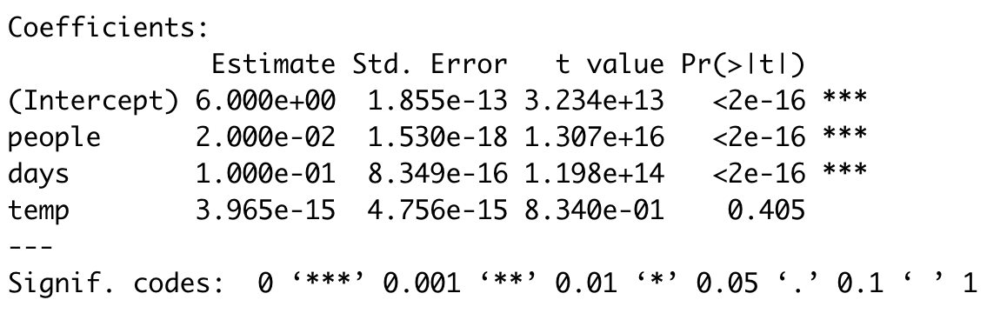

<style>
h1,
h2,
h3,
h4,
h5,
h6  {
  color: #317eac;
}
</style>
```{r setup, include=FALSE}
knitr::opts_chunk$set(echo = TRUE, warning=FALSE, message=FALSE)
```

### Правила игры

1. Вы должны оформить экзамен в R Markdown или обычном R скрипте.
2. Вы можете не комментировать ваш код. Просто пишите код для решения задач.
3. Экзамен сдается в AnyTask до 10:55!

### Пакеты

```{r}
packages <- c('readr', 'dplyr', 'tidyr', 'ggplot2', 'cluster', 'tibble')
# install.packages(packages)
library(readr)
library(dplyr)
library(tidyr)
library(ggplot2)
library(cluster)
library(tibble)
```

### Задание №1: Линейная, но все равно хорошая (30)

Кратко ответьте на следующие вопросы:

1. С какими проблемами можно столкнуться при использовании One Hot Encoding? Почему его нужно применять?

2. Студент Витя хорошо прослушал курс "Анализ данных в R" и решил после него построить модель линейной регрессии. Он решил оценить зависимость среднего кол-ва лайков (`likes`) на посте в группе вк от кол-ва участников группы (`people`), дней существования группы (`days`) и температуры за окном в градусах Цельсия (`temp`). Оценив модель, он получил следующую таблицу:

{width=50%}

Помогите Вите решить, какие переменные в модель брать не стоит, а также ответьте на вопрос: сколько в среднем поставят лайков в группе со 10000 человек, существующей 30 дней, если температура за окном 15 градусов Цельсия? 

### Задание №2: Шансы на выживание (30)

```{r eval=FALSE}
url <- 'https://raw.githubusercontent.com/Yorko/mlcourse.ai/master/data/titanic_train.csv'
df <- read_csv(url)
```

Перед вами датасет по пассажирам "Титаника". Он содержит в себе:

* `PassengerId` - id пассажира
* `Survived` - выжил пассажир или нет (1 - выжил, 0 - нет)
* `Pclass` - класс обслуживания (1 — высший, 2 — средний, 3 — низший)
* `Name` - имя
* `Sex` - пол
* `Age` - возраст
* `SibSp` - сколько братьев/сестер у пассажира было на борту
* `Parch` - количество родителей, детей (в том числе приемных) на борту
* `Ticket` - номер билета
* `Fare` - сколько заплатил за билет
* `Cabin` - номер кабины
* `Embarked` - порт посадки (C — Шербур; Q — Квинстаун; S — Саутгемптон)

Ответьте на следующие вопросы:

1. Правда ли, что женщины выживали чаще мужчин? Каковы доли выживших в каждой группе?
2. Сколько в среднем нужно было бы заплатить за билет в зависимости от класса обслуживания?

### Задание №3: Надоедливые соседи (40)

```{r eval=FALSE}
url <- 'https://raw.githubusercontent.com/ahmedushka7/R/master/docs/homeworks/exam/data/sample_cluster.csv'
df <- read_csv(url)
```

```{r echo=FALSE}
df <- read_csv("data/sample_cluster.csv")
df %>%
  glimpse()
```

У вас есть датасет, в котором 150 наблюдений и 5 переменных.

1. Ваша главная задача -- сделать кластеризацию методом **k-means**.
2. Не нужно скалировать и отбирать признаки, все данные уже готовы.
3. С помощью любого метода *elbow method*, *silhouette method*, *PCA* определить *k*. Можно предположить, что *k* лежит на отрезке от 0 до 10.
4. Построить модель с выбранным *k*.
5. Создать в исходном датасете колонку `cluster` с меткой кластера для каждого наблюдения.


