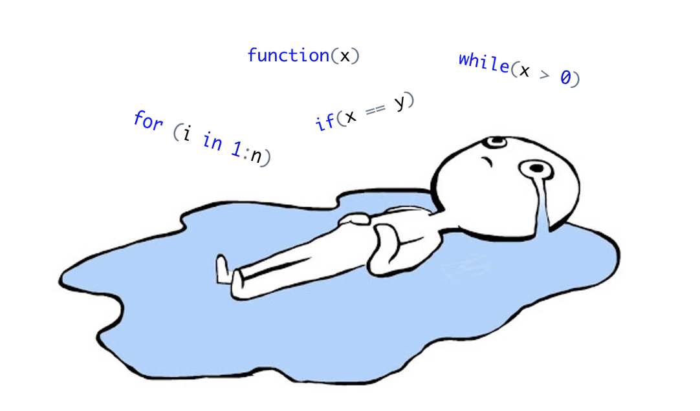

---




### Правила игры

* Все задачи должны быть оформлены в виде функции! Если вы смогли решить задачу, но не смогли оформить ее в виде функции, то за это будет снято какое-то количество баллов.
* Запрещено пользоваться встроенными функциями, которые могут очень легко упростить решение задач, такие как `unique`, `max`, `min`, `sort` и другие. Можете уточнить в телеге про конкретную функцию.

### 1. Високосный год (10 баллов)

Дан год (`year`). Нужно определить, является ли он високосным. Если год является високосным выведите `TRUE`, иначе `FALSE`. 

__Примеры__:

* `year <- 2020` -- ответ: `TRUE`
* `year <- 2000` -- ответ: `TRUE`
* `year <- 2001` -- ответ: `FALSE`

__Hints__:

* Год является високосным, если он кратен 4, но не кратен 100, или же если он кратен 400.

### 2. Повторяющиеся элементы (20 баллов)

Дан массив. Нужно вывести элементы, которые встречаются в массиве более одного раза.

__Примеры__:

* `c(1, 2, 2, 3, 10, 3, 4, 3)` -- ответ: `c(2, 3)`,  так как элементы 2 и 3 встречаются больше одного раза в массиве
* `c(1, 2, 3, 4)` --  ответ: `c()` эквивалентно `NULL`, так обозначается пустой массив

__Hints__:

* Можно проверить находится ли элемент в массиве с помощью `%in%`.

```{r collapse=TRUE}
x <- c(-10, 20, 30)

print(5 %in% x) # спрашиваем, есть ли 5 в массиве x и получает ответ FALSE
print(20 %in% x) # спрашиваем, есть ли 10 в массиве x и получает ответ TRUE
```

### 3. Сумма для таргета (20 баллов)

Дан массив $x$ и таргет $t$. Нужно вывести индексы тех элементов массива, которые при сложении дают $t$. Гарантируется, что такая пара есть и она единственна.

__Примеры__:

* `x <- c(100, 102, 104, 110), t <- 204` -- ответ: `c(1, 3)` , так как элементы `100` и `104` в сумме дают `204` и имеют индексы `1` и `3`.
* `x <- c(100, 102, 104, 110), t <- 200` -- ответ: `c(1, 1)` , то есть один и тот же элемент может использоваться 2 раза.

### 4. Максимальный/минимальный элемент массива (20 баллов)

Написать собственную функцию (это должна быть одна функция!), которая находит максимальный или минимальный элемент в массиве в зависимости от того, что просит пользователь. Если пользователь ничего не просит, то находится максимальный элемент.

__Примеры__:

* `c(0, -10, 20); максимальный` -- ответ: `20`
* `c(0, -10, 20); минимальный` -- ответ: `-10`


### 5. Парадокс дней рождения (30 баллов + 10 дополнительных баллов)

* [Статья на вики](https://ru.wikipedia.org/wiki/Парадокс_дней_рождения)
* [Видео](https://www.youtube.com/watch?v=LFB1_QEnqY4)

В теории вероятностей есть интересный результат, что в группе из 23 человек вероятность того, что хотя бы у двоих день рождения в один день, больше 0.5.

__Задача__: Проверить этот парадокс. 

__Hints__:

* Нужно написать функцию, которая принимает на вход размер группы, а выдает вероятность.

* Вероятность можно найти по формуле

\[
P = \frac{m}{n},
\]

где `n` количество сгенерированных групп, а `m` - количество групп, в которых хотя бы у двоих людей день рождения в один день.


* Рекомендуется использовать решение задачи "Повторяющиеся элементы", немного изменив его.

__Халява__:

За дополнительные 10 баллов можно нарисовать график зависимости вероятности от размера группы.

* Нарисовать график можно с помощью встроенной функции `plot`.

```{r}
plot(c(1, 15, 30), c(0.1, 0.2, 0.8), 
     type = "l", xlab = "Размер группы", ylab = "Вероятность")
```
