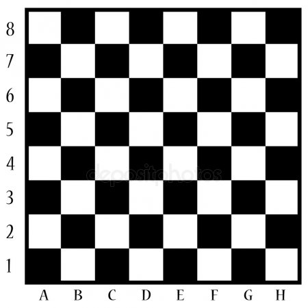

```{r setup, include=FALSE}
knitr::opts_chunk$set(echo = TRUE)
```

### Шахматы (10 баллов)

#### Условие

Заданы две клетки шахматной доски. Если они покрашены в один цвет, то выведите слово YES, а если в разные цвета — то NO. Функция получает на вход четыре числа от 1 до 8 каждое, задающие номер столбца и номер строки сначала для первой клетки, потом для второй клетки.

#### Решение

Посмотрим на шахматную доску.

<center>

</center>

Можно заметить, что ячейки закрашенные черным находятся на тех местах, где сумма их координат четна. И наоборот, где сумма нечетна, там ячейки белые. Наприме, ячейка с координатой (4,2) черная, так как 4 + 2 = 6 -- четное число. То есть, мы можем понять какого цвета ячейка, используя координаты. 

У нас 2 ячейки. Если они одного цвета, то нужно вывести`YES`, а если нет, то `NO`. Есть две ситуации, когда ячейки могут быть одного цвета. Они могут быть черными (сумма координат четная) или белыми (сумма координат нечетная). Остаток от деления суммы координат у ячеек должен совпадать.

```{r}
chess <- function(k1, k2, l1, l2) {
  if ((k1 + k2) %% 2 == (l1 + l2) %% 2) {
    return('YES')
  }else{
    return('NO')
  }
}
chess(1, 2, 4, 8)
```

### Сумма ряда (5 баллов)

#### Условие

По натуральным числам n и y вычислите сумму $1^y + 2^y + 3^y + ... + n^y$

#### Решение

Мы умеем последовательно суммировать, например элементы массива с помощью `for`. Но тут можно не использовать массив, а пройтись от 1 до n. Возвести это число в степень y и добавить в нашу переменную отвечающую за сумму.

```{r}
sum_series <- function(n, y) {
  s <- 0
  for (i in 1:n) {
    s <- s + i^y
  }
  return(s)
}
```

### Петя и ходьба (10 баллов)

#### Условие

Петя хотел улучшить свою физическую подготовку, поэтому решил начать больше ходить. В первый неделю он прошел x километров, а после этого каждую следующую неделю он увеличивал пройденную дистанцию на y% (процентов) от предыдущего расстояния. Определите на какой неделе он начнет ходить z километров.

#### Решение

Мы не знаем через какое точное количество недель Петя будет ходить z километров. Пусть Петя будет ходить до тех пор пока количество километров пройденное за неделю будет меньше z. Нужно завести переменную w, которая будет отвечать за текущую неделю. А также будем увеличивать на y% пройденное растояние за неделю.

```{r}
walk <- function(x, y, z) {
  w <- 1
  while (x < z) {
    x <- x*(1 + y/100)
    w <- w + 1
  }
  return(w)
}
```

### Домашки (10 баллов)

#### Условие

Даны оценки за домашние задания двух студентов:

```{r}
a <- c(10, 9, 5,  7,  NA, 3,  4, 7, NA)
b <- c(9, 8, NA, 0, 2, 5,  8, 10, NA)
```

Преподаватель потерял некоторые домашки студентов. Они отмечены `NA`. Вместе со студентами он решил не учитывать такие домашки.

Необходимо найти среднюю оценку за домашки для каждого студента.

Подсказка: чтобы разобраться с `NA`, нужно посмотреть [онлайн скрипт посиделки №1](https://ahmedushka7.github.io/R/scripts/hse_data_analysis/sem_1/introduction_to_R.html#работа_с_глобальным_окружением).

#### Решение

Мы умеем суммировать элементы массива. Только здесь перед тем как прибавить элемент к нашей сумме, нужно проверить не является ли он числом. Это можно сделать с помощью `is.na`. Если не `NA`, то суммируем. При этом в конце нам нужно поделить сумму на количество элементов, которые вошли в эту сумму. Для этого можно создать переменную, которая будет за это отвечать. 

Многие встроенные функции в R, имеют параметр `na.rm`, который позволяет не учитывать `NA`.

```{r collapse=TRUE}
a <- c(10, 9, 5,  7,  NA, 3,  4, 7, NA)
b <- c(9, 8, NA, 0, 2, 5,  8, 10, NA)

mean_na <- function(x) {
  s <- 0
  k <- 0
  for (i in 1:length(x)) {
    if (!is.na(x[i])) {
      s <- s + x[i]
      k <- k + 1
    }
  }
  return(s/k)
}

(mean_na(a))
(mean(a, na.rm=TRUE))
(mean_na(b))
(mean(b, na.rm=TRUE))
```

### Сочетания (5 баллов)

#### Условие

Пусть у нас есть n предметов, из которых нужно выбрать k штук. Известнейшая комбинаторная формула $C_n^k = \dfrac{n!}{k!(n-k)!}$ задаёт количество всевозможных сочетаний. 

Оформить эту формулу в виде функции.

#### Решение

Вспоминаем функцию для нахождаения факториала.

```{r}
FACT <- function(n){
  if (n == 1) {
    return(1)
  }
  k <- FACT(n-1)
  return(k*n)
}
```

Просто используем ее в нашей функции.

```{r}
soch <- function(n, k) {
  s <- FACT(n)/(FACT(n-k)*FACT(k))
  return(s)
}
```

### Максимальная последовательность (10 баллов)

#### Условие

Дана последовательность чисел. Определите, какое наибольшее число подряд идущих элементов этой последовательности равны друг другу. Оформить задачу в виде функции.

__Примеры__:

* (1,1,1,0,5,5,0,2,3) -- ответ: 3 (последовательность единиц самая большая)
* (1,1,1,0,5,5,5,5,3,5) -- ответ: 4 (последовательность пятерок самая большая)

#### Решение

Нужно завести 2 переменные. Первая будет отвечать за глобальный максимум. А вторая будет отвечать за локальный максимум: максимум текущей последовательности. Пойдем по всем элементам массива и будем сравнивать их. Если они равны, то значит последовательность растет. Если не равны, значит последовательность закончилась. Длину этой последовательсти надо сравнить с максимальной длиной, которая была ранее. Также нужно сбросить максимум текущей последовательности. В самом конце нужно опять сравнить максимум с текущим максимумом. В этом можно убедиться на примере (1,0,0,2,2,2).

```{r}
maxS <- function(x) {
  m <- 1
  c_m <- 1
  for (i in 1:length(x)-1) {
    if (x[i] == x[i+1]) {
      c_m <- c_m + 1
    }else{
      if(c_m > m) {
        m <- c_m
      }
      с_m <- 0
    }
  }
  if(c_m > m) {
    m <- c_m
  }
  return(m)
}
```

### unique (10 баллов)

#### Условие

Мы изучали встроенную функцию `unique`. Она выводит все уникальны элементы массива.

```{r}
x <- c(1,1,1,2,2,1,10,10,3)
unique(x)
```

Нужно написать собственную функцию `unique`, которая делает то же самое.

#### Решение

Создадим пустой массив, в который будем скалдывать уникальные элементы. Пройдемся по каждому элементу исходного массива. Если элемента нет в нашем массив, то добавим его. Если есть, то перейдем к следующему элементу.

```{r}
UNIQUE <- function(x) {
  l <- c()
  for (i in 1:length(x)) {
    if (!(x[i] %in% l)) {
      l <- c(l, x[i])
    }
  }
  return(l)
}
```

### Максимум, минимум и медиана (10 баллов)

#### Условие

Написать функцию, которая находит максимальный элемент, минимальный элемент или медиану в массиве в зависимости от того, что просит пользователь.

[Медиана](https://ru.wikipedia.org/wiki/Медиана_(статистика)) -- это такое число массива, что ровно половина элементов массива больше него, а другая половина меньше него.

__Примеры__:

*  (1,10,20, 45, 100) -- нечетное количество элементов: медиана = 20
*  (1,10,20, 30, 45, 100) -- четное количество элементов: медиана = $\frac{20+30}{2} = 25$

#### Решение

Отсортируем массив по возрастанию. Если просят максимум, то это последний элемент. Если просят минимум, то это первый элемент. Если просят медиану, то сначала проверяем количество элементов в массиве. И в зависимости от этого выводим ответ.

```{r}
mmm <- function(x, y) {
  x <- sort(x)
  n <- length(x)
  if (y == 'Максимум') {
    return(x[n])
  }
  if (y == 'Минимум') {
    return(x[1])
  }
  if (y == 'Медиана') {
    if (n %% 2 == 0) {
      l <- (x[n/2] + x[n/2 + 1])/2
      return(l)
    }else{
      return(x[n%/%2 + 1])
    }
  }
}
```

### Парадокс Монти Холла (30 баллов)

#### Условие

[Парадокс Монти Холла](https://ru.wikipedia.org/wiki/Парадокс_Монти_Холла) — одна из известных задач теории вероятностей, решение которой, на первый взгляд, противоречит здравому смыслу.

* [Видео №1](https://www.youtube.com/watch?v=xgENddTR_5s)
* [Видео №2](https://www.youtube.com/watch?v=8IUGY6T0x_c&t=94s)

Если говорить кратко, вы находитесь на телеигре. Перед вами 3 двери, за одной их них деньги, за двумя другими ничего нет. Вы выбираете какую-то дверь. Например, первую. Ведуший открывает одну из оставшихся дверей, за которой ничего нет. Например, вторую. После чего спрашивает вас: "Хотите ли поменять свой выбор, и выбрать дверь номер 3?". Поменять свой выбор стоит, так как вероятность, что деньги находятся за 1 и 3 дверью равны не $\frac{1}{2}$, а $\frac{1}{3}$ и $\frac{2}{3}$. Изначально, вероятность, что приз за первой дверью $\frac{1}{3}$, а за второй или третьей $\frac{2}{3}$. Когда ведущий открывает вторую дверь, вся вероятность переносится на 3 дверь.

__Задача__: проверить этот парадокс на 100000 играх, то есть посмотреть сколько раз мы бы выиграли, если бы меняли выбор, и сколько раз мы бы выиграли, если бы не меняли выбор. После чего объяснить почему мы получили именно эти цифры.

Вы будете постоянно пользоваться функцией `sample`. Есть странность, что если вы выбираете один элемент из одного возможно, может выводиться не это число. Поэтому используйте функцию `resample`, которую я написал ниже. Она работает как и обычная функцию `sample`. Просто вставьте ее в свой код в самый вверх.

```{r}
resample <- function(x, ...){
  if(length(x) == 1){
    return(x)
  }else{
    return(sample(x,...))
  }
}
resample(x = 1:10, size = 2, replace = FALSE)
```

Задачу можно оформить без создания функции.

#### Решение

```{r}
resample <- function(x, ...){
  if(length(x) == 1){
    return(x)
  }else{
    return(sample(x,...))
  }
}

MH <- function(n) {
  point_DC <- 0
  point_C <- 0
  v <- 1:3 # двери
  
  for(i in 1:n){
    priz <- resample(v, 1) # генерируем дверь
    choice <- resample(v, 1) # выбираем дверь
    f_open <- v[-c(priz,choice)] 
    open <- resample(c(f_open), 1) # номер двери, которую открывает ведущий
    CC <- v[-c(choice, open)] # меняем дверь
    DC <- choice # не меняем дверь
    if (priz == CC) {
      point_C <- point_C + 1
    }
    if (priz == DC){
      point_DC <- point_DC + 1
    }
  }
  return(c(point_C, point_DC))
}

MH(10000)
```
