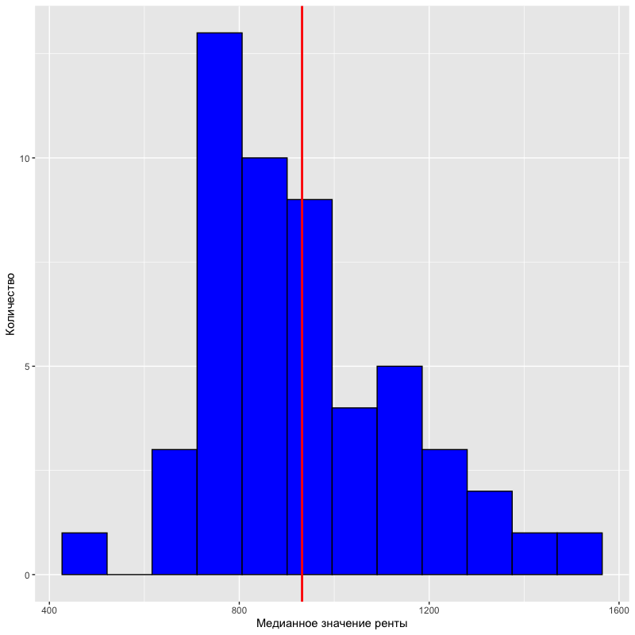

---

### Правила игры

Третья домашка нацелена на отработку преобразований, очистки, и визуализации данных. 

1. Домашка оформляется в R Markdown.
2. Старайтесь использовать *pipe* (`%>%`).
3. Подгрузите все нужные вам пакеты в самом начале в одном чанке.
4. Если задается какой-то вопрос, то нужен не просто ответ, а код, с помощью которого вы нашли этот ответ.

---

```{r warning=FALSE, message=FALSE}
# install.packages(tidyr)
library(tidyr)
```

В пакете `tidyr` есть замечательный набор данных `us_rent_income`, который мы будем использовать. В нем собраны данные об арендной плате для каждого штата США. Более подробно о нем можно узнать с помощью команды `?us_rent_income` Опишем каждую переменную.

* `GEOID` -- номер штата
* `NAME` -- название штата
* `variable` -- название показателя 
  + `income` -- медианный годовой доход людей
  + `rent` -- медианная рента
* `moe` -- 90% погрешность показателей (например, если `income` равно 100, а его `moe` 10, то 90% значений лежит в интервале от 90 до 110)

---

### Задание 1 (20 баллов)

Сейчас переменная `variable` содержит в себе еще две переменные. Из-за этого у нас по 2 наблюдения на каждый штат. Нужно преобразовать данные к следующему виду.


**Важно!** Колонки с показателями должны иметь числовой формат.

Эту задачу можно решить 2 способами. Первый мы сможем реализовать с теми знаниями, которые у нас есть. Второй очень простой, но надо изучить функцию `pivot_wider` из пакета `tidyr`. Она работает так же как и функция `spread`, но у нее есть свой большой плюс. Когда вы будете решать задачу, объясните проблему, из-за которой вы не смогли сделать это задание с помощью только одной функции `spread`.

### Задание 2 (20 баллов)

Переменная `GEOID` имеет строковый тип, нужно привести его к числовому. 

*Hints:*

* Аналогично номеру из семинара, где нужно было убрать X из X1.
* У вас возникнет проблема с 0. Вам нужно убрать только нули, которые **идут в начале строки**. 

### Задание 3 (20 баллов)

* Нарисуйте гистограммы распределений для переменных `income` и `rent`. 
* Подберите адекватный по вашему мнению параметр `bins`. 
* Проведите вертикальную линию, которая будет показывать среднее значение.
* Подпишите оси.



### Задание 4 (20 баллов)

Есть ли пропущенные значения? Нарисуйте график, который показывает количество пропущенных значений в вашем датасете. Можно ли заменить значения пропущенных переменных их средними? Если да, то замените. Если нет, то просто выкиньте эти переменные.

### Задание 5 (20 баллов)

Нарисуйте график рассеяния между доходом (`income`) и арендной платой (`rent`). Есть ли какая-то зависимость? Наложите на график линию линейной регрессии с помощью слоя `geom_smooth(method='lm')`. Подпишите оси и дайте название вашему графику.
