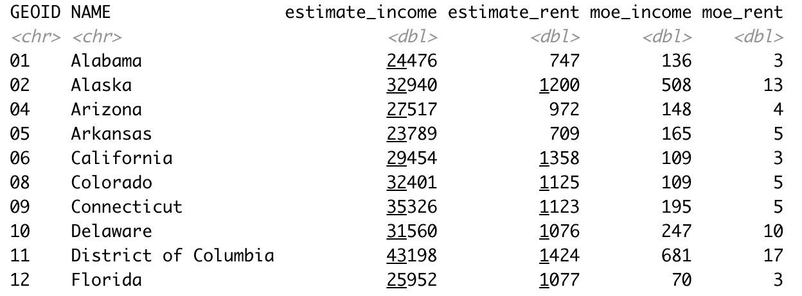

<style>
h1,
h2,
h3,
h4,
h5,
h6  {
  color: #317eac;
}
</style>
---
```{r setup, include=FALSE}
knitr::opts_chunk$set(echo = TRUE, warning = FALSE, message = FALSE)
```

```{r}
library(tidyr)
library(naniar)
library(ggplot2)
library(stringr)
library(dplyr)
```

В пакете `tidyr` есть замечательный набор данных `us_rent_income`, который мы будем использовать. В нем собраны данные об арендной плате для каждого штата США. Более подробно о нем можно узнать с помощью команды `?us_rent_income` Опишем каждую переменную.

* `GEOID` -- номер штата
* `NAME` -- название штата
* `variable` -- название показателя 
  + `income` -- медианный годовой доход людей
  + `rent` -- медианная рента
* `moe` -- 90% погрешность показателей (например, если `income` равно 100, а его `moe` 10, то 90% значений лежит в интервале от 90 до 110)

```{r}
glimpse(us_rent_income)
```

---

### Задание 1 (30 баллов)

Сейчас переменная `variable` содержит в себе еще две переменные. Из-за этого у нас по 2 наблюдения на каждый штат. Нужно преобразовать данные к следующему виду.



**Важно!** Колонки с показателями должны иметь числовой формат.

Эту задачу можно решить 2 способами. Первый мы сможем реализовать с теми знаниями, которые у нас есть. Второй очень простой, но надо изучить функцию `pivot_wider` из пакета `tidyr`. Она работает так же как и функция `spread`, но у нее есть свой большой плюс. Когда вы будете решать задачу, объясните проблему, из-за которой вы не смогли сделать это задание с помощью только одной функции `spread`.

**Первый способ**

```{r}
rent <- us_rent_income %>% 
          pivot_wider(names_from = variable, 
                      values_from = c('estimate', 'moe'))
```

**Второй способ**

```{r}
rent <- us_rent_income %>% 
          unite(common, estimate, moe, sep = '-') %>%
          spread(variable, common) %>%
          separate(income, into = c('income', 'income_error'), convert = T) %>%
          separate(rent, into = c('rent', 'rent_error'), convert = T)

glimpse(rent)
```


### Задание 2 (10 баллов)

Переменная `GEOID` имеет строковый тип, нужно привести его к числовому. 

*Hints:*

* Аналогично номеру из семинара, где нужно было убрать X из X1.
* У вас возникнет проблема с 0. Вам нужно убрать только нули, которые **идут в начале строки**. 

```{r}
rent <- rent %>%
          mutate(GEOID = str_replace(GEOID, '^0', ''),
                 GEOID = as.numeric(GEOID))
```

### Задание 3 (20 баллов)

* Нарисуйте гистограммы распределений для переменных `income` и `rent`. 
* Подберите адекватный по вашему мнению параметр `bins`. 
* Проведите вертикальную линию, которая будет показывать среднее значение.
* Подпишите оси.

```{r}
MEAN_income <- mean(rent$income, na.rm = T)
ggplot(rent, aes(income)) + 
  geom_histogram(bins = 23, col='black', fill='blue') + 
  geom_vline(xintercept = MEAN_income, col='red') +
  ylab('Количество') + 
  xlab('Медианное значение дохода')
```

```{r}
MEAN_rent <- mean(rent$rent, na.rm = T)
ggplot(rent, aes(rent)) + 
  geom_histogram(bins = 17, col='black', fill='blue') + 
  geom_vline(xintercept = MEAN_rent, col='red', size=1) +
  ylab('Количество') + 
  xlab('Медианное значение ренты')
```

### Задание 4 (20 баллов)

Есть ли пропущенные значения? Нарисуйте график, который показывает количество пропущенных значений в вашем датасете. Можно ли заменить значения пропущенных переменных их средними? Если да, то замените. Если нет, то просто выкиньте эти переменные.

```{r}
vis_miss(rent)
```

При работе с пропущенными значениями нет какого-то одного правильного решения. Вы можете поступать так, как считаете нужным. Считать Пуэрто-Рико частью США или нет, завивисит от вашего исследования.

**Первый способ**

```{r}
rent_mean <- rent %>%
              impute_mean_at(c('income', 'income_error'))
vis_miss(rent_mean)
```

**Второй способ**

```{r}
rent_drop <- rent %>%
              drop_na()
vis_miss(rent_mean)
```

### Задание 5 (20 баллов)

Нарисуйте график рассеяния между доходом (`income`) и арендной платой (`rent`). Есть ли какая-то зависимость? Наложите на график линию линейной регрессии с помощью слоя `geom_smooth(method='lm')`. Подпишите оси и дайте название вашему графику.

```{r}
ggplot(rent_drop, aes(rent, income)) +
  geom_point() + 
  geom_smooth(method='lm') + 
  xlab('Медианное значение ренты') +
  ylab('Медианное значение дохода') + 
  labs(title = 'Линейная зависимость дохода от ренты')
```

