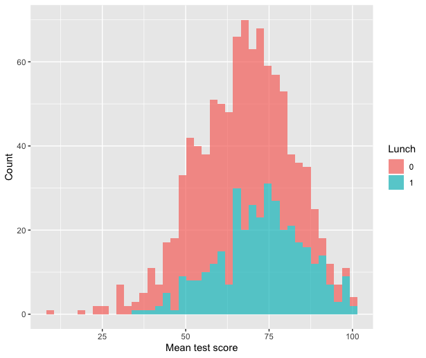

<style>
h1,
h2,
h3,
h4,
h5,
h6  {
  color: #317eac;
}
</style>
---
```{r setup, include=FALSE}
knitr::opts_chunk$set(echo = TRUE, warning=FALSE, message=FALSE)
```

### Правила игры

1. Вы должны оформить КР в R Markdown или обычном R скрипте.
2. Вы можете не комментировать ваш код. Просто пишите код для решения задач.
3. Вы можете пользоваться скриптами, которые находятся на моем репозитории. 
4. Домашка сдается в AnyTask.
5. Если я замечаю, что у вас открыт какой-либо сайт, не считая мой и AnyTask, вы получаете 0 за КР.

<center>
{width=400px}
</center>
---

### Задание №0 (1 балл)

Подгрузите следующие пакеты.

```{r eval=FALSE}
packages <- c('readr', 'dplyr', 'tidyr', 'ggplot2')
# install.packages(packages)
library(readr)
library(dplyr)
library(tidyr)
library(ggplot2)
```

Подгрузите ваш датасет.

```{r eval=FALSE}
url <- 'https://raw.githubusercontent.com/ahmedushka7/R/master/docs/homeworks/test/data/students.csv'
data <- read_csv(url)
```

Это датасет с результатами тестов, которые писали студенты. В нём представлены следующие переменные:

* `student_id` -- id студента
* `gender` -- пол студента
* `race` -- раса студента
* `parental_lvl_of_edu` -- какое образование имеют родители студента
* `lunch` -- 1, если студент кушал до теста и 0, если не кушал
* `prepartion_course` -- 1, если студент проходил подготовительный курс для написания теста и 0, если не проходил
* `type_test` -- тип теста
* `score` -- оценка за тест

### Задание №1 (33 балла)

Сколько студентов находится в нашем наборе данных? Какие тесты писали эти студенты? Преобразуйте ваш набор данных так, чтобы результат каждого теста стал отдельной новой переменной.

### Задание №2 (33 балла)

Найдите средний результат каждого теста в разрезе пола. Найдите средний результат за все тесты для каждого студента и запишите его в переменную `mean_score`. Постройте гистограмму распределения этой переменной отдельно (разным цветом) для тех, кто кушал и не кушал до теста. 

**Hint:**

Не забывайте, что когда вы работаете с цветом вам нужна факторная переменная.



### Задание №3 (33 балла)

Нарисуйте график рассеяния между переменными `writing_score` и `reading_score`. Наложите на этот график линию линейной регрессии.

