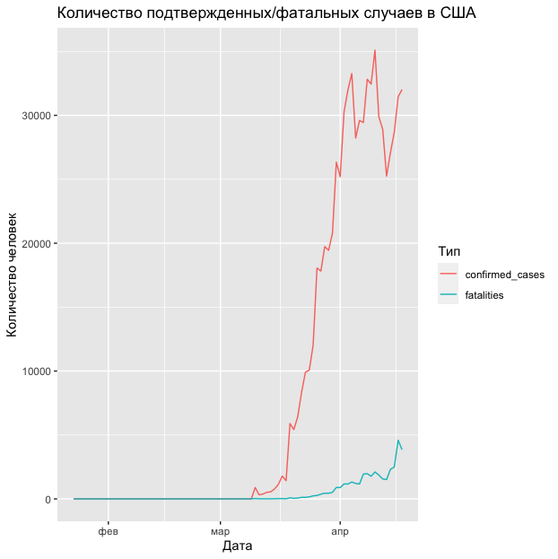
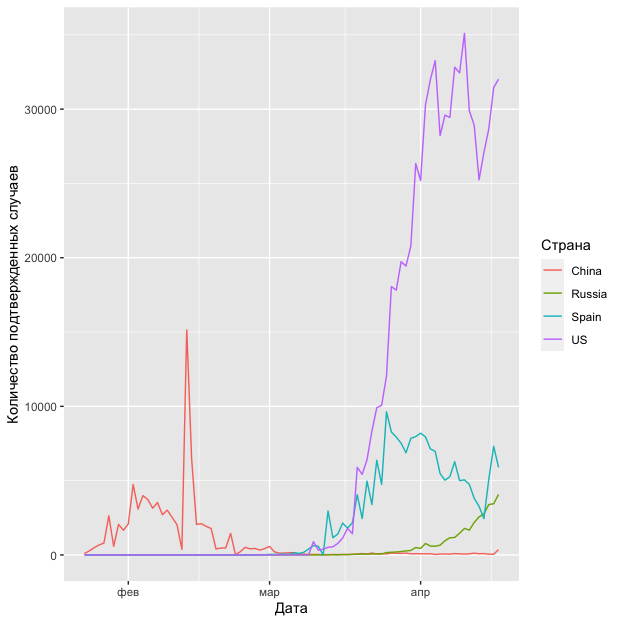

<style>
h1,
h2,
h3,
h4,
h5,
h6  {
  color: #317eac;
}
</style>
```{r setup, include=FALSE}
knitr::opts_chunk$set(echo = TRUE, warning=FALSE, message=FALSE)
```

<center>
{width=800px}
</center>
---

### Правила игры

1. Вы должны оформить КР в R Markdown или обычном R скрипте.
2. Вы можете не комментировать ваш код. Просто пишите код для решения задач.
3. КР сдается в AnyTask до 10:55!

### Задание №0 (1 балл)


```{r eval=FALSE}
packages <- c('readr', 'dplyr', 'tidyr', 'ggplot2')
# install.packages(packages)
library(readr)
library(dplyr)
library(tidyr)
library(ggplot2)
```

Подгрузите ваш датасет.

```{r eval=FALSE}
url <- 'https://raw.githubusercontent.com/ahmedushka7/R/master/docs/homeworks/test/data/covid.csv'
data <- read_csv(url)
```

Это датасет со статистикой о COVID-19. В нём представлены следующие переменные:

* `country` -- название страны
* `state` -- название штата (региона)
* `date` -- дата
* `confirmed_cases` -- количество подтвержденных случаев
* `fatalities` -- количество фатальных случаев

То есть, одно наблюдение -- количество подтвержденных/фатальных случаев в определенный день в определенном штате. Если региона нет (`NA`), то показатели для всей страны.

### Задание №1 (20 баллов)

1. Сколько наблюдений в датасете и какой тип имеет каждая переменная?
2. Сколько стран в датасете?
3. За какой период представлены данные?
4. Вывести статистики (минимум; 1, 3 квартиль; медиана, максимум, среднее) для всего датасета по переменным `confirmed_cases` и `fatalities`. Это можно сделать с помощью одной функции :).
5. Вывести наблюдение по России за 30 марта.

### Задание №2 (20 баллов)

Вывести топ-15 стран в порядке убывания по количеству подтвержденных случаев за все время. На каком месте находится Россия?

### Задание №3 (30 баллов)

Нужно построить следующий график. На нем изображена динамика количества подтвержденных/фатальных случаев в США.

<center>
{width=400px}
</center>

### Задание №4 (30 баллов)

Нужно построить следующий график. На нем изображена динамика количества подтвержденных случаев в США, России, Испании и Китае.

<center>
{width=400px}
</center>
