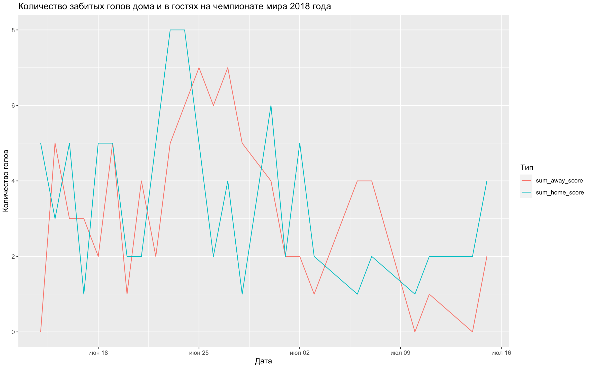
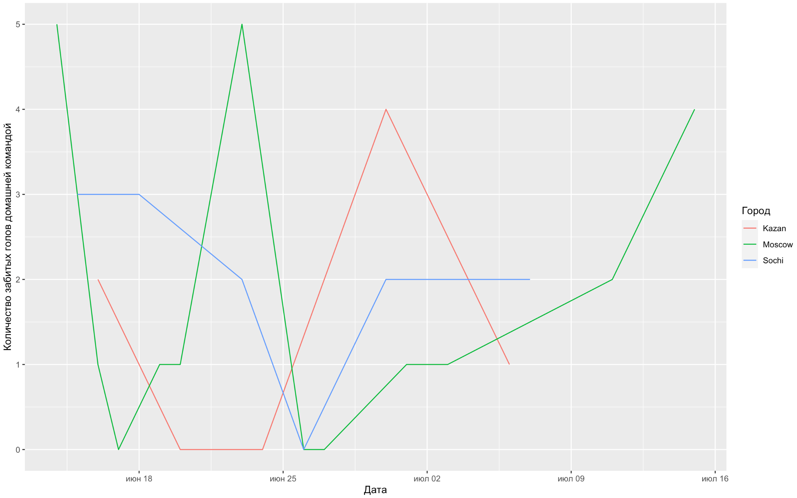

<style>
h1,
h2,
h3,
h4,
h5,
h6  {
  color: #317eac;
}
</style>
```{r setup, include=FALSE}
knitr::opts_chunk$set(echo = TRUE, warning=FALSE, message=FALSE)
```

<center>
{width=400px}
</center>

### Правила игры

1. Вы должны оформить КР в R Markdown или обычном R скрипте.
2. Вы можете не комментировать ваш код. Просто пишите код для решения задач.
3. КР скидываете в телеграмм до 11:00!

```{r eval=FALSE}
packages <- c('readr', 'dplyr', 'tidyr', 'ggplot2')
# install.packages(packages)
library(readr)
library(dplyr)
library(tidyr)
library(ggplot2)
```

Подгрузите ваш датасет.

```{r eval=FALSE}
url <- 'https://raw.githubusercontent.com/ahmedushka7/R/master/docs/homeworks/test/data/results.csv'
data <- read_csv(url)
```

Это датасет со статистикой о футбольных матчах. В нём представлены следующие переменные:

* `date` -- дата
* `home_team` -- команда, которая играла на домашнем поле
* `away_team` -- команда, которая играла на гостевом поле
* `home_score` -- количество голов, забитых домашней командой
* `away_score` -- количество голов, забитых гостевой командой 
* `city` -- город

### Задание №1 (20 баллов)

1. Сколько наблюдений в датасете и какой тип имеет каждая переменная?
2. В скольких городах проходили матчи?
3. За какой период представлены данные?
4. Вывести статистики (минимум; 1, 3 квартиль; медиана, максимум, среднее) для всего датасета по переменным `home_score` и `away_score`. Это можно сделать с помощью одной функции.
5. Выведите матч игры России с Испанией. Кто выиграл? Какой счет? 

### Задание №2 (20 баллов)

Вывести топ-10 команд в порядке убывания по количеству пропущенных голов на своем поле. На каком месте находится Россия?

### Задание №3 (30 баллов)

Нужно построить следующий график. На нем изображена динамика забитых голов на домашнем поле и на гостевом по всему периоду чемпионата мира 2018 года. 

<center>
{width=400px}
</center>

### Задание №4 (30 баллов)

Нужно построить следующий график. На нем изображена динамика количества забитых голов домашней командой в трех городах, проводящих матчи. 

<center>
{width=400px}
</center>


