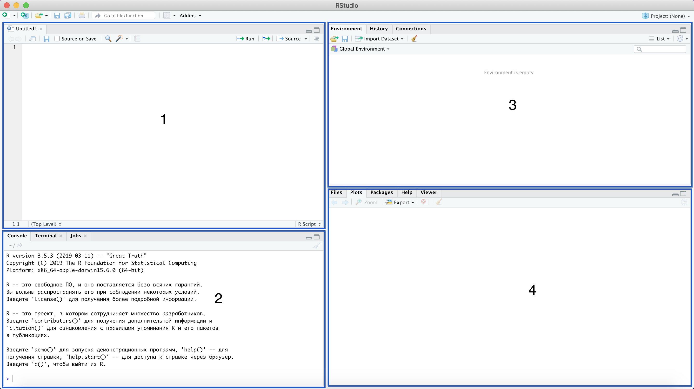

```{r setup, include=FALSE}
knitr::opts_chunk$set(echo = TRUE)
```

### Цель курса

Данная дисциплина предназначена для изучения языка программирования R и его использования для анализа данных. Дисциплина охватывает все стадии анализа данных, от сбора и обработки данных до обучения модели на этих данных. Уделено большое внимание визуализации данных, а также работе с данными в интернете.

### Язык программирования R

R — язык программирования для статистической обработки данных и работы с графикой, но в тоже время это свободная программная среда с открытым исходным кодом. R применяется везде, где нужна работа с данными. Это не только статистика в узком смысле слова, но и «первичный» анализ (графики, таблицы), и продвинутое математическое моделирование.

### IDE и RStudio

IDE(Integrated Development Environment) - интегрированная среда разработки. Можно сказать, что это красивая и удобная обложка для R.Такими инстсрументами являются RStudio, JGR, RKWard, SciViews-R. Мы будем использовать RStudio.Для тех, кто продвинется в изучении R и Python,можно работать с обоими языками в Jupyter notebook.

### Интерфейс RStudio


Интерфейс RStuidio состоит из четырёх основных окон:

* верхнее левое(1) - работа со скриптами
* нижнее левое(2) - работа с консолью
* верхнее правое(3) - переменные, функции и остальные созданные объекты
* нижнее правое(4) - директория, графики, пакеты и поддержка

### Арифметические операции и первая работа с консолью 

Давайте теперь попробуем начать наше взаимодействие с R. Начнем с простых арифметических операций. Будем писать и запускать код в консоли. О том, что консоль готова запускать какой-либо код, говорит нам знак больше(>). Напишем *2 + 2* и нажмем *Enter*.


В выводе получаем закономерные 4! Попробуйте сами выполнить остальные арифметические операции.

```{r collapse=TRUE}
2+2 # Сложение.
10-5 # Вычитание.
10*99 # Умножение.
225/15 # Деление, результат - целочисленный.
10/4 # Деление, результат - действительное число.
11%/%3 # Целая часть от деления.
11%%3 # Остаток от деления.
5^2 # Возведение в степень (1 вариант).
5**2 # Возведение в степень (2 вариант).
```

В R также есть встроенное значение числа Пи.

```{r collapse=TRUE}
pi
```

Давайте теперь попробуем воспользоваться знакомыми нам функциями. Например найдем косинус числа Пи. Для этого напишем в консоли `cos(pi)`. Заметим, что аргумент нашей функции мы записываем в круглых скобках. Используем эту функцию и другие.

```{r collapse=TRUE}
cos(pi) # Косинус.
sin(pi) # Синус.
exp(1) # Экспонента.
tan(0) # Тангентс.
abs(-5) # Модуль.
sqrt(144) #Корень.
factorial(10) # Факториал.
round(3.4865, 2) # Округление числа до 2 знака после запятой.
```

Отметим некоторые моменты:

* Все эти функции являляются встроенными в R. На вход функции получают один или несколько аргументов. Как и в математике, чтобы получить значение функции $y = f(x)$ нужно подставить аргумент $x$. 

* У функции `round` имеется два аргумента: число, которое нужно округлить, и до скольких знаков после запятой это нужно сделать. Когда у нас имеется 2 или более аргумента, мы перечисляем их через запятую. К функциям мы еще вернемся позднее.

* Есть огромное количество функций(как встроенных, так и написанных нами). Их названия могут быть большими. Чтобы не писать их полностью, можно написать начало функции после чего нажать кнопку *Tab*. RStudio выведет список функций с таким же началом, после чего вы с помощью стрелочек сможете выбрать нужную вам функцию. 

* Как говорилось ранее, о готовности консоли запустить код говорит знак больше(>). Но иногда там появляется плюсик(+) из-за которого все перестает работать. Этот плюсик появляется после того, как вы не дописали какой-то код. Давайте напишем в консоли `10 - 5 -`. В данном случае мы видимо забыли дописать какое-то число. У нас появится плюсик(+). В данном случае мы можем дописать код или нажать *Esc* и написать код заново. Чтобы не писать код заново, можно с помощью стрелочки вверх вернуться к написанному ранее коду.


* Кто не знал, факториал числа $n$ вычисляется следующим образом. 
\[
n! = 1 \times 2 \times... \times n-1 \times n
\]
Восклицательный знак как раз и обозначает факториал. Например, посчитаем факториал числа 5.
\[
5! = 1 \times 2 \times 3 \times 4 \times 5 = 120
\]


### Первый скрипт

Обычно мы пишем достаточно большой код на много строк. Писать по одной строке в консоле очень неудобно по всем причинам. Хотелось бы написать код, а потом уже его запустить и при надобности редактировать. Для этого и нужен скрипт. Давайте создадим наш первый скрипт!


Код пишется здесь построчно. После того как вы написали нужный вам код у вас есть несколько вариантов как передать его в консоль и запустить:

1. Можно использовать комбинацию клавиш *Ctrl + Enter*(*Cmd + Enter* на маке). Так можно запускать код по одной строчке или выделив нужный кусок кода запустить его. Эта комбинация клавиш эквивалента нажатию кнопки *Run*, которая находится на верхней панели скрипта. 
2. Можно запустить весь код сразу с помощью кнопки *Source* на верхней панели скрипта.


Полезно комментировать код, который вы пишите, чтобы другие люди или вы позднее смогли понять смысл кода. Для комментирования импользуется решетка(#). Все, что идет после нее не является кодом, который R запускает. Это удобно, когда нужно прокомментировать что-то или убрать часть кода, не удаляя его. Если вам нужно закомментировать/расскоментировать несколько строк, то можно использовать комбинация клавиш *Ctrl + Shift + C*(*Сmd + Shift + C* на маке).
 
Также можно сделать заголовок, чтобы отделить части кода друг от друга. Это можно сделать с помощью комбинации клавиш *Ctrl + Shift + R*(*Сmd + Shift + R* на маке).


### Переменные

Информацию нужно где-то хранить. Самым простым контейнером для хранения данных являются переменные. Их можно создавать следующим образом:

1. Пишите название переменной (оно не должно содержать пробелов и должно начинаться с буквы)
2. Ставите стрелочку(`<-`) или знак равно(`=`). Стрелочку можно поставить с помощью комбинации Alt + - . Предпочтительнее использовать стрелочку.
3. Написать значение, которое вы хотите присвоить.

```{r}
a <- 5 # Теперь в а содержится цифра 5.
b = 19 # Теперь b содержит цифру 7.
```

На самом деле можно присваивать и в обртаную сторону, но так код становится менее читабельным.

```{r}
8 -> c # С помощью стрелочки можно присваивать и в обратную сторону,может кому-то будет удобнее.
```

Чтобы отобразить переменную нужно написать её название или использовать функцию `print`.

```{r}
a
print(c)
```

А теперь очень важное замечание! R отличает строчные и заглавные буквы!

```{r}
M <- 99
m <- 66
#Это две разные переменные!
```

С переменными можно проводить те же действия, что и с числами.

Значением переменной может быть не только какое-то число. Рассмотрим основные виды переменных:

* числовой(integer/numeric/double)
* строковый(character) - записывается в кавычках
* логический(logical) - TRUE/FALSE

```{r}
#числовой(integer/numeric/double)
number <- 7
#строковый(character)
name <- "Anna"
#Логический(logical)
a <- TRUE
b <- FALSE
```

Тип переменной можно определиить с помощью следующих команд:

* `typeof`
* `class`
* семейство функций `is.*`, например, `is.logical`

```{r}
typeof(number)
typeof(name)
typeof(a)
```

Кроме основных типов переменных есть еще и особые:

* `Inf` - бесконечность
* `NA` - Not available
* `NaN` - Not-a-Number

```{r}
sila <- Inf
b <- 0/0 # Not-a-Number
a <- NA # not available
```

Чтобы вывести на экран все наши объекты можно использовать функцию `ls`. 

```{r}
ls()
```

Чтобы удалить отдельный объект можно использовать функцию `rm`.

```{r}
a <- 10
rm(a)
```

Чтобы удалить все ваши объекты есть два пути:

* запустить код `rm(list=ls())`
* нажать на метёлочку в правом верхнем углу

Также можно очистить консоль с помощью комбинации Ctrl + L.

### Массивы

Следующим контейнером хранения данных являются массивы (векторы). Самый простой способ задания массива это использование функции `c`. Массивы могут содержать данные любого типа. Но этот тип должен быть одним, то есть вы не можете иметь в массиве, например, числовое и строковое значение. Название массива должно удовлетворять таким же условиям, что и названия переменных.

```{r}
numbers <- c(1,2,3,4,5)
names <- c("Ahmed","Anna","Vika","Mikhael")
logic <- c(TRUE,FALSE,T,F)
```

Выведем эти переменные на экран.

```{r}
print(numbers)
print(names)
print(logic)
```

Массив это индексируемый вид данных. Можно выделять нужные нам элементы по индексам.

```{r}
n1 <- numbers[1]
n2 <- numbers[2]
n3 <- numbers[3]
print(n1)
print(n2)
print(n3)
```

Элементы вектора можно изменять.

```{r}
numbers[1] <- 10
numbers[2] <- 11
numbers[3] <- 12
print(numbers)
```

Функция `length(x)`, где x - это сам вектор, считает количество элементов в нем.

```{r}
chi <- c(0,0,0,0,0,0)
kol <- length(chi)
print(kol)
```

Элементов получилось 6, но что будет если мы попробуем вывести 7-ой элемент?

```{r}
print(chi[7])
```

Как же добавить еще элементов в вектор? Просто создать новый вектор.

```{r}
numbers <- c(numbers,10,13,99)
print(numbers)
```

В данном случае мы можем вставить элементы в начало или конец.Если же нужно вставить элемент в определенное время используем функцию `append`. Первый аргумент это массив, в который добавляем элемент. Второй аргумент это сам элемент. А третий аргумент это после какого аргумента нужно вставить элемент.

```{r}
numbers <- append(numbers, -Inf, after = 3)
numbers
```

Добавлять научились, теперь научимся удалять. Можно выделить массив без указанного элемента. 

```{r}
numbers <- numbers[-1]
```

Изучим еще несколько способов создания массивов.

```{r}
v1 <- 10:100
v2 <- seq(1, 2, by = 0.25)
v3 <- seq(5, 10, length = 20)
v4 <- rep(1:3,times = 5)
v5 <- rep(1:3,each = 4)
```

Можно выделять из массива не только один элемент, но и несколько. Просто нужно подать массив индексов, которые нам нужны.

```{r}
v1[c(1,3,5)]
v1[seq(1,5,2)]
```

Часто для проверки аргументов хорошо использовать рандомный массив. Его можно создать с помощью функции `sample`. Первый аргумент(`x`) это массив из которого можно генерировать значения. Второй(`size`) это размер генерируемого массива. А третий(`replace`) указывает можно ли повторять элементы.

```{r}
random <- sample(x = 1:10, size = 5, replace = TRUE)
```


### Цикл for

### Условный оператор if

#### Операторы сравнения

Мы можем сравнивать элементы:

```{r}
5 == 5
5 != 5
5 > 5
5 < 5
5 >= 5
5 <= 5
```

Есть некоторый нюанс.

```{r}
0.1 + 0.2 == 0.3
1/49 * 49 == 1
```

Так происходит потому что в R есть точность до определенного знака. Чтобы избежать этого можно использовать функцию `all.equal`. 

```{r}
all.equal(0.1+0.2, 0.3)
```

#### Логические операторы

табличку с операторами

#### if

Зачастую действие алгоритма или какого-то кода может зависеть от условия, Для этого нужен условный оператор. Он выглядет следующим образом.

```{r, eval=FALSE}
if (condition) {
  # действия в случае TRUE 
}else{
  # действи в случае FALSE
}
```

Условие(condition) должно принимать значения либо TRUE, либо FALSE. То есть иметь логический тип.

### Цикл while

### Работа с матрицами

### Функции

help
рекурсия

### Алгоритм сортировки пузырьком