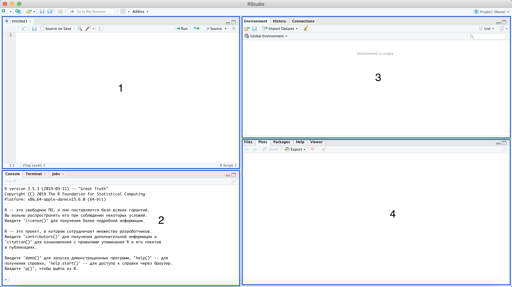
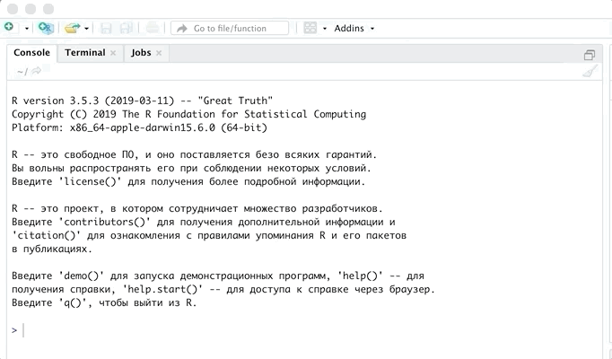
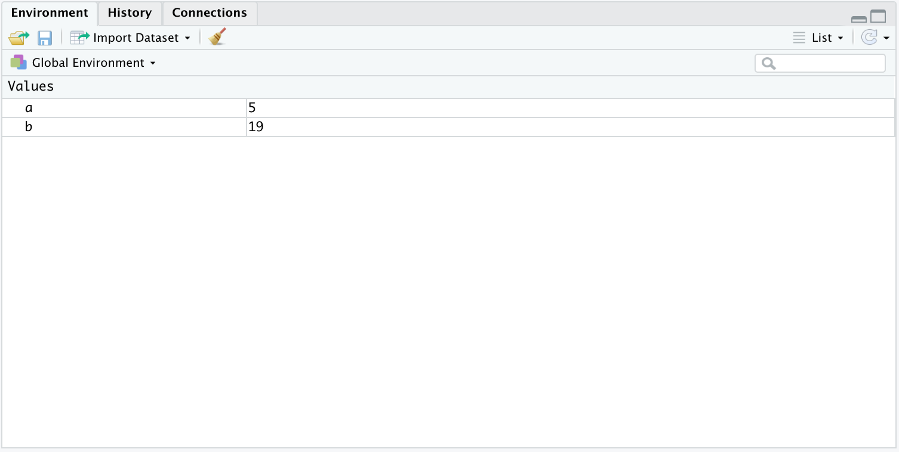
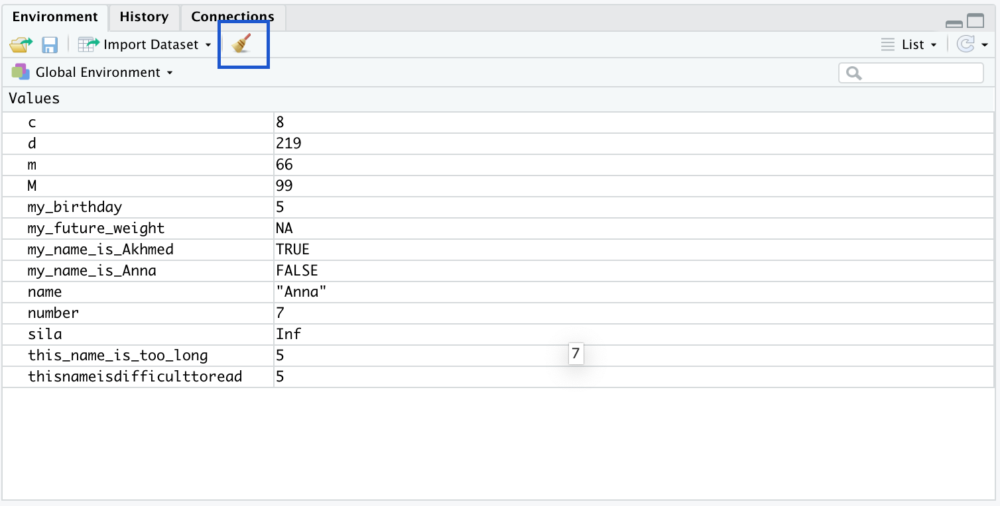
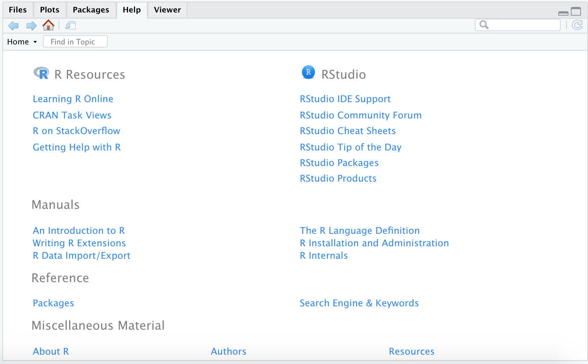

---
```{r setup, include=FALSE}
knitr::opts_chunk$set(echo = TRUE)
```

### Цель курса

Данная дисциплина предназначена для изучения языка программирования R и его использования для анализа данных. Дисциплина охватывает все стадии анализа данных: от сбора и обработки данных до обучения модели на этих данных. Уделено большое внимание визуализации данных, а также работе с данными в интернете.

### Язык программирования R

R — язык программирования для статистической обработки данных и работы с графикой, но в то же время это свободная программная среда с открытым исходным кодом. R применяется везде, где нужна работа с данными. Это не только статистика в узком смысле слова, но и «первичный» анализ (графики, таблицы), и продвинутое математическое моделирование.

### IDE и RStudio

IDE(Integrated Development Environment) - интегрированная среда разработки. Можно сказать, что это красивая и удобная обложка для R. Такими инстструментами являются RStudio, JGR, RKWard, SciViews-R. Мы будем использовать RStudio. Для тех, кто продвинется в изучении R и Python,можно работать с обоими языками в Jupyter notebook.

### Интерфейс RStudio


Интерфейс RStuidio состоит из четырёх основных окон:

* верхнее левое (1) -- работа со скриптами
* нижнее левое (2) -- работа с консолью
* верхнее правое (3) -- переменные, функции и остальные созданные объекты
* нижнее правое (4) -- директория, графики, пакеты и поддержка

### Арифметические операции и первая работа с консолью 

Давайте теперь попробуем начать наше взаимодействие с R. Начнем с простых арифметических операций. Будем писать и запускать код в консоли. О том, что консоль готова запускать какой-либо код, говорит нам знак больше(>). Напишем *2 + 2* и нажмем *Enter*.


В выводе получаем закономерные 4! Попробуйте сами выполнить остальные арифметические операции.

```{r collapse=TRUE}
2+2 # Сложение.
10-5 # Вычитание.
10*99 # Умножение.
225/15 # Деление, результат - целочисленный.
10/4 # Деление, результат - действительное число.
11%/%3 # Целая часть от деления.
11%%3 # Остаток от деления.
5^2 # Возведение в степень (1 вариант).
5**2 # Возведение в степень (2 вариант).
```

В R также есть встроенное значение числа Пи.

```{r collapse=TRUE}
pi
```

Давайте теперь попробуем воспользоваться знакомыми нам функциями. Например найдем косинус числа Пи. Для этого напишем в консоли `cos(pi)`. Заметим, что аргумент нашей функции мы записываем в круглых скобках. Используем эту функцию и другие.

```{r collapse=TRUE}
cos(pi) # Косинус.
sin(pi) # Синус.
exp(1) # Экспонента.
log(exp(1)) # натуральный логарифм
log10(100) # логарифм с основанием 10
tan(0) # Тангенс.
abs(-5) # Модуль.
sqrt(144) #Корень.
factorial(10) # Факториал.
```

Отметим некоторые моменты про функции:

* Все эти функции являются встроенными в R. На вход функции получают один или несколько аргументов. Как и в математике, чтобы получить значение функции $y = f(x)$ нужно подставить аргумент $x$. 

* Некоторые функции принимают несколько аргументов, а не один. Например, у функции `log` есть основной аргумент (число, от которого нам нужно посчитать логарифм), а также аргумент `base`, в который нужно передать основание логарифма. Как я узнал что он называется `base`? Да очень просто: я написал функцию, а затем нажал `TAB`. После этого R сразу предложил мне все аргументы внутри функции. Также у функции `round` имеется два аргумента: число, которое нужно округлить, и до скольки знаков после запятой это нужно сделать (аргумент называется `digits`). 

```{r collapse=TRUE}
log(4, base=2) # логарифм от 4 с основанием 2
round(3.4865, digits=2) # Округление числа 3.4865 до 2 знака после запятой.
```

**Важное замечание №1:** Нажимать `TAB` внутри R бывает очень полезно. Например, вы не помните как называется функция полностью, но помните о том, с каких букв она начинается. Тогда можно начать писать название функции, нажать `TAB` и R предложит вам все варианты. В первое время старайтесь нажимать `TAB` почаще, чтобы получать клевые подсказки от R. 

**Важное замечание №2:** Порой внутри функции бывает очень много аргументов, да и когда их всего 2, если честно перечислять названия каждого не очень хочется. Тогда можно перечислить все, что вы подставляете в аргументы, просто через запятую, но в таком случае важно соблюдать порядок передачи символов. То есть, например, в описанные выше функции `log` и `round` можно было добавить аргументы так. 

```{r collapse=TRUE}
log(4, 2) # логарифм от 4 с основанием 2
round(3.4865, 2) # Округление числа 3.4865 до 2 знака после запятой.
```

**Важное замечание №3:** Многие аргументы внутри функций принимают какие-то значения по умолчанию. Например, можно залезть в справку функции `log` и увидеть, что аргумент `base`, отвечающий за основание логарифма, по умолчанию равен `exp(1)`, то есть по умолчанию логарифм натуральный. Поэтому если мы не поставим ничего в аргумент `base`, это не выдаст нам ошибку, так как по умолчанию уже есть число, которое соответствует этому аргументу. Аналогично с функцией `round`

```{r collapse=TRUE}
log(4) # логарифм от 4 с основанием exp(1) - стоит по умолчанию
round(3.456) # по умолчанию digits=0, то есть округляем до целого числа
```

* Можно пользоваться не только встроенными функциями, но и писать свои! К этому мы более подробно вернемся на следующих семинарах. 

Как говорилось ранее, о готовности консоли запустить код говорит знак больше(>). Но иногда там появляется плюсик(+) из-за которого все перестает работать. Этот плюсик появляется после того, как вы не дописали какой-то код. Давайте напишем в консоли `10 - 5 -`. В данном случае мы видимо забыли дописать какое-то число. У нас появится плюсик(+). В данном случае мы можем дописать код или нажать *Esc* и написать код заново. Чтобы не писать код заново, можно с помощью стрелочки вверх вернуться к написанному ранее коду.


Перечислим еще несколько важных моментов, которые очень полезно знать для работы в дальнейшем:

* Можно очистить консоль сочетанием клавиш *Ctrl+L*(*Cmd + L* на маке) .

* Кто не знал, факториал числа $n$ вычисляется следующим образом. 
\[
n! = 1 \times 2 \times... \times n-1 \times n
\]
Восклицательный знак как раз и обозначает факториал. Например, посчитаем факториал числа 5.
\[
5! = 1 \times 2 \times 3 \times 4 \times 5 = 120
\]

### Первый скрипт

Обычно мы пишем достаточно большой код на много строк. Писать по одной строке в консоле очень неудобно по всем причинам. Хотелось бы написать код, а потом уже его запустить и при надобности редактировать. Для этого и нужен скрипт. Давайте создадим наш первый скрипт!



Код пишется здесь построчно. После того, как вы написали нужный вам код у вас есть несколько вариантов как передать его в консоль и запустить:

1. Можно использовать комбинацию клавиш *Ctrl + Enter*(*Cmd + Enter* на маке). Так можно запускать код по одной строчке или выделив нужный кусок кода запустить его. Эта комбинация клавиш эквивалента нажатию кнопки *Run*, которая находится на верхней панели скрипта. 
2. Можно запустить весь код сразу с помощью кнопки *Source* на верхней панели скрипта.


Полезно комментировать код, который вы пишите, чтобы другие люди или вы позднее смогли понять смысл кода. Для комментирования используется решетка (#). Все, что идет после нее не является кодом, который R запускает. Это удобно, когда нужно прокомментировать что-то или убрать часть кода, не удаляя его. Если вам нужно закомментировать/раскоментировать несколько строк, то можно использовать комбинацию клавиш *Ctrl + Shift + C* (*Сmd + Shift + C* на маке).
 
Также можно сделать заголовок, чтобы отделить части кода друг от друга. Это можно сделать с помощью комбинации клавиш *Ctrl + Shift + R* (*Сmd + Shift + R* на маке).


### Переменные

#### Создание переменной

Информацию нужно где-то хранить. Самым простым типом данных для их хранения являются *переменные*. Вы можете сохранять какое-нибудь значение под определённым названием. Все ваши созданные переменные хранятся в глобальном окружении R, мы еще вернемся к этому позже, сейчас просто знайте, что переменные хранятся в памяти компьютера. Переменные можно создавать следующим образом:

1. Напишите название переменной.
2. Поставьте стрелочку(`<-`) или знак равно(`=`), это не имеет значения. Стрелочку можно поставить с помощью комбинации клавиш *Alt + -* (*Option + -*  на маке). Предпочтительнее использовать стрелочку, она выглядит более эстетично.
3. Написать значение, которое вы хотите присвоить.

Давайте попробуем создать простые переменные.

```{r}
a <- 5 # Теперь в а содержится число 5.
b = 19 # Теперь b содержит чиcло 7.
```

После присвоения (передачи значения в переменную) можно заметить, что наши переменные появились в верхнем правом окне. Это означает, что они находятся в памяти компьютера и мы всегда можем использовать их.



На самом деле можно присваивать и в обратную сторону, возможно, кому-то так будет более удобное, но так код становится менее читабельным. Лучше так не делать (:

```{r}
8 -> c 
```

Чтобы вывести переменную на экран нужно написать функцию `print`. 

```{r collapse=TRUE}
print(a)
print(b)
print(c)
```

#### Правила обозначения переменных

Теперь поговорим немного о названиях переменных. Вот несколько правил и пожеланий:

1. Переменная обязательно начинается с буквы!
2. Пробелы в названии использовать нельзя!
3. Если вы пишете длинный код, в котором очень много переменных, используйте названия, которые что-то говорят о данной переменной, дабы избежать путаницы. Не используйте рандомные названия, взятые с потолка (типа, “asfsadsf”)
4. Название также должно быть не слишком длинным, иначе вы замучаетесь каждый раз его набирать при вызове переменной, а еще это занимает много места на экране.
5. Если название состоит из нескольких слов, пользуйтесь “змеиным языком”. Это означает, что слова разделены символом _ (помним, что пробелы использовать нельзя).
6. Нежелательно использовать названия, которые уже даны функциям в R. Это создаст сложности, когда вы захотите вызвать функцию, либо что-то сделать с переменной.

Вот несколько хороших и не очень названий для переменных:

```{r}
a <- 5
number <- 5
my_birthday <- 5
this_name_is_too_long <- 5
thisnameisdifficulttoread <- 5
```

А теперь очень **важное замечание**! R отличает строчные и заглавные буквы! Ниже представлены 2 разные переменные:

```{r}
M <- 99
m <- 66
```

#### Базовые типы переменных

Значением переменной может быть не только какое-то число. Рассмотрим основные типы переменных:

* числовой (integer/numeric/double)
* строковый (character) - записывается в кавычках
* логический (logical) - `TRUE`/`FALSE`(можно коротко `T`/`F`)
* NA (not available) - пропущенное значение (более подробно об этом чуть позже)

```{r}
number <- 7
name <- "Anna"
my_name_is_Akhmed <- TRUE
my_name_is_Anna <- FALSE
my_future_weight <- NA
```

Тип переменной можно определить с помощью следующих команд:

* Функция `typeof`.
* Функция `class`.
* Семейство функций `is.*`(например, `is.logical`), которое дает логический ответ на вопрос, является ли переменная определенного типа.

```{r collapse=TRUE}
class(number)
class(name)
class(my_name_is_Akhmed)
class(my_name_is_Anna)
class(my_future_weight)
```

```{r collapse=TRUE}
is.numeric(number)
is.character(name)
is.logical(my_name_is_Akhmed)
is.logical(my_name_is_Anna)
is.na(my_future_weight)
```

Кроме основных типов переменных есть еще и особые:

* `Inf` - бесконечность
* `NaN` - Not-a-Number (неопределенность)

```{r collapse=TRUE}
power_of <- Inf
b <- 0/0
```

### Работа с глобальным окружением

Мы видим все наши объекты (пока только переменные) в правом верхнем окне. Иногда при работе только в консоли или других IDE у нас нет такого окна. Чтобы вывести на экран все наши объекты можно использовать функцию `ls`. 

```{r}
ls()
```

Чтобы удалить отдельный объект можно использовать функцию `rm`. Можно удалить несколько объектов через запятую.

```{r}
rm(a, b)
ls()
```

Чтобы удалить все наши объекты есть два пути:

1. Прописать строчку `rm(list=ls())` в скрипте и выполнить ее. Очень советую вставлять этот код в каждый скрипт на первую строчку.
2. Нажать на метёлочку в правом верхнем углу.




### Массивы

#### Определение и необходимость

Следующим контейнером хранения данных являются массивы (векторы). Представим вам нужно хранить информацию о возрасте 25 учеников в классе. Создавать 25 переменных не очень корректно. Хотелось бы создать одну переменную, в которой все это хранилось. Для этого и созданы массивы. Массив - это тип данных, который представляет собой набор последовательных значений. 
 
#### Способы задания

Самый простой способ задания массива это использование функции `c`. Массивы могут содержать данные любого типа. Но этот тип должен быть одним, то есть вы не можете иметь в массиве, например, числовое и строковое значение. Название массива должно удовлетворять таким же условиям, что и названия переменных.

```{r collapse=TRUE}
numbers <- c(1,2,3,4,5)
names <- c("Ahmed","Max","Vika","Mikhael")
logic <- c(TRUE,FALSE,T,F)
```

Можем также видеть, что массивы отобразились в верхнем правом окне. Там показан тип переменных массива, его длина и первые значения.

**Замечание:** У массивов есть одна особенность: если вы добавляете к числовому массиву (массиву, в котором все объекты - это числа) строковую переменную, то все объекты тоже становятся строками. Поэтому хранить строковые переменные с другими в массиве нельзя! 

```{r collapse=TRUE}
numbers <- c(1,2,3,4,5, 'Max')
print(numbers)
print(class(numbers))
```

#### Индексирование!

Массив это индексируемый вид данных. Можно обращаться к нужным нам элементам по индексам.

```{r collapse=TRUE}
n1 <- numbers[1]
n2 <- numbers[2]
n3 <- numbers[3]

print(n1)
print(n2)
print(n3)
```

Элементы массива можно изменять с помощью индексирования.

```{r}
numbers[1] <- 10
numbers[2] <- 11
numbers[3] <- 12
print(numbers)
```

ОЧЕНЬ ПОЛЕЗНАЯ функция `length(x)`, где x - это сам вектор, считает количество элементов в нем.

```{r}
chi <- c(0,0,0,0,0,0)
kol <- length(chi)
print(kol)
```

Элементов получилось 6, но что будет если мы попробуем вывести 7-ой элемент?

```{r}
print(chi[7])
```

Как же добавить еще элементов в вектор? Просто создать новый вектор.

```{r}
numbers <- c(numbers,10,13,99)
print(numbers)
```

В этом случае мы можем вставить элементы в начало или конец. Если же нужно вставить элемент в определенное время -- используем функцию `append`. Первый аргумент это массив, в который добавляем элемент. Второй аргумент -- сам элемент. А третий аргумент -- после какого аргумента нужно вставить элемент.

```{r}
numbers <- append(numbers, -Inf, after = 3)
numbers
```

Добавлять научились, теперь научимся удалять. Можно выделить массив без указанного элемента. 

```{r}
numbers <- numbers[-1]
print(numbers)
```

#### Другие способы создания массива

Изучим еще несколько способов создания массивов.

```{r collapse=TRUE}
v1 <- 10:100
v2 <- seq(1, 2, by = 0.25)
v3 <- seq(5, 10, length = 20)
v4 <- rep(1:3,times = 5)
v5 <- rep(1:3,each = 4)
```

Можно выделять из массива не только один элемент, но и несколько. Просто нужно подать массив индексов, которые нам нужны.

```{r collapse=TRUE}
v1[c(1,3,5)]
v1[seq(1,5,2)]
```

Часто для проверки работы алгоритма или функции хорошо использовать рандомный массив. Его можно создать с помощью функции `sample`. Он содержит следующие аргументы:

1. `x` -- массив, из которого можно генерировать значения
2. `size` -- это размер генерируемого массива
3. `replace` -- можно ли повторять элементы

```{r}
random <- sample(x = 1:10, size = 5, replace = TRUE)
```

#### Арифметические операции

Большинство арифметических операций векторизовано. Это означает, что функция применяется поэлементно.

```{r collapse=TRUE}
vec1 <- c(1,2,3,4)
vec2 <- c(3,2,1,0)
vec1 + vec2
vec1 * vec2
```

Найдем корень каждого числа массива.

```{r}
sqrt(vec1)
```

А вот функция `sum()` невекторизована, она выдает одно число, состоящее из суммы всех остальных.

```{r}
sum(vec1)
```

Также можно выполнять арифметические операции между вектором и числом.

```{r collapse=TRUE}
vec1 - 1
vec1 + 1
vec1 * 5
vec1 / 10
```


### Help

Мы уже научились пользоваться встроенными функциями R. Их будет очень много и в дальнейшем. Очень сложно помнить о функциях всё, поэтому в RStudio есть справка. Она находится в правом нижнем окне. Там можно найти много интересного.


Зная же название функции, можно вызвать справку несколькими способами:

* поставить вопросительный знак и название функции -- `?facrorial` 
* использовать функцию `help` -- `help(factorial)`
* навести мышкой на функцию и нажать *F1*

