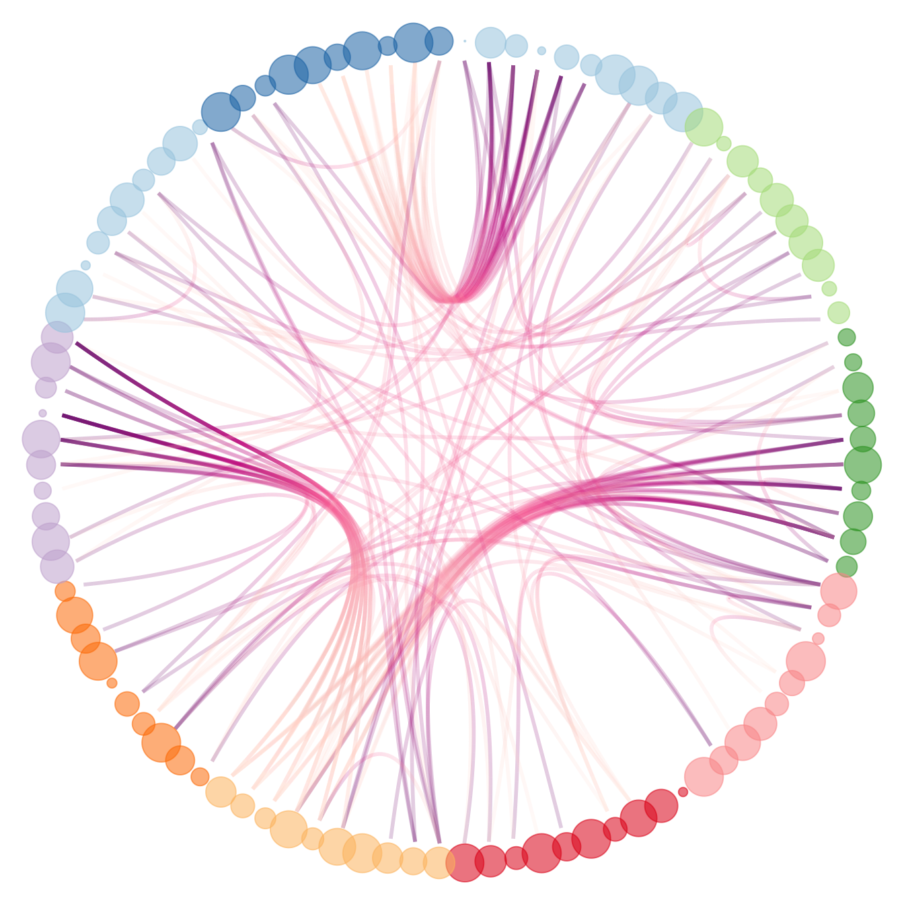

---
```{r setup, include=FALSE}
knitr::opts_chunk$set(echo = TRUE, warning = FALSE, message = FALSE)
```

### Визуализация данных

> "Обычный график дает аналитику гораздо больше пищи для размышлений, чем любая другая форма представления информации." -- Джон Тьюки


{width=33%}{width=33%}{width=33%} 
{width=33%}{width=33%}{width=33%}
{width=33%}{width=33%}{width=33%}

```{r echo=FALSE}
library(plotly)
p <- plot_ly(z = volcano, type = "surface")
p 
```

Визуализациия -- один из важнейших этапов анализа данных. Различные графики могут помочь понять, что не так с вашмими данными, найти какие-то закономерности, понять какая зависимость между переменными (линейная, нелинейная), найти аномалии или выбросы и многое другое. К тому же визуализация это очень красиво!

Графики могут быть очень разными, например:

1. Визуализация одной переменной (histogram, bar, boxplot).
2. Визуализация нескольких переменных (scatter plot, line plot).
3. Визуализация графов.
4. Визуализация карты.
5. Визуализация моделей.
6. Визуализация 3D графиков.

На [этом сайте](https://datavizcatalogue.com/RU/) можно найти большое количество разных типов графиков.

### ggplot2

В стандартном пакете R есть визуализация с помощью функции `plot`. Она уже устарела и не такая красивая, как визуализация с помощью пакета `ggplot2`.

#### Установка и подгрузка пакета

Давайте установим и подгрузим уже известные нам пакеты, а также пакет `ggplot2`.

```{r}
packages <- c('ggplot2', 'dplyr', 'tidyr', 'tibble')
# install.packages(packages)
library(ggplot2)
library(dplyr)
library(tidyr)
library(tibble)
```

#### Принцип создания графика

Визуализация часто помогает найти какие-то закономерности в данных, которые потом можно использовать для построения моделей. Давайте возьмем набор данных `mpg`. Можно вызвать справку по этому датасету с помощью команды `?mpg`. Взглянем на то, как выглядит наш набор данных.

```{r}
glimpse(mpg)
```

В этом наборе данных представлена информация о 38 моделях автомобилей. Среди 11 переменных в этом датасете есть 2 следующие переменные:

* `displ` -- объем двигателя (в литрах)
* `hwy` -- эффективность расхода топлива, сколько миль машина может проехать с одним галлоном (около 4 литров) топлива

Скорее всего эти переменные взаимосвязаны. Чем больше объем двигателя, тем меньше миль машина сможет проехать. Давайте проверим это, нарисовав график.

```{r}
ggplot(data = mpg) +
  geom_point(mapping = aes(x = displ, y = hwy))
```

Видно, что и правда существует какая-то отрицательная связь. Но нас интересует то, как можно строить графики с помощью пакета `ggplot2`.

1. Любой график в `ggplot2` начинается с функции `ggplot()`, внутри которой вы передайте обязательный аргумент `data` -- это ваш набор данных, в котором находится информация для визуализации.
2. Весь рисунок -- это **наложение нескольких слоев** с помощью знака плюс (`+`). Функция `ggplot()` строит первый слой. Она создает систему координат, к которой можно начинать добавлять слои.

```{r}
ggplot(data = mpg)
```

3. Функция `geom_point()` накладывает следующий слой, который состоит из точек. Эта функция имеет обязательный аргумент `mapping`, в котором вы должны указать оси (переменные) для вашего графика. Существует целое семейство функций, которые имеют название `geom_xxx`.

#### Атрибуты графика

Вы можете также можете изменять ваш график. Например, вы хотите изменить цвет (`color`) и размер (`size`) точек. Внутри функции вы можете добавить эти аргументы.

```{r}
ggplot(data = mpg) +
  geom_point(mapping = aes(x = displ, y = hwy), color = 'blue', size = 2.5)
```

Вы можете писать какой-то цвет в виде строки. А можете использовать формат *HEX*. Например на [сайте](https://colorscheme.ru/color-converter.html) вы можете выбрать нужный вам цвет и использовать его.

```{r}
ggplot(data = mpg) +
  geom_point(mapping = aes(x = displ, y = hwy), color = '#593dbf')
```

Также вы можете поставить не точки, а другую форму (`shape`). Можно например поставить треугольники.

```{r}
ggplot(data = mpg) +
  geom_point(mapping = aes(x = displ, y = hwy), color = '#593dbf', shape = 2)
```

На рисунке показаны все виды форм.


Стоит заметить, что формы с 21 по 25 могут иметь 2 цвета. Обычный атрибут `color` отвечает за цвет границы. Если вы хотите закрасить фигуру, то можно использовать атрибут `fill`.

```{r}
ggplot(data = mpg) +
  geom_point(mapping = aes(x = displ, y = hwy), 
             color = '#593dbf', shape = 25,
             fill = 'red')
```
 
Также с помощью атрибута `alpha` вы можете делать ваши точки более прозрачными. Этот аргумент должен принимать значения от 0 до 1. По умолчанию стоит 1.

```{r}
ggplot(data = mpg) +
  geom_point(mapping = aes(x = displ, y = hwy), 
             alpha = 0.5)
```

Некоторые точки не стали прозрачными. Это произошло, так как на самом деле там не одна, а несколько точек, поэтому при наложении друг на друга они дали менее прозрачную точку. Это аргумент бывает очень удобным, когда вы визуализируете большой набор данных. 

#### Другой взгляд на атрибуты

Атрибуты украшают график, но можно использовать их и по-другому. До этого мы рисовали график, в котором использовали две непрерывные переменные. То есть на графике мы можем увидеть взаимосвязь только переменных. Нарисовать третью ось и перейти в трехмерное пространство, чтобы добавить 3 переменную было бы не очень хорошим решением. Атрибуты, про которые мы с вами узнали могут помочь нам добавить информацию на график о других переменных. 

У нас есть переменная `drv`, которая принимает только 3 значения. Эти значения указывают какой привод у машины.

```{r}
mpg %>%
  select(drv) %>%
  unique()
```

Можно, например расскрасить каждое значение в отдельный цвет. В этом случае нам нужно сделать следующее:

1. **ВАЖНО!** Использовать атрибут `color` в функции `aes`.
2. Передаем теперь этому артрибуты не какой-то цвет, а переменную `drv`.

```{r eval=FALSE}
# ДО
ggplot(data = mpg) +
  geom_point(mapping = aes(x = displ, y = hwy), color = 'blue')

# ПОСЛЕ
ggplot(data = mpg) +
  geom_point(mapping = aes(x = displ, y = hwy, color = drv))
```

Нарисуем наш новый график!

```{r}
ggplot(data = mpg) +
  geom_point(mapping = aes(x = displ, y = hwy, color = drv))
```

У нашего графика автоматически появилась легенда. Про нее мы тоже поговорим позже.

Попробуем теперь использовать переменную `cyl`, которая показывает количество цилиндров в двигателе. Эта переменная принимает значения 4, 5, 6 и 8.

```{r}
ggplot(data = mpg) +
  geom_point(mapping = aes(x = displ, y = hwy, color = cyl))
```

График получился не таким как раньше. Это просходит, так как мы имеем числовую переменную. Но у нас всего 4 значения, поэтому стоит использовать факторный тип. Перевести переменную в факторный тип можно прямо внутри функции `aes`. 

```{r}
ggplot(data = mpg) +
  geom_point(mapping = aes(x = displ, y = hwy, color = factor(cyl)))
```

Вы можете использовать и другие атрибуты, а также их комбинации. 

```{r}
ggplot(data = mpg) +
  geom_point(mapping = aes(x = displ, y = hwy, color = factor(cyl), shape = drv))
```

На таком графике уже можно увидеть взаимосвязь 4 переменных. Но не стоит этим увлекаться. График не должен быть сложным.

#### Виузализация временных рядов

До этого мы с вами говорили про график рассеяния (scatter plot). Он показывал взаимосвязь двух непрерывных переменных. Часто нам хочется посмотреть на динамику какого-то показателя (переменной) во времени. 

Давайте возьмем датасет `economics` из пакеты `dplyr`. Видим, что у нас есть переменная `date`, которая уже имеет формат даты. А также какие-то показатели. Например уровень безработицы (`uempmed`). Давайте нарисуем график дата -- уровень безработицы. Для этого используем слой `geom_line()`, который работает аналогично `geom_point()`.

```{r}
ggplot(data = economics) +
  geom_line(mapping = aes(x = date, y = uempmed))
```

Давайте добавим еще временной ряд для переменной `psavert`, которая показывает процент личных сбережений людей. Мы можем просто нанести еще один слой `geom_line()`.

```{r}
ggplot(data = economics) +
  geom_line(mapping = aes(x = date, y = uempmed)) + 
  geom_line(mapping = aes(x = date, y = psavert))
```

Получилось два временных ряда на одной картинке, но они одного цвета, и легенда не появилась. Первый способ как это можно исправить это задать цвет и легенду самому, это очень неприятный способ. Второй способ это использовать знакомую нам функцию `gather`. С `ggplot` можно использовать *pipe* (`%>%`).

```{r}
economics %>%
  gather(Type, Value, uempmed, psavert) %>%
  ggplot() +
    geom_line(aes(x = date, y = Value, color = Type))
```

Если в вашем слое вы постоянно работаете с одними осями, то вы можете их указать прямо в функции `ggplot`, чтобы не писать их несколько раз.

```{r}
economics %>%
  gather(Type, Value, uempmed, psavert) %>%
  ggplot(aes(x = date, y = Value, color = Type)) +
    geom_line()
```

#### Гистограмма

Гистограмма строится для **одной непрерывной** переменной. Это нужно, чтобы посмотреть на распределение нашей переменной. Для построения гистограммы достаточно указать одну ось **x* и использовать функцию `geom_histogram`.

```{r}
ggplot(iris, aes(x = Sepal.Width)) +
  geom_histogram()
```

Мы получили гистограмму, но она не очень хорошо выглядит. Возникают интервалы, в которых переменная не принимает никакие значения. Из-за этого эти интервалы пустые. Сейчас автоматически выбирается ширина прямоугольничков. Ее можно менять с помощью аргумента `binwidth`. 

```{r}
ggplot(iris, aes(x = Sepal.Width)) +
  geom_histogram(binwidth = 0.1)
```

Часто нам не нужно абсолютное значение, а нужно плотность распределения. Ее можно добавить с помощью известной функции `aes`, внутри которой ей присовить значение `..density..`. Точками отделяем, чтобы R не подумал, что это название переменной.

```{r}
ggplot(iris, aes(x = Sepal.Width)) +
  geom_histogram(aes(y = ..density..), binwidth = 0.1)
```

Вы можете так же использовать атрибуты.

```{r}
ggplot(iris, aes(x = Sepal.Width, fill = Species)) +
  geom_histogram(binwidth = 0.1)
```

График не совсем понятный, так как у значения x равным 2.5 мы не понимаем долю *setosa*. 

```{r}
ggplot(iris, aes(x = Sepal.Width, fill = Species)) +
  geom_histogram(binwidth = 0.1)
```

Есть несколько способов исправить это.

Первый способ: использовать аргумент `position`.

```{r}
ggplot(iris, aes(x = Sepal.Width, fill = Species)) +
  geom_histogram(binwidth = 0.1, position = 'dodge')
```

```{r}
ggplot(iris, aes(x = Sepal.Width, fill = Species)) +
  geom_histogram(binwidth = 0.1, position = 'fill')
```

Эти графики не так хороши. Поэтому есть второй способ: использовать функцию `geom_freqpoly` вместо `geom_histogram`. Она рисует распределение линиями.

```{r}
ggplot(iris, aes(x = Sepal.Width, color = Species)) +
  geom_freqpoly(binwidth = 0.1)
```

#### Диаграмма

Диаграмма строится для **одной дискретной** переменной. То есть переменные принимающие конечное число значений (факторные). Их можно нарисовать аналогично с помощью функции `geom_bar`.

Давайте посмотрим на количество машин, которые имеют передний, задний привод или 4x4.

```{r}
ggplot(mpg, aes(x = drv)) +
  geom_bar()
```

Вы так же можете использовать атрибуты.

```{r}
ggplot(mpg, aes(x = drv, fill = factor(cyl))) +
  geom_bar()
```

Если на такой график смотреть неудобно, то можно сделать по каждой переменной отдельный столбец с помощью аргумента `position`.

```{r}
ggplot(mpg, aes(x = drv, fill = factor(cyl))) +
  geom_bar(position=position_dodge())
```


<!-- #### Непрерывная и категориальная переменные -->

<!-- #### Две категориальные переменные -->

<!-- ```{r} -->
<!-- ggplot(data = diamonds) +  -->
<!--   geom_count(mapping = aes(x = cut, y = color)) -->
<!-- ``` -->


<!-- #### Название графика и оси -->

<!-- Все графики, которые мы делали до этого не очень хороши. Их минус заключается в том, что непонятно что этот график отображает. С помощью функции `labs` вы можете добавить название графика (`title`), дополнительное подробное описание графика (`subtitle`), источник данных (`caption`), название осей (`x` и  `y`), а также легенду. -->

<!-- ```{r} -->
<!-- ggplot(mpg, aes(displ, hwy, color = class)) + -->
<!--   geom_point() + -->
<!--   labs(title = 'Fuel efficiency genereally decreases with engine size', -->
<!--        subtitle = 'Two seaters (sports car) are an exception,  -->
<!--                     because of their light weight', -->
<!--        caption = 'Data from fueleconomy.gov', -->
<!--        x = 'Engine displacement (L)', -->
<!--        y = 'Highway fuel economy (mpg)', -->
<!--        color = 'Car type') -->
<!-- ``` -->

<!-- Название осей можно также быстро поменять с помощью функций `xlab()` и `ylab()`. -->

<!-- ```{r} -->
<!-- ggplot(mpg, aes(displ, hwy, color = class)) + -->
<!--   geom_point() + -->
<!--   xlab('Engine displacement (L)') +  -->
<!--   ylab('Highway fuel economy (mpg)') -->
<!-- ``` -->

<!-- Можно также использовать формулы в названии осей с помощью функции `quate()`. Более подробную информация можно найти с помощью команды `?plotmath`. -->

<!-- ```{r} -->
<!-- df <- tibble( -->
<!--   x = runif(10), -->
<!--   y = runif(10) -->
<!-- ) -->
<!-- ggplot(df, aes(x, y)) + -->
<!--   geom_point() + -->
<!--   labs( -->
<!--     x = quote(sum(x[i] ^ 2, i == 1, n)), -->
<!--     y = quote(alpha + beta + frac(delta, theta)) -->
<!--   ) -->
<!-- ``` -->

<!-- #### Оси -->

<!-- `ggplot` автоматически подбирает тип оси исходя от типа переменных. -->

<!-- ```{r} -->
<!-- ggplot(mpg, aes(displ, hwy)) + -->
<!--   geom_point(aes(colour = class)) -->
<!-- ``` -->

<!-- Для изменения осей вы можете использовать семейство функций `scale_*`. -->

<!-- ```{r} -->
<!-- ggplot(mpg, aes(displ, hwy)) + -->
<!--   geom_point(aes(colour = class)) + -->
<!--   scale_x_continuous() + -->
<!--   scale_y_continuous() + -->
<!--   scale_colour_discrete() -->
<!-- ``` -->

<!-- Внешним видом меток на осях и ключей легенды управляют два аргумента: `breaks` и `labels`. -->

<!-- * `breaks` -- управляет положением меток или значениями осей или ключей -->

<!-- ```{r} -->
<!-- ggplot(mpg, aes(displ, hwy)) + -->
<!--   geom_point() + -->
<!--   scale_y_continuous(breaks = seq(15, 40, by = 5)) -->
<!-- ``` -->

<!-- * `labels` --  -->

<!-- ```{r} -->
<!-- ggplot(mpg, aes(displ, hwy)) + -->
<!--   geom_point() + -->
<!--   scale_x_continuous(labels = NULL) + -->
<!--   scale_y_continuous(labels = NULL) -->
<!-- ``` -->


<!-- ```{r} -->
<!-- presidential %>% -->
<!--   mutate(id = 33 + row_number()) %>% -->
<!--   ggplot(aes(start, id)) + -->
<!--     geom_point() + -->
<!--     geom_segment(aes(xend = end, yend = id)) + -->
<!--     scale_x_date(NULL, breaks = presidential$start, date_labels = "'%y") -->
<!-- ``` -->

<!-- Также есть аргумент `limits`, который задает диапозон значений, который мы хотим увидеть. -->

<!-- ```{r} -->
<!-- ggplot(mpg, aes(displ, hwy)) + -->
<!--   geom_point() + -->
<!--   scale_y_continuous(limits = c(20, 40)) + -->
<!--   scale_x_continuous(limits = c(2, 4)) -->
<!-- ``` -->

<!--  -->

<!-- Это можно сделать и с помощью функций `xlim` и `ylim`. -->

<!-- ```{r} -->
<!-- ggplot(mpg, aes(displ, hwy)) + -->
<!--   geom_point() + -->
<!--   ylim(20, 40) + -->
<!--   xlim(2, 4) -->
<!-- ``` -->

<!-- Иногда эти два способа не работают. Тогда вам на может помочь функция `coord_cartesian`. -->

<!-- #### Построение нескольких графиков по категориальным переменным -->

<!-- ```{r} -->
<!-- p <- ggplot(mtcars, aes(x = wt, y = mpg)) + -->
<!--   geom_point() -->
<!-- p + -->
<!--   facet_grid(am ~ .) -->
<!-- p + -->
<!--   facet_grid(. ~ cyl) -->
<!-- p + -->
<!--   facet_grid(am ~ cyl) -->
<!-- ``` -->


<!-- #### Легенда -->

<!-- ####  -->


<!-- #### Сохранение графиков -->

<!-- Для сохранения графика можно использовать функцию `ggsave`, которая сохранит последний **нарисованный** график.  -->

<!-- Можно просто написать название файла и его расширение и все. Рисунок сохранится в рабочей директории.  -->

<!-- ```{r} -->
<!-- ggplot(mpg, aes(displ, hwy)) + geom_point() -->
<!-- ggsave("plot.pdf") -->
<!-- ``` -->

<!-- У этой функции много аргументов. Можно настраивать ширину, длину, качество рисунка и многое другое. -->

<!-- -- -->


<!-- ### ggplot2 -->

<!-- рассказать как он устроен -->

<!-- он устроен накладыванием слоев -->
<!-- Три основных элемента: -->
<!-- 1.Данные(data) -->
<!-- 2.Какие переменные мы маштабируем -->
<!-- 3.Какие элементы мы отображаем(как выглядит рисунок) -->
<!-- 4.Деление графиков -->
<!-- 5.Статистический слой, какие-то линейные или нелинейные модели -->
<!-- 6.Координаты -->
<!-- 7.Тема -->

<!-- Первые два слоя обязательные, они записываются в функции ggplot -->
<!-- Осталбные добавляются с помощью плюсика -->

<!-- Всего этиъ элементов 7 в видео в 1 главе есть классные картинки -->

<!-- рассказать почему он лучше чем обычный plot(прям показать, но не учить их обычному, это только запутает их) -->
<!-- есть в первом видео 2 главы -->
<!-- -можно взять за основу один график и с помощью него рисовать много других -->

<!-- ### Типы графиков -->

<!-- scatter plot -->


<!-- ### Начнем с самого простого график -->

<!-- ```{r} -->
<!-- str(mtcars) -->
<!-- ggplot(mtcars, aes(x = cyl, y = mpg)) + -->
<!--   geom_point() -->
<!-- ``` -->

<!-- Можно видеть, что `cyl` это категориальная переменная, поэтому график получается не достаточно хорошим. Изменим график -->

<!-- ```{r} -->
<!-- ggplot(mtcars, aes(x = factor(cyl), y = mpg)) + -->
<!--   geom_point() -->
<!-- ``` -->

<!-- Убрались лишние значения 5 и 7. -->


<!-- ```{r} -->
<!-- ggplot(mtcars, aes(x = wt, y = mpg)) + -->
<!--   geom_point() -->

<!-- ggplot(mtcars, aes(x = wt, y = mpg, color = disp)) + -->
<!--   geom_point() -->

<!-- ggplot(mtcars, aes(x = wt, y = mpg, size = disp)) + -->
<!--   geom_point() -->
<!-- ``` -->

<!-- ggplot все сделал за вас(про размер и цвет) -->

<!-- disp может быть как непрерывной так и категориальной переменной(выше видим) -->

<!-- ```{r} -->
<!-- ggplot(mtcars, aes(x = wt, y = mpg, shape = disp)) + -->
<!--   geom_point() -->
<!-- ``` -->

<!-- Выдается ошибка, так как shape работает только с категориальными переменными -->

<!-- ```{r} -->
<!-- # Explore the diamonds data frame with str() -->
<!-- str(diamonds) -->

<!-- # Add geom_point() with + -->
<!-- ggplot(diamonds, aes(x = carat, y = price)) +  -->
<!--   geom_point() -->


<!-- # Add geom_point() and geom_smooth() with + -->
<!-- ggplot(diamonds, aes(x = carat, y = price))+ -->
<!--   geom_point() +  -->
<!--   geom_smooth() -->
<!-- ``` -->

<!-- ```{r} -->
<!-- # 1 - The plot you created in the previous exercise -->
<!-- ggplot(diamonds, aes(x = carat, y = price)) + -->
<!--   geom_point() + -->
<!--   geom_smooth() -->

<!-- # 2 - Copy the above command but show only the smooth line -->
<!-- ggplot(diamonds, aes(x = carat, y = price)) + -->
<!--   geom_smooth() -->

<!-- # 3 - Copy the above command and assign the correct value to col in aes() -->
<!-- ggplot(diamonds, aes(x = carat, y = price,color = clarity)) + -->
<!--   geom_smooth() -->

<!-- # 4 - Keep the color settings from previous command. Plot only the points with argument alpha. -->
<!-- ggplot(diamonds, aes(x = carat, y = price,color = clarity)) + -->
<!--   geom_point(alpha = 0.4) -->

<!-- ``` -->

<!-- ### Основы -->

<!-- можно взять за основу два слоя а потом из них делать различные рисунки -->
<!-- aes можно добавлять в 3 слой, не обязательно во второй -->

<!-- ```{r} -->
<!-- # Create the object containing the data and aes layers: dia_plot -->
<!-- dia_plot <- ggplot(diamonds, aes(x = carat, y = price)) -->

<!-- # Add a geom layer with + and geom_point() -->
<!-- dia_plot + geom_point() -->

<!-- # Add the same geom layer, but with aes() inside -->
<!-- dia_plot + geom_point(aes(color = clarity)) -->

<!-- dia_plot + geom_smooth(aes(col = clarity), se = FALSE) # se от ошибок -->

<!-- ``` -->

<!-- ```{r} -->
<!-- # Plot 1: add geom_point() to this command to create a scatter plot -->
<!-- ggplot(mtcars, aes(x = wt, y = mpg, col = cyl)) + -->
<!--   geom_point()  # Fill in using instructions Plot 1 -->

<!-- # Plot 2: include the lines of the linear models, per cyl -->
<!-- ggplot(mtcars, aes(x = wt, y = mpg, col = cyl)) + -->
<!--   geom_point() + # Copy from Plot 1 -->
<!--   geom_smooth(method = 'lm', se = F)   # Fill in using instructions Plot 2 -->

<!-- # Plot 3: include a lm for the entire dataset in its whole -->
<!-- ggplot(mtcars, aes(x = wt, y = mpg, col = cyl)) + -->
<!--   geom_point() + # Copy from Plot 1 -->
<!--   geom_smooth(method = 'lm', se = F) + # Copy from Plot 2 -->
<!--   geom_smooth(aes(group = 1), method = 'lm', se = F, linetype =2)   # Fill in using instructions Plot 3 -->
<!-- ``` -->

<!-- ### Первый слой - data -->

<!-- Почему первый вариант не верен? -->
<!-- ```{r} -->
<!-- # Option 1 -->
<!-- ggplot(iris, aes(x = Sepal.Length, y = Sepal.Width)) + -->
<!--   geom_point() + -->
<!--   geom_point(aes(x = Petal.Length, y = Petal.Width), col = "red") -->

<!-- # Option 2 -->
<!-- ggplot(iris.wide, aes(x = Length, y = Width, col = Part)) + -->
<!--   geom_point() -->
<!-- ``` -->

<!-- ПОСМОТРЕТЬ ПРО ТО КАКИЕ ГРАФИКИ НОРМ А КАКИЕ НЕТ ВО 2 ГЛАВЕ 3 ВИДЕО -->

<!-- ```{r} -->
<!-- # Consider the structure of iris, iris.wide and iris.tidy (in that order) -->
<!-- str(iris) -->
<!-- str(iris.wide) -->
<!-- str(iris.tidy) -->


<!-- # Think about which dataset you would use to get the plot shown right -->
<!-- # Fill in the ___ to produce the plot given to the right -->
<!-- ggplot(iris.tidy, aes(x = Species, y = Value, col = Part)) + -->
<!--   geom_jitter() + -->
<!--   facet_grid(. ~ Measure) -->
<!-- ``` -->

<!-- ```{r} -->
<!-- # Load the tidyr package -->
<!-- library(tidyr) -->

<!-- # Fill in the ___ to produce to the correct iris.tidy dataset -->
<!-- iris.tidy <- iris %>% -->
<!--   gather(key, Value, -Species) %>% -->
<!--   separate(key, c("Part", "Measure"), "\\.") -->
<!-- ``` -->

<!-- ```{r} -->
<!-- # The 3 data frames (iris, iris.wide and iris.tidy) are available in your environment -->
<!-- # Execute head() on iris, iris.wide and iris.tidy (in that order) -->
<!-- head(iris) -->
<!-- head(iris.wide) -->
<!-- head(iris.tidy) -->

<!-- # Think about which dataset you would use to get the plot shown right -->
<!-- # Fill in the ___ to produce the plot given to the right -->
<!-- ggplot(iris.wide, aes(x = Length, y = Width, color = Part)) + -->
<!--   geom_jitter() + -->
<!--   facet_grid(. ~ Species) -->
<!-- ``` -->

<!-- ```{r} -->
<!-- # Load the tidyr package -->
<!-- library(tidyr) -->

<!-- # Add column with unique ids (don't need to change) -->
<!-- iris$Flower <- 1:nrow(iris) -->

<!-- # Fill in the ___ to produce to the correct iris.wide dataset -->
<!-- iris.wide <- iris %>% -->
<!--   gather(key, value, -Species, -Flower) %>% -->
<!--   separate(key, c("Part", 'Measure'), "\\.") %>% -->
<!--   spread(Measure, value) -->
<!-- ``` -->

<!-- ### Разбираемся со вторым слоем aesthetic -->

<!-- Есть атрибуты - это просто цвет, например цвет всех точек красный, а есть aesthetic(нужно придумать перевод) - это когда мы используем еще одну переменную, например цвет зависит от пола. -->

<!-- aesthetic записывается в функции aes, а атрибиуты вне этой функции -->

<!-- Основные aesthetic: -->
<!-- -X -->
<!-- -Y -->
<!-- -colour -->
<!-- -fill -->
<!-- -size -->
<!-- -alpha -->
<!-- -linetype -->
<!-- -labels -->
<!-- -shape(19 по дефолту) -->

<!-- ```{r} -->
<!-- # 1 - Map mpg to x and cyl to y -->
<!-- ggplot(mtcars, aes(x = mpg, y = cyl)) + -->
<!--   geom_point() -->

<!-- # 2 - Reverse: Map cyl to x and mpg to y -->
<!-- ggplot(mtcars, aes(x = cyl, y = mpg)) + -->
<!--   geom_point() -->

<!-- # 3 - Map wt to x, mpg to y and cyl to col -->
<!-- ggplot(mtcars, aes(x = wt, y = mpg, colour = cyl)) + -->
<!--   geom_point() -->

<!-- # 4 - Change shape and size of the points in the above plot -->
<!-- ggplot(mtcars, aes(x = wt, y = mpg, colour = cyl)) + -->
<!--   geom_point(shape = 1, size = 4) -->
<!-- ``` -->

<!-- ```{r} -->
<!-- # am and cyl are factors, wt is numeric -->
<!-- class(mtcars$am) -->
<!-- class(mtcars$cyl) -->
<!-- class(mtcars$wt) -->

<!-- # From the previous exercise -->
<!-- ggplot(mtcars, aes(x = wt, y = mpg, col = cyl)) + -->
<!--   geom_point(shape = 1, size = 4) -->

<!-- # 1 - Map cyl to fill -->
<!-- ggplot(mtcars, aes(x = wt, y = mpg, fill = cyl)) + -->
<!--   geom_point(shape = 1, size = 4) -->

<!-- # 2 - Change shape and alpha of the points in the above plot -->
<!-- ggplot(mtcars, aes(x = wt, y = mpg, fill = cyl)) + -->
<!--   geom_point(shape = 21, size = 4, alpha = 0.6) -->

<!-- # 3 - Map am to col in the above plot -->
<!-- ggplot(mtcars, aes(x = wt, y = mpg, fill = cyl, col = am)) + -->
<!--   geom_point(shape = 21, size = 4, alpha = 0.6) -->

<!-- ``` -->

<!-- ```{r} -->
<!-- # Map cyl to size -->
<!-- ggplot(mtcars, aes(x = wt, y = mpg,size = cyl)) + -->
<!--   geom_point() -->

<!-- # Map cyl to alpha -->
<!-- ggplot(mtcars, aes(x = wt, y = mpg,alpha = cyl)) + -->
<!--   geom_point() -->

<!-- # Map cyl to shape  -->
<!-- ggplot(mtcars, aes(x = wt, y = mpg,shape = cyl)) + -->
<!--   geom_point() -->

<!-- # Map cyl to label -->
<!-- ggplot(mtcars, aes(x = wt, y = mpg,label = cyl)) + -->
<!--   geom_text() -->

<!-- ``` -->


<!-- Shapes 1-20 can only accept a color aesthetic, but shapes 21-25 have both a color and a fill aesthetic.  -->

<!-- Аттрибуты -->

<!-- ```{r} -->
<!-- # Define a hexadecimal color -->
<!-- my_color <- "#4ABEFF" -->

<!-- # Draw a scatter plot with color *aesthetic* -->
<!-- ggplot(mtcars, aes(x = wt, y = mpg, color = cyl)) +  -->
<!--   geom_point() -->


<!-- # Same, but set color *attribute* in geom layer  -->
<!-- ggplot(mtcars, aes(x = wt, y = mpg)) +  -->
<!--   geom_point(color = my_color) -->

<!-- # Set the fill aesthetic; color, size and shape attributes -->
<!-- ggplot(mtcars, aes(x = wt, y = mpg, fill = cyl)) +  -->
<!--   geom_point(color = my_color, size = 10, shape = 23) -->

<!-- ``` -->

<!-- ```{r} -->
<!-- # Expand to draw points with alpha 0.5 -->
<!-- ggplot(mtcars, aes(x = wt, y = mpg, fill = cyl)) +  -->
<!--   geom_point(alpha = 0.5) -->


<!-- # Expand to draw points with shape 24 and color yellow -->
<!-- ggplot(mtcars, aes(x = wt, y = mpg, fill = cyl)) + -->
<!--   geom_point(color = 'yellow', shape = 24) -->


<!-- # Expand to draw text with label rownames(mtcars) and color red -->
<!-- ggplot(mtcars, aes(x = wt, y = mpg, fill = cyl)) + -->
<!--   geom_text(label = rownames(mtcars),color = 'red') -->


<!-- ``` -->

<!-- ```{r} -->
<!-- # Map mpg onto x, qsec onto y and factor(cyl) onto col -->
<!-- ggplot(mtcars, aes(x = mpg, y = qsec, color = factor(cyl))) + -->
<!--   geom_point() -->

<!-- # Add mapping: factor(am) onto shape -->
<!-- ggplot(mtcars, aes(x = mpg, y = qsec, color = factor(cyl), shape = factor(am)))+ geom_point() -->

<!-- # Add mapping: (hp/wt) onto size -->
<!-- ggplot(mtcars, aes(x = mpg, y = qsec, color = factor(cyl), shape = factor(am), size = (hp/wt)))+ geom_point() -->

<!-- ``` -->

<!-- label and shape are only applicable to categorical data. -->

<!-- Модифицированные aes: -->

<!-- ```{r} -->
<!-- cyl.am <- ggplot(mtcars, aes(x = factor(cyl), fill = factor(am))) -->
<!-- # The base layer, cyl.am, is available for you -->
<!-- # Add geom (position = "stack" by default) -->
<!-- cyl.am +  -->
<!--   geom_bar() -->

<!-- # Fill - show proportion -->
<!-- cyl.am +  -->
<!--   geom_bar(position = 'fill')   -->

<!-- # Dodging - principles of similarity and proximity -->
<!-- cyl.am + -->
<!--   geom_bar(position = 'dodge')  -->

<!-- # Clean up the axes with scale_ functions -->
<!-- val = c("#E41A1C", "#377EB8") -->
<!-- lab = c("Manual", "Automatic") -->
<!-- cyl.am + -->
<!--   geom_bar(position = "dodge") + -->
<!--   scale_x_discrete("Cylinnders") +  -->
<!--   scale_y_continuous("Number") + -->
<!--   scale_fill_manual('Transmission',  -->
<!--                     values = val, -->
<!--                     labels = lab)  -->
<!-- ``` -->

<!-- ```{r} -->
<!-- # 1 - Create jittered plot of mtcars, mpg onto x, 0 onto y -->
<!-- ggplot(mtcars, aes(x = mpg, y = 0)) + -->
<!--   geom_jitter() -->

<!-- # 2 - Add function to change y axis limits -->
<!-- ggplot(mtcars, aes(x = mpg, y = 0)) + -->
<!--   geom_jitter()+ -->
<!--   scale_y_continuous(limits=c(-2,2)) -->


<!-- ``` -->


<!-- ### третий слой - geomethries -->

<!-- Есть 37 разновидностей, но есть три основные группы -->

<!-- 1.scatter plot -->
<!-- -points(geom_point;need x and y;alpha,colour,fill, shape,size) -->
<!-- -jitter -->
<!-- -abline -->
<!-- 2.bar plot -->
<!-- -histogram -->
<!-- -bar -->
<!-- -errorbar -->
<!-- 3.lineplots -->
<!-- -line -->

<!-- ```{r} -->
<!-- # Shown in the viewer: -->
<!-- ggplot(mtcars, aes(x = cyl, y = wt)) + -->
<!--   geom_point() -->

<!-- # Solutions: -->
<!-- # 1 - With geom_jitter() -->
<!-- ggplot(mtcars, aes(x = cyl, y = wt)) + -->
<!--   geom_jitter() -->

<!-- # 2 - Set width in geom_jitter() -->
<!-- ggplot(mtcars, aes(x = cyl, y = wt)) + -->
<!--   geom_jitter(width = 0.1) -->

<!-- # 3 - Set position = position_jitter() in geom_point() () -->
<!-- ggplot(mtcars, aes(x = cyl, y = wt)) + -->
<!--   geom_point(position = position_jitter(0.1)) -->

<!-- ``` -->

<!-- ```{r} -->
<!-- # Examine the structure of Vocab -->
<!-- str(Vocab) -->

<!-- # Basic scatter plot of vocabulary (y) against education (x). Use geom_point() -->
<!-- ggplot(Vocab, aes(x = education, y = vocabulary)) + -->
<!--   geom_point() -->

<!-- # Use geom_jitter() instead of geom_point() -->
<!-- ggplot(Vocab, aes(x = education, y = vocabulary)) + -->
<!--   geom_jitter() -->

<!-- # Using the above plotting command, set alpha to a very low 0.2 -->
<!-- ggplot(Vocab, aes(x = education, y = vocabulary)) + -->
<!--   geom_jitter(alpha = 0.2) -->


<!-- # Using the above plotting command, set the shape to 1 -->
<!-- ggplot(Vocab, aes(x = education, y = vocabulary)) + -->
<!--   geom_jitter(alpha = 0.2, shape = 1) -->

<!-- ``` -->


<!-- Bar plots -->

<!-- Histogram -->
<!-- строится для одной непрерывной переменной -->
<!-- binwidth = range/30 -->

<!-- Bar -->
<!-- для одной категориальной -->

<!-- ```{r} -->
<!-- # 1 - Make a univariate histogram -->
<!-- ggplot(mtcars, aes(x = mpg)) + -->
<!--   geom_histogram() -->

<!-- # 2 - Plot 1, plus set binwidth to 1 in the geom layer -->
<!-- ggplot(mtcars, aes(x = mpg)) + -->
<!--   geom_histogram(binwidth = 1) -->

<!-- # 3 - Plot 2, plus MAP ..density.. to the y aesthetic (i.e. in a second aes() function) -->
<!-- ggplot(mtcars, aes(x = mpg)) + -->
<!--   geom_histogram(binwidth = 1, aes(y = ..density..)) -->

<!-- # 4 - plot 3, plus SET the fill attribute to "#377EB8" -->
<!-- ggplot(mtcars, aes(x = mpg)) + -->
<!--   geom_histogram(binwidth = 1, aes(y = ..density..), fill = "#377EB8") -->
<!-- ``` -->

<!-- Three position arguments will be introduced here: -->
<!-- *stack: place the bars on top of each other. Counts are used. This is the default position. -->
<!-- *fill: place the bars on top of each other, but this time use proportions. -->
<!-- *dodge: place the bars next to each other. Counts are used. -->

<!-- ```{r} -->
<!-- # Draw a bar plot of cyl, filled according to am -->
<!-- ggplot(mtcars, aes(x = cyl, fill = am)) + -->
<!--   geom_bar() -->

<!-- # Change the position argument to stack -->
<!-- ggplot(mtcars, aes(x = cyl, fill = am)) + -->
<!--   geom_bar(position = 'stack') -->


<!-- # Change the position argument to fill -->
<!-- ggplot(mtcars, aes(x = cyl, fill = am)) + -->
<!--   geom_bar(position = 'fill') -->


<!-- # Change the position argument to dodge -->
<!-- ggplot(mtcars, aes(x = cyl, fill = am)) + -->
<!--   geom_bar(position = 'dodge') -->

<!-- ``` -->

<!-- ```{r} -->
<!-- # 1 - The last plot form the previous exercise -->
<!-- ggplot(mtcars, aes(x = cyl, fill = am)) + -->
<!--   geom_bar(position = "dodge") -->

<!-- # 2 - Define posn_d with position_dodge() -->
<!-- posn_d <- position_dodge(width = 0.2) -->

<!-- # 3 - Change the position argument to posn_d -->
<!-- ggplot(mtcars, aes(x = cyl, fill = am)) + -->
<!--   geom_bar(position = posn_d) -->

<!-- # 4 - Use posn_d as position and adjust alpha to 0.6 -->
<!-- ggplot(mtcars, aes(x = cyl, fill = am)) + -->
<!--   geom_bar(position = posn_d, alpha = 0.6) -->


<!-- ``` -->

<!-- ```{r} -->
<!-- # A basic histogram, add coloring defined by cyl -->
<!-- ggplot(mtcars, aes(mpg,fill = cyl)) + -->
<!--   geom_histogram(binwidth = 1) -->

<!-- # Change position to identity -->
<!-- ggplot(mtcars, aes(mpg,fill = cyl)) + -->
<!--   geom_histogram(binwidth = 1, position = 'identity') -->


<!-- # Change geom to freqpoly (position is identity by default) -->
<!-- ggplot(mtcars, aes(mpg,color = cyl)) + -->
<!--   geom_freqpoly(binwidth = 1, position = 'identity') -->

<!-- ``` -->

<!-- ```{r} -->
<!-- # Example of how to use a brewed color palette -->
<!-- ggplot(mtcars, aes(x = cyl, fill = am)) + -->
<!--   geom_bar() + -->
<!--   scale_fill_brewer(palette = "Set1") #?brewer.pal -->

<!-- # Use str() on Vocab to check out the structure -->
<!-- str(Vocab) -->

<!-- # Plot education on x and vocabulary on fill -->
<!-- # Use the default brewed color palette -->
<!-- ggplot(Vocab, aes(x = education, fill = vocabulary)) +  -->
<!-- geom_bar(position = 'fill') + -->
<!-- scale_fill_brewer() -->


<!-- ``` -->

<!-- ```{r} -->
<!-- new_col <- colorRampPalette(c("#FFFFFF", "#0000FF")) -->
<!-- new_col(4) # the newly extrapolated colours -->
<!-- munsell::plot_hex(new_col(4)) # Quick and dirty plot -->

<!-- # Final plot of last exercise -->
<!-- ggplot(Vocab, aes(x = education, fill = vocabulary)) + -->
<!--   geom_bar(position = "fill") + -->
<!--   scale_fill_brewer() -->

<!-- # Definition of a set of blue colors -->
<!-- blues <- brewer.pal(9, "Blues") # from the RColorBrewer package -->

<!-- # 1 - Make a color range using colorRampPalette() and the set of blues -->
<!-- blue_range <- colorRampPalette(blues) -->

<!-- # 2 - Use blue_range to adjust the color of the bars, use scale_fill_manual() -->
<!-- ggplot(Vocab, aes(x = education, fill = vocabulary)) + -->
<!--   geom_bar(position = "fill") + -->
<!--   scale_fill_manual(values = blue_range(11)) -->


<!-- ``` -->

<!-- ```{r} -->
<!-- # 1 - Basic histogram plot command -->
<!-- ggplot(mtcars, aes(mpg)) + -->
<!--   geom_histogram(binwidth = 1) -->

<!-- # 2 - Plot 1, Expand aesthetics: am onto fill -->
<!-- ggplot(mtcars, aes(mpg, fill = am)) + -->
<!--   geom_histogram(binwidth = 1) -->


<!-- # 3 - Plot 2, change position = "dodge" -->
<!-- ggplot(mtcars, aes(mpg, fill = am)) + -->
<!--   geom_histogram(binwidth = 1, position = 'dodge') -->


<!-- # 4 - Plot 3, change position = "fill" -->
<!-- ggplot(mtcars, aes(mpg, fill = am)) + -->
<!--   geom_histogram(binwidth = 1, position = 'fill') -->


<!-- # 5 - Plot 4, plus change position = "identity" and alpha = 0.4 -->
<!-- ggplot(mtcars, aes(mpg, fill = am)) + -->
<!--   geom_histogram(binwidth = 1, position = 'identity', alpha = 0.4) -->


<!-- # 6 - Plot 5, plus change mapping: cyl onto fill -->
<!-- ggplot(mtcars, aes(mpg, fill = cyl)) + -->
<!--   geom_histogram(binwidth = 1, position = 'identity', alpha = 0.4) -->

<!-- ``` -->

<!-- line plot(time series) -->
<!-- лучший способ нескольких линий это цвет -->

<!-- ```{r} -->
<!-- # Print out head of economics -->
<!-- head(economics) -->

<!-- # Plot unemploy as a function of date using a line plot -->
<!-- ggplot(economics, aes(x = date, y = unemploy)) + -->
<!--   geom_line() -->


<!-- # Adjust plot to represent the fraction of total population that is unemployed -->
<!-- ggplot(economics, aes(x = date, y = unemploy/pop)) + -->
<!--   geom_line() -->
<!-- ``` -->

<!-- ```{r} -->
<!-- # Basic line plot -->
<!-- ggplot(economics, aes(x = date, y = unemploy/pop)) + -->
<!--   geom_line() -->

<!-- # Expand the following command with geom_rect() to draw the recess periods -->
<!-- ggplot(economics, aes(x = date, y = unemploy/pop)) + -->
<!--   geom_rect(data = recess, -->
<!--          aes(xmin = begin, xmax = end, ymin = -Inf, ymax = Inf), -->
<!--          inherit.aes = FALSE, fill = "red", alpha = 0.2) + -->
<!--   geom_line() -->

<!-- ``` -->

<!-- ### qplot -->

<!-- ```{r} -->
<!-- # basic qplot scatter plot: -->
<!-- qplot(wt, mpg, data = mtcars) -->

<!-- # Categorical variable mapped onto size: -->
<!-- # cyl -->
<!-- qplot(wt, mpg, data = mtcars, size = factor(cyl)) -->

<!-- # gear -->
<!-- qplot(wt, mpg, data = mtcars, size = factor(gear)) -->

<!-- # Continuous variable mapped onto col: -->
<!-- # hp -->
<!-- qplot(wt, mpg, data = mtcars, color = hp) -->

<!-- # qsec -->
<!-- qplot(wt, mpg, data = mtcars, color = qsec) -->
<!-- ``` -->

<!-- ```{r} -->
<!-- # cyl and am are factors, wt is numeric -->
<!-- class(mtcars$cyl) -->
<!-- class(mtcars$am) -->
<!-- class(mtcars$wt) -->

<!-- # "Basic" dot plot, with geom_point(): -->
<!-- ggplot(mtcars, aes(cyl, wt, col = am)) + -->
<!--   geom_point(position = position_jitter(0.2, 0)) -->

<!-- # 1 - "True" dot plot, with geom_dotplot(): -->
<!-- ggplot(mtcars, aes(cyl, wt, fill = am)) + -->
<!--   geom_dotplot(binaxis = "y", stackdir = 'center') -->

<!-- # 2 - qplot with geom "dotplot", binaxis = "y" and stackdir = "center" -->
<!-- qplot( -->
<!--   cyl, wt, -->
<!--   data = mtcars, -->
<!--   fill = am, -->
<!--   geom = 'dotplot', -->
<!--   binaxis = 'y', -->
<!--   stackdir = "center" -->
<!-- ) -->
<!-- ``` -->

<!-- ### Четвертый слой - Statistics -->

<!-- Первой функцией является `geom_smooth`.  -->

<!-- Как работает и основные параметры(есть еще параметр span, надо понять как работает) -->
<!-- ```{r} -->
<!-- ggplot(mtcars, aes(x = wt, y = mpg)) + -->
<!--   geom_point() + -->
<!--   geom_smooth() -->

<!-- ggplot(mtcars, aes(x = wt, y = mpg)) + -->
<!--   geom_point() + -->
<!--   geom_smooth(method = 'lm') -->

<!-- ggplot(mtcars, aes(x = wt, y = mpg)) + -->
<!--   geom_point() +  -->
<!--   geom_smooth(method = 'lm', se = F) -->

<!-- ggplot(mtcars, aes(x = wt, y = mpg)) + -->
<!--   geom_smooth(method = 'lm', se = F) -->
<!-- ``` -->


<!-- Как работает с наблюдениями, если они делятся по цвету еще. -->
<!-- ```{r} -->
<!-- ggplot(mtcars, aes(x = wt, y = mpg, col = cyl)) + -->
<!--   geom_point() + -->
<!--   stat_smooth(method = "lm", se = FALSE) -->

<!-- ggplot(mtcars, aes(x = wt, y = mpg, col = factor(cyl))) + -->
<!--   geom_point() + -->
<!--   stat_smooth(method = "lm", se = FALSE) -->

<!-- ggplot(mtcars, aes(x = wt, y = mpg, col = factor(cyl))) + -->
<!--   geom_point() + -->
<!--   stat_smooth(method = "lm", se = FALSE) + -->
<!--   stat_smooth(method = "lm", se = FALSE, aes(group = 1)) -->
<!-- ``` -->

<!-- Метод loess работает только с наблюдениями <1000 -->
<!-- Цвет общей линии и еще span -->

<!-- ```{r} -->
<!-- # Plot 1: change the LOESS span -->
<!-- ggplot(mtcars, aes(x = wt, y = mpg)) + -->
<!--   geom_point() + -->
<!--   geom_smooth(se = FALSE, span = 0.7) -->

<!-- # Plot 2: Set the second stat_smooth() to use LOESS with a span of 0.7 -->
<!-- ggplot(mtcars, aes(x = wt, y = mpg, col = factor(cyl))) + -->
<!--   geom_point() + -->
<!--   stat_smooth(method = "lm", se = FALSE) + -->
<!--   stat_smooth(method = "loess", aes(group = 1),  -->
<!--               se = FALSE, col = "black", span = 0.7) -->

<!-- # Plot 3: Set col to "All", inside the aes layer of stat_smooth() -->
<!-- ggplot(mtcars, aes(x = wt, y = mpg, col = factor(cyl))) + -->
<!--   geom_point() + -->
<!--   stat_smooth(method = "lm", se = FALSE) + -->
<!--   stat_smooth(method = "loess", -->
<!--               # Add col inside aes() -->
<!--               aes(group = 1, col = 'All'), -->
<!--               # Remove the col argument below -->
<!--               se = FALSE, span = 0.7) -->

<!-- # Plot 4: Add scale_color_manual to change the colors -->
<!-- myColors <- c(brewer.pal(3, "Dark2"), "black") -->
<!-- ggplot(mtcars, aes(x = wt, y = mpg, col = factor(cyl))) + -->
<!--   geom_point() + -->
<!--   stat_smooth(method = "lm", se = FALSE, span = 0.7) + -->
<!--   stat_smooth(method = "loess",  -->
<!--               aes(group = 1, col="All"),  -->
<!--               se = FALSE, span = 0.7) + -->
<!--   # Add correct arguments to scale_color_manual -->
<!--   scale_color_manual('Cylinders', values = myColors) -->
<!-- ``` -->

<!-- ```{r} -->
<!-- # Plot 1: Jittered scatter plot, add a linear model (lm) smooth -->
<!-- ggplot(Vocab, aes(x = education, y = vocabulary)) + -->
<!--   geom_jitter(alpha = 0.2) + -->
<!--   stat_smooth(method = 'lm', se = FALSE) # smooth -->

<!-- # Plot 2: points, colored by year -->
<!-- ggplot(Vocab, aes(x = education, y = vocabulary, col = year)) + -->
<!--   geom_jitter(alpha = 0.2)  -->

<!-- # Plot 3: lm, colored by year -->
<!-- ggplot(Vocab, aes(x = education, y = vocabulary, col = factor(year))) + -->
<!--   stat_smooth(method = 'lm', se = FALSE) # smooth -->

<!-- # Plot 4: Set a color brewer palette -->
<!-- ggplot(Vocab, aes(x = education, y = vocabulary, col = factor(year))) + -->
<!--   stat_smooth(method = 'lm', se = FALSE) +  # smooth -->
<!--   scale_color_brewer()  # colors -->

<!-- # Plot 5: Add the group aes, specify alpha and size -->
<!-- ggplot(Vocab, aes(x = education, y = vocabulary, col = year, group = factor(year))) + -->
<!--   stat_smooth(method = "lm", se = FALSE, alpha = 0.6, size = 2) + -->
<!--   scale_color_gradientn(colors = brewer.pal(9, "YlOrRd")) -->
<!-- ``` -->

<!-- Квантили -->
<!-- ```{r} -->
<!-- # Use stat_quantile instead of stat_smooth -->
<!-- ggplot(Vocab, aes(x = education, y = vocabulary, col = year, group = factor(year))) + -->
<!--   stat_quantile(alpha = 0.6, size = 2) + -->
<!--   scale_color_gradientn(colors = brewer.pal(9,"YlOrRd")) -->

<!-- # Set quantile to 0.5 -->
<!-- ggplot(Vocab, aes(x = education, y = vocabulary, col = year, group = factor(year))) + -->
<!--   stat_quantile(alpha = 0.6, size = 2, quantiles = 0.5) + -->
<!--   scale_color_gradientn(colors = brewer.pal(9,"YlOrRd")) -->


<!-- ``` -->

<!-- Сумма -->
<!-- ```{r} -->
<!-- # Plot 1: Jittering only -->
<!-- p <- ggplot(Vocab, aes(x = education, y = vocabulary)) + -->
<!--   geom_jitter(alpha = 0.2) -->

<!-- # Plot 2: Add stat_sum -->
<!-- p + -->
<!--   stat_sum() # sum statistic -->

<!-- # Plot 3: Set size range -->
<!-- p + -->
<!--   stat_sum() + # sum statistic -->
<!--   scale_size(range = c(1, 10)) # set size scale -->

<!-- ``` -->

<!-- ### пятый слой -->

<!-- Zoom:(есть еще xlim просто) -->
<!-- ```{r} -->
<!-- # Basic ggplot() command, coded for you -->
<!-- p <- ggplot(mtcars, aes(x = wt, y = hp, col = am)) + geom_point() + geom_smooth() -->

<!-- # Add scale_x_continuous() -->
<!-- p + scale_x_continuous(limits = c(3,6), expand = c(0,0)) -->

<!-- # Add coord_cartesian(): the proper way to zoom in -->
<!-- p + coord_cartesian(xlim = c(3,6)) -->
<!-- ``` -->

<!-- Aspect Ratio: -->
<!-- ```{r} -->
<!-- # Complete basic scatter plot function -->
<!-- base.plot <- ggplot(iris, aes(x = Sepal.Length, y = Sepal.Width, col = Species)) + -->
<!--                geom_jitter() + -->
<!--                geom_smooth(method = "lm", se = FALSE) -->

<!-- # Plot base.plot: default aspect ratio -->
<!-- base.plot -->

<!-- # Fix aspect ratio (1:1) of base.plot -->
<!-- base.plot + coord_equal() -->
<!-- ``` -->

<!-- ### Слой Facets -->

<!-- Очень классное видео, оттуда можно сделать гифку разъединения плюс показывает сколько строчек кода экономит эта функция -->

<!-- `facet_grid`: -->

<!-- Испоьзуем для деления сложного графика на несколько простых с помощью одной или двух категориальных переменных. Формула : `rows ~ columns`. Необязательно приводить переменные к факторам, ggplot сам их принудительно приведет. Если используем только одну категориальную переменную, то вторую обозначаем просто точкой(.). -->

<!-- ```{r} -->
<!-- # Basic scatter plot -->
<!-- p <- ggplot(mtcars, aes(x = wt, y = mpg)) + -->
<!--   geom_point() -->

<!-- # 1 - Separate rows according to transmission type, am -->
<!-- p + -->
<!--   facet_grid(am ~ .) -->

<!-- # 2 - Separate columns according to cylinders, cyl -->
<!-- p + -->
<!--   facet_grid(. ~ cyl) -->

<!-- # 3 - Separate by both columns and rows  -->
<!-- p + -->
<!--   facet_grid(am ~ cyl) -->
<!-- ``` -->

<!-- Можно отразить 6 переменных на графике -->
<!-- ```{r} -->
<!-- ggplot(mtcars, aes(x = wt, y = mpg, col = cyl_am)) + -->
<!--   geom_point() + -->
<!--   # Add a manual colour scale -->
<!--   scale_color_manual(values = myCol)+ facet_grid(gear ~ vs) -->
<!-- ``` -->

<!-- Иногда переменные не пересекаются: -->
<!-- ```{r} -->
<!-- # Basic scatter plot -->
<!-- p <- ggplot(mamsleep, aes(x = time, y = name, col = sleep)) + -->
<!--   geom_point() -->

<!-- # Execute to display plot -->
<!-- p -->

<!-- # Facet rows accoding to vore -->
<!-- p + -->
<!--   facet_grid(vore ~ .) -->

<!-- # Specify scale and space arguments to free up rows -->
<!-- p + -->
<!--   facet_grid(vore ~ ., scale= 'free_y', space = 'free_y') -->

<!-- ``` -->

<!-- ### Седьмой слой - Themes -->

<!-- Вы можете изменять тему вашего рисунка с помощью функции `theme`. В пакете `ggplot2` уже есть некоторые встроенные темы: -->

<!-- * `theme_grey()` -->
<!-- * `theme_bw()` -->
<!-- * `theme_linedraw()` -->
<!-- * `theme_light()` -->
<!-- * `theme_dark()`  -->
<!-- * `theme_minimal()`  -->
<!-- * `theme_classic()` -->
<!-- * `theme_void()` -->
<!-- * `theme_test()` -->

<!-- Тема -- это отдельны слой, который мы можем добавить. -->

<!-- [](https://ggplot2.tidyverse.org/reference/ggtheme.html) -->

<!-- ```{r} -->
<!-- ggplot(data = mpg, aes(x = displ, y = hwy)) + -->
<!--   geom_point() +  -->
<!--   theme_test() -->
<!-- ``` -->

<!-- Дополнительные темы можно найти в пакете `ggthemes`.  -->

<!-- [](https://yutannihilation.github.io/allYourFigureAreBelongToUs/ggthemes/) -->

<!-- ```{r} -->
<!-- install.packages('ggthemes') -->
<!-- library(ggthemes) -->
<!-- ``` -->

<!-- ```{r} -->
<!-- ggplot(data = mpg, aes(x = displ, y = hwy)) + -->
<!--   geom_point() +  -->
<!--   theme_pander() -->
<!-- ``` -->


<!-- ### Другая визуализация -->


<!-- [](https://www.r-graph-gallery.com/287-smooth-animation-with-tweenr.html) -->
<!-- plotly интерактивная визуализация -->
<!-- ggmap карты -->
<!-- [](https://www.r-graph-gallery.com/index.html) -->
<!-- [](https://www.r-graph-gallery.com/network.html) для графов -->

<!-- [](https://www.r-graph-gallery.com/3d.html) для градиентного спуска прикольно -->


<!-- ```{r message=FALSE, warning=FALSE} -->
<!-- install.packages('plotly') -->
<!-- library(plotly) -->
<!-- library(tibble) -->

<!-- x = seq(1,10, length.out = 1000) -->
<!-- y = seq(1,10, length.out = 1000) -->
<!-- z <- matrix(data = 0, nrow = 1000, ncol = 1000) -->
<!-- for(i in 1:nrow(z)){ -->
<!--   for(j in 1:ncol(z)){ -->
<!--     z[i,j] <- x[i] * x[j] -->
<!--   } -->
<!-- } -->


<!-- p <- plot_ly(z = z, x = x, y = y, type = "surface") -->
<!-- p  -->

<!-- ``` -->

