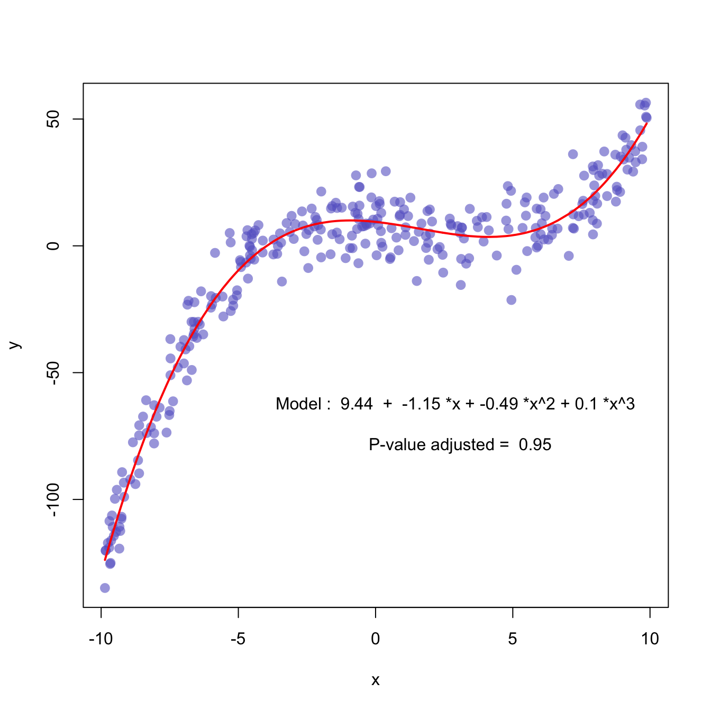

---
```{r setup, include=FALSE}
knitr::opts_chunk$set(echo = TRUE, warning = FALSE, message = FALSE)
```

### Визуализация данных

> "Обычный график дает аналитику гораздо больше пищи для размышлений, чем любая другая форма представления информации." -- Джон Тьюки


{width=33%}{width=33%}{width=33%} 
{width=33%}{width=33%}{width=33%}
{width=33%}{width=33%}{width=33%}

```{r echo=FALSE}
library(plotly)
p <- plot_ly(z = volcano, type = "surface")
p 
```

Визуализациия -- один из важнейших этапов анализа данных. Различные графики могут помочь понять, что не так с вашмими данными, найти какие-то закономерности, понять какая зависимость между переменными (линейная, нелинейная), найти аномалии или выбросы и многое другое. К тому же визуализация это очень красиво!

Графики могут быть очень разными, например:

1. Визуализация одной переменной (histogram, bar, boxplot).
2. Визуализация нескольких переменных (scatter plot, line plot).
3. Визуализация графов.
4. Визуализация карты.
5. Визуализация моделей.
6. Визуализация 3D графиков.

На [этом сайте](https://datavizcatalogue.com/RU/) можно найти большое количество разных типов графиков.

### ggplot2

В стандартном пакете R есть визуализация с помощью функции `plot`. Она уже устарела и не такая красивая, как визуализация с помощью пакета `ggplot2`.

### Установка и подгрузка пакета

Давайте установим и подгрузим уже известные нам пакеты, а также пакет `ggplot2`.

```{r}
packages <- c('ggplot2', 'dplyr', 'tidyr', 'tibble')
# install.packages(packages)
library(ggplot2)
library(dplyr)
library(tidyr)
library(tibble)
```

### Принцип создания графика

Визуализация часто помогает найти какие-то закономерности в данных, которые потом можно использовать для построения моделей. Давайте возьмем набор данных `mpg`. Можно вызвать справку по этому датасету с помощью команды `?mpg`. Взглянем на то, как выглядит наш набор данных.

```{r}
glimpse(mpg)
```

В этом наборе данных представлена информация о 38 моделях автомобилей. Среди 11 переменных в этом датасете есть 2 следующие переменные:

* `displ` -- объем двигателя (в литрах)
* `hwy` -- эффективность расхода топлива, сколько миль машина может проехать с одним галлоном (около 4 литров) топлива

Скорее всего эти переменные взаимосвязаны. Чем больше объем двигателя, тем меньше миль машина сможет проехать. Давайте проверим это, нарисовав график.

```{r}
ggplot(data = mpg) +
  geom_point(mapping = aes(x = displ, y = hwy))
```

Видно, что и правда существует какая-то отрицательная связь. Но нас интересует то, как можно строить графики с помощью пакета `ggplot2`.

1. Любой график в `ggplot2` начинается с функции `ggplot()`, внутри которой вы передайте обязательный аргумент `data` -- это ваш набор данных, в котором находится информация для визуализации.
2. Весь рисунок -- это **наложение нескольких слоев** с помощью знака плюс (`+`). Функция `ggplot()` строит первый слой. Она создает систему координат, к которой можно начинать добавлять слои.

```{r}
ggplot(data = mpg)
```

3. Функция `geom_point()` накладывает следующий слой, который состоит из точек. Эта функция имеет обязательный аргумент `mapping`, в котором вы должны указать оси (переменные) для вашего графика. Существует целое семейство функций, которые имеют название `geom_xxx`.

### Атрибуты графика

Вы можете также можете изменять ваш график. Например, вы хотите изменить цвет (`color`) и размер (`size`) точек. Внутри функции вы можете добавить эти аргументы.

```{r}
ggplot(data = mpg) +
  geom_point(mapping = aes(x = displ, y = hwy), color = 'blue', size = 2.5)
```

Вы можете писать какой-то цвет в виде строки. А можете использовать формат *HEX*. Например на [сайте](https://colorscheme.ru/color-converter.html) вы можете выбрать нужный вам цвет и использовать его.

```{r}
ggplot(data = mpg) +
  geom_point(mapping = aes(x = displ, y = hwy), color = '#593dbf')
```

Также вы можете поставить не точки, а другую форму (`shape`). Можно например поставить треугольники.

```{r}
ggplot(data = mpg) +
  geom_point(mapping = aes(x = displ, y = hwy), color = '#593dbf', shape = 2)
```

На рисунке показаны все виды форм.


Стоит заметить, что формы с 21 по 25 могут иметь 2 цвета. Обычный атрибут `color` отвечает за цвет границы. Если вы хотите закрасить фигуру, то можно использовать атрибут `fill`.

```{r}
ggplot(data = mpg) +
  geom_point(mapping = aes(x = displ, y = hwy), 
             color = '#593dbf', shape = 25,
             fill = 'red')
```
 
Также с помощью атрибута `alpha` вы можете делать ваши точки более прозрачными. Этот аргумент должен принимать значения от 0 до 1. По умолчанию стоит 1.

```{r}
ggplot(data = mpg) +
  geom_point(mapping = aes(x = displ, y = hwy), 
             alpha = 0.5)
```

Некоторые точки не стали прозрачными. Это произошло, так как на самом деле там не одна, а несколько точек, поэтому при наложении друг на друга они дали менее прозрачную точку. Это аргумент бывает очень удобным, когда вы визуализируете большой набор данных. 

### Другой взгляд на атрибуты

Атрибуты украшают график, но можно использовать их и по-другому. До этого мы рисовали график, в котором использовали две непрерывные переменные. То есть на графике мы можем увидеть взаимосвязь только переменных. Нарисовать третью ось и перейти в трехмерное пространство, чтобы добавить 3 переменную было бы не очень хорошим решением. Атрибуты, про которые мы с вами узнали могут помочь нам добавить информацию на график о других переменных. 

У нас есть переменная `drv`, которая принимает только 3 значения. Эти значения указывают какой привод у машины.

```{r}
mpg %>%
  select(drv) %>%
  unique()
```

Можно, например расскрасить каждое значение в отдельный цвет. В этом случае нам нужно сделать следующее:

1. **ВАЖНО!** Использовать атрибут `color` в функции `aes`.
2. Передаем теперь этому артрибуты не какой-то цвет, а переменную `drv`.

```{r eval=FALSE}
# ДО
ggplot(data = mpg) +
  geom_point(mapping = aes(x = displ, y = hwy), color = 'blue')

# ПОСЛЕ
ggplot(data = mpg) +
  geom_point(mapping = aes(x = displ, y = hwy, color = drv))
```

Нарисуем наш новый график!

```{r}
ggplot(data = mpg) +
  geom_point(mapping = aes(x = displ, y = hwy, color = drv))
```

У нашего графика автоматически появилась легенда. Про нее мы тоже поговорим позже.

Попробуем теперь использовать переменную `cyl`, которая показывает количество цилиндров в двигателе. Эта переменная принимает значения 4, 5, 6 и 8.

```{r}
ggplot(data = mpg) +
  geom_point(mapping = aes(x = displ, y = hwy, color = cyl))
```

График получился не таким как раньше. Это просходит, так как мы имеем числовую переменную. Но у нас всего 4 значения, поэтому стоит использовать факторный тип. Перевести переменную в факторный тип можно прямо внутри функции `aes`. 

```{r}
ggplot(data = mpg) +
  geom_point(mapping = aes(x = displ, y = hwy, color = factor(cyl)))
```

Вы можете использовать и другие атрибуты, а также их комбинации. 

```{r}
ggplot(data = mpg) +
  geom_point(mapping = aes(x = displ, y = hwy, color = factor(cyl), shape = drv))
```

На таком графике уже можно увидеть взаимосвязь 4 переменных. Но не стоит этим увлекаться. График не должен быть сложным.

### Виузализация временных рядов

До этого мы с вами говорили про график рассеяния (scatter plot). Он показывал взаимосвязь двух непрерывных переменных. Часто нам хочется посмотреть на динамику какого-то показателя (переменной) во времени. 

Давайте возьмем датасет `economics` из пакеты `dplyr`. Видим, что у нас есть переменная `date`, которая уже имеет формат даты. А также какие-то показатели. Например уровень безработицы (`uempmed`). Давайте нарисуем график дата -- уровень безработицы. Для этого используем слой `geom_line()`, который работает аналогично `geom_point()`.

```{r}
ggplot(data = economics) +
  geom_line(mapping = aes(x = date, y = uempmed))
```

Давайте добавим еще временной ряд для переменной `psavert`, которая показывает процент личных сбережений людей. Мы можем просто нанести еще один слой `geom_line()`.

```{r}
ggplot(data = economics) +
  geom_line(mapping = aes(x = date, y = uempmed)) + 
  geom_line(mapping = aes(x = date, y = psavert))
```

Получилось два временных ряда на одной картинке, но они одного цвета, и легенда не появилась. Первый способ как это можно исправить это задать цвет и легенду самому, это очень неприятный способ. Второй способ это использовать знакомую нам функцию `gather`. С `ggplot` можно использовать *pipe* (`%>%`).

```{r}
economics %>%
  gather(Type, Value, uempmed, psavert) %>%
  ggplot() +
    geom_line(aes(x = date, y = Value, color = Type))
```

Если в вашем слое вы постоянно работаете с одними осями, то вы можете их указать прямо в функции `ggplot`, чтобы не писать их несколько раз.

```{r}
economics %>%
  gather(Type, Value, uempmed, psavert) %>%
  ggplot(aes(x = date, y = Value, color = Type)) +
    geom_line()
```

### Гистограмма

Гистограмма строится для **одной непрерывной** переменной. Это нужно, чтобы посмотреть на распределение нашей переменной. Для построения гистограммы достаточно указать одну ось **x* и использовать функцию `geom_histogram`.

```{r}
ggplot(iris, aes(x = Sepal.Width)) +
  geom_histogram()
```

Мы получили гистограмму, но она не очень хорошо выглядит. Возникают интервалы, в которых переменная не принимает никакие значения. Из-за этого эти интервалы пустые. Сейчас автоматически выбирается ширина прямоугольничков. Ее можно менять с помощью аргумента `binwidth`. 

```{r}
ggplot(iris, aes(x = Sepal.Width)) +
  geom_histogram(binwidth = 0.1)
```

Часто нам не нужно абсолютное значение, а нужно плотность распределения. Ее можно добавить с помощью известной функции `aes`, внутри которой ей присовить значение `..density..`. Точками отделяем, чтобы R не подумал, что это название переменной.

```{r}
ggplot(iris, aes(x = Sepal.Width)) +
  geom_histogram(aes(y = ..density..), binwidth = 0.1)
```

Вы можете так же использовать атрибуты.

```{r}
ggplot(iris, aes(x = Sepal.Width, fill = Species)) +
  geom_histogram(binwidth = 0.1)
```

График не совсем понятный, так как у значения x равным 2.5 мы не понимаем долю *setosa*. 

```{r}
ggplot(iris, aes(x = Sepal.Width, fill = Species)) +
  geom_histogram(binwidth = 0.1)
```

Есть несколько способов исправить это.

Первый способ: использовать аргумент `position`.

```{r}
ggplot(iris, aes(x = Sepal.Width, fill = Species)) +
  geom_histogram(binwidth = 0.1, position = 'dodge')
```

```{r}
ggplot(iris, aes(x = Sepal.Width, fill = Species)) +
  geom_histogram(binwidth = 0.1, position = 'fill')
```

Эти графики не так хороши. Поэтому есть второй способ: использовать функцию `geom_freqpoly` вместо `geom_histogram`. Она рисует распределение линиями.

```{r}
ggplot(iris, aes(x = Sepal.Width, color = Species)) +
  geom_freqpoly(binwidth = 0.1)
```

### Сохранение графика в переменную

Вы можете сохранить часть ваших слое в какой-то переменной, а потом добавлять следующие слои. Это удобно, когда вы хотите строить разные графики.

```{r}
p <- ggplot(iris, aes(x = Sepal.Width, color = Species))

p + geom_freqpoly(binwidth = 0.1)
```

### Диаграмма

Диаграмма строится для **одной дискретной** переменной. То есть переменные принимающие конечное число значений (факторные). Их можно нарисовать аналогично с помощью функции `geom_bar`.

Давайте посмотрим на количество машин, которые имеют передний, задний привод или 4x4.

```{r}
ggplot(mpg, aes(x = drv)) +
  geom_bar()
```

Вы так же можете использовать атрибуты.

```{r}
ggplot(mpg, aes(x = drv, fill = factor(cyl))) +
  geom_bar()
```

Если на такой график смотреть неудобно, то можно сделать по каждой переменной отдельный столбец с помощью аргумента `position`.

```{r}
ggplot(mpg, aes(x = drv, fill = factor(cyl))) +
  geom_bar(position='dodge')
```

Также есть другие аргументы.

```{r}
ggplot(mpg, aes(x = drv, fill = factor(cyl))) +
  geom_bar(position='fill')
```

### Непрерывная и категориальная переменные

Иногда мы хотим посмотреть на комбинцаию непрерыной и категориальной переменной. Мы уже делали это, когда рисовали гистограмму и использовали в качестве атрибута цвет. Но сейчас мы хотим посмотреть прямо на наши наблюдения.

```{r}
ggplot(mtcars, aes(x = cyl, y = wt)) +
  geom_point()
```

Видно, что для переменная `cyl` не принимает значения 5 и 7. Мы уже говорили, что она является факторной. Укажем это.

```{r}
ggplot(mtcars, aes(x = factor(cyl), y = wt)) +
  geom_point()
```

Так график выглядет уже лучше. Но есть проблема: некоторые точки накладываются друг на друга. Можно попробовать решить это с помощью атрибута `alpha`.

```{r}
ggplot(mtcars, aes(x = factor(cyl), y = wt)) +
  geom_point(alpha=0.5)
```

Но это помогает не очень хорошо. Существует функция `geom_jitter`, которая помогает немножко раскинуть значения вправо и влево на небольшую величину. В нашем случае, у нас переменная `cyl` принимает 3 значения (4,6,8). Давайте просто отклонимся от этих значений на небольшое значение, чтобы точки больше не накладывались друг на друга.

```{r}
ggplot(mtcars, aes(x = cyl, y = wt)) +
  geom_jitter()
```

Эх! Точки уходят слишком далеко. С помощью аргумента `width` можно контролировать размер отклонения.

```{r}
ggplot(mtcars, aes(x = cyl, y = wt)) +
  geom_jitter(width = 0.1)
```

Так же можно рисовать распределение точек внутри каждой категории с помощью слоя `geom_violin`.

```{r}
ggplot(mtcars, aes(x = factor(cyl), y = wt)) +
  geom_violin(fill='green')
```

### Две категориальные переменные

Рассмотрим связку двух категориальных переменных. 

```{r}
ggplot(diamonds) +
  geom_point(aes(x = cut, y = color))
```

Видно, что график не несет никакого смысла. Так как мы не можем увидеть сколько точек лежит на пересечении двух категорий. Хотелось бы, чтобы размер точки зависел от количества наблюдений, которые имеют пересечение двух категорий. В этом нам поможет функция `geom_count`.

```{r}
ggplot(data = diamonds) +
  geom_count(mapping = aes(x = cut, y = color))
```

Рассмотрим другой способ. Возьмем датасет `Vocab` из пакета `car`. Описание датасета можно найти с помощью команды `?Vocab`.

```{r}
# install.packages('car')
library('car')
glimpse(Vocab)
```

Логично предположить, что чем выше образование человека тем больше его оценка.

```{r}
ggplot(Vocab, aes(x = education, y = vocabulary)) +
  geom_point()
```

Видно, что оценки и образование округлены до какого-то знака. То есть мы опять работаем с 2 факторными переменными. Давайте попробуем использовать уже знакомую нам функцию `geom_jitter`, чтобы немного сместить значения.

```{r}
ggplot(Vocab, aes(x = education, y = vocabulary)) +
  geom_jitter()
```

Другое дело, давайте добавим еще прозрачности.

```{r}
ggplot(Vocab, aes(x = education, y = vocabulary)) +
  geom_jitter(alpha = 0.2)
```

Пустые кружочки могут помочь еще больше.

```{r}
ggplot(Vocab, aes(x = education, y = vocabulary)) +
  geom_jitter(alpha = 0.2, shape = 1)
```

### Название графика и оси

Все графики, которые мы делали до этого не очень хороши. Их минус заключается в том, что непонятно что этот график отображает. С помощью функции `labs` вы можете добавить название графика (`title`), дополнительное подробное описание графика (`subtitle`), источник данных (`caption`), название осей (`x` и  `y`), а также легенду.

```{r}
ggplot(mpg, aes(displ, hwy, color = class)) +
  geom_point() +
  labs(title = 'Fuel efficiency genereally decreases with engine size',
       subtitle = 'Two seaters (sports car) are an exception,
                    because of their light weight',
       caption = 'Data from fueleconomy.gov',
       x = 'Engine displacement (L)',
       y = 'Highway fuel economy (mpg)',
       color = 'Car type')
```

Название осей можно также быстро поменять с помощью функций `xlab()` и `ylab()`.

```{r}
ggplot(mpg, aes(displ, hwy, color = class)) +
  geom_point() +
  xlab('Engine displacement (L)') +
  ylab('Highway fuel economy (mpg)')
```

Можно также использовать формулы в названии осей с помощью функции `quate()`. Более подробную информация можно найти с помощью команды `?plotmath`.

```{r}
df <- tibble(
  x = runif(10),
  y = runif(10)
)
ggplot(df, aes(x, y)) +
  geom_point() +
  labs(
    x = quote(sum(x[i] ^ 2, i == 1, n)),
    y = quote(alpha + beta + frac(delta, theta))
  )
```

### Оси

`ggplot` автоматически подбирает тип оси исходя от типа переменных.

```{r}
ggplot(mpg, aes(displ, hwy)) +
  geom_point()
```

Для изменения осей вы можете использовать семейство функций `scale_*`.

```{r}
ggplot(mpg, aes(displ, hwy)) +
  geom_point() +
  scale_x_continuous() +
  scale_y_continuous()
```

Внешним видом меток на осях и ключей легенды управляют два аргумента: `breaks` и `labels`.

* `breaks` -- управляет положением меток или значениями осей или ключей

```{r}
ggplot(mpg, aes(displ, hwy)) +
  geom_point() + 
  scale_x_continuous(breaks = c(2, 4, 6))
```

* `labels` -- позволяет менять название меток

```{r}
ggplot(mpg, aes(displ, hwy)) +
  geom_point() + 
  scale_x_continuous(
        breaks = c(2, 4, 6),
        label = c("two", "four", "six")
  )
```

Например, можно сделать такой классный график.

```{r}
presidential %>%
  mutate(id = 33 + row_number()) %>%
  ggplot(aes(start, id)) +
    geom_point() +
    geom_segment(aes(xend = end, yend = id)) +
    scale_x_date(breaks = presidential$start, date_labels = "'%y")
```

Также есть аргумент `limits`, который задает диапозон значений, который мы хотим увидеть.

```{r}
ggplot(mpg, aes(displ, hwy)) +
  geom_point() +
  scale_y_continuous(limits = c(20, 40)) +
  scale_x_continuous(limits = c(2, 4))
```


Это можно сделать и с помощью функций `xlim` и `ylim`.

```{r}
ggplot(mpg, aes(displ, hwy)) +
  geom_point() +
  ylim(20, 40) +
  xlim(2, 4)
```

Иногда эти два способа не работают. Тогда вам на может помочь функция `coord_cartesian`.

### Прямые линии

За линии отвечают три функции:

* `geom_hline` -- горизонтальные линия
* `geom_vline` -- вертикальная линия
* `geom_abline` -- прямая линия с каким-то значеним константы и наклоном

```{r}
ggplot(iris, aes(x = Sepal.Length, y = Sepal.Width, color = Species)) +
  geom_point() + 
  geom_hline(yintercept = 3.3, color = 'green') +
  geom_vline(xintercept = 6.5, color = 'green') + 
  geom_abline(intercept = 1, slope = 0.5, color = 'red')
```

### Статистический слой

Когда мы рисуем график рассеяния, то хотим увидеть какие-то закономерности между переменными. Чтобы как-то апроксимировать их можно использовать функцию `geom_smooth`, которая позволяет нарисовать некоторую линию зависимости переменных.

```{r}
ggplot(mtcars, aes(x = wt, y = mpg)) +
  geom_point() +
  geom_smooth()
```

Серая область вокруг линии это 95%  доверительный интервал. Его можно убрать с помощью аргумента `se`.

```{r}
ggplot(mtcars, aes(x = wt, y = mpg)) +
  geom_point() +
  geom_smooth(se = F)
```

Мы уже наслышены о линейно модели. Давайте попробуем визуализировать такую модель.

```{r}
ggplot(mtcars, aes(x = wt, y = mpg)) +
  geom_point() +
  geom_smooth(method = 'lm')
```

Если вы используете какой-то атрибут, то у вас построится не одна модель а несколько.

```{r}
ggplot(mtcars, aes(x = wt, y = mpg, col = factor(cyl))) +
  geom_point() +
  geom_smooth(method = "lm", se = FALSE)
```

Чтобы нарисовать линию и указать ее группу.

```{r}
ggplot(mtcars, aes(x = wt, y = mpg, col = factor(cyl))) +
  geom_point() +
  geom_smooth(method = "lm", se = FALSE) +
  geom_smooth(method = "lm", se = FALSE, aes(group = 1))
```

### Построение нескольких графиков по категориальным переменным (facet)

В данном случае мы хотим нарисовать отдельные графики для каждой категории факторной переменной. Делим один сложный график на несколько простых с помощью одной или двух факторных переменных с помощью функции `facet_grid`. Аргументом является формула: `rows ~ columns`. Необязательно приводить переменные к факторам, `ggplot` сам их принудительно приведет. Если используем только одну категориальную переменную, то вторую обозначаем просто точкой (`.`).

```{r}
p <- ggplot(mtcars, aes(x = wt, y = mpg)) +
  geom_point()
p +
  facet_grid(am ~ .)
p +
  facet_grid(. ~ cyl)
p +
  facet_grid(am ~ cyl)
```

### Стили

Можно настраивать свою палитру цветов, а не использовать ту, которую предоставляет `ggplot2`. С помощью функции `scale_fill_brewer` можно использовать другие палитры.

```{r}
ggplot(mtcars, aes(x = cyl, fill = factor(am))) +
  geom_bar() +
  scale_fill_brewer(palette = "Set1") 
```

Узнать о всех готовых палитрах можно с помощью команды `?brewer.pal` или найти на [сайте](https://observablehq.com/@d3/color-schemes).

Нарисуем уже знакомый нам график.

```{r}
ggplot(Vocab, aes(x = education, fill = factor(vocabulary))) +
  geom_bar(position = 'fill')
```

Можно поменять заливку с помощью этой же функции.

```{r}
ggplot(Vocab, aes(x = education, fill = factor(vocabulary))) +
  geom_bar(position = 'fill') + 
  scale_fill_brewer()
```

С помощью пакета `RColorBrewer` вы можете создавать свои палитры.

```{r}
# install.packages('RColorBrewer')
library(RColorBrewer)
new_col <- colorRampPalette(c("#FFFFFF", "#0000FF"))
new_col(4)
munsell::plot_hex(new_col(4))

ggplot(Vocab, aes(x = education, fill = factor(vocabulary))) +
  geom_bar(position = "fill") +
  scale_fill_brewer()

blues <- brewer.pal(9, "Blues")
blue_range <- colorRampPalette(blues)

ggplot(Vocab, aes(x = education, fill = factor(vocabulary))) +
  geom_bar(position = "fill") +
  scale_fill_manual(values = blue_range(11))
```

### Тема

Вы можете изменять тему вашего рисунка с помощью функции `theme`. В пакете `ggplot2` уже есть некоторые встроенные темы:

* `theme_grey()`
* `theme_bw()`
* `theme_linedraw()`
* `theme_light()`
* `theme_dark()`
* `theme_minimal()`
* `theme_classic()`
* `theme_void()`
* `theme_test()`

Тема -- это отдельный слой, который мы можем добавить.

[](https://ggplot2.tidyverse.org/reference/ggtheme.html)

```{r}
ggplot(data = mpg, aes(x = displ, y = hwy)) +
  geom_point() +
  theme_test()
```

Дополнительные темы можно найти в пакете `ggthemes`.

[](https://yutannihilation.github.io/allYourFigureAreBelongToUs/ggthemes/)

```{r}
# install.packages('ggthemes')
library(ggthemes)
```

```{r}
ggplot(data = mpg, aes(x = displ, y = hwy)) +
  geom_point() +
  theme_pander()
```

### Легенда

Изменять настройки легенды можно в функции `theme`. Одной из настроек является расположение легенды. 

* `left`
* `top`
* `bottom`
* `right`

```{r}
ggplot(mtcars, aes(x = wt, y = mpg, col = factor(cyl))) +
  geom_point() +
  geom_smooth(method = "lm", se = FALSE) +
  theme(legend.position = 'left')
```

### Сохранение графиков

Для сохранения графика можно использовать функцию `ggsave`, которая сохранит последний **нарисованный** график.

Можно просто написать название файла и его расширение и все. Рисунок сохранится в рабочей директории.

```{r}
ggplot(mpg, aes(displ, hwy)) + geom_point()
ggsave("plot.pdf")
```

У этой функции много аргументов. Можно настраивать ширину, длину, качество рисунка и многое другое.

### Интерактивные графики

Пакет `plotly` предлагает разные инструменты для построения интерактивных графиков. В этом пакете есть функция `ggplotly`, которая может преобразовать почти любой график, созданный пакетом `ggplot2`, в интерактивный.

```{r}
# install.packages('plotly')
library(plotly)

p <- ggplot(iris, aes(x = Sepal.Length, y = Sepal.Width, color = Species)) +
  geom_point()
ggplotly(p)
```

Также для создания интерактивных графиков есть пакет `ggvis`. 

---