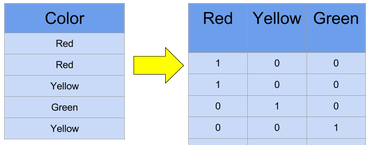

<style>
h1,
h2,
h3,
h4,
h5,
h6  {
  color: #317eac;
}
</style>
---
```{r setup, include=FALSE}
knitr::opts_chunk$set(echo = TRUE, warning = FALSE, message = FALSE, error = TRUE)
```

```{r}
library(tibble)
library(dplyr)
library(tidyr)
library(ggplot2)
library(plotly)
```

### Функция lm

На прошлой посиделке мы узнали, что можно обучить линейную регрессию с помощью функции `lm`. Наши данные находятся в датасете `data`. Мы хотим предсказать заработную плату человека (`income`). Нашим единственныи признаком является количество лет, которые человек отучился (`education`).

```{r}
set.seed(42)
n <- 50
data <- tibble(education = seq(7, 20, length.out = n) + rnorm(n, sd = 2),
               income = 10000 + 5000 * education + rnorm(n, sd = 5000))
```

```{r}
head(df)
```

Нарисуем график рассеяния этих двух переменных. На этом графике мы видим линейную зависимость переменных.

```{r}
ggplot(data, aes(x = education, y = income)) +
  geom_point()
```

Обучим линейную регрессию.

```{r}
model <- lm(income ~ education, data = data)
```

В переменной `model` находится наша модель. Она имеет тип `list`. Из него можно получить значение коэффициентов или ошибки, совершенные моделью.

```{r collapse=TRUE}
model$coefficients
model$residuals
```

Также можно получить более подробную информацию с помощью функции `summary`.

```{r}
summary(model)
```

### Интерпретация полученных коэффициентов

Из модели мы видим: 

* Cвободный коэффициент равен 8683. Это означает, что в среднем человек, который проучился 0 лет будет зарабатывать 8683 рубля.
* Коэффициент перед переменной *education* равен 5091. Это означает, что если человек учится на один год больше, то в среднем он начинает зарабывать на 5091 рубль больше.

Эти оценки могут быть неточными. Чтобы получить доверительный интервалы, можно использовать функцию `confint`. 

```{r}
confint(model)
```

### Выбросы

Выбросы очень сильно влияют на линейную регрессию. 

```{r}
set.seed(42)
n <- 50
data <- tibble(education = seq(7, 20, length.out = n) + rnorm(n, sd = 2),
               income = 10000 + 5000 * education + rnorm(n, sd = 5000))
data <- add_row(data, education=c(19, 20, 21), income=c(1000, 1400, 2000))
```

```{r}
ggplot(data, aes(x = education, y = income)) +
  geom_point()
```

На графике видно, что видимо кто-то указал зарплату не в рублях, а в долларах. Попробуем оценить линейную регрессию и нарисовать ее.

```{r}
model <- lm(income ~ education, data = data)
model
coeff <- model$coefficients
```

```{r}
ggplot(data, aes(x = education, y = income)) +
  geom_point() +
  geom_smooth(method = 'lm', se=F)
```

Видно, что линия регрессии проходит не через основное облако точек.

### Использование большего количества признаков

Вы можете использовать несколько признаков для построения вашей модели. 

```{r }
n <- 100
df <- tibble(x1 = seq(-5, 5, length.out = n) + rnorm(n),
             x2 = seq(-10, 10, length.out = n) + rnorm(n),
             x3 = seq(12, 16, length.out = n) + rnorm(n),
             y = 5 + 2*x1 - 3*x2)
```

Для этого в формуле вам нужно просто перечислить те, которые вы хотите использовать.

```{r}
model <- lm(y ~ x1 + x2 + x3, data = df)
summary(model)
```

### Категориальные переменные

Давайте рассмотрим следующий набор данных.

```{r}
n <- 50
data <- tibble(education = seq(7, 20, length.out = n) + rnorm(n, sd = 2),
               type = rep(c('college', 'university'), times = n/2),
               income = ifelse(type=='college', 
                               10000 + 5000 * education + rnorm(n, sd = 5000),
                               40000 + 5000 * education + rnorm(n, sd = 5000)))
```

Изначально кажется, что тут имеется линейная зависимость и можно провести одну линию регрессии.

```{r}
ggplot(data, aes(x = education, y = income)) +
  geom_point() + 
  geom_smooth(method = 'lm', se=F)
```

Но если попробовать покрасить точки, используя переменную `type`, то можно понять, что доход зависит от типа образования, которое получил человек.  

```{r}
ggplot(data, aes(x = education, y = income, color = type)) +
  geom_point()
```

#### Бинарная переменная

Чтобы отобразить это в моделе можно закодировать нашу переменную `type` в 0, если образование `college`, и в 1, если образование `university`. Это можно сделать с помощью функции `ifelse`.

```{r}
data <- data %>%	
  mutate(type_encode = ifelse(type == "college", 0, 1))

head(data)
```

Попробуем обучить эту модель используя бинарную переменную.

```{r}
model <- lm(income ~ education + type_encode, data = data)
model
coeff <- model$coefficients
```

Коэффициент перед `type_encode` показывает на сколько в среднем человек с высшим образованием зарабатывает больше чем человек со средним образованием.

```{r}
ggplot(data, aes(x = education, y = income, color = type)) +
  geom_point() +
  geom_abline(intercept = coeff[1], slope = coeff[2], color='darkred') +
  geom_abline(intercept = coeff[1] + coeff[3], slope = coeff[2], color='darkblue')
```

#### Label Encoding

Что делать, если переменная принимает больше двух значений?

```{r}
n <- 60
data <- tibble(education = seq(7, 20, length.out = n) + rnorm(n, sd = 2),
               type = rep(c('college', 'university', 'PhD'), times = n/3),
               income = ifelse(type=='college', 
                               10000 + 5000 * education + rnorm(n, sd = 5000),
                               ifelse(type=='university',
                                      40000 + 5000 * education + rnorm(n, sd = 5000),
                                      60000 + 5000 * education + rnorm(n, sd = 5000))))

head(data)
```

Визуализируем данные.

```{r}
ggplot(data, aes(x = education, y = income, color = type)) +
  geom_point() 
```

Давайте просто закодируем переменную как в прошлый раз. 

```{r}
data <-  data %>%
	mutate(type_encode = 
           	case_when(type == 'college' ~ 1,
                      type == 'university' ~ 2,
                      type == 'PhD' ~ 3))

head(data)
```

Обучим модель.

```{r}
model <- lm(income ~ education + type_encode, data = data)
model
coeff <- model$coefficients
```

Смотрим на результат.

```{r}
ggplot(data, aes(x = education, y = income, color = type)) +
  geom_point() +
  geom_abline(intercept = coeff[1] + coeff[3]*1, slope = coeff[2], color='darkred') +
  geom_abline(intercept = coeff[1] + coeff[3]*2, slope = coeff[2], color='darkblue') +
  geom_abline(intercept = coeff[1] + coeff[3]*3, slope = coeff[2], color='darkgreen')
```

Такой подход не очень хорош. Попробуем закодировать наши переменные по-другому.

```{r}
data <-  data %>%
	mutate(type_encode = 
           	case_when(type == 'college' ~ 1,
                      type == 'university' ~ 3,
                      type == 'PhD' ~ 2))

head(data)
```

Обучим модель.

```{r}
model <- lm(income ~ education + type_encode, data = data)
model
coeff <- model$coefficients
```

Смотрим на результат.

```{r}
ggplot(data, aes(x = education, y = income, color = type)) +
  geom_point() +
  geom_abline(intercept = coeff[1] + coeff[3]*1, slope = coeff[2], color='darkred') +
  geom_abline(intercept = coeff[1] + coeff[3]*2, slope = coeff[2], color='darkblue') +
  geom_abline(intercept = coeff[1] + coeff[3]*3, slope = coeff[2], color='darkgreen')
```

В данном случае кодировка очень важна, потому что 1 и 2 ближе чем 1 и 3.

#### One Hot Encoding

Чтобы избежать проблем с Label Encoding можно использовать One Hot Encoding (OHE).

<center>

</center>

Можно использовать готовую функцию. В качестве аргумента вы подаете ваш датасет, в котором все переменные, которые вы хотите закодировать являются факторными.

```{r}
n <- 60
data <- tibble(education = seq(7, 20, length.out = n) + rnorm(n, sd = 2),
               type = rep(c('college', 'university', 'PhD'), times = n/3),
               income = ifelse(type=='college', 
                               10000 + 5000 * education + rnorm(n, sd = 5000),
                               ifelse(type=='university',
                                      40000 + 5000 * education + rnorm(n, sd = 5000),
                                      60000 + 5000 * education + rnorm(n, sd = 5000))))

head(data)
```

Попробуем на нашем датасете.

```{r}
library(onehot)

OHE <- function(df){
  encoder <- onehot(df)
  df_OHE <- as_tibble(predict(encoder, df))
  return(df_OHE)
}

data$type <- factor(data$type)
data_OHE <- OHE(data)

head(data_OHE)
```

Переменных уже много и писать их вручную не очень. Вместо этого можно поставить точку. Тогда все переменные, которые есть в вашем наборе данных будут использованы. В данном случае мы хотим оценить нашу модель без свободного коэффициента, поэтому поставим -1.

```{r}
model <- lm(income ~ . - 1 , data = data)
model
coeff <- model$coefficients
```

Смотрим на результат.

```{r}
ggplot(data, aes(x = education, y = income, color = type)) +
  geom_point() +
  geom_abline(intercept = coeff[2], slope = coeff[1], color='darkred') +
  geom_abline(intercept = coeff[4], slope = coeff[1], color='darkblue') +
  geom_abline(intercept = coeff[3], slope = coeff[1], color='darkgreen')
```

<!-- ### Графическая иллюстрация модели -->

<!-- Когда признаков много, невозможно прдеставить себе  многомерное пространство. Нарисовать это тоже очень тяжело. Но можно посмотреть на то, как работает модель -->

<!-- ```{r} -->
<!-- ggplot(unemployment, aes(x = prediction, y = female_unemployment)) +  -->
<!--   geom_point() + -->
<!--   geom_abline(color = "blue") -->
<!-- ``` -->

<!-- ```{r echo=FALSE, eval=FALSE} -->
<!-- # Ошибки -->
<!-- ggplot(unemployment, aes(x = predictions, y = residuals)) +  -->
<!--   geom_pointrange(aes(ymin = 0, ymax = residuals)) +  -->
<!--   geom_hline(yintercept = 0, linetype = 3) -->
<!-- ``` -->

<!-- ### Метрики качества -->


<!-- ```{r} -->
<!-- library(Metrics) -->
<!-- ``` -->

<!-- RMSE -->
<!-- R2 -->


<!-- ### Нелинейная зависимость -->


<!-- ### Train and test -->

<!-- ```{r} -->
<!-- library(rsample) -->
<!-- # Prepare the initial split object -->
<!-- gap_split <- initial_split(gapminder, prop = 0.75) -->

<!-- # Extract the training dataframe -->
<!-- training_data <- training(gap_split) -->

<!-- # Extract the testing dataframe -->
<!-- testing_data <- testing(gap_split) -->
<!-- ``` -->


<!-- ``` -->
<!-- predict(model, newdata) -->
<!-- ``` -->
