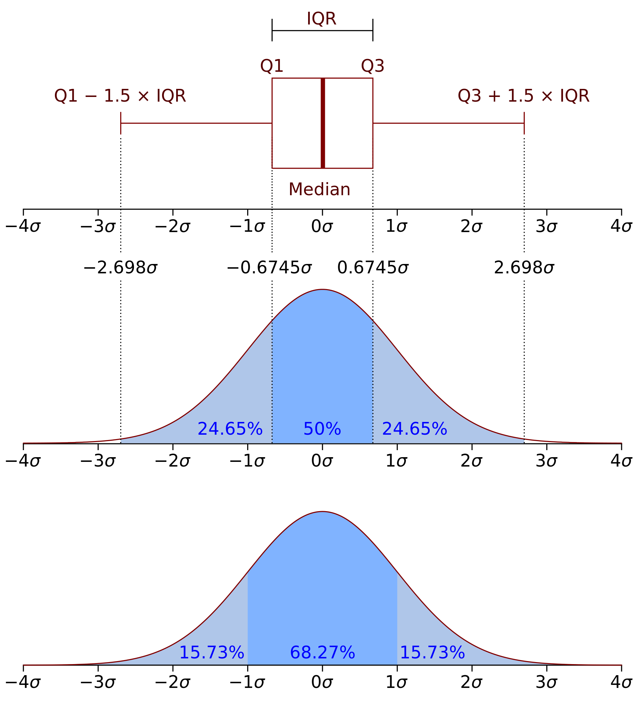

---
```{r setup, include=FALSE}
knitr::opts_chunk$set(echo = TRUE, warning = FALSE, message = FALSE)
```

```{r}
library(ggplot2)
library(tibble)
library(dplyr)
```

Сегодня будем говорить о разных статистиках для непрерывных переменных. Мы не будем лезть в теорию вероятности и математическую статистику, но рассмотрим два распределения, которые часто встречаются в реальной жизни.

### Распределения

#### Нормальное распределение

Для генерации нормального распределения можно использовать функцию `rnorm`. Она принимает три значения:

1. Количество элементов для генерации.
2. Среднее.
3. Стандартное отклонение.

Мы познакомимся со средним и дисперсией позже. 

```{r}
n <- 10000
m <- 0
sd <- 1
norm <- tibble(real = rnorm(n, m, sd))

ggplot(norm, aes(real)) +
  geom_histogram(bins=100) 

ggplot(norm, aes(real)) + 
  geom_density(fill = '#009294', color = 'black')
```

С помощью функции `dnorm` можно нарисовать теоретическое нормальное распределение.

```{r}
norm_true <- tibble(x = seq(-5, 5, length.out = n),
                    y = dnorm(x, m, sd))

ggplot(norm_true, aes(x, y)) +
  geom_line(color = '#009294')
```

#### Равномерное распределение

Для генерации равномерного распределения можно использовать функцию `runif`. Она принимает три аргумента:

1. Количество элементов для генерации.
2. Минимальное значение.
3. Максимальное значение.

```{r}
n <- 10000
MIN <- 10
MAX <- 20
unif <- tibble(real = runif(n, MIN, MAX))

ggplot(unif, aes(real)) +
  geom_histogram(bins=80) 

ggplot(unif, aes(real)) + 
  geom_density(fill = '#009294', color = 'black')
```

#### Другие распределения и ЦПТ

Существует огромное количество других распределений:

* экспоненциальное распределение (`rexp`)
* геометрическое распределение (`rgeom`)
* распределение Пуассона (`rpois`)
* биномиальное распределение (`rbinom`)
* и множество других

Чаще всего мы будем встречать именно нормальное распределение. Это доказывает центральная предельная теорема (ЦПТ). 

**Центральная предельная теорема в формулировке Ляпунова:**

Пусть $X_1,…, X_n$ случайные величины, имеющие одинаковое распределение с конечными математическим ожиданием и дисперсией. Обычно этот факт записывают вот так:

$$X_1, \ldots X_n \sim iid(\mu,\sigma^2)$$
тогда при $n \to \infty$ имеет место сходимость по распределению:

$$\frac{X_1 + \ldots X_n - \mu \cdot n}{\sqrt{n} \sigma } \Rightarrow N(0,1)$$

Если говорить просто, то давайте создадим несколько переменных с равномерным распределением.

```{r}
n = 10^4
df <- tibble(X1 = runif(n, min = -1, max = 1),
             X2 = runif(n, min = -1, max = 1),
             X3 = runif(n, min = -1, max = 1))
```

А теперь попробуем нарисовать сумму этих распределений.

```{r}
ggplot(df, aes(X1 + X2 + X3)) +
    geom_histogram(bins = 50)
```

Что мы получили? Нормальное распределение!

### Оценки центрального положения

Непрерывные переменные могут принимать тысячи различных значений. Но нам нужно понять сущность этих данных. Одним из способов является оценка того, где расположено большинство данных, то есть оценка центрального положения.

#### Среднее

$$\bar{x} = \frac{\sum_{i=1}^{n} x_i}{n}$$

Обычное среднее арифметическое, которое мы с вами проходили еще в школе.

```{r}
x <- c(10.7, 12.3, 5.7, 3.3)
mean(x)
```

#### Среднее взвешенное

$$\bar{x_w} = \frac{\sum_{i=1}^{n} w_i x_i}{\sum_{i=1}^{n}w_i}$$

Иногда среднее какой-то переменной нужно взвесить по какой-то другой переменной. Например, у вас есть данные по ценам на мандарины за 5 дней. А также количество купленных мандаринов. Логичнее считать взвешенную цену по количеству.

```{r collapse=TRUE}
p <- c(10, 12, 30, 15, 20)
q <- c(20, 10, 5, 7, 2)

mean(p)
weighted.mean(p, w=q)
```

#### Среднее усеченное

Иногда значения переменной сортируют и отсекают $p$ значений слева и справа, чтобы избежать выбросов, о которых мы поговорим позднее. $x_{(i)}$ это i-ое значение переменной в отсортированном массиве. 

$$\bar{x_t} = \frac{\sum_{i=p+1}^{n-p} x_{(i)}}{n}$$

В функции `mean` есть аргумент `trim`, который отрезает слева и справа определенной количество процентов.

```{r collapse=TRUE}
set.seed(42)
x <- sample(1:30, size = 10)
x
mean(x, trim = 0.1)
```

#### Медиана

Медиана -— это величина, при которой ровно половина значений переменной больше нее, а другая половина меньше нее.

Чтобы найти медиану, нужно отсортировать массив и найти центральный элемент. Если количество значений четно, то нужно найти их среднее, это и будет медианой.

```{r collapse=TRUE}
x <- c(5, 3, 1, 2, 4)
median(x)
y <- c(3, 4, 1, 2)
median(y)
```

#### Выбросы

Выброс -- это значения, которые сильно удалены от других значений в наборе данных. Выбросы не обязательно делают значение данных недопустимыми или ошибочными. Рассмотрим два примера.

##### Пример №1

В массиве `income` находятся заработные платы людей из выборки. 

```{r}
income <- c(30000, 40000, 25000, 300000)
```

Говорить о том, что значение 300000 является неуместным. Ведь такое может быть. Но на такое значение все равно стоит обратить внимание.

##### Пример №2

В массиве `temperature` находятся значение температуры в какому-то городе за 5 рабочих дней.

```{r}
temperature <- c(30, 28, 32, 80, 31)
```

Значение 80 является ошибочным. Возможно здесь стоит значение в градусах по Фаренгейту.


#### Пример

Давайте загенерим какую-то переменную с нормальным распределением и добавим туда несколько своих значений.

```{r}
test <- tibble(x = c(rnorm(500, 100, 2), 1000, 2000))
```

Давайте нарисуем распределение нашей переменной.

```{r}
ggplot(test, aes(x)) +
  geom_histogram()
```

График оказался ужасным, из-за значений, которые мы добавили специально. Давайте найдем среднее и медиану и отметим их на рисунке без значений, которые мы добавили сами.

```{r}
Mean <- mean(test$x)
Median <- median(test$x)
 
test %>%
  filter(x < 150) %>%
ggplot(aes(x)) +
  geom_histogram() + 
  geom_vline(xintercept = Mean, color = 'red') +
  geom_vline(xintercept = Median, color = 'blue') 
```

Видно, что среднее это не очень хорошая оценка, когда есть выбросы. Медиана оказывается устойчивой к выбросам. Но медиана учитывает только значение одной переменной. Я советую использовать усеченное среднее, которое является некой "золотой" серединой.

### Меры разброса

Еще одной оценкой для непрерывных переменных является мера разброса.

#### Дисперсия

$$s^2 = \frac{\sum_{i=1}^{n} (x_i - \bar{x})}{n - 1}$$
Дисперсия показывает насколько значения вашей переменной "собраны" около его среднего значения. Дисперсия это безразмерная величина, потому что мы считаем квадраты отклонений.

```{r collapse=TRUE}
n <- 10
x <- rep(5, n) + rnorm(n, 0, 1)
y <- rep(5, n) + rnorm(n, 0, 5)
x
y
var(x)
var(y)
```

#### Стандартное отклонение 

$$s = \sqrt{s^2}$$

Стандартное отклонение -- это корень из дисперсии. Тут уже появляется интерпретация. Она показывает на сколько в среднем от среднего отклоняются значения переменной.

```{r collapse=TRUE}
n <- 10
x <- rep(5, n) + rnorm(n, 0, 1)
y <- rep(5, n) + rnorm(n, 0, 5)
x
y
sd(x)
sd(y)
```

#### Размах

$$range = max - min $$

В качестве оценки разброса можно также смотреть на размер интервала значений, в котором находятся значения переменной.

#### Квантили

$k\%$ квантиль (персентиль) -- это значение, меньше которого $k\%$ значений переменной. Например, медиана это 50% квантиль. 

* 0.25-квантиль называется первым квартилем
* 0.5-квантиль называется медианой или вторым квартилем
* 0.75-квантиль называется третьим квартилем

Межквартильный размах -- это разница между третьим квартилем и первым.

```{r}
x <- sample(-100:100, 300, replace = TRUE)
quantile(x, 0.1)
```

Очень удобно смотреть на распределение данных с помощью ящика с усами (boxplot).

```{r}
boxplot(mtcars$mpg)
```

<center>
{width=500px}
</center>


```{r}
ggplot(mtcars, aes(x = factor(cyl), y = mpg)) + 
  geom_boxplot()
```


### Мера взаимосвязи величин (корреляция Пирсона)

Есть большое количество различных мер взаимосвязи величин. Но мы рассмотрим только одну меру: корреляцию Пирсона. Она принимает значение от -1 до 1 и характеризует линейную связь между двумя величинами. 

* Если значение близко к 1, то значит величины изменяются прямопропорционально. 
* Если значение близко к -1, то значит величины изменяются обратнопропорционально. 
* Если значени близко к 0, то линейной взаимосвязи между величинами нет или она слаба.

$$r = \frac{\sum_{i=1}^{n} (x_i - \bar{x})(y_i - \bar{y})}{n - 1}$$

#### Пример №1

```{r}
df <- tibble(x = sample(seq(1, 10, by = 0.1), 30),
             y = 3 * x + rnorm(30, 0, 2))

ggplot(df, aes(x, y)) +
  geom_point()

cor(df$x, df$y)
```

Корреляция близка к 1. Видна положительная связь между переменными.

#### Пример №2

```{r}
df <- tibble(x = sample(seq(1, 10, by = 0.1), 30),
             y = -5 * x + rnorm(30, 0, 4))

ggplot(df, aes(x, y)) +
  geom_point()

cor(df$x, df$y)
```

Корреляция близка к -1. Видна отрицательная связь между переменными.

#### Пример №3

```{r}
df <- tibble(x = sample(seq(1, 10, by = 0.1), 30),
             y = rnorm(30, 0, 4))

ggplot(df, aes(x, y)) +
  geom_point()

cor(df$x, df$y)
```

Корреляция близка к 0. Какой-то линейной связи не видно.

### Статистики набора данных

Вы можете использовать встроенную функцию `summary` для получения сводных статистик вашего датасета.

```{r}
summary(mtcars)
```

Или использовать готовые пакеты. Один из них `skimr`. Установим и подгрузим его.

```{r}
# install.packages('skimr')
library('skimr')
```

Используем функцию `skim`

```{r}
skim(mtcars) 
```

Её можно использовать по группам.

```{r}
mtcars %>%
  group_by(cyl) %>%
  skim()
```
