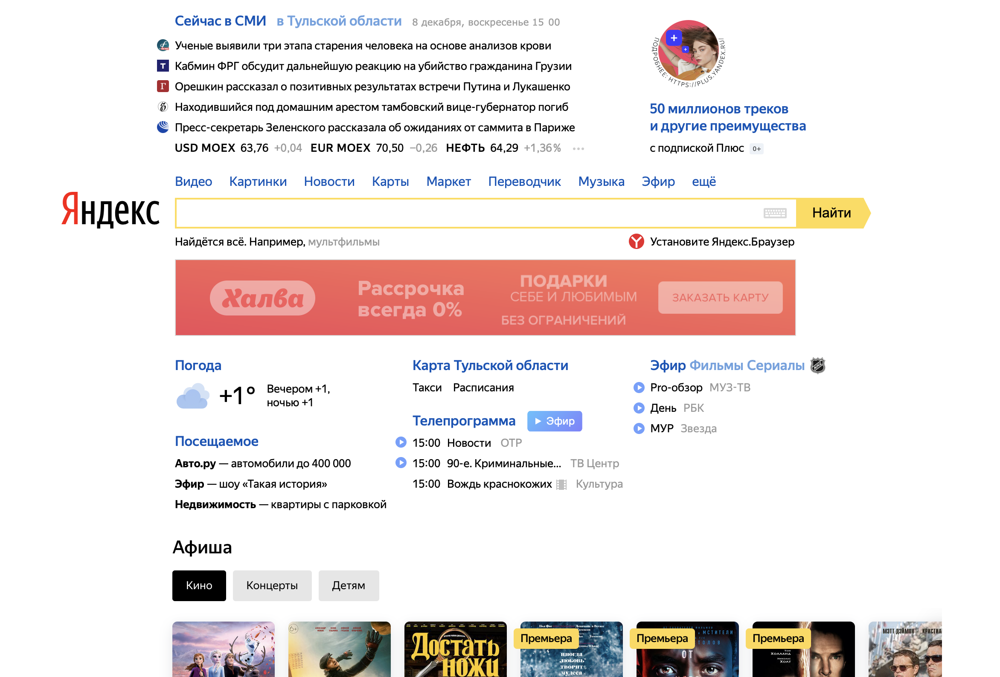
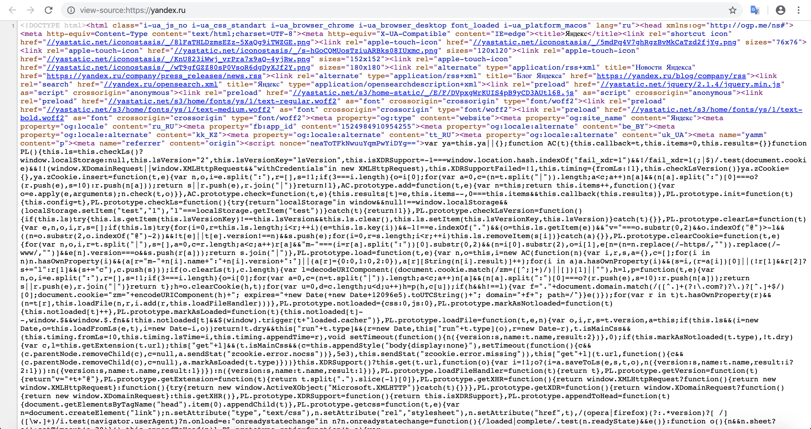
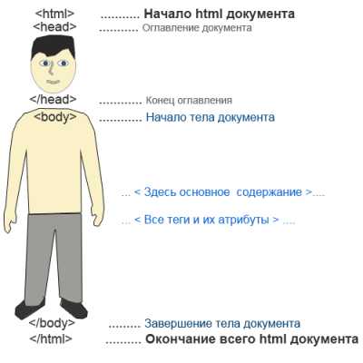
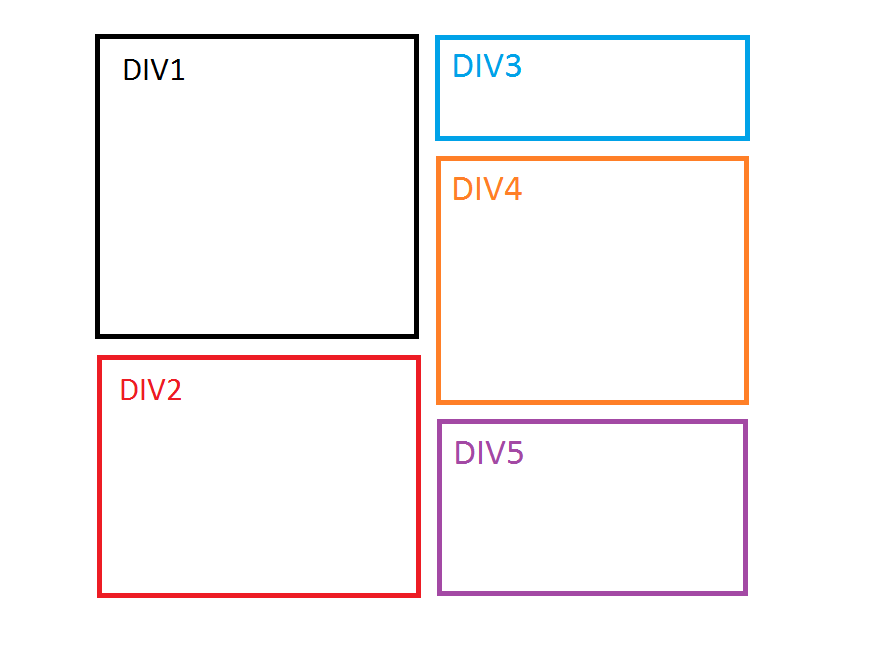

<style>
h1,
h2,
h3,
h4,
h5,
h6  {
  color: #317eac;
}
</style>
---
```{r setup, include=FALSE}
knitr::opts_chunk$set(echo = TRUE, warning = FALSE, message = FALSE, error = TRUE)
```

### HTML

API у веб-сайтов бывает очень редко. А часто оно бывает еще и платным. Поэтому нужно как-то обходится без него. В таких случаях пытаются извлечь информацию с сайта вручную. 

Любой сайт написан на языке HTML. Давайте откроем сайт [яндекса](https://yandex.ru). Мы видим его следующим образом.

<center>

</center>

На самом деле мы можем посмотреть его HTML-код. Для этого нужно в браузере (в Safari не получится) нажать правой кнопкой мыши и выбрать "Просмотр кода страницы". 

<center>

</center>

Можно увидеть вот такой страшный и непонятный код.

<center>

</center>

Это и есть язык верстки сайтов HTML -- Hyper Text Markup Language. Посмотрим как выглядит самый простой html-код.

```
<!DOCTYPE html>
<html>
  <head>
    <meta charset="UTF-8">
    <title>Какая-то страница</title>
  </head>
  <body>
      <H1>Какой-то заголовок</H1>
      <p>Какой-то текст</p>
  </body>
</html>
```

Попробуйте создать текстовый файлик с разрешением _.html_ и посмотреть как он выглядит в браузере.

<center>

</center>

Любой html-код из нескольких частей:

1. `<!DOCTYPE html>` -- это надпись идет в самом начале. В ней указывается, что этот файлик - html, а также указывается его версия.
2. `<html></html>` -- главный тег, внутри которого записывается весь html-код.
3. `<head></head>` -- первый основной тег, внутри которого записывается какая-то мета-информация, которая не будет видна на сайте. Например, кодировка или заголовок страницы.
4. `<body></body>` -- второй основной тег, в котором записывается вся информация, которую видит пользователь на странице.

Как вы могли заметить в html основная концепция заключается в тегах. Есть открывающий тег (<body>) и закрывающий тег (</body>). Между этими тегами могут быть другие теги или что-то другое, например текст. 

Рассмотрим некоторые теги:

* **H1-H6** -- теги для заголовков
* *p* -- тег для абзацев
* *b* -- тег для жирного текста
* *em* -- тег для курсивного текста
* *ul* и *li* -- тег для создания списков

Существует огромное количество тегов. Одним из важных тегов является **div**. Это контейнер (блок) для разметки сайта. Он делит страницу на блоки, внутри которых можно продолжить писать наш сайт.

<center>

</center>

У тегов также бывают атрибуты. Они записываются в открывающем теге. Вот например тег с атрибутом id равным 1.

```
<div id="1"> </div>
```

Необязательно знать все теги и их атрибуты, главное понимать как они записываются.

### XPath

XPath -- это язык для работы с XML/HTML. Он предназначен, чтобы находить какие-то части всего файла.

### Введение в парсинг

Попробуем парсить погоду в Москве с помощью [Яндекс Погоды](https://yandex.ru/pogoda/moscow). Первое что нужно сделать это загрузить html страницу в R. Это можно сделать с помощью функции `read_html` из пакета `rvest`.

```{r}
# install.packages('rvest')
library(rvest)

url <- 'https://yandex.ru/pogoda/moscow'
weather <- read_html(url)
```


