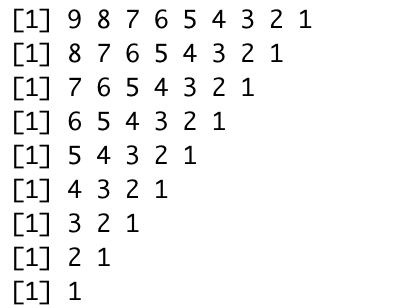

---
```{r setup, include=FALSE}
knitr::opts_chunk$set(echo = TRUE)
```

### Задание №1

Даны 2 числа a и b. Нужно вывести на экран значение числа, которое больше.

### Задание №2

Дано число. Нужно узнать положительное оно или отрицательное. Число 0 будем считать положительным в этой задаче.

### Задание №3

Условие задачи 2, но теперь нужно определять, равно ли число нулю. То есть, если число равно 0, то выводить "Число равно 0!".

### Задание №4

Даны 3 числа: a,b и c. Нужно вывести на экран значение числа, которое больше.

### Задание №5

Дано число a. Вывести на экран четное оно или нет.

### Задание №6

Даны 2 числа. Определить есть ли среди них хотя бы одно нечетное.

### Задание №7

Даны 2 числа. Определить являются ли они нечетными.

### Задание №8

Усовершенствовать задания 6 и 7 с помощью `&&` и `||`. 

### Задание №9

Дан массив, состоящий из рандомных чисел. Длина массива равна 15. Вывести на экран первые 10 элементов массива.

### Задание №10

Дан массив, состоящий из рандомных чисел. Длина массива равна 15. Вывести на экран с 5 по 12 элементы массива.

### Задание №11

Дан массив, состоящий из рандомных чисел. Вывести на экран все элементы массива. Сделать код оптимальным в том смысле, что если длинна массива поменяется вам не нужно будет переписывать код.

### Задание №12

Имеется 2 числа: вывести все целые числа, которые находятся между ними.

### Задание №13

Высести на экран первые 15 нечетных чисел.

### Задание №14

Дан массив. Найти сумму всех элементов этого массива.

### Задание №15

Дан массив. Найти произведение всех элементов этого массива.

### Задание №16

Найти факториал числа n(n!). Пользоваться встроенной функцией запрещено.

### Задание №17

Дано число k. Нужно вывести треугольник с изчезающим первым значением. Например, `k = 9`, тогда вывод должен быть следующим.



### Задание №18

Для настольной игры используются карточки с номерами от 1 до N. Одна карточка потерялась. Найдите ее, зная номера оставшихся карточек.

### Задание №19

Задан массив и числа a, b. Вывести все индексы переменных, где выполняется $a < x[i] < b$.

### Задание №20

Дан массив. Посчитать сумму всех четных элементов массива.

### Задание №21

Есть переменная action. Она может быть равна либо "Сложить", либо "Перемножить". В зависимости от этой переменной нужно сложить или перемножить все элементы массива.

### Задание №22

По данному натуральном n вычислите сумму $1!+2!+3!+...+n!$. В решении этой задачи можно использовать только один цикл.

### Задание №23

Есть матрица состоящая из нулей. Нужно заполнить её таким образом, чтобы значение элемента, который находится в i-ой строчке и j-ом столбце, равно i + j. 

### Задание №24

Даны числа a и b (a < b). Нужно увеличивать число a на единицу и уменьшать число b на единицу пока число a меньше числа b.

### Задание №25

Дан массив длинны n, состоящий из одних 0. Вы выбираете рандомное число от 1 до n(с помощью функции sample). Это рандомное число показывает индекс элемента массива, который нужно изменить с 0 на 1. После чего вы опять выбираете рандомное число. Это делается до тех пор пока массив не будет состоять из одних 1. Например: был массив с(0,0,0,0). Выпало рандомное число 3. Теперь массив выглядит так : c(0,0,1,0). Вы продолжаете так делать, пока все нули не исчезнут. Нужно посчитать, сколько раз выбиралось рандомное число.