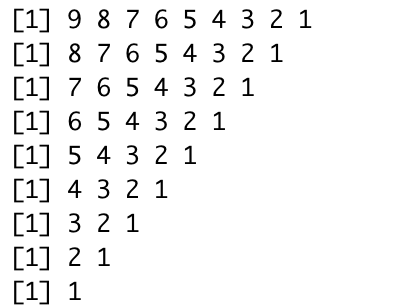

---
```{r setup, include=FALSE}
knitr::opts_chunk$set(echo = TRUE)
```

### Задание №1

Даны 2 числа a и b. Нужно вывести на экран значение числа, которое больше.

**Решение:**

```{r}
a <- 10
b <- 5
if (a > b) {
  print(a)
} else {
  print(b)
}
```

Этот код можно перевести так: "Если число `a` больше числа `b`, вывести на экран `a`, иначе вывести `b`. 

### Задание №2

Дано число. Нужно узнать отрицательное оно или нет. 

**Решение:**

Эта задача похожа на первую. Но сравнивать будем с 0. 

```{r}
a <- 10
if (a >= 0) {
  print("Неотрицательное")
}else{
  print("Отрицательное")
}
```

### Задание №3

Условие задачи 2, но теперь нужно определять, равно ли число нулю. То есть, если число равно 0, то выводить "Число равно 0!".

**Решение:**

```{r}
a <- 0
if (a >= 0) {
  if (a == 0) {
    print("Число равно 0!")
  }else{
    print("Положительное")
  }
}else{
  print("Отрицательное")
}
```

### Задание №4

Даны 3 числа: a,b и c. Нужно вывести на экран значение числа, которое больше.

**Решение:**

Эту задачу можно представить в виде боя. Представим, что у нас есть три бойца: `a`,`b` и `c`. Мы не можем определить лучшего бойца за один раунд. За раз могут драться только два бойца. Так же и у нас, мы можем сравнить за один `if` только два числа. Давайте сравним двух бойцов, лучшего из них сравним с третьим.

```{r}
a <- 10
b <- -2
c <- 0
if (a > b) {
  if (a > c){
    print(a)
  }else{
    print(c)
  }
}else{
  if (b > c){
    print(b)
  }else{
    print(c)
  }
}
```

Либо с помощью логического И (&&):

```{r}
if (a > b && a > c){
  print(a)
} else if (b > c && b > a){
  print(b)
} else {
  print(c)
}
```

### Задание №5

Дано число a. Вывести на экран четное оно или нет.

**Решение:**

Чтобы понять четное число или нет, нужно посмотреть на остаток от деления на 2. Если он равен 0, то число четное. Если равен 1, то нечетное. Для нахождения остатка в R используется `%%`.

```{r}
a <- 18
if (a %% 2 == 0){
  print("Число четное!")
}else{
  print("Число нечетное!")
}
```

### Задание №6

Дан массив, состоящий из рандомных чисел. Длина массива равна 15. Вывести на экран с 5 по 12 элементы массива.

**Решение:**

```{r}
v <- sample(x = 1:10, size = 15, replace = TRUE)
for (i in 5:12) {
  print(v[i])
}
```

### Задание №7

Дан массив, состоящий из рандомных чисел произвольной длины. Вывести на экран все элементы массива. Сделать код оптимальным в том смысле, что если длина массива поменяется вам не нужно будет переписывать код.

**Решение:**

```{r}
v <- sample(x = 1:10, size = 8, replace = TRUE)
for (i in 1:length(v)) {
  print(v[i])
}
```

### Задание №8

Имеется 2 числа: вывести все целые числа, которые находятся между ними.

**Решение:**

```{r}
a <- 4
b <- 10
for (i in a:b) {
  print(i)
}
```

### Задание №9

Дан массив. Найти сумму всех элементов этого массива.

**Решение:**

```{r}
v <- c(1, 10, -5, 3)
s <- 0
for (i in 1:length(v)) {
  s <- s + v[i]
}
print(s)
```

### Задание №10

Дан массив. Найти произведение всех элементов этого массива.

**Решение:**

```{r}
v <- c(1, 10, -5, 3)
p <- 1
for (i in 1:length(v)) {
  p <- p * v[i]
}
print(p)
```

### Задание №11

Найти факториал числа $n$ ($n!$). Помним, что $0! = 1$

**Решение:**

```{r}
n <- 5
f <- 1
if(n == 0 || n == 1){
  print(1)
} else {
  for (i in 2:n) {
    f <- f*i
  }
}
```

### Задание №12

Дано число k. Нужно вывести треугольник с изчезающим первым значением. Например, `k = 9`, тогда вывод должен быть следующим.


**Решение:**

```{r}
k <- 9
for (i in k:1) {
  print(i:1)
}
```

### Задание №13

Для настольной игры используются карточки с номерами от 1 до N. Одна карточка потерялась. Найдите ее, зная номера оставшихся карточек.

**Решение:**

```{r}
N <- 5
x <- sample(1:N, N-1)
s1 <- 0
s2 <- 0
for (i in 1:N) {
  s1 <- s1 + i
}
for (i in 1:length(x)) {
  s2 <- s2 + x[i]
}
print(s1 - s2)
```

### Задание №14

Задан массив и числа a, b. Вывести все индексы переменных, где выполняется $a < x[i] < b$.

**Решение:**

```{r}
a <- 0
b <- 10
x <- c(5, -10, 1, 100)
for (i in 1:length(x)) {
  if (a < x[i] && x[i] < b) {
    print(i)
  }
}
```

### Задание №15

Дан массив. Посчитать сумму всех четных элементов массива.

**Решение:**

```{r}
x <- c(2, -1, 10, 15, 18, 21)
s <- 0
for (i in 1:length(x)) {
  if (x[i]%%2 == 0) {
    s <- s + x[i]
  }
}
print(s)
```

### Задание №16

Есть переменная action. Она может быть равна либо "Сложить", либо "Перемножить". В зависимости от этой переменной нужно сложить или перемножить все элементы массива.

**Решение:**

```{r}
action <- 'Cложить'
x <- c(1, 10, -5, 8, 23)
if (action == 'Сложить') {
  s <- 0
  for (i in 1:length(x)) {
    s <- s + x[i]
  }
  print(s)
}else{
    s <- 1
  for (i in 1:length(x)) {
    s <- s * x[i]
  }
  print(s)
}
```

### Задание №17

По данному натуральном n вычислите сумму $1!+2!+3!+...+n!$. В решении этой задачи можно использовать только один цикл.

**Решение:**

```{r}
n <- 5
k <- 1
s <- 0
for (i in 1:n) {
  k <- k * i
  s <- s + k
}
print(s)
```

### Задание №18

Есть матрица состоящая из нулей. Нужно заполнить её таким образом, чтобы значение элемента, который находится в i-ой строчке и j-ом столбце, равно i + j. 

**Решение:**

```{r}
m <- matrix(data = 0, nrow = 4, ncol = 5)
for (i in 1:nrow(m)) {
  for(j in 1:ncol(m)) {
    m[i, j] <- i + j
  }
}
print(m)
```

### Задание №19

Даны числа a и b (a < b). Нужно увеличивать число a на единицу и уменьшать число b на единицу пока число a меньше числа b.

**Решение:**

```{r collapse=TRUE}
a <- 5
b <- 15
while (a < b) {
  a <- a + 1
  b <- b - 1
}
print(a)
print(b)
```

### Задание №20

Дан массив длины n, состоящий из одних 0. Вы выбираете рандомное число от 1 до n (с помощью функции sample). Это рандомное число показывает индекс элемента массива, который нужно изменить с 0 на 1. После чего вы опять выбираете рандомное число. Это делается до тех пор пока массив не будет состоять из одних 1. Например: был массив с(0,0,0,0). Выпало рандомное число 3. Теперь массив выглядит так : c(0,0,1,0). Вы продолжаете так делать, пока все нули не исчезнут. Нужно посчитать, сколько раз выбиралось рандомное число.

**Решение:**

```{r}
n <- 10
x <- rep(0, n) 
i <- 0 # переменная, отвечающая за количество итераций
while (sum(x) != n) {
  k <- sample(1:n, 1)
  x[k] <- 1
  i <- i + 1
}
```

### Задание №21 (!!)

Нужно подкинуть монетку 10 раз. Сколько раз выпала "Решка" и "Орел" в общем числе подкидываний? Теперь подкиньте монетку 100/1000/10000 раз. Какую закономерность вы видите? 

_Подсказка:_ Для того чтобы подкинуть монетку, можно использовать функцию `sample`, которая из двух значений (0 и 1, где 0 -- "Решка", а 1 -- "Орел") случайным образом выдает одно. И так `n` раз.

**Решение:**

```{r}
vec <- c()
vec2 <- c()
n <- 10 

for (i in 1:n){
  x <- sample(0:1, size = 1)
  if (x == 0){
    vec <- append(vec, 'Решка')
  } else {
    vec2 <- append(vec2, 'Орел')
  }
}

print(length(vec) / n)
print(length(vec2) / n)
```

Закономерность состоит в том, что с ростом числа подбрасываний, вы получаете одинаковую вероятность для выпадение "Орла" и "Решки" (у каждого 0.5). Этот вывод -- один из ключевых в теории вероятностей. 