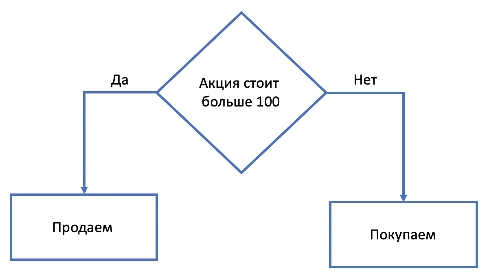

```{r setup, include=FALSE}
knitr::opts_chunk$set(echo = TRUE)
```

### Управляющие конструкции

Познакомимся теперь с управляющими конструкциями, которые упрощают работу в написании кода, а также помогают писать очень сложный код. 

Мы рассмотрим следующие управляющие конструкции:

* `if`
* `for`
* `while`

### Условный оператор if

Перед тем, как приступать к самому оператору `if`, вспомним логический тип переменной и изучим логические операторы и операторы сравнения.

#### Операторы сравнения

С помощью операторов сравнения мы можем сравнивать объекты(числа/строки) друг с другом. Результатом операции сравнения является `TRUE`/`FALSE`, то есть логический тип. 

Стандартные операторы сравнения:

* `a == b` - равен ли объект a объекту b?
* `a != b` - не равен ли объект a объекту b?
* `a > b` - больше ли объект a чем объект b?
* `a < b` - меньше ли объект a чем объект b?
* `a >= b` - больше или равен объект a чем объект b?
* `a <= b` - меньше или равен объект a чем объект b?

Зачастую объекты это числа.

```{r collapse=TRUE}
5 == 5
5 != 5
5 > 5
5 < 5
5 >= 5
5 <= 5
```

Есть некоторый нюанс. Иногда происходит следующее.

```{r collapse=TRUE}
0.1 + 0.2 == 0.3
1/49 * 49 == 1
```

Так происходит потому, что в R есть точность до определенного знака. Чтобы избежать этого можно использовать функцию `all.equal`. 

```{r collapse=TRUE}
all.equal(0.1+0.2, 0.3)
all.equal(1/49 * 49, 1)
```

#### Логические операторы

Несколько логических выражений можно объединять. Рассмотрим простой пример. Когда вы заходите в VK, вам нужно ввести логин и пароль. Чтобы авторизоваться вам нужно ввести правильно и логин, и пароль. Если же вы ввели что-то неправильно, то вы не войдете в систему. В данном примере мы использовали логический оператор **И**, который обозначается как `&&`.

```{r collapse=TRUE}
login <- TRUE
password <- TRUE
login && password
```

```{r collapse=TRUE}
login <- TRUE
password <- FALSE
login && password
```

```{r collapse=TRUE}
login <- FALSE
password <- TRUE
login && password
```

```{r collapse=TRUE}
login <- FALSE
password <- FALSE
login && password
```

Давайте попробуем соединить операторы сравнения вместе с логическими операторами. Пусть у нас есть число `x`, и нам нужно определить, находится ли оно в диапозоне от 0 до 100. 

В данном случае должны выполняться два условия: число должно быть больше 0 **И(т.е. одновременно)** меньше 100.

```{r collapse=TRUE}
x <- 200
x > 0 && x < 100
```

Сначала выполняются операторы сравнения, после чего выражение упрощается до вида `TRUE && FALSE`. После чего выполняется логический оператор **И**. 

Рассмотрим теперь логический оператор **ИЛИ**, который обозначается как `||`. Для него важно выполнение хотя бы одного условия. Например, вам нужно оплатить покупку в 400 рублей. Нужно чтобы у вас были деньги на карте или были наличные. 

```{r collapse=TRUE}
card <- 29500
cash <- 100
card >= 400 || cash >= 400
```


Ниже представлена таблица истинности для этих двух операторов.

  a  | b | a and b (a &&b) | a or b (a \|\| b)
--- | --- | --- | --- | ---
TRUE | TRUE |TRUE | TRUE 
TRUE | FALSE | FALSE | TRUE 
FALSE| TRUE  |FALSE | TRUE 
FALSE| FALSE | FALSE | FALSE 
 
Еще одним логическим оператором является **НЕ**, которое обозначается как `!`. Это отрицание в явном виде.

```{r collapse=TRUE}
a <- TRUE
b <- FALSE
!a
!b
```

#### if

А теперь можно разобрать условный оператор `if`. Зачастую действие алгоритма или какого-то кода может зависеть от условия. Например, у вас есть бот, который покупает акции. Когда цена акции меньше 100 он их покупает, а когда больше, продает. 


Для такого типа задач и нужен условный оператор `if`. Он выглядит следующим образом.

```{r, eval=FALSE}
if (condition) {
  # действия в случае TRUE 
}else{
  # действи в случае FALSE
}
```

Условие (condition) должно принимать значения либо `TRUE`, либо `FALSE.` То есть иметь логический тип. 

В нашей задаче с ботом условие(condition) это `price > 100`. 

```{r, eval=FALSE}
if (price > 100) {
  # цена товара > 100
  # продаем
}else{
  # цена товара <= 100
  # покупаем
}
```

Попробуем написать реальный код. Представим, что есть некоторый прибор, который измеряет температуру какого-то устройства. Если она больше 80, то нужно написать, что температура очень высокая и это опасно. В обратном случае пишем, что все хорошо.

```{r}
temp <- 100
if (temp > 80) {
  print("Температура превысила порог в 80 градусов!")
}else{
  print("Температура в норме.")
}
```

```{r}
temp <- 50
if (temp > 80) {
  print("Температура превысила порог в 80 градусов!")
}else{
  print("Температура в норме.")
}
```

В обшем, если температура меньше 80 градусов можно ничего не писать. То есть можно записать код следующим образом.

```{r}
temp <- 50
if (temp > 80) {
  print("Температура превысила порог в 80 градусов!")
}else{}
```

Но это выглядит некрасиво. На самом деле `if` можно использовать и без `else`.

```{r}
temp <- 50
if (temp > 80) {
  print("Температура превысила порог в 80 градусов!")
}
```

### Цикл for

Чтобы понять, зачем нужен цикл `for`, представьте, что вас попросили увеличить первые 5 значений массива. С текущими знаниями мы бы сделали это следующим образом:

```{r}
v <- sample(x = 1:10, size = 15, replace = TRUE)
v
v[1] <- v[1] + 1
v[2] <- v[2] + 1
v[3] <- v[3] + 1
v[4] <- v[4] + 1
v[5] <- v[5] + 1
v
```

Код выглядит большим и некрасивым. А вдруг нас попросили бы это сделать для 1000 значений? Можно заметить, что в наших действиях менялся только индекс массива, остальное оставалось тем же. Этот индекс можно сделать переменной, которая меняется после выполнения действия. Преобразуем код.

```{r}
k <- 1
v[k] <- v[k] + 1

k <- 2
v[k] <- v[k] + 1

k <- 3
v[k] <- v[k] + 1

k <- 4
v[k] <- v[k] + 1

k <- 5
v[k] <- v[k] + 1
```

Этот код выполняет то же, что и предыдущий. Теперь мы явно видим, что мы выполняем одну и ту же операцию  `v[k] <- v[k] + 1`, но при этом меняем индекс `k`.

Для облегчения таких задач и придумали цикл `for`. Его конструкция выглядит следующим образом.

```{r, eval=FALSE}
for (variable in vector) {
  # здесь тело цикла
}
```

Основные моменты:

* `variable` - название переменной, которая будет меняться
* `vector`- массив значений, которые будет принимать переменная
* *тело цикла* - что будет выполняться на каждой итерации

Разберем цикл `for` на нашей задаче. 

* Название переменной в ней `k`.
* Массив `1:5`.
* Выполняем `v[k] <- v[k] + 1`.

```{r}
v
for (k in 1:5) {
  v[k] <- v[k] + 1
}
v
```

Принцип такой: переменная принимает значение, выполняется тело цикла с этим значением переменной, переменная принимает следующее значение, выполняется тело цикла с новым значением переменной и так продолжается пока переменная не пройдет по всем значениям. Тело цикло может состоять из неограниченного количества действий.

```{r}
for(i in 1:5){
  print(i)
  print('')
}
```

Цикл `for` очень удобен. Например, вам нужно выкачать цены билетов на разные перелеты. Вы же не будете это делать для каждого перелета. Вы создадите какой-то шаблон, после чего используете цикл. О других тонкостях цикла `for` будет сказано далее. 

### Матрицы

Еще одним контейнером хранения данных являются матрицы. Это двумерный массив, то есть набор нескольких массивов. Следовательно он имеет уже две координаты, а не одну.

Чтобы создать матрицу нужно использовать функцию `matrix`. Она имеет следующие аргументы:

* `data` - то чем будет заполнена матрица (массив или число)
* `nrow` - количество строк
* `ncol` - количество столбцов
* `byrow` - заполнять по строкам (`TRUE`), заполнять по столбцам (`FALSE`)

```{r}
m <- matrix(data = 0, nrow = 3, ncol = 5)
print(m)

m1 <- matrix(data = 1:15, nrow = 3, ncol = 5)
print(m1)

m2 <- matrix(data = 1:15, nrow = 3, ncol = 5, byrow = TRUE)
print(m2)
```

Обращение к матрицам очень похоже на обращение к массивам. Но матрица имеет 2 оси. Чтобы выделить какой-то элемент, нужно написать название матрицы, а потом в квадратных скобках через запятую указать номер строки и номер столбца.

```{r collapse=TRUE}
m2[1,5]
m2[3,2]
```

Элементы матрицы можно менять.

```{r collapse=TRUE}
m2[1,5] <- 7
```

Можно выделять отдельно столбец или строку.

```{r collapse=TRUE}
m2[1,] # 1 строка
m2[,2] # 2 столбец
```

Можно менять строку или столбец.

```{r}
m2[1,] <- m2[1,] * 2
m2[,2] <- c(1, -1, 0)
m2
```

Для определения длины массива использовалась функция `length()`. Если использовать ее для матрицы, то получим количество элементов матрицы. Но более полезными являются функции количества строк и столбцов.

```{r}
nrow(m)
ncol(m)
```

### Комбинирование разных конструкций

Условный оператор `if`, цикл `for`, а также цикл `while`(про него в следующей главе) можно комбинировать. Например, использовать `for` + `for`, `for` + `if` или `if` + `if`. 
```{r}
for (i in 1:3) {
  for (j in 0:2) {
    print(c(i,j))
  }
}
```

Видно, что сначала фиксируется первая переменная, после чего вторая проходит по всем своим значениям. После чего первая переменная принимает второе свое значение. Вторая переменная снова проходит по всем своим значениям. И так далее.

```{r}
for (i in 1:10) {
  if (i >= 5){
    print(i)
  }
}
```

В данном примере переменная `i` последовательно принимает значения от 1 до 10. Если это число больше или равно 5, то переменная выводится на экран.

### Цикл while

Мы уже изучили цикл `for`. Но часто бывает нужно совершать не какое-то фиксированное количество операций. То есть нужно совершать операцию пока какое-то условие выполняется. Для этого нужен цикл `while`. Цикл `while` = `for + if` = "бесконечный" цикл.

```{r}
a <- 0
while (a < 5) {
  a <- a + 1
  print(a)
}
```

R может сломаться, если вы используете `while` неправильно. Если не менять значение переменной `a`, то условие будет выполняться "вечно". R либо зависнет, либо будет принтовать 0 не останавливаясь. В верхнем правом углу консоли появится знак *stop*. Нажмите на него, чтобы остановить R.

```{r}
# a <- 0
# while (a < 5) {
#   print(a)
# }
```

