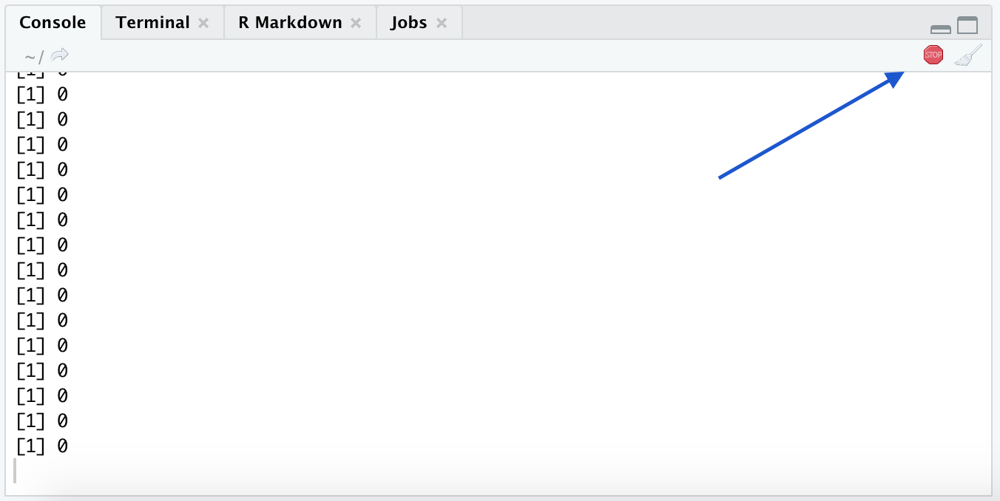

---
```{r setup, include=FALSE}
knitr::opts_chunk$set(echo = TRUE)
```

### Цикл `for`

Чтобы понять, зачем нужен цикл `for`, представьте, что вас попросили увеличить первые 5 значений массива. С текущими знаниями мы бы сделали это следующим образом:

```{r}
v <- sample(x = 1:10, size = 15, replace = TRUE)
print(v)
v[1] <- v[1] + 1
v[2] <- v[2] + 1
v[3] <- v[3] + 1
v[4] <- v[4] + 1
v[5] <- v[5] + 1
print(v)
```

Код выглядит большим и некрасивым. А вдруг нас попросили бы это сделать для 1000 значений? Как-то не очень хочется 1000 раз прописывать по сути одну и ту же строчку, даже зная комбинацию клавиш `Ctrl + C` `Ctrl + V`. 

Можно заметить, что в наших действиях менялся только индекс массива, остальное оставалось тем же. Этот индекс можно сделать переменной, которая меняется после выполнения действия. Преобразуем код.

```{r}
k <- 1
v[k] <- v[k] + 1

k <- 2
v[k] <- v[k] + 1

k <- 3
v[k] <- v[k] + 1

k <- 4
v[k] <- v[k] + 1

k <- 5
v[k] <- v[k] + 1
```

Этот код выполняет то же, что и предыдущий. Теперь мы явно видим, что мы выполняем одну и ту же операцию  `v[k] <- v[k] + 1`, но при этом меняем индекс `k`.

Для облегчения таких задач и придумали цикл `for`. Его конструкция выглядит следующим образом.

```{r, eval=FALSE}
for (variable in vector) {
  # здесь тело цикла
}
```

Основные моменты:

* `variable` - название переменной, которая будет меняться
* `vector`- массив значений, которые будет принимать переменная
* *тело цикла* - что будет выполняться на каждой итерации

Разберем цикл `for` на нашей задаче. 

* Название переменной в ней: `k`.
* Массив: `1:5` -- помним, что `:` это просто один из способов задать массив, можно было бы и с помощью `c(1,2,3,4,5)`
* Тело цикла: `v[k] <- v[k] + 1`.

```{r}
print(v)
for (k in 1:5) {
  v[k] <- v[k] + 1
}
print(v)
```

Принцип такой: переменная принимает значение, выполняется тело цикла с этим значением переменной, переменная принимает следующее значение, выполняется тело цикла с новым значением переменной и так продолжается пока переменная не пройдет по всем значениям. Тело цикло может состоять из неограниченного количества действий.

```{r}
for(i in 1:5){
  print(i)
  print('')
}
```

Цикл `for` очень удобен. Например, вам нужно выкачать цены билетов на разные перелеты. Вы же не будете это делать для каждого перелета. Вы создадите какой-то шаблон, после чего используете цикл. О других тонкостях цикла `for` будет сказано далее. 

Для того чтобы понять, как еще более сложно можно использовать цикл `for`, сделаем еще одно лирическое отступление и изучим новую структуру хранения данных: матрицы. 

### Матрицы

Помимо уже известных нам переменных и массивов, есть и другие структуры хранения данных. Одной из таких структур является матрица. Матрица -- это двумерный массив, то есть набор нескольких массивов.

Чтобы создать матрицу нужно использовать функцию `matrix`. Она имеет следующие аргументы:

* `data` - то чем будет заполнена матрица (массив или один объект)
* `nrow` - количество строк
* `ncol` - количество столбцов
* `byrow` - как следует брать элементы из `data` и заполнять их (по строкам -- тогда пишем в аргумент `TRUE` или по столбцам -- `FALSE`). По умолчанию `byrow=FALSE`. 

```{r}
m <- matrix(data = 0, nrow = 3, ncol = 5)
print(m)

m1 <- matrix(data = 1:15, nrow = 3, ncol = 5)
print(m1)

m2 <- matrix(data = 1:15, nrow = 3, ncol = 5, byrow = TRUE)
print(m2)
```

Мы с вами уже знакомы с очень полезной функцией `length(x)`, которая считает количество элементов в массиве. Давайте попробуем выполнить ее для объекта матрицы. 

```{r}
length(m2)
```

Получим также ожидаемый ответ -- количество элементов. Однако если в массивах на этом наш интерес заканчивался, то в матрице нам было бы интересно знать не только количество элементов, но и количество строк/столбцов, так как матрица -- это двумерный объект. Так как объект двумерный, у него есть так называемая размерность. Размерность -- это просто два числа, где первое число -- это количество строк в матрице, а второе -- количество столбцов. Размерность матрицы можно узнать с помощью функции `dim`.

```{r}
dim(m2)
```

Также можно получать отдельно число количества строк и столбцов. За это отвечают функции `nrow` и `ncol`. 

```{r}
nrow(m2) 
ncol(m2)
```

#### Индексирование в матрице

Обращение к матрицам очень похоже на обращение к массивам. Но как мы уже сказали, матрица -- объект двумерный. Поэтому чтобы выделить какой-то элемент, нужно написать название матрицы, а потом в квадратных скобках через запятую указать номер строки и номер столбца, на месте которых стоит интересующий нас элемент.

```{r collapse=TRUE}
m2
m2[1,5] # получим объект, находящийся в 1 строке и 5 столбце
```

Также элементы матрицы можно менять.

```{r collapse=TRUE}
m2[1,5] <- 7
```

Можно доставать отдельно весь столбец или всю строку.

```{r collapse=TRUE}
m2[1,] # 1 строка
m2[,2] # 2 столбец
```

Можно менять строку или столбец.

```{r}
m2[1,] <- m2[1,] * 2
m2[,2] <- c(1, -1, 0)
m2
```

После того как мы познакомились с матрицами, можно переходить обратно к `for`.

### Комбинирование разных конструкций

Иногда использования одного цикла `for` недостаточно для решения какой-либо задачи. Очень часто бывает полезным комбинировать его с другими конструкциями (например, с уже известным нам `if` или даже с самим циклов `for`). Разберем несколько примеров. 

**Пример №1: `for` + `if`** Вернемся к нашему примеру про температуру с прошлого семинара. Предположим теперь, что к нам поступают несколько чисел (в виде массива, например), где каждое число -- это температура на каком-то приборе. Тогда нам нужно будет "пробежаться" по всем этим числам и получить сообщение о температуре для каждого прибора. 

```{r}
x <- c(50, 30, 71, 90, 69) # массив из чисел 
for (i in x){ # начинаем пробегаться по массиву
  if (i >= 70 && i < 80){ # для каждого элемента из массива проверяем на пороговую температуру
    print("Температура близится к 80 градусам!")
  } else if (i > 80){
    print("Температура достигла 80 градусов!!")
  } else {
    print("Температура в норме")
  }
}

```

**Пример №2: `for` + `for`** Вспомним матрицы и представим, что наша задача -- это вывести на экран каждый элемент матрицы. Как мы поступим, зная конструкцию `for`?

```{r}
m <- matrix(1:6, nrow = 3, ncol = 2, byrow = T)
for (i in 1:nrow(m)) {
  for (j in 1:ncol(m)) {
    print(m[i,j])
  }
}
```

Видно, что сначала мы пробегаемся по всем строкам в матрице, а потом для каждой строки пробегаемся по всем столбцам. То есть сначала у нас фиксируется значение из первого `for`. Затем для этого значения переменная `j` меняется в своих пределах, затем переменная `i` принимает следующее значение, а переменная `j` снова пробегается по всем своим значениям и так далее. Вот так это выглядит с помощью индексирования:

```{r}
m[1,1]
m[1,2]
m[2,1]
m[2,2]
m[3,1]
m[3,2]
```

### Цикл `while`

Ну и напоследок рассмотрим еще одну конструкцию: цикл `while`. Этот цикл позволяет совершать операцию пока какое-то условие выполняется. 

Например, нам нужно добавлять к нашей переменной единицу, **пока** эта переменная меньше 5. Тогда с помощью `while` это можно сделать так:

```{r}
a <- 0
while (a < 5) {
  a <- a + 1
  print(a)
}
```

R может сломаться, если вы используете `while` неправильно. Если не менять значение переменной `a`, то условие будет выполняться "вечно". R либо зависнет, либо будет принтовать 0 не останавливаясь. В верхнем правом углу консоли появится знак *stop*. Нажмите на него, чтобы остановить R.

```{r}
# a <- 0
# while (a < 5) {
#   print(a)
# }
```



### `break` и `next`

На примере цикла `while` мы с вами отметили, что иногда циклы могут зацикливаться (тавтология, да). Чтобы этого избежать, можно также использовать оператор `break`. Он используется внутри циклов (`for`, `while`), чтобы остановить итерации в цикле и продолжить код уже за его пределами. Приведем пример в цикле `for`.

```{r}
vec <- c(1,2,3,4,5)
for (i in vec){
  if (i == 3){
    break
  }
  print(i)
}
```

Следующий же оператор `next` полезен, когда мы хотим пропустить текущую итерацию цикла, не завершая его.

```{r}
vec <- c(1,2,3,4,5)
for( i in vec ){
  if(i == 3){
    next
  }
  print(i)
}
```


