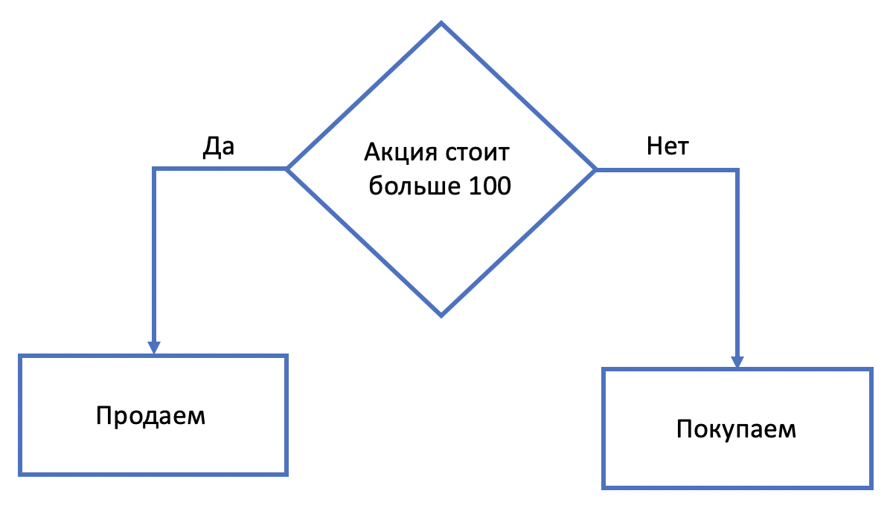

---
```{r setup, include=FALSE}
knitr::opts_chunk$set(echo = TRUE)
```

## Управляющие конструкции

Теперь приступим к более сложным вещам. Мы рассмотрим 3 наиболее часто употребляемых управляющих конструкций. Этот материал считается очень важным для понимания программирования в целом и его ни в коем случае нельзя разбирать поверхностно. Можно сказать, что он является фундаментом для всех алгоритмов, задач и функций, поэтому просьба быть чуточку внимательнее.

Основными конструкциями являются:

* `if`
* `for`
* `while`

### Условный оператор if

Перед тем, как приступать к самому оператору `if`, сделаем небольшое лирическое отступление и изучим логические операторы и операторы сравнения.

#### Операторы сравнения

С помощью операторов сравнения мы можем сравнивать объекты (числа/строки) друг с другом. Результатом операции сравнения является `TRUE`/`FALSE`, то есть логический тип. 

Стандартные операторы сравнения:

* `a == b` - равен ли объект a объекту b?
* `a != b` - не равен ли объект a объекту b?
* `a > b` - больше ли объект a чем объект b?
* `a < b` - меньше ли объект a чем объект b?
* `a >= b` - больше или равен объект a чем объект b?
* `a <= b` - меньше или равен объект a чем объект b?

Зачастую объекты это числа.

```{r collapse=TRUE}
5 == 5
5 != 5
5 > 5
5 < 5
5 >= 5
5 <= 5
```

Есть некоторый нюанс. Иногда происходит следующее.

```{r collapse=TRUE}
0.1 + 0.2 == 0.3
1/49 * 49 == 1
```

Так происходит потому, что в R есть точность до определенного знака. Чтобы избежать этого можно использовать функцию `all.equal`. 

```{r collapse=TRUE}
all.equal(0.1+0.2, 0.3)
all.equal(1/49 * 49, 1)
```

#### Логические операторы

Несколько логических выражений можно объединять. Рассмотрим простой пример. Когда вы заходите в VK, вам нужно ввести логин и пароль. Чтобы авторизоваться вам нужно ввести правильно и логин, и пароль. Если же вы ввели что-то неправильно, то вы не войдете в систему. В данном примере мы использовали логический оператор **И**, который обозначается как `&&`.

```{r collapse=TRUE}
login <- TRUE
password <- TRUE
login && password
```

```{r collapse=TRUE}
login <- TRUE
password <- FALSE
login && password
```

```{r collapse=TRUE}
login <- FALSE
password <- TRUE
login && password
```

```{r collapse=TRUE}
login <- FALSE
password <- FALSE
login && password
```

Давайте попробуем соединить операторы сравнения вместе с логическими операторами. Пусть у нас есть число `x`, и нам нужно определить, находится ли оно в диапозоне от 0 до 100. 

В данном случае должны выполняться два условия: число должно быть больше 0 **И (т.е. одновременно)** меньше 100.

```{r collapse=TRUE}
x <- 200
x > 0 && x < 100
```

Сначала выполняются операторы сравнения, после чего выражение упрощается до вида `TRUE && FALSE`. После чего выполняется логический оператор **И**. 

Рассмотрим теперь логический оператор **ИЛИ**, который обозначается как `||`. Для него важно выполнение хотя бы одного условия. Например, вам нужно оплатить покупку в 400 рублей. Нужно чтобы у вас были деньги на карте или были наличные. 

```{r collapse=TRUE}
card <- 29500
cash <- 100
card >= 400 || cash >= 400
```


Ниже представлена таблица истинности для этих двух операторов.

  a  | b | a and b (a &&b) | a or b (a \|\| b)
--- | --- | --- | --- | ---
TRUE | TRUE |TRUE | TRUE 
TRUE | FALSE | FALSE | TRUE 
FALSE| TRUE  |FALSE | TRUE 
FALSE| FALSE | FALSE | FALSE 
 
Еще одним логическим оператором является **НЕ**, которое обозначается как `!`. Это отрицание в явном виде.

```{r collapse=TRUE}
a <- TRUE
b <- FALSE
!a
!b
```

#### Переходим к `if` 

А теперь можно разобрать условный оператор `if`. Зачастую действие алгоритма или какого-то кода может зависеть от условия. Например, у вас есть бот, который покупает акции. Когда цена акции меньше 100 он их покупает, а когда больше, продает. 


Для такого типа задач и нужен условный оператор `if`. Он выглядит следующим образом.

```{r, eval=FALSE}
if (condition) {
  # действия в случае TRUE 
}else{
  # действия в случае FALSE
}
```

Условие (condition) должно принимать значения либо `TRUE`, либо `FALSE.` То есть иметь логический тип. 

В нашей задаче с ботом условие (condition) это `price > 100`. 

```{r, eval=FALSE}
if (price > 100) {
  # цена товара > 100
  # продаем
}else{
  # цена товара <= 100
  # покупаем
}
```

Попробуем написать реальный код. 

**Пример №1** Представим, что есть некоторый прибор, который измеряет температуру какого-то устройства. Если она больше 80, то нужно написать, что температура очень высокая и это опасно. В обратном случае пишем, что все хорошо.

```{r}
temp <- 100
if (temp > 80) {
  print("Температура превысила порог в 80 градусов!")
}else{
  print("Температура в норме.")
}
```

```{r}
temp <- 50
if (temp > 80) {
  print("Температура превысила порог в 80 градусов!")
}else{
  print("Температура в норме.")
}
```

Если нам не очень важно сообщения о том, что все в норме, а нужно знать, только когда наступают проблемы, то можно обойтись и без `else`:

```{r}
temp <- 50
if (temp > 80) {
  print("Температура превысила порог в 80 градусов!")
}
```

**Пример №2** Представим, что у нас есть потенциальных не 2, а 3 исхода. Например, нам нужно знать, что температура прибора в норме, что она близится к пороговым 80 градусам и что она достигла нашего максимального порога температуры. Тогда это можно сделать с помощью `else if` или `if внутри if`. 

```{r}
temp <- 70
if (temp >=  70 && temp < 80) {
  print("Температура близится к 80 градусам!")
}else if (temp >= 80) {
  print("Температура достигла максимального значения!")
} else {
  print("Температура в норме")
}
```

```{r}
temp <- 90
if (temp >=  70 && temp < 80) {
  print("Температура близится к 80 градусам!")
}else if (temp >= 80) {
  print("Температура достигла максимального значения!")
} else {
  print("Температура в норме")
}
```

```{r}
temp <- 30
if (temp >=  70 && temp < 80) {
  print("Температура близится к 80 градусам!")
}else if (temp >= 80) {
  print("Температура достигла максимального значения!")
} else {
  print("Температура в норме")
}
```

