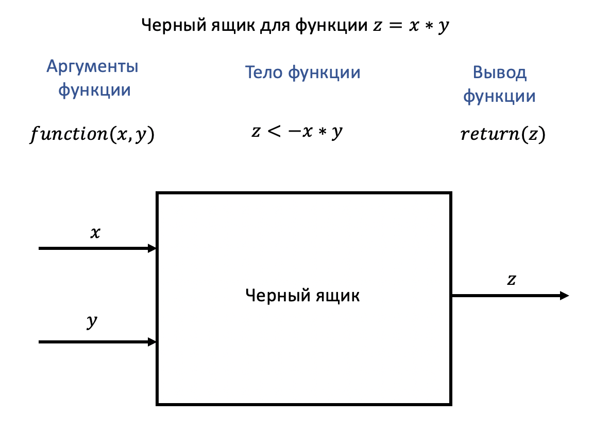
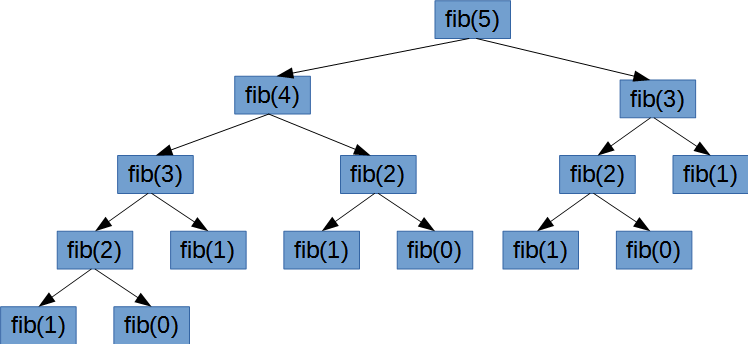

---
```{r setup, include=FALSE}
knitr::opts_chunk$set(echo = TRUE)
```

### Встроенные функции

Мы уже встречали много различных встроенных функций. Давайте вспомним некоторые из них:

* `cos(x)` - косинус числа x
* `round(x, n)` - округление числа x до n знака после запятой
* `factorial(n)` - факториал числа n
* `sum(x)` - сумма значений массива x

Для использования функции мы пишем ее название, ставим круглые скобки и в них перечисляем аргументы через запятую.

### Зачем нужны собственные функции

Предположим у нас есть 3 массива. И нам нужно найти сумму каждого из них. Не зная, что такое функция, мы бы сделали следующим образом.

```{r collapse=TRUE}
m1 <- 1:5
m2 <- 3:6
m3 <- c(-10,0,9)

s1 <- 0
for(i in 1:length(m1)){
  s1 <- s1 + m1[i]
}

s2 <- 0
for(i in 1:length(m2)){
  s2 <- s2 + m2[i]
}

s3 <- 0
for(i in 1:length(m3)){
  s3 <- s3 + m3[i]
}

print(s1)
print(s2)
print(s3)
```

Если представить, что таких массивов будет больше или мы будем находить не сумму, а что-то другое (где код будет гораздо больше), то возникает проблема: код занимает очень много места, хотя производится одна и та же операция, но с **разными  входными данными**. Для решения данной проблемы была придумана функция.

```{r collapse=TRUE}
SUM <- function(x){
  s <- 0
  for(i in 1:length(x)){
    s <- s + x[i]
  }
  return(s)
}

SUM(m1)
SUM(m2)
SUM(m3)
```

Код значительно уменьшился. Не бойтесь, что не понимаете как мы сделали собственную функцию. Позже мы разберем все на более простых примерах. А сейчас разберем общий алгоритм создания функций.

### Алгоритм создания функций

1. Вы должны придумать название своей функции, оно должно выполнять такие же требования, которые были для названий переменных.
2. Вы пишите название своей функции и ставите знак присвоения (<-).
3. Далее вы пишите `function()`, тем самым давая понять R, что вы создаете функцию.
4. В круглых скобках вы перечисляете аргументы вашей функции. Если аргументов несколько, то перечисляете их через запятую. 
5. Дальше ставятся фигурные скобки. В них записывается тело функции, то есть все то, что должна сделать функция.
6. Внутри функции нужно поставить `return()`, где в круглых скобках записать объект (переменная, массив, матрица или еще что-то), что вы хотите вывести. Например в задаче с суммой массива, мы выводим переменную, которая отвечает за сумму. По сути `return()` это примерно тоже самое, что и `print()`, но только `print()` выводит что-то на экран, а `return()` "выкидывает" ответ из функции. 

При создании любой функции важно понять, **какие аргументы идут на вход** и **что идет на выход**. Это можно изобразить на черном ящике.



Реализуем эту функцию. И запустим ее для аргмументов 5 и 7.

```{r}
pow <- function(x, y){
  z <- x*y
  return(z)
}

pow(5, 7)
```

Попробуем сделать функцию, которая выводит квадрат числа. 

```{r}
square <- function(x){
  l <- x^2
  return(l)
}

square(5)
```

А теперь попробуем сделать функцию, которая считает квадрат или куб числа, в зависимости от какого-то другого аргумента.

```{r}
sq_or_cu <- function(x,y){
  if(y == 'Квадрат'){
    l <- x^2
    return(l)
  } else {
    l <- x^3
    return(l)
  }
}

sq_or_cu(3,y = 'Куб')
sq_or_cu(3,y = 'Квадрат')
```

Как видим, можно использовать несколько `return`.

**Замечание:** Когда вы пишите достаточно большой код, а потом еще оборачиваете это в функцию, то очень легко запутаться с фигурными скобками, так как их становится очень много. Чтобы этого избежать, всегда используете *правила написания красивого кода*: делайте вложенные отступы, закрывающие скобки пишите на отдельных строках, делайте код приятным на глаз. Также можно навести курсор мыши на интересующую вас скобку и R покажет вам, с какой другой скобкой она связана. 

### Аргументы по умолчанию (дефолтные переменные)

У многих функций, есть дефолтные параметры. Они нужны, чтобы уменьшить написание
входных переменных функции. Если вы чаще используете возведение в квадрат, и только иногда в куб, то стоит поставить аргументу значение по умолчанию. Это делается при перечислении аргументов. Там можно поставить знак равно и ввести аргумент по умолачанию. 

```{r}
sq_or_cu <- function(x, y = 'Квадрат'){
  if(y == 'Квадрат'){
    l <- x^2
    return(l)
  } else {
    l <- x^3
    return(l)
  }
}

sq_or_cu(3)
sq_or_cu(3,y = 'Куб')
```

**Замечание:** Мы с вами уже сталкивались с аргументами по умолчанию в встроенных функциях. Например, функция `round` имеет аргумент `digits`, который по умолчанию равен 0, либо функция `log` имеет по умолчанию основание `exp(1)`. Если же какому-либо аргументу не присвоить значение по умолчанию внутри функции, то тогда если вы его не передадите в функцию, она работать не будет! 

### Глобальные и локальные переменные

Внутри каждой функции обычно используются какие-то дополнительные переменные. Но их значение используется только внутри функции, поэтому такие переменные называются локальными. То есть эти переменные не остаются в памяти. Переменные, которые мы видим в правом верхнем окошке являются глобальными. К локальным переменным нельзя обращаться за пределами функций. 

```{r error=TRUE}
square <- function(x){
  l <- x^2
  return(l)
}

l + 2
```

При запуске предыдущей функции мы не видим переменную l в правом верхнем углу. Если мы хотим сделать переменную глобальной, нужно изменить знак присвоения на `<<-`. 

```{r}
square <- function(x){
  l <<- x^2
  return(l)
}

square(5)
```

Теперь можно увидеть переменную l в правом верхнем углу.

### return

Поработаем теперь с `return`. Важно, что должна выводить функция.

```{r}
abc <- function(x){
  a <- x*5
  b <- x/5
  c <- x+5
  return(a)
}

abc(5)

abc <- function(x){
  a <- x*5
  b <- x/5
  c <- x+5
  return(b)
}

abc(5)
```

Выводить можно несколько чисел, с помощью массива. К этому массиву можно потом обращаться.

```{r collapse=TRUE}
abc <- function(x){
  a <- x*5
  b <- x/5
  c <- x+5
  return(c(a,b,c))
}

w <- abc(5)
w[1] # a
w[2] # b 
w[3] # c
```

После написания `return` функция останавливает работу и выходит из нее. Например попробуем вывести на экран сумму чисел после `return`. Это не сработает, так как строчка `print(a + b + c)` уже не будет запускаться. Функция прекратила свою работу ранее и вывела массив этих значений.

```{r}
abc <- function(x){
  a <- x*5
  b <- x/5
  c <- x+5
  return(c(a,b,c))
  print(a + b +c)
}

abc(5)
```

### Принцип создания функций

Прежде чем написать функцию, попробуйте просто написать код внутри нее и проверить работает ли он, а уже потом сделать его в виде функции.

Например, код для вычисления факториала.

```{r}
n <- 5
  
k <- 1
for (i in 2:n) {
  k <- k * i
}
print(k)
```

Тут можно быстро проверить, все ли работает корректно. А уже потом оформить это в виде функции. На вход подается число `n`. На выходе `k`.

```{r}
fact <- function(n) {
  k <- 1
  for(i in 2:n){
    k <- k * i
  }
  return(k)
}
```

### Рекурсия

Теперь поговорим про рекурсию. Рекурсия - это функция, которая использует саму себя.

<center>
{width=400}
</center>

<center>
{width=400px}
</center>

Ярким примером рекурссии являются [числа фибоначчи] (https://ru.wikipedia.org/wiki/Числа_Фибоначчи). Начальное число фибоначчи равно 0 ($F_0 = 0$). Первое число равно 1 ($F_1 = 1$). Последующие числа задаются формулой $F_n = F_{n-1} + F_{n-2}$. Чтобы вычислить 5 число фиббоначи, нужно вычислить 3 и 4. В этом и заключается рекурсия. На картинке можно увидеть дерево рекурсии для чисел фибоначчи.



Самое главное в рекурсии прописать условие выхода. В данном случае, когда будет считаться `fib(0)`, мы не должны рекурсивно искать `fib(-1)` и `fib(-2)`. Мы должны сразу вернуть 0. Аналогично для `fib(1)`. Если условие выхода не прописать, то можно столкнуться с той же самой проблемой "зацикливания", которую мы наблюдали в цикле `while`. Если такое случилось, напомним, что можно нажать красную кнопку **stop** в правом верхнем углу консоли. 

```{r}
fib <- function(n){
  if(n == 0){
    return(0)
  }
  if(n == 1){
    return(1)
  }
  k <- fib(n-1) + fib(n-2)
  return(k)
}

fib(6)
```
