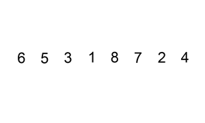
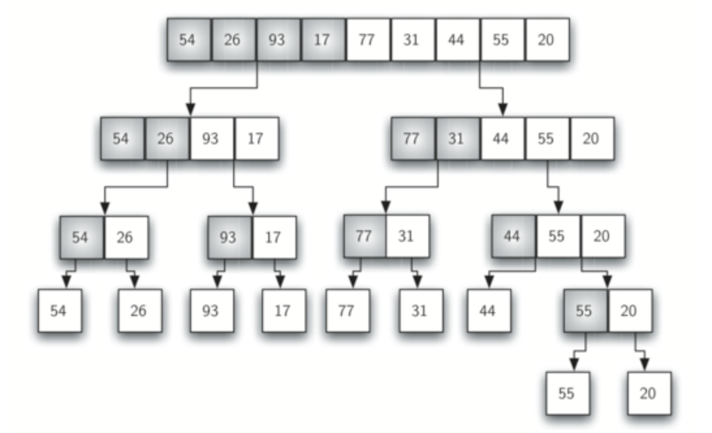
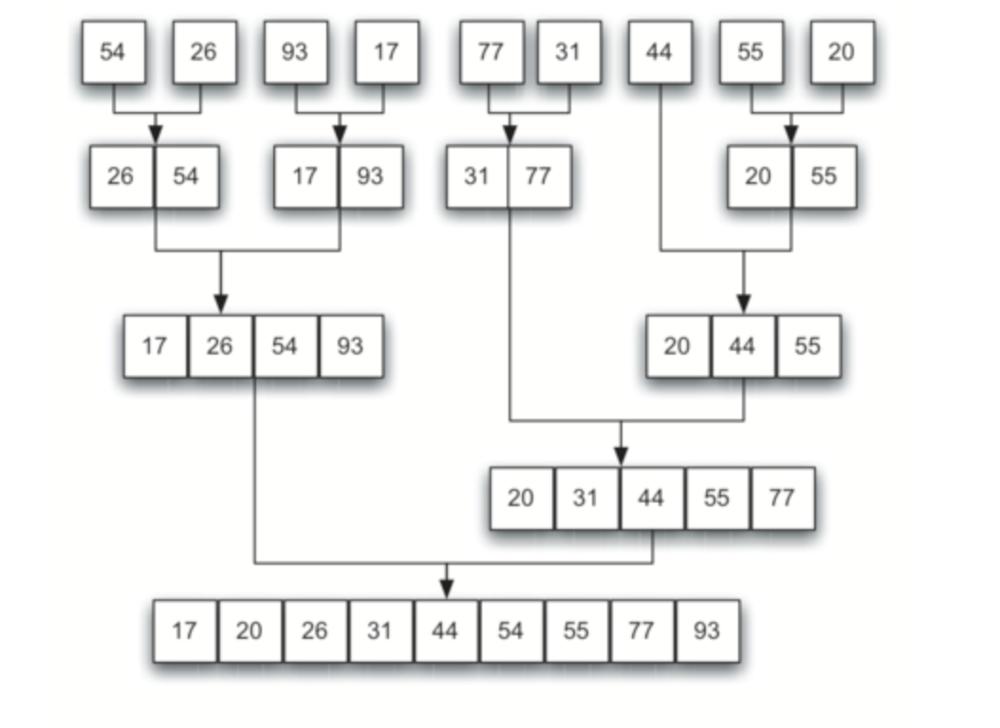

```{r setup, include=FALSE}
knitr::opts_chunk$set(echo = TRUE)
```

### Задача

Дан массив, нужно отсортировать его элементы. Существует достаточно большое количество сортировок. Отличаются они друг от друга скоростью выполнения. Мы рассмотрим одну из самых медленных, но самую понятную в реализации сортировку. Она называется сортировкой пузырьком.

### Алгоритм сортировки пузырьком

<center>

</center>

[Сортировка пузырьком](https://ru.wikipedia.org/wiki/Сортировка_пузырьком) - это метод сортировки массивов и списков путем последовательного сравнения и обмена соседних элементов, если предшествующий оказывается больше последующего. В процессе выполнения данного алгоритма элементы с большими значениями оказываются в конце списка, а элементы с меньшими значениями постепенно перемещаются по направлению к началу списка. Образно говоря, тяжелые элементы падают на дно, а легкие медленно всплывают подобно пузырькам воздуха.

В сортировке методом пузырька количество итераций внешнего цикла определяется длинной списка минус единица, так как когда второй элемент становится на свое место, то первый уже однозначно минимальный и находится на своем месте.

Количество итераций внутреннего цикла зависит от номера итерации внешнего цикла, так как конец списка уже отсортирован, и выполнять проход по этим элементам смысла нет.

```{r}
bubble_sort <- function(x){
  n <- length(x)
  for(i in (n-1):1){
    for(j in 1:i){
      if(x[j] > x[j+1]){
        a <- x[j]
        x[j] <- x[j+1]
        x[j+1] <- a
      }
    }
  }
  return(x)
}
x <- sample(1:100,10)
print(x)
print(bubble_sort(x))
```

Рассмотрим также реализации других алгоритмов сортировки.

### Сортировка выбором

<center>

</center>

[Статья](https://ru.wikipedia.org/wiki/Сортировка_выбором) про сортировку выбором.

Алгоритм:

1. Найти наименьшее значение в списке.
2. Записать его в начало списка, а первый элемент - на место, где раньше стоял наименьший.
3. Снова найти наименьший элемент в списке. При этом в поиске не участвует первый элемент.
4. Второй минимум поместить на второе место списка. Второй элемент при этом перемещается на освободившееся место.
5. Продолжать выполнять поиcк и обмен, пока не будет достигнут конец списка

Иногда вместо минимума ищут максимум в массиве, тогда код может слегка отличаться. В качестве тренировки попробуйте дома построить алгоритм при нахождении максимума. 

```{r}
selection <- function(x){
  for(i in 1:(length(x)-1)){
    m <- i
    for(j in (i+1):length(x)){
      if(x[j]<x[m]){
        m <- j
      }
    }
    a <- x[i]
    x[i] <- x[m]
    x[m] <- a
  }
  return(x)
}

x <- sample(-500:500, size = 8)
print(x)
selection(x)
```

### Сортировка вставками

<center>

</center>

[Статья](https://ru.wikipedia.org/wiki/Сортировка_вставками) про сортировку вставками.

```{r}
insertion <- function(x){
  for(i in 2:length(x)){
    k <- i
    
    C <- x[i]
    for(j in (i-1):1){
      if(x[j] > C){
        x[j+1] <- x[j]
        k <- j
      }
    }
    x[k] <- C
  }
  return(x)
}

x <- sample(1:100,30)
print(x)
print(insertion(x))
```

### Сортировка слиянием

<center>

</center>

[Статья](https://ru.wikipedia.org/wiki/Сортировка_слиянием) про сортировку слиянием.

При сортировке слиянием массив разбивается пополам на 2 массива до тех пор, пока не останется по одному элементу. Потом начинается поочередное слияние, но только уже в отсортированном порядке. Более наглядно представлено на рисунках.

<center>

</center>

<center>

</center>

```{r}
MERGE <- function(A,B){ 
  C <- c() 
  while(length(A)>0 & length(B)>0){ 
    if(A[1]<B[1]){ 
      C <- c(C,A[1]) 
      A <- A[-1] 
    }else{ 
      C <- c(C,B[1]) 
      B <- B[-1] 
    } 
  } 
  C <- c(C,A,B) 
  return(C) 
} 
mergeSORT <- function(D){ 
  if(length(D)==1){ 
    return(D) 
  }else{ 
    mid <- length(D)%/%2 
    D <- MERGE(mergeSORT(D[1:mid]),mergeSORT(D[(mid+1):length(D)])) 
  } 
  return(D) 
}

x <- sample(1:100,30)
print(x)
print(mergeSORT(x))
```
