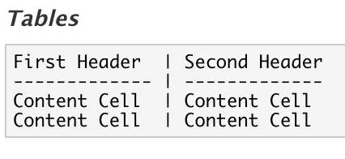

```{r setup, include=FALSE}
knitr::opts_chunk$set(echo = TRUE)
```

### R Markdown

R Markdown -- это язык разметки, который позволяет объединять код, его результаты, текст, графики и картинки. Он очень удобен для составления различных отчетов. 

Давайте попробуем создать наш первый R Markdown(.Rmd) файл. Там, где мы создаем скрипт нужно выбрать R Markdown.

<center>
{width=500px}
</center>

Далее выйдет окно, в котором нужно дать название отчета, имя автора, а также тип выходного файла. Используйте html, можно также пользоваться pdf, но для этого нужен установленный LaTeX.

<center>
{width=500px}
</center>

После этого у вас откроется Rmd файл.

<center>
{width=500px}
</center>

Любой Rmd файл состоит из следующих частей:

* YAML Header -- шапка документа, в которой указываются различные настройки того как должен выглядеть итоговый файл.
* Глобальные настройки чанков -- настройки, которые идут по умолчанию для всех чанков. Позже еще вернемся к этому более подробно.
* Заголовок --  имеется 6 уровней заголовков, количество решеток показывает уровень заголовка.
* Текст -- можно писать любой текст, который вы хотите.
* Чанк -- создается для того, чтобы отделить код от текста. Внутри чанка пишется код.

Давайте попробуем собрать этот файлик. Чтобы это сделать, нужно нажать на кнопку **Knit**, которая находится на панели для файла. После нажатия у вас появится html файлик.


Видим, что код находится в отдельном окошке. А также его результат выносится в отдельное окошко.

### Основные элементы R Markdown

#### Жирный шрифт

Для выделения текста жирным можно использовать конструкцию \*\*текст\*\* или \_\_текст\_\_. Давайте попробуем! **Сегодня** мы изучаем R Markdown.

#### Курсивный шрифт

Чтобы сделать текст курсивным можно использовать конструкцию \*текст\* или \_текст\_. Пробуем! Для формирования отчетов удобно пользоваться *R Markdown*.

#### Моноширинный шрифт

Этот шрифт нужен для того, чтобы выделять куски кода прямо в тексте. Чтобы применить шрифт используем следующую конструкцию \`текст\`. Например, sum(x) не так заметен, как `sum(x)`.

#### Верхние и нижние индексы

Можно поставить верхний и нижний индексы. Сначала пишем выражение, которое будет иметь эти индексы. Далее для верхнего индекса ставим ^^ и между ними пишем, что будет содержаться в верхнем индексе, для нижнего аналогично, но пишем между ~~. Например: R^2^~i~ можно написать с помощью конструкции R\^2\^\~i\~. 

#### Зачеркнутый текст

Чтобы зачеркнуть текст используйте конструкцию \~\~текст\~\~. Например, я являюсь ~~студентом~~ преподавателем ВШЭ.

#### Экранирование служебных символов

Обратный слэш(\\), звёздочка(\*), знак доллара(\$) и нижнее подчеркивание(\_) являются служебными командами. Но если вы хотите их напечать, то используйте перед этими знаками обратный слэш. \\, \$, \_, \* .

#### Тире и длинное  тире

Чтобы использовать тире нужно поставить два знака минуса (\-\-). Например, Среднее -- это сумма всех значений деленное на их количество. Если же вы хотите использовать длинное тире, то нужно поставить три знака минуса (\-\-\-). Пробуем! Дисперсия случайно величины --- мера разброса значений случайной величины относительно её математического ожидания.

#### Гиперссылки

Чтобы выделить гиперссылку, нужно использовать конструкцию <ссылка>. Например, главная страница яндекса находится по адрессу <https://yandex.ru> . Иногда гиперссылка выглядит очень некрасиво и её можно спрятать. Для этого используем конструкцию [текст] (ссылка), без пробела между скобками. Сделаем наше последнее предложение более красивым. [Главная страница](https://yandex.ru) яндекса.

### Чанк

Чанк создается, для того, чтобы R Markdown понимал где находится код, который нужно запустить.

Чанк можно создать с помощью кнопки **Insert**.

<center>
{width=300px}
</center>

Выглядит он следующим образом. 

<center>

</center>

Внутри этого блока и нужно писать код. Буква r в фигурных скобках означает, что в чанке будет код на языке R. Дело в том, что можно использовать несколько языков программирования сразу. 

### Опции чанка

#### echo
Данная опция может принимать логическое значение: TRUE или FALSE(default:TRUE). Она отвечает за вывод кода, находящийся в чанке. Давайте попробуем на примере.

Выведем первые 6 наблюдений датасета cars с помощью команды head и выставим TRUE в опции echo.
```{r, echo=TRUE}
print('Hello world')
```

А теперь попробуем выставить FALSE. Посмотрим, что поменяется.
```{r, echo=FALSE}
print('Hello world')
```

Как видно, теперь код не высвечивается.

#### eval
Данная опция может принимать логическое значение: TRUE или FALSE(default:TRUE). Отвечает за исполнение кода в чанке. Смотрим на пример.
```{r, eval=TRUE}
print('Hello world')
```

А теперь попробуем выставить FALSE. Посмотрим, что поменяется.
```{r, eval=FALSE}
print('Hello world')
```

#### include
Данная опция может принимать логическое значение: TRUE или FALSE(default:TRUE). Отвечает за отображение результата исполнения чанка. Смотрим на пример.

```{r, include=TRUE}
print('Hello world')
```

А теперь попробуем выставить FALSE. Посмотрим, что поменяется.
```{r, include=FALSE}
print('Hello world')
```

#### error
Данная опция может принимать логическое значение: TRUE или FALSE(default:FALSE). Отвечает за отображение ошибок в текст документа. 

```{r, error=TRUE}
'Матан' + 'Гуманитарий'
```

А теперь попробуем выставить FALSE. Посмотрим, что поменяется.

#### message
Данная опция может принимать логическое значение: TRUE или FALSE(default:TRUE). Отвечает за отображение текста сообщений  в документ.

#### warning
Данная опция может принимать логическое значение: TRUE или FALSE(default:TRUE). Отвечает за добавление предупреждений в текст.

#### comment
Данная опция может принимать строковое значение(default:'##'). Отвечает за префикс перед каждой строкой вывод результата.

```{r}
print('Hello world')
```

А теперь поменяем префикс.
```{r, comment='->'}
print('Hello world')
```

#### results
Данная опция может принимать строковое значение(default:'##'). Отвечает за отображение кода.


#### highlight
Данная опция может принимать логическое значение: TRUE или FALSE(default:TRUE). Отвечает за подсвечивание синтаксиса кода.

#### tidy
Данная опция может принимать логическое значение: TRUE или FALSE(default:FALSE). Отвечает за отступы  и пробелы.

#### collapse

Остальные опции чанков можно найти по этой [cсылке](https://yihui.name/knitr/options/).

### Inline code

В RMarkdown можно вставлять значение какой-то переменной прямо в текст. Давайте попробуем. В датсете cars имеется `r nrow(cars)` наблюдений и `r ncol(cars)` переменных.

### LaTeX в R Markdown

Первый замечательный предел: 
$\lim_{x \to 0}\frac{\sin(x)}{x} = 1$ .

Выглядит не очень. Формулу лучше выносить отдельно.

Второй замечательный предел:)
$$
\lim_{n \to \infty} \left(1+\frac{1}{n}\right)^n = e 
$$

### Списки

#### Нумерованный список

Чтобы сделать нумерованный список можно просто ставить цифру с точкой и сделав отступ.

1. Подготовиться к КР по мировой экономике.
2. Сделать материал для факультатива.
3. Ждать стипендию.

#### Маркированный список

* МИКРО
* МАКРО
* МОКРО

#### Двойной список 

1. Item 1
2. Item 2
3. Item 3
    + Item 3a
    + Item 3b
    

* Item 1
* Item 2
    + Item 2a
    + Item 2b

### Блоки

A friend once said:

> It's always better to give 
> than to receive.

```
Тут должна быть цитата)
```

### Картинки


### Таблички 

Таблички делаются следующим образом.

<center>

</center>

First Header  | Second Header
------------- | -------------
Content Cell  | Content Cell
Content Cell  | Content Cell

### Горизонтальная линия

----


### HTML

Обычно инструментов R Markdown хватает, чтобы делать отчеты. Но так как на выходе вы получаете HTML страничку, вы можете пользоваться и инструментами HTML. 

Например, создавать таблички удобным способом на [сайте](https://daruse.ru/html-table-generator). А потом просто вставлять код, который получили. 

Или менять цвет текста. 

Код  | Текст
---- | ------
\<font color="red"\>This is some text!\</font\>  | <font color="red">This is some text!</font>
\<font color="green"\>This is some text!\</font\>  | <font color="green">This is some text!</font>
\<font color="blue"\>This is some text!\</font\>  | <font color="blue">This is some text!</font>

### YAML Header

CSS

### Примечания

Материалы по $\LaTeX$ можно найти на репозитории моего друга.[^1]

[^1]: [Страничка Филиппа на GitHub](https://fulyankin.github.io/LaTeX/) 

Также можно посмотреть курс от ВШЭ на Coursera[^2]

[^2]: [Курс по $\LaTeX$](https://www.coursera.org/learn/latex)
