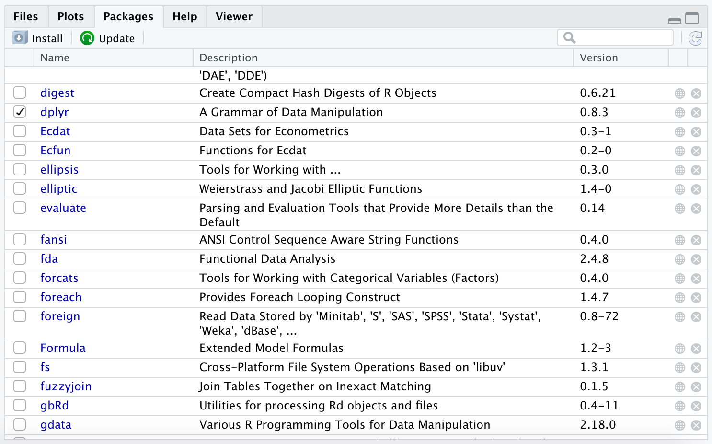
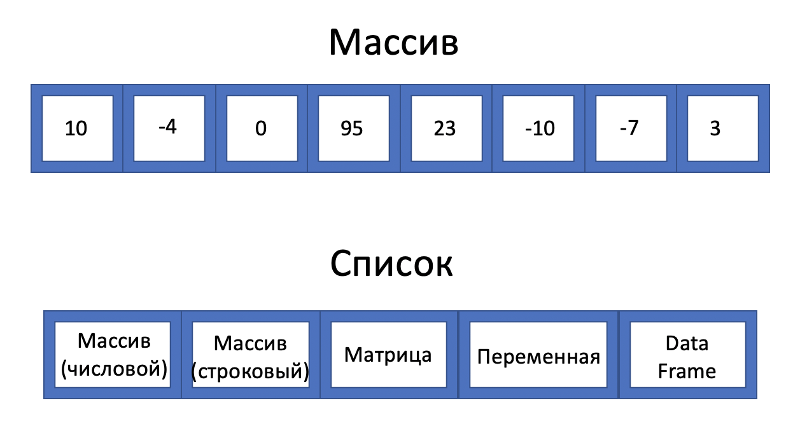

---
```{r setup, include=FALSE}
knitr::opts_chunk$set(echo = TRUE)
```

### Пакеты

R появился в 1993 году. Его "ядро" устаревает, но мир не стоит на месте и постоянно развивается. Следовательно, нужно вносить какие-то изменения в язых: улучшать и оптимизировать его функционал и так далее. Но изменение ядра может повлечь за собой серьезные последствия. Поэтому было принято не менять изначальный функционал, а создавать новые функции и методы. Функций очень много, и подгружать их все нет смысла. Для этого придумали пакеты(библиотеки), в которых лежат функции и многое другое, которые можно установить и начать ими пользоваться. Все пакеты распространяются через CRAN (Comprehensive R Archive Network).

Мы будем постоянно работать с различными пакетами, поэтому давайте научимся их устанавливать. Сначала нужно скачать пакет на наш компьютер, это нужно сделать только один раз. Сделать это можно с помощью функции `install.packages()`. Аргументом этой функции является название пакета в кавычках. Давайте установим пакет `dplyr`, который нужен для работы с набором данных.

```{r eval=FALSE}
install.packages('dplyr')
```

Отлично! Мы скачали пакет на свой компьютер. Чтобы начать пользоваться функционалом пакета, нужно подгрузить его с помощью команды `library()`. Аргументом этой функции также является название пакета, но вводить можно уже без кавычек. Эту команду нужно выполнять каждый раз, как вы заходите в RStudio и хотите воспользоваться функционалом пакета.

```{r eval=FALSE}
library('dplyr')
```

В нижнем правов окне есть вкладка "Packages". В ней можно установить пакеты с помощью кнопки "Install", обновить пакеты с помощью кнопки "Update", а также увидеть список установленных пакетов на вашем компьютере. Галочкой отмечены пакеты, которые подгружены в данный момент.

<center>
{width=500px}
</center>

### Типы переменных

__Переменная__ -- это самый простой тип данных в R. Вы можете сохранить какое-либо значение под определённым названием. Помним, что название должно соблюдать некоторые правила.

К текущему моменту мы знаем следующие типы переменных в R:

1. Числовой(numeric/integer/double)
2. Строковый(character)
3. Логический(logical)
4. `NA`(not available)
5. `NaN`(not a number)

```{r collapse=TRUE}
(number <- 5)
(name <- 'Ahmedushka')
(log <- TRUE)
(na <- NA)
(nan <- NaN)
```

Тип переменной всегда можно проверить с помощью функций `class()` и `typeof()`, а также семейства функций `is.*`. `NA` имеет на самом деле логический тип, а `NaN` числовой тип. Но их стоит выделять отдельно.

```{r collapse=TRUE}
class(number)
class(name)
class(log)
class(na)
class(nan)
```

Иногда нужно менять тип переменной. Для этого используется семейство функций `as.*`.

* `as.numeric(as.integer)`
* `as.character`
* `as.logical`

Создадим строковую переменную `n` равную "10".

```{r}
n <- "10"
class(n)
```
 
С такой переменной нельзя даже выполнить какие-либо арифметические операции. Поэтому преобразуем ее к числовому типу.

```{r}
n <- as.numeric(n)
class(n)
```

Семейство функций может работать и с массивами.

```{r collapse=TRUE}
(x <- 1:5)
(y <- as.character(x))
(class(x))
(class(y))
```

---

Рассмотрим еще два типа переменных:

* Категориальный или факторный(factor)
* Дата и время (date)

#### Факторный тип переменных

Факторный тип переменных -- это фиксированны набор строковых переменных, на которых можно установить какой-то порядок, то есть сравнить друг с другом эти строковые переменные.

Например, название месяцев. Их фиксированное количество(12) и на них установлен порядок: февраль(2) > январь(1).

Давайте разбремся зачем нужны факторные переменные. Представьте, что у вас есть массив, в котором записаны названия месяцев.

```{r}
year1 <- c('Dec', 'Jan', 'Apr', 'Mar')
```

При использовании обычного массива у вас возникают 2 проблемы:

1. Этот список сортируется в алфавитном порядке, а не в том порядке, который мы хотели бы:

```{r}
sort(year1)
```

2. Возможны опечатки:

```{r}
year2 <- c('Dec', 'Jam', 'Apr', 'Mar')
```

Эти 2 проблемы можно избежать с помощью факторного типа переменных. Он создается с помощью функции `factor`. Также у этой функции есть аргумент `levels`, в который можно передать список допустимых значений и порядок:

```{r}
months <- c('Jan', 'Feb', 'Mar', 'Apr', 'May', 'Jun', 'Jul', 'Aug', 'Sep', 'Oct', 'Nov', 'Dec') 
year1_2 <- factor(year1, levels = months)
year2_2 <- factor(year2, levels = months)
class(year1_2)
```

Если мы совершим ошибку, то выставится значение `NA`. А теперь попробуем отсортировать наш фактор.

```{r}
sort(year1_2)
```

Для создания факторного типа, можно испольовать функцию `as.factor()`.

#### Тип переменной дата и время

Даты очень важны в анализе данных. Например, при работе с временными рядами. Самым простым способом создания даты и времени являются базовые функции `Sys.Date()` и `Sys.time()`, которые

```{r collapse=TRUE}
(date <- Sys.Date())
(time <- Sys.time())
(class(date))
(class(time))
```

Обычно время дано в виде строковой переменной. С помощью базовых функций `as.Date()` и `as.POSIXct()` можно создавать переменные типа дата и время. Но мы не будем пользоваться этими старыми не очень удорбными функциями. Мы будем использовать современные функции из пакета `lubridate`, который предназначен для работы со временем. Давайте установим и подгрузим этот пакет.

```{r message=FALSE}
# install.packages('lubridate')
library('lubridate')
```

Рассмотрим основные функции в этом пакете:

* `dmy`
* `dym`
* `mdy`
* `myd`
* `ymd`
* `ydm`

Все эти функции расшифровываются как day month year, только в разном порядке. Эти функции позволяют из строковой или числовой переменной получить переменную с типом дата. Порядок букв означает в каком порядке представлена дата. Если в дате сначала идет день, потом месяц и потом год, то нужно использовать функцию `dmy`. Давайте попробуем.

```{r collapse=TRUE}
(mdy("January 18 2005"))
(ymd('01/02/03'))
(d <- dmy(10092018))
(class(d))
```

Все даты приведены к формату "year-month-day". Эти функции могут работать и с массивами.

```{r}
x <- c("09-01-01", "09-01-02", "09-01-03")
ymd(x)
```

---

Мы еще более подробно поговорим о пакете `lubridate` и о работе с факторными переменными.

### Контейнеры для хранения данных

Перед тем как мы начнем познавать анализ данных, давайте вспомним какие контейнеры для хранения данных мы изучили:

1. Переменная
2. Массив(вектор)
3. Матрица

Про каждый из контейнеров мы говорили. Давайте только вспомним, что массив может состоять только из переменных одного типа. Матрица -- это двумерный массив, поэтому тоже может состоять только из переменных одного типа.

### Формат данных для анализа

То, как должны выглядеть данные зависит от задачи. Мы можем работать с временными рядами, картинками, видео и многим другим. От того с какими данными мы работаем, зависит как они должны выглядеть. В этом курсе мы будем работать с данными типа наблюдения(observations) -- переменные(variables). Давайте рассмотрим эту концепцию на примере.

| Name   |Age | Gender | Birthday| Homework grade |
|:------:|:-----:|---------:| :------: | :------: |
|Jack   |19     |M         |  10 May 2000     | A |
|Emma |21     |F         |  22 February 1998 | B+ |
|Henry    |18     |M         |  3 September 2001| C- |
|Aria    |20     |F         |  26 June 1999  | D |

В этом наборе данных каждая строчка это наблюдение о каком-то человеке. А какждый столбце это переменная, которая описывает какую-то характеристику людей. Важно заметить, что столбцы -- это массивы, так как они содержат один тип переменных.

* `Name` -- строковый(character)
* `Age` -- числовой(numeric)
* `Gender` -- категориальный(без порядка)(factor)
* `Birthday` -- дата(date)
* `Homework grade` -- категориальный(с порядком)(factor)

То есть, набор данных -- это набор массивов с разным типом переменных. Матрица, как говорилось ранее, не подходит под это описание. Для хранения такого набора данных был придуман *data frame*(дата фрейм или фрейм данных), коротко *df*. Грубо говоря, это матрица, состоящая из массивов рызных типов переменных.

### Data Frame

Давайте создадим наш первый `data frame`. Для этого нам нужна функция `data.frame`, в которой мы даем название нашим переменным и передаем массив значений. Создадим набор данных, который разбирали выше.

```{r}
df <- data.frame('Name' = c('Jack', 'Emma', 'Henry', 'Aria'),
                   'Age' = c(19, 21, 18, 20),
                   'Gender' = c('M', 'F', 'M', 'F'),
                   'Birthday' = c('10 May 2000', '22 February 1998', 
                                  '3 September 2001', '26 June 1999'),
                   'Homework grade' = c('A', 'B+', 'C-', 'D'),
                   stringsAsFactors = FALSE)
print(df)
```

При использовании функции, мы установили аргумент `stringsAsFactors = FALSE`, чтобы строковые переменные не форматировались в факторные.

Посмотреть на наш df под названием `data` можно с помощью функции `print()`. Также можно использовать функцию `View()` или нажать на df в верхнем левом окне, где находятся все наши переменные, функции и прочее.

```{r eval=FALSE}
View(df)
```

Заметим, что название переменной "Homework grade" изменилось на "Homework.grade". Это происхоит, потому что data frame запрещает иметь в названии пробелы, а также он запрещает называть переменные,  начиная с цифр или символов. 

Давайте начнем работать с нашим набором данных. Во-первых, давайте убедимся, что перед нами правда df. Сделаем это с помощью функции `class`.

```{r}
class(df)
```

Давайте посмотрим на размерность нашего df. Для этого используем функции `nrow()` и `ncol()`.

```{r collapse=TRUE}
(nrow(df)) # количество наблюдений
(ncol(df)) # количество переменных
```

Видим, что у нас есть 4 наблюдения и 5 переменных. Чтобы получить эти два числа сразу, можно использовать функцию `dim()`.

```{r}
dim(df)
```

Фреймы данных бывают очень большие, поэтмому посмотреть вручную столбцы и наблюения бывает сложно. Когда вы только начинаете работать с таким df, лучше сначала использовать функцию `str`. Она показывает его структуру.

```{r}
str(df)
```

Можно увидеть уже знакомую нам информацию, что мы имеем дело с df, у которого 4 наблюдения и 5 переменных, а также информацию по каждому столбцу(переменной). После названия столбца(переменной) идет тип переменных в нем.

Обратиться к какой-то переменной можно с помощью \$. Сначала пишем название df, потом ставим \$ и пишем название переменной, данные по которой мы хотим получить. 

```{r}
df$Age # массив, состоящий из значений возраста
```

При создании df, мы не использовали только строковый и числовой тип переменных. Чтобы работать с нужными типами переменных, используем функции, которые изучили ранее.

```{r}
df$Gender <- factor(df$Gender)
df$Birthday <- dmy(df$Birthday)
df$Homework.grade <- factor(df$Homework.grade, 
                              levels = c('A', 'A-', 'B+', 'B', 'B-', 'C+', 'C',
                                         'C-', 'D+', 'D', 'E', 'F'))
```

Посмотрим теперь на структуру нашего df.

```{r}
str(df)
```

Наш датасет(df) очень маленький. В R и его пакетах есть встроенные датасеты. Давайте воспользуемся датасетом `mtcars`. Об этом датасете можно подробнее прочитать с помощью команды `?mtcars`. Этот датасет о характеристиках машин 1974 года. 

Можно написать в консоли `mtcars`, и мы увидим этот датасет. Но лучше подгрузить его, чтобы мы видели его в верхнем правом окне. Это можно сделать с помощью функции `data`. 

```{r}
data(mtcars)
```

Изучим структуру набора данных.

```{r}
str(mtcars)
```

Видим, что имеется 32 наблюдения и 11 переменных, все из которых числовые. Когда датасет очень большой, неудобно просматривать его весь. Обычно смотрят на первые и последние 6 наблюдений с помощью функций `head` и `tail`. Можно выводить другое количество наблюдений на экран с помощью парметра `n`.

```{r}
head(mtcars)
tail(mtcars, n = 3)
```

Датасет очень похож на матрицу. Он тоже двумерный, поэтому к нему можно обращаться как к матрице. Давайте найдем значение в 1 строке(наблюдении), во 2 столбце(переменной). Выведем полностью 1 строку(наблюдение) и 3 столбец(переменную).

```{r collapse=TRUE}
mtcars[1, 2]
mtcars[1, ]
mtcars[, 3]
```

Можно получать срезы. Например мне нужны 1-3 наблюдения и 2-4 переменные.

```{r}
mtcars[1:3,2:4]
```

Чтобы получить полный список названий переменных, можно использовать функцию `names`. На выходе вы получите массив названий переменных.

```{r}
names(mtcars)
```

Переменные можно выбирать и с помощью названия.

```{r}
mtcars[1:3,"disp"]
```

Как уже говорилось, это можно сделать с помощью знака `$`. После него можно нажать кнопку *TAB* и увидеть все названия переменных. При такой команде мы получим массив значений переменной, которую мы выбрали.

```{r}
mtcars$wt
```

Можно получить сводную статистику по каждой переменной с помощью функции `summary`.

```{r}
summary(mtcars)
```

В ней мы видим:

* минимуальное значение;
* значение 1 квартиля;
* значение 2 квартиля(медиану);
* среднее;
* значение 3 квартиля;
* максимальное значение.

Не беспокойтесь, если не знаете, что такое квартиль. Мы разберемся с этим, когда будем изучать описательные статистики. 

Переменная `cyl` показывает количество цилиндров в машине. Можно увидеть сколько наблюдений приходится на определенное количество цилиндров с помощью функции `table`, то есть понять сколько машин есть в выборке с 4-мя цилиндрами, 6-ю и так далее.

```{r}
table(mtcars$cyl)
```

Можно получить не количество машин, а их долю.

```{r}
table(mtcars$cyl)/sum(table(mtcars$cyl))
```

Больше сводной статистики можно получить с помощью пакета `psych`. Давайте его установим и подгрузим.

```{r message=FALSE}
# install.packages('psych')
library(psych)
```

В пакете есть функция `describe`. Она нам и нужна! Она выдает очень много статистик. 

```{r}
describe(mtcars)
```

Также можно использовать функцию `describeBy` для вычисления статистик в группах. Например, посчитаем описательные статистики для машин, которые можно разделить на группы по количеству цилиндров.

```{r}
describeBy(mtcars, group = mtcars$cyl)
```

### Tibble

<center>
{width=300px}
</center>

Функция `data.frame` была придумана 10-20 лет назад. Но мир не стоит на месте. R развивается, многие функции улучшаются и оптимизируются. Сейчас все пользуются функцией `tibble` для создания df. Данная функция находится в одноименном пакете `tibble`. Удалить функцию `data.frame` нельзя, потому что можно поставить работоспособность существующего кода. Я советую пользоваться `tibble`, так как он является ядром библиотеки `tidyverse` с которой мы будем работать весь курс.Все пакеты в этой библиотеке взаимосвязаны и предназначены для работы с `tibble`. Давайте подгрузим пакет.

```{r}
# install.packages('tibble')
library('tibble')
```

У `tibble` есть красивая справка. Её можно вызвать с помощью команды `vignette('tibble')`. Давайте создадим первый датасет.

```{r}
df <- tibble(
        x = 1:5,
        y = 1,
        c = 'a', 
        z = x^2 + y,
        `:)` = 10,
        ` ` = NA
      )
df
```

Заметим некоторые отличия от функции `data.frame`:

* Можно ссылаться на уже созданные переменные(переменная `z`).
* С помощью апострофа(`) можно давать любые названия переменным.
* При отображении `tibble` под названиями переменных появляется тип переменных.
* Для удобного отображения появляются только первые 10 наблюдений и все переменные, которые помещаются в пределах экрана.

Также бывает удобным задавать `tibble` в виде таблицы. Для этого можно использовать функцию `tribble`. Давайте попробуем.

```{r}
df1 <- tribble(
        ~x, ~y, ~z,
        #--|--|---
        "a", 2, 3.6,
        "b", 1, 8.5
       )
df1
```

Часто некоторые базовые функции не работают с `tibble` или некоторые функции из пакетов не очень хорошо работают с `data.frame`. В таких случаях вы можете перевести `tibble` в `data.frame` и наоборот с помощью функций `as_tibble` и `as.data.frame`.

```{r}
as_tibble(mtcars)
as.data.frame(df)
```

Функция `str` так же устарела. На смену ей пришла функция `glimpse` из пакета `dplyr`, который мы установили и подгрузили в самом начале.

```{r}
glimpse(df)
```

### Визуализация

Для того, чтобы быстро посмотреть на распределение(гистограмму) какой-то одной переменной можно использовать функцию `hist`.

```{r}
hist(mtcars$mpg, breaks = 30)
```

Если же вы хотите быстро посмотреть на зависимость одной переменной от другой, можно использовать обычную функцию `plot`. 

```{r}
plot(mtcars$disp, mtcars$mpg)
```

Данные функции так же устарели. Графики получаются некрасивыми. Поэтому в этом курсе мы будем пользоваться пакетом `ggplot2` для более продвинутой и красивой визуализации.

```{r message=FALSE}
# install.packages('ggplot2')
library('ggplot2')
```

Более подробно мы будем изучать этот пакет на следующих занятиях. А сейчас давайте изучим как построить самые простые графики. 

Гистограмма распределения.

```{r}
ggplot(mtcars, aes(x = mpg)) +
  geom_histogram() 
```

Диаграмма рассеяния.

```{r}
ggplot(mtcars, aes(x = disp, y = mpg)) +
  geom_point() 
```

### List

Список(list) -- это более усложненный вариант массива. В массиве мы могли хранить набор чисел или строк. Но не могли записать в первое значение массива еще один массив или матрицу. Для этого и был придуман список. Внутри него можно хранить любые данные.

<center>
{width=500px}
</center>
 
Создавать списки можно с помощью функции `list`.

```{r}
x <- list(1, 2, 3)
x
```

Можно посмотреть на структуру нашего списка с помощью уже известной нам функции `str`.

```{r}
str(x)
```

Можно давать имена объектам списка.

```{r}
x <- list(a = 1, b = 2, c = 3)
str(x)
```

Список, который мы создали, можно было сделать и с помощью массива. Но списки могут хранить переменные разного типа.

```{r}
y <- list('a', TRUE, 42.24)
str(y)
```

В списках можно хранить массивы, матрицы и другие объекты.

```{r}
z <- list(1:10, matrix(0, 3,3))
z
```

В списках можно хранить списки!

```{r}
k <- list(list(1, 2), list(3, 4), list(5, 6))
k
str(k)
```

Вообще список можно представить как обычный пакет. В пакете вы можете хранить какие-то вещи(переменные, массивы, матрицы и df). В этом же пакете у вас могут быть еще пакеты, внутри которых тоже что-то есть.

Есть три способа извлечения элементов списка, которые разберем на примере следующего списка.

```{r}
a <- list(a = 1:3, b = 'Hello', c = pi, d = list(-1, -5))
a
```

* `[` -- извлекает подсписок.

```{r collapse=TRUE}
str(a[1:2])
str(a[4])
```

* `[[` -- извлекает одиночный компонент списка. 

```{r collapse=TRUE}
print(a[[1]])
print(a[[2]])
print(a[['c']])
```

* `$` -- извлечение по имени элемента списка.

```{r}
print(a$b)
```

Разница между `[` и `[[` играет важную роль, так как `[[` проникает в список, тогда как `[` возращает новый список меньшего размера.

Объекты списка можно изменять.

```{r}
a[[1]] <- c(a[[1]], 4)
a[[1]][4]
```

Если список состоит из одиночных элементов одного типа, при необходимости его можно быстро превратить в обычный вектор с помощью функции `unlist()`:

```{r collapse=TRUE}
l <- list(c("a", "b", "c"))
l
unlist(l)
```


