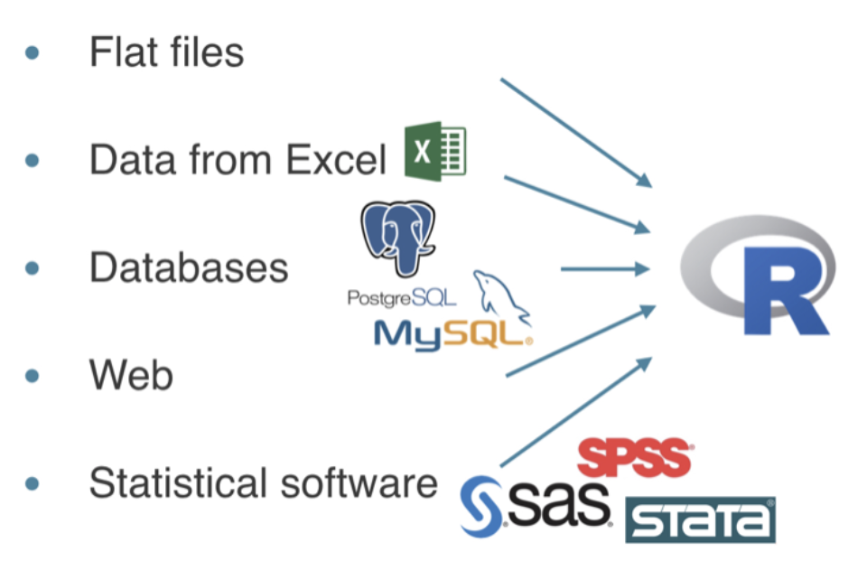
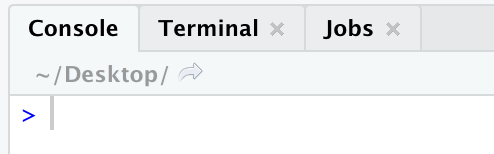

---
```{r setup, include=FALSE}
knitr::opts_chunk$set(echo = TRUE, error=FALSE, warning = FALSE, message = FALSE)
```

### Импорт данных

До этого момента мы либо создавали какой-то набор данных, либо использовали какие-то встроенные датасеты. В реальной жизни все намного сложнее. Данные нужно откуда-то брать. Прежде чем говорить об источниках данных, давайте дадим определение. **Импорт данных** -- это загрузка в среду R различных данных для последующей работы с ними. Важно понимать откуда мы берём данные. Обычно источником импорта выступают:

<center>
{width=400px}
</center>

1. Обычные файлы (.csv, .txt).
2. Excel (.xlsx, .xls)
3. Базы данных (SQL).
4. Интернет.
5. Статистические пакеты (SPSS, SAS, STATA)

### Директория

Директория -- это место (папка), где находится ваш "проект". То есть там лежит скрипт, данные, картинки и прочее. Когда вы хотите загрузить данные с файлика, вам нужно прописать путь к нему, но если он находится в вашей директории, то можно просто напиать его название.

После загрузки всех необходимых пакетов, нужно узнать в какой директории вы находитесь. Это можно сделать несколькими способами:

1. Текущая директория написана в консоли.



2. C помощью функцию `getwd()`.

Зачастую, у каждого проекта своя директория, поэтому приходится часто их менять. Есть несколько способов это сделать:

1. Использовать функция `setwd("~/Desktop/R")`, где в кавычках можно прописать путь к директории.
2. На панели R нажать кнопку *Session* и в выпадающем списке выбрать *Set Working Directory*. После чего вы можете выбрать нужную папку.
3. В нижнем правом окошке есть вся файловая система компьютера, где так же удобно можно установить нужную директорию. Нажав кнопку *More*, можно перейти в текущую директорию или установить новую.

Я рекомендую именно второй способ, потому что он быстрее , и вам не нужно знать путь. Чтобы проверить, что вы находитесь в нужной директории можно использовать функцию `dir()`. Она показывает все объекты которые находятся в директории. 

### Импорт файлов с расширениями csv, txt и другими

#### Функция read.csv()

Формат *.csv* самый распространенный формат хранения данных в мире для анализа данных. Его можно получить, например, сохранив *excel* файл в формате *csv(разделитель - запятая)*. Перед тем как подгружать файл, нужно открыть файл в текстовом редакторе и посмотреть его структуру. Нужно обратить внимание на:

1. Наличие шапки (то есть имеются ли названия столбцов).
2. Тип разделителя (чем отделены друг от друга переменные).

Если вы часто работаете в разных директориях, советую прописать путь к файлу в отдельную переменную `path`. Для этого можно использовать функцию `file.path(‘~’, ‘data’, ‘data.csv’)`, но все таки лучше копировать путь из свойств файла. Также важно отметить про то, что *Windows* ставит слэш в обратную сторону. 

Давайте разберем функцию `read.csv()`. Можно вызвать справку и узнать об этой функции побольше. 

```{r eval=FALSE}
?read.csv
```

Можно увидеть, что у этой функции достаточно много аргументов. Давайте посмотрим только на те, которые нам нужны.

> `read.csv(path, header = TRUE, sep = ",", stringAsFactors = TRUE, dec = '.')`

Аргументы (дефолтное значение):

* `path` -- путь к файлу
* `header` (`TRUE`) -- есть ли в файле наименования столбцов
* `sep` (`','`) -- разделитель между переменными
* `stringAsFactors` (`TRUE`) -- сделать ли столбец строковых переменных в факторный
* `dec` (`'.'`) -- разделитель для числовых переменных (точка или запятая)

У нас есть файлик *friends.csv*. Попробуем подгрузить его.

##### Попытка №1

А давайте просто укажем файл и забьем на все эти параметры.

```{r}
data <- read.csv('data/friends.csv')
data
str(data)
```

R неправильно прочитал файл. Он думает, что у нас есть всего два столбца. Почему так вышло? Если открыть файл в текстовом редакторе, то можно увидеть, что разделителем между переменными является `";"`.

##### Попытка №2

Теперь мы поняли свою ошибку. Давайте её исправим

```{r}
data <- read.csv('data/friends.csv', sep = ';')
data
str(data)
```

Ой! У нас всего 3 наблюдения, хотя было 4. Это произошло, так как первая строчка стала названием столбцом. Почему так вышло? Давайте исправим это.

##### Попытка №3

```{r}
data <- read.csv('data/friends.csv', sep = ';', header = FALSE)
data
str(data)
```

Если взглянуть на данные, то кажется, что всё прекрасно. Но это не так!

1. Попробуйте вытащить любое число и провести с ним какую-нибудь операцию.
2. Данные без названия столбцов -- это не данные.
3. Хотелось бы, чтобы все переменные считывались как строковые, а не факторные.

##### Попытка №4

Попробуем сделать всё так, как нужно!

```{r}
data <- read.csv('data/friends.csv', sep = ';', header = FALSE, 
                 dec = ',', stringsAsFactors = FALSE, 
                 col.names = c('Name', 'Age', 'Gender', 'Birthday', 'Homework grade'))
data
str(data)
```

Все выглядит почти идеально. Изменим тип переменной *Gender* на факторный, а также переменную *Birthday* на дату.

```{r message=FALSE}
# install.packages('lubridate')
library(lubridate)
data$Birthday <- dmy(data$Birthday)
data$Gender <- factor(data$Gender)
str(data)
```

Если вы хотите использовать разделитель `;`, то можно использовать функцию `read.csv2`, которая использует этот разделитель по умолчанию, а также `dec = ","`.

Иногда бывают данные, где столбец это год. Например, у вас есть временной ряд за 1960 - 1976 года. Писать название каждого столбца утомительно. Можно воспользоваться функцией `paste0`.

```{r}
paste0("year_", 1960:1976)
```

Помним, что обычный *data frame* не терпит пробелов в названиях переменных. Можно ставить нижнее подчеркивание (`_`).

#### Функция read.delim() и read.table()

Нужно сказать сначала то, что функции `read.delim` и `read.csv` это дочерние функции от функции `read.table`. Как мы уже убедились `read.csv` создан для файлов с расширением csv. А вот `read.delim` создан для файлов с расширением *.txt*. Если у вас есть какое-то другое расширение, то вы можете использовать `read.table` с нужными вам параметрами.

#### Функция read.delim()

`/t` -- знак табуляции (один из видов разделителей). В `read.delim` он используется по умолчанию.

```{r}
data <- read.delim('data/friends.txt', dec = ',', header = FALSE, 
                   stringsAsFactors = FALSE, 
                   col.names = c('Name', 'Age', 'Gender', 'Birthday', 'Homework grade'))
data
str(data)
```

Аналогично есть функция `read.delim2`.

#### Функция read.table()

Если открыть файл `friends2.txt` можно увидеть, что разделитель это слэш (`/`). С помощью `read.table` мы можем задать нужный нам разделитель.

```{r}
data <- read.table('data/friends2.txt', sep = '/', dec = ',', 
                   header = FALSE, stringsAsFactors = FALSE, 
                   col.names = c('Name', 'Age', 'Gender', 'Birthday', 'Homework grade'))
data
str(data)
```

### Пакет readr

#### Установка и чтение пакетов

Давайте для начала установим и прочитаем пакет, а также пакет `dplyr`.

```{r message=FALSE}
#install.packages('readr')
# install.packages("dplyr")
library(readr)
library(dplyr)
```

#### Плюсы пакета и основые функции

Зачем нам вообще этот пакет, ведь мы умеем читать файлы с расширением *.csv*, *.txt* и их разновидностями?. 

Плюсы:

1. **Самое главное:** сами понимают как устроен файл. Не нужно вводить все эти аргументы.
2. Работают быстрее (примерно в 10 раз).
3. Создают *tibble-frame*, а не *data frame*.
4. Более оптимален. С ним будет меньше проблем.
5. Имеет интерактивную полосу, чтобы понимать, сколько нам еще ждать. Это становится актуально, когда файл весит много.

Здесь важно использовать определенную функцию для определенного разделителя. Мы рассмотрим функции `read_csv()` и `read_csv2()`. 

Давайте попробуем подгрузить файл, который подгружали ранее.

```{r}
data <- read_csv2('data/friends.csv', 
                  col_names = c('Name', 'Age', 'Gender', 'Birthday', 'Homework grade'))
glimpse(data)
```

Все получилось! Видим, что оценка за ДЗ подгрузилась как число. Аргумент `col_names` может принимать значение `FALSE`, если у нас нет названий переменных.

Изучим 2 новых аргумента:

* `comment` -- знак комментария в файле
* `skip` -- количество строк, которые нужно пропустить

```{r}
data <- read_csv2('data/friends2.csv', comment = '#', 
                  col_names = c('Name', 'Age', 'Gender', 'Birthday', 'Homework grade'))
```

Или можно просто пропустить 1 строку.

```{r}
data <- read_csv2('data/friends2.csv', skip = 1,
                  col_names = c('Name', 'Age', 'Gender', 'Birthday', 'Homework grade'))
```

Функции этого пакета определяют тип переменных в столбце следующим образом: они берут первые 1000 наблюдений и используют к нему функцию `guess_parser`, которая определяет к какому типу относится переменная. 

ПРО ЭТУ ФУНКЦИЮ, НЕМНОГО ПРИМЕРОВ

#### Скорость работы

Давайте проверим сокрость этого пакета. С помощью функции `Sys.time()` будем измерять время загрузки файла. Будем использовать файл *nir.csv*. В нем имеются данные о российских корпоративных облигациях. Весит этот файл 50 мегабайт. Это средний размер файла, но уже здесь мы почувствуем разницу.

Посчитаем время использования функции `read.csv()`:

```{r}
start <- Sys.time()
data <- read.csv('data/nir.csv')
finish <- Sys.time()

print(finish-start)
```

Видим приблизительно `r round(print(finish-start),2)` секунды. Представьте, что вы меняете и запускаете код постоянно. Хотелось бы, чтобы загрузка занимала меньше времени.

Теперь посчитаем время использования аналогичной функции `read_csv()` из пакета `readr`:

```{r}
start <- Sys.time()
data <- read_csv2('data/nir.csv')
finish <- Sys.time()

print(finish-start)
```

Время уменьшилось до `r round(print(finish-start),2)` секунд!

#### Проблемы больших файлов

В больших файлах иногда бывают проблемы. Например, первые 1000 значений `NA`. А с 1001 идут вещественные числа. Столбцу дадут тип `logical`. Можно увеличить количество значений с помощью аргумента `guess_max`. 

ПРИМЕР И СКАЗАТЬ,ЧТО ЕСЛИ МНОГО ПРОБЛЕМНЫХ МЕСТ, ТО ЛУЧШЕ ВСЕ ПЕРЕМЕННЫЕ ПРОЧИТАТЬ КАК СТРОКОВЫЕ ИЛИ КАКИЕ-ТО ОПРЕДЕЛЕННЫЕ

Можно увидеть, что появились предупреждения. Это связано с проблемой описанной выше. Эту проблему можно исправить с помощью парметра `col_types`.

```{r}
data <- read_csv2('data/nir.csv', col_types = cols(
                                YLD_YTM_MID = col_double() ,
                                YLD_CNV_MID = col_double()
                  ))
```


#### Пропущенные значения

```{r}
# в readr na = c("", "NA")  # можно увеличить этот параметр
# # Filter rows where showstopper is UNKNOWN 
# bakeoff %>% 
#   filter(showstopper == "UNKNOWN")
# 
# # Edit to add list of missing values
# bakeoff <- read_csv("bakeoff.csv", skip = 1,
#                     na = c("", "NA", "UNKNOWN"))
# 
# # Filter rows where showstopper is NA 
# bakeoff %>% filter(is.na(showstopper))
```


#### Подгрузка файлов из интернета

read_csv(url)

#### Экспорт данных

write_csv

### Пакет rio


```{r}
#   когда read_csv рассказать как работает parse
# # Find format to parse uk_airdate 
# parse_date("17 August 2010", format = "%d %B %Y")
# 
# # Edit to cast uk_airdate
# desserts <- read_csv("desserts.csv", 
#                      col_types = cols(
#                        uk_airdate = col_date(format = "%d %B %Y")
#                      )
# )
# 
# # Arrange by descending uk_airdate
# desserts %>% 
#   arrange(desc(uk_airdate))  
```

```{r}
# ### ИМПОРТ
# ---
# df2 <- read.csv("example3.csv", encoding = "UTF-8")
# df2 <- read.csv("example4.csv", encoding = "WINDOWS-1251")
# ---
# примеры для импорта
# https://www.dropbox.com/s/8xc2zfb70aauc3t/data-l3.zip?dl=0&file_subpath=%2Fdata-l3
```

```{r}
#   # Edit code to fix the parsing error 
#   desserts <- read_csv("desserts.csv",
#                        col_types = cols(
#                          uk_airdate = col_date(format = "%d %B %Y"),
#                          technical = col_number()
#                        ),
#                        na = c("", "NA", 'N/A') 
#   )
# 
# # View parsing problems
# problems(desserts)
```

