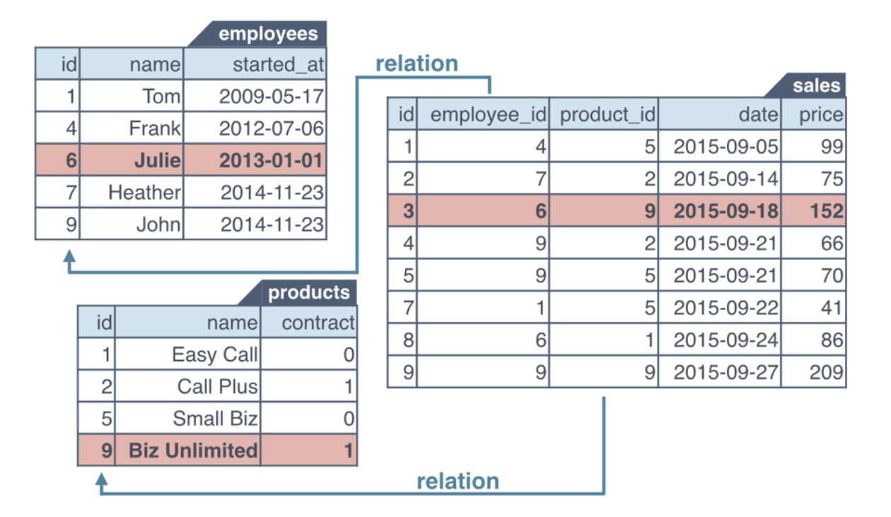
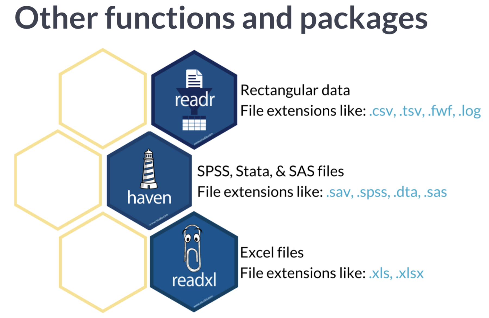

---
```{r setup, include=FALSE}
knitr::opts_chunk$set(echo = TRUE, error=TRUE, warning = FALSE, message = FALSE)
```

### Работа с файлами Excel

Многие пакеты в R взаимодействуют с Microsoft Excel.

#### Пакет readxl

Для начала установим и загрузим пакет `readxl`.

```{r}
#install.packages('readxl')
library('readxl')
```

Рассмотрим 2 функции в этом пакете:

1. `excel_sheets`
2. `read_excel`

##### Функция excel_sheets()

Пропишем один раз путь к файлу для удобства:

```{r}
path = '/home/ahmedushka/GitHub/R/docs/scripts/semester_2_data_analysis/sem_2/exchange_rate.xlsx'
```

У функции excel_sheets() на вход идёт один аргумент: путь к файлу. Если файл находится в директории, то его название.

\[
excel\_sheets("data.xlsx"")
\]

Данная функция показывает нам какие листы есть в нашем excel файле. Это очень удобно: поонять структуру excel файла.

```{r}
excel_sheets(path)
```

##### Функция read_excel()

У этой функции есть 1 обязательный аргумент: путь к файлу. Посмотрим, что сделает функция, когда у нас имеется 2 листа.

\[
data <- read\_excel("data.xlsx", sheet = "my\_sheet")
\]


```{r}
data_1 <- read_excel(path)
head(data_1)
```

Как мы видим данная функция импортировала нам только 1-ый лист. Чтобы подгрузить какой-то другой лист используем необязательный аргумент sheet.

```{r}
data_2 <- read_excel(path, sheet = 2)
head(data_2)
data_2 <- read_excel(path, sheet = "EUR")
head(data_2)
```

Чтобы удобно хранить все листы в одном месте, можно использовать функцию `list`:

```{r}
data <- list(data_1, data_2)
str(data)
```

##### Комбинируем функции excel_sheets() и read_excel() с помощью lapply()

Представьте, что у вас есть файл, в котором 10 листов. Писать 10 строчек с подгрузкой каждого листа это нудно. Но у нас есть функция `lapply`!

```{r}
data <- lapply(excel_sheets(path), read_excel, path = path)
str(data)
```

##### Более детально разберёмся с read_excel()
На самом деле у функции `read_excel` есть и другие аргументы:

\[
data <- read\_excel("data.xlsx", sheet = "my\_sheet", col_names = TRUE, col_types = NULL, skip = 0)
\]

1. `col_names` - есть ли названия столбцов в excel файле (попробовать поставить `FALSE`) или можно сразу их задавать `col_names = c('Name', 'Population')`.
2. `col_types` - можем вручную задавать тип переменных в столбце(например: `col_types('text', 'text')`.
3. `skip` - пропускает какое-то количество строк. Если используем, то нужно указать название столбцов или `FALSE`.

#### Пакет gdata

Для начала подгрузим пакет:

```{r}
#install.packages('gdata')
library('gdata')
```

##### Функция read.xls()

Схемка как это работает через read.csv()

Файл с расширением *.xls — это формат всех файлов версии Excel 2003 и раньше. Он имеет меньше возможностей, работает медленнее.

Файл с расширением *.xlsx — это формат подавляющего большинства файлов Excel на настоящий момент, используется начиная с версии Microsoft Office 2007.

```{r}
data <- read.xls(path)
```

Работает через read.csv , следовательно параметры такие же как и там:

```{r}
data <- read.xls(path, sheet = 2,
                      skip = 50, header = FALSE, stringsAsFactors = FALSE,
                      col.names = c('Date', 'USD/RUB'))
```

### Пакет XLConnect

Особенности пакета:

1. Работа в excel через R.
2. Мост между R и excel.
3. Поддержка xls и xlsx.
4. Простой функционал
5. Можно записывать формулы Excel.

Чтобы пользоваться возможностями данного пакета, нужно уставновить [Java](https://www.java.com/en/download/manual.jsp).

```{r , include=FALSE}
knitr::opts_chunk$set(eval = FALSE)
```

Установим пакет:
```{r}
# install.packages("XLConnect")
library("XLConnect")
```

#### Функция loadWorkbook()

Эта функция создаёт "мост" между файлом Excel и R.

```{r}
book <- loadWorkbook(path)
str(book)
print(class(book))
```

#### Функция getSheets()

Показывает список листов в файле.

```{r}
getSheets(book)
```

#### Функция readWorksheet

Импортирует определенный лист

```{r}
readWorksheet(book, sheet = 2)
```

Краткая инструкция:

```{r}
my_book <- loadWorkbook("urbanpop.xlsx")
sheets <- getSheets(my_book)
all <- lapply(sheets, readWorksheet, object = my_book)
str(all)
# startCol и endCol:(ПОДГРУЗКА ОПРЕДЕЛЕННЫХ СТОЛБЦОВ)
urbanpop_sel <- readWorksheet(my_book, sheet = 2, startCol = 3, endCol = 5)
```

#### Изменение листов

Предположим у нас есть новые данные. Пусть пока будет cars.

#### Функция createSheet()

Создаем лист в нашем файле Excel:

```{r}
book <- loadWorkbook(path)
createSheet(book, name = 'cars')
```

#### Функция writeWorksheet()

Заполняет наш лист.

```{r}
book <- loadWorkbook(path)
createSheet(book, name = 'cars')
writeWorksheet(book, cars, sheet = "cars")
```

#### Функция saveWorkbook()

Сохраняет наши изменения:

```{r}
book <- loadWorkbook(path)
createSheet(book, name = 'cars')
writeWorksheet(book, cars, sheet = "cars")
saveWorkbook(book, file = "exchange_rate2.xlsx")
```

#### Функция renameSheet()

Меняет название листов в Excel:

```{r}
renameSheet(book, 'cars', 'Данные о машинках')
saveWorkbook(book, file = "exchange_rate3.xlsx")
```

#### Функция removeSheet()

Удаляет лист в Excel:

```{r}
removeSheet(book, sheet = 'Данные о машинках')
saveWorkbook(book, file = "exchange_rate4.xlsx")
```


### Базы данных SQL

#### Подключение и базовые функции

Есть много пакетов для работы с базами данных:

* *MySQL*: пакет `RMySQL`
* *PostgresSQL*: пакет `RPostgresSQL`
* *Oracle*: пакет `ROracle`

Эти пакеты -- это реализации. Нужен так же пакет `DBI`, который будет являться "интерфейсом". Если установить пакет `RMySQL`, то установится и пакет `DBI`.

```{r}
# install.packages('RMySQL')
library(RMySQL)
```

В первую очередь нужно подключиться к базе данных, то есть создать соединение с ней. Давайте подключимся к учебной базе данных, которую предоставляет Datacamp.

```{r}
con <- dbConnect(RMySQL::MySQL(), # тип базы данных
                 dbname = "company", 
                 host = "courses.csrrinzqubik.us-east-1.rds.amazonaws.com", 
                 port = 3306,
                 user = "student",
                 password = "datacamp")
con
```

Прежде чем работать с таблицами, давайте посмотрим какие доступны нам.

```{r}
dbListTables(con)
```

<center>

</center>

А теперь прочитаем табличку `employees`.

```{r}
dbReadTable(con, "employees")
```

Можно также создавать и удалять таблички. Или изменять текущие, но мы сейчас говорим об импорте. 

Хорошим тоном является закрытие соединения с базой данных.

```{r eval=FALSE}
dbDisconnect(con)
```

#### Запросы

Подгружать такую маленькую табличку очень удобно, но что если у нас миллионы наблюдений? Нам скорее не нужна вся табличка, а нужна какая-то часть. Можно выгрузить часть информации с помощью запросов.

Допустим, мы хотим получить имена работников, которые начали работать после первого сентября 2012 года. Сделаем соответсвующий запрос.

```{r}
dbGetQuery(con, "SELECT name FROM employees WHERE started_at > '2012-09-01' ")
```

Попробуем еще один запрос.

```{r}
dbGetQuery(con, "SELECT * FROM products WHERE contract=1")
```

Также имеются функции `dbSendQuery()`,`dbFetch()` и ` dbClearResult()`. С помощью которых можно извлекать данные кусками.

### SPSS, STATA и SAS

#### STATA

Для загрузки файлов STATA (файлы с расширением *.dta*) потребуется библиотека `foreign`.

```{r eval=FALSE}
# install.packages("foreign")
library(foreign)
```

Теперь загрузим dta-файл.

```{r}
stata_data <- read.dta("example.dta")
```

#### SPSS

Для загрузки файлов SPSS (файлы с расширением *.sav*) потребуется библиотека `Hmisc`.

```{r}
# install.packages("Hmisc")
library(Hmisc)
```

Загрузим sav-файл.

```{r eval=FALSE}
sav_data <- spss.get("example.sav")
```

### Еще немного пакетов для импорта



1. `data.table` - функция `fread` еще быстрее пакета `readr`.
2. `haven` - читает файлы приложений SPSS, Stata и SAS.
3. `DBI` - позволяет взаимодействовать с базами данных.
4. `jsonlite` - для работы с форматом JSON.
5. `xml` - для работы с форматом XML.
6. `rio` - для работы с огромным типом файлов.