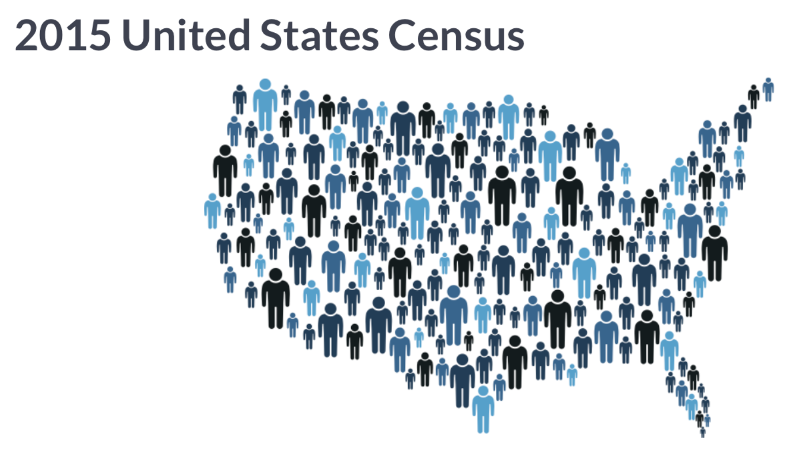

---
```{r setup, include=FALSE}
knitr::opts_chunk$set(echo = TRUE, message = FALSE, warning = FALSE)
```

Установим и подгрузим пакеты.

```{r}
# install.packages('readr')
# install.packages('dplyr')
# install.packages('ggplot2')
library(readr)
library(dplyr)
library(ggplot2)
```

### Задание №1

Будем работать с файликом *counties.rds*. Формат *.rds* это формат данных для R, который сохраняет ваш *df* в том виде, в котором вы его видели. Его очень легко подгрузить с помощью функции `read_rds()`.

```{r}
counties <- read_rds('data/counties.rds')
```

<center>

</center>

Этот набор данных, сформированный после переписи населения США в 2015 году.

Немножко информации о некоторых переменных:

* `state` -- название штата США (всего 50)
* `county` -- округ штата
* `region` -- регион
* `metro` -- есть ли метро
* `population` -- количество жителей
* `men` -- количество мужчин
* `women` -- количество женщин
* `unemployment` -- процент безработицы
* `land area` -- площадь округа
* `private_work`, `public_work`, `self_employed`, `family_work` -- процент работающих на частные компании, на государство, на себя и процент работающих в семейном бизнесе
* `employed` -- частный предприниматель
* `income` -- доход
* `walk` -- количество граждан (в %), которые ходят на работу пешком

* Сколько наблюдений и переменных в нашем наборе данных? Что является наблюдением? Какое первое значение в переменной `income`?

```{r}
glimpse(counties)
```

* Отберите наблюдения только для штатов `California`.

```{r}
counties %>%
  filter(state == 'California')
```

* Отберите наблюдения только для штатов `California` и `Florida`.

```{r}
counties %>%
  filter(state == 'California' | state == 'Florida')
```

* Отберите наблюдения только для штатов `California`, `Florida`, `Alabama` и `Indiana`.

```{r}
counties %>%
  filter(state %in% c('California', 'Florida', 'Alabama', 'Indiana'))
```

* Отберите округа с количеством населения не меньше 20000 только для штатов `California`, `Florida`, `Alabama` и `Indiana`.

```{r}
counties %>%
  filter(state %in% c('California', 'Florida', 'Alabama', 'Indiana'), population >= 20000) 
```

* Отберите все округа кроме округов штата `California`.

```{r}
counties %>%
  filter(state != 'California') 
```

* Отсортируйте в алфавитном порядке названия штатов.

```{r}
counties %>%
  arrange(state)
```

* Отсортируйте в алфавитном порядке названия штатов и округов.

```{r}
counties %>%
  arrange(state, county)
```

* Отсортируйте округи в порядке убывания численности населения. Какой штат и округ имеют наибольшую численность населения?

```{r}
counties %>%
  arrange(desc(population))
```

* Отберите переменные `state`, `county`, `population` и  `unemployment`.

```{r}
counties %>% 
  select(state, county, population, unemployment)
```

* Отберите переменные `state`, `county`, `region`, `metro`, `population`, `men` и `women`.

```{r}
counties %>% 
  select(state:women)
```

* Отберите переменные `state`, `county`, `region`, `population`, `men` и `women`.

```{r}
counties %>% 
  select(state:women, -metro)
```

* Создать переменную `unemployed_population`, которая показывает количество безработного населения.

```{r}
counties %>%
  mutate(unemployed_population = population * unemployment / 100) 
```

* Создать логическую переменную `pop_1kk`, которая отвечает на вопрос: "Проживает ли в округе более 1000000 человек?"

```{r}
counties %>%
  mutate(pop_1kk = population > 1000000) 
```

* В каком штате и каком округе больше всего (в %) люди работают на частные компании?

```{r}
counties %>%
  select(state, county, population, private_work) %>%   
  arrange(desc(private_work))
```

* Найти все округа, где количество населения превышает 1000000 и отсортировать их по убыванию.

```{r}
counties %>%
  select(state, county, population) %>% 
  filter(population > 1000000) %>%
  arrange(desc(population))
```

* Найти все округа штата **California**, где количество населения превышает 1000000 и отсортировать их по убыванию.

```{r}
counties %>%
  select(state, county, population) %>% 
  filter(state == 'California', population > 1000000) %>%
  arrange(desc(population))
```

* Вывести все округа штата **Texas**, где население превышает 10000, и отсортировать их по убыванию количества работающих на частные компании.

```{r}
counties %>%
  select(state, county, population, private_work) %>% 
  filter(state == 'Texas', population > 10000) %>% 
  arrange(desc(private_work))
```

* Показать округи в порядке убыванию по количеству доли женщин в населении.

```{r}
counties %>%
  select(state, county, population, women) %>%
  mutate(proportion_women = women / population) %>%
  arrange(desc(proportion_women))
```

* Показать округи в порядке убыванию по количеству доли мужчин в населении только для округов, где живет по крайней мере 10000 человек.

```{r}
counties %>%
  select(state, county, population, men) %>%
  mutate(proportion_men = men / population) %>%
  filter(population >= 10000) %>%
  arrange(desc(proportion_men))
```

* Показать сколько округов находится в каждом регионе. Отсортировать по убыванию.

```{r}
counties %>% 
  count(region, sort=TRUE)
```

* Найти наименьшую численность округа, наибольшую безработицу и средний доход по всем округам.

```{r}
counties %>% 
  summarize(min_population = min(population),
            max_unemployment = max(unemployment),
            average_income = mean(income))
```

* Создать переменную плотность населения (`density`) и высчитать ее для каждого штата. Найти штат с наибольшей плотностью.

```{r}
counties %>%
  group_by(state) %>%
  summarize(total_area = sum(land_area),
            total_population = sum(population)) %>%
  mutate(density = total_population/total_area) %>%
  arrange(desc(density))
```

* Найти численность населения каждого штата.

```{r}
counties %>%
  group_by(state) %>%
  summarize(total_pop = sum(population))
```

* Проверить, находится ли какой-то штат в нескольких регионах.

```{r}
counties %>%
  group_by(state) %>%
  summarize(n_region = n_distinct(region))
```

* Найти среднее и медианное значени численности штата для каждого региона.

```{r}
counties %>%
  group_by(region, state) %>%
  summarize(total_pop = sum(population)) %>%
  group_by(region) %>%
  summarize(average_pop = mean(total_pop),
            median_pop = median(total_pop))
```

* Вывести 2 самых больших округа по количеству населения (в %), которое ходит пешком до работы, для каждого региона.

```{r}
counties %>%
  group_by(region) %>%
  top_n(2, walk) 
```

* Найти штат с наибольшим средним доходом для каждого региона.

```{r}
counties %>%
  group_by(region, state) %>%
  summarize(average_income = mean(income)) %>%
  top_n(1)
```

### Задание №2

Будем работать с файлом *babynames.rds*. Давайте подгрузим его.

```{r}
babynames <- read_rds('data/babynames.rds')
```

Этот датасет показывает количество детей, которым дали определенное имя в определенный год.

```{r}
glimpse(babynames)
```

* За какой период времени имеются наблюдения?

```{r}
range(babynames$year)
```

* Нарисовать график: по оси *x* год, по оси *y* количество детей, которые родились в этот год.

```{r}
babynames %>%
  group_by(year) %>%
  summarize(SUM = sum(number)) %>%
  ggplot(aes(year, SUM)) + 
    geom_line()
```

* Давайте увидим что-то интересное. Посмотрим как "Игра Престолов" влияет на ее поклонников. Посмотрим на динамику имя `Arya` и `Emilia`.  

```{r}
babynames %>% 
  filter(name == 'Arya') %>%
  ggplot(aes(x = year, y = number)) +
    geom_line()
```

```{r}
babynames %>% 
  filter(name == 'Emilia', year > 1970) %>%
  ggplot(aes(x = year, y = number)) +
    geom_line()
```

```{r}
babynames_Emilia <- babynames %>% 
                    filter(name == 'Emilia')
MIN <- min(babynames_Emilia$year)
MAX <- max(babynames_Emilia$year)
ggplot(babynames_Emilia, aes(x = year, y = number)) +
  geom_line() +
  theme(axis.text.x = element_text(angle = 90, vjust = 0.5)) +
  scale_x_continuous(breaks = seq(MIN, MAX, 5))
```

* Вывести самое популярное имя за каждый год.

```{r}
babynames %>%
  group_by(year) %>%
  top_n(1, number)
```

* Посмотреть на графики для имен `Steven`, `Thomas` и `Matthew`.

```{r}
selected_names <- babynames %>%
  filter(name %in% c("Steven", "Thomas", "Matthew"))
ggplot(selected_names, aes(x = year, y = number, color = name)) +
  geom_line()
```

* Вывести для каждого имени год, в котором его доля от всех имен была наибольшей.

```{r}
babynames %>%
  group_by(year) %>%
  mutate(year_total = sum(number)) %>%
  ungroup() %>%
  mutate(fraction = number / year_total) %>%
  group_by(name) %>%
  top_n(1, fraction)
```

* Создать колонку, которая будет показывать долю для каждого имени относительно максимального значения для этого имени за весь период.

```{r}
babynames %>%
  group_by(name) %>%
  mutate(name_max = max(number)) %>%
  ungroup() %>%
  mutate(fraction_max = number/name_max)
```
