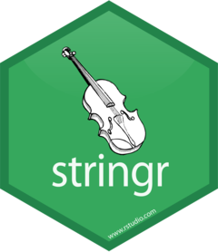

---
```{r setup, include=FALSE}
knitr::opts_chunk$set(echo = TRUE, warning = FALSE, message = FALSE, error = TRUE)
```

## Пакет lubridate

<center>
{width=300px}
</center>


### Введение

Как мы говорили ранее одним из типов переменных является *дата и время*. В R уже встроены основные функции для работы с датами. Это функции `as.Date` и `as.POSIXct`. Ими можно пользоваться, но они уже устарели. Поэтому был создан более функциональный пакет `lubridate` для работы с датами и временем. Он не входит в библиотеку `tidyverse`, поэтому установить и подгружать его нужно отдельно.

### Подгрузка пакета

Также нам понадобится уже знакомый нам пакет `nycglights13` и пакет `dplyr` для работы с данными.

```{r, message=FALSE}
# install.packages('lubridate')
# install.packages('nycflights13')
# install.packages('dplyr')
library('lubridate')
library('nycflights13')
library('dplyr')
```

### Создание переменных

Существует три типа данных, описывающих время:

* дата(`date`) - календарная дата
* время(`time`) - время суток
* дата и время(`dttm/POSIXct`) - календарная дата + время суток

Мы будем говорить только о первом и третьем типе.

С помощью  функций `today` и `now` вы можете получить значения текущей даты или даты и времени.

```{r}
today()
now()
```

Создать переменную даты и времени можно с помощью следующих способов:

* на основе строковой переменной
* на основе индвидуальных компонент даты и времени
* на основе существующего объекта даты и времени

Рассмотрим каждый из них.

#### Создание переменных на основе строк

Этот способ очень часто используется, когда данные поступают в виде строковой переменной. Если вы работаете с датами, то вам нужно лишь определить в какой последовательности идет значение года, месяца и дня. В такой же последовательности нужно расставить буквы `y`,`m` и `d`. Это и будет название функции, на вход которой мы подаем строковую переменную.

```{r}
ymd("2017-01-31")
mdy("January 31st, 2017")
dmy("31-Jan-2017")
```

На вход этим функциям можно подать и числовое значение.

```{r}
ymd(20170131)
```

Чтобы создать переменную даты и времени нужно добавить в имя функции символ нижнего подчеркивания и одну или несколько дополнительных букв `h`, `m` и `s`, которым соответсвуют часы, минуты и секунды.

```{r}
ymd_hms("2017-01-31 20:11:59")
mdy_hm("01/31/2017 08:01")
```

#### Создание переменных на основе отдельных компонент

Иногда вы будете располагать отдельными компонентами даты и времени, предоставленных в нескольких столбцах. Например такой вариант есть в фрейме данных `flights`.

```{r}
flights %>% 
  select(year, month, day, hour, minute)
```

В таком случае можно использовать функцию `make_date` для даты и `make_datetime` для даты и времени.

```{r}
flights %>% 
  select(year, month, day, hour, minute) %>% 
  mutate(departure_dt = make_datetime(year, month, day, hour, minute),
         departure_d = make_date(year, month, day))
```

#### Создание переменных на основе других типов

Иногда возникает необходимость перехода между значениями даты и даты/времени. Для этого можно использовать функции `as_datetime` и `ad_date`. 

```{r}
as_datetime(today())
as_date(now())
```

Иногда ваши исходные значения даты и времени могут быть заданы в виде количество секунд, которое прошло с 1 января 1970 года. В этом случае тоже можно использовать эти функции.

```{r}
as_datetime(60 * 60 * 10)
as_date(365 * 10 + 2)
```

### Компоненты даты и времени

Из переменных даты и времени можно выделять следующие компоненты:

* `year` - год
* `month` - месяц
* `mday` - день месяца
* `yday` - день года
* `wday` - день недели
* `hour` - час
* `minute` - минута
* `second` - секунда

```{r}
datetime <- ymd_hms("2016-07-08 12:34:56")
year(datetime)
month(datetime)
mday(datetime)
yday(datetime)
wday(datetime)
hour(datetime)
minute(datetime)
second(datetime)
```

Передав функциям `month` и `wday` аргумент `label = TRUE`, можно получить сокращенное название месяца или дня недели. Чтобы получить полное название можно задать аргумент `abbr = TRUE`.

```{r}
month(datetime, label = TRUE)
wday(datetime, label = TRUE, abbr = FALSE)
```

Компоненты можно также менять.

```{r}
year(datetime) <- 2020
month(datetime) <- 01
hour(datetime) <- hour(datetime) + 1
```

Все изменения можно произвести за один раз с помощью функции `update`.

```{r}
update(datetime, year = 2020, month = 2, mday = 2, hour = 2)
```

Если значения слишком большие, они переносятся на следующие года, месяцы и так далее.

```{r}
ymd("2015-02-01") %>% 
  update(mday = 30)
ymd("2015-02-01") %>% 
  update(hour = 400)
```

### Временные промежутки

Над датами можно выполнять арифметические операции.

В R при вычитании двух дат вы получаете объект `difftime`.

```{r}
a_age <- today() - ymd(19980505)
a_age
```

Этот объект выводит промежутки, выраженные в секундах, минутах, часах, днях или неделях. Эта неоднозначность можнт несколько затруднять работу с объектами `difftime`. Поэтому лучше использовать функцию `as.duration`, которая приводит все в секунды.

```{r}
as.duration(a_age)
```


## Пакет stringr

<center>
{width=300px}
</center>

### Регулярные выражения

Начнем с простого. Выражение, которое содержится в слове(неважно где).

```{r}
x <- c("apple", "banana", "pear")
str_view(x, "an")
```

Вместо точки(`.`) может быть любой символ, кроме символа перевода строки(`\n`).

```{r}
str_view(x, ".a.")
```

Но если точке соотвествует любой символ, то какому шаблону будет соотвествовать сам символ точки(`.`). В регулярных выражениях для этого используется обратный слеш(`\`). То есть нам `\.`. Но для создания регулярного выражения нужно использовать опять обратный слеш.

```{r}
str_view(c("abc", "a.c", "bef"), "a\\.c")
```

Так называемые якоря:

* `^` to match the start of the string.
* `$` to match the end of the string.

```{r}
x <- c("apple", "banana", "pear")
str_view(x, "^a")
str_view(x, "a$")
```

Используем оба "якоря", чтобы выделить выражения, которые содержат только нужное нам слово.

```{r}
x <- c("apple pie", "apple", "apple cake")
str_view(x, "apple")
str_view(x, "^apple$")
```


* `\d`: совпадает с любой цифрой
* `\s`: совпадает с любым пробельным символом(пробел, символ табуляции(`\t`), перевод строки(`\n`))
* `[abc]`: совпадает с a, b или c
* `[^abc]`: совпадает с любым сиволом, кроме a,b или c


## Пакет forcats

<center>
{width=300px}
</center>