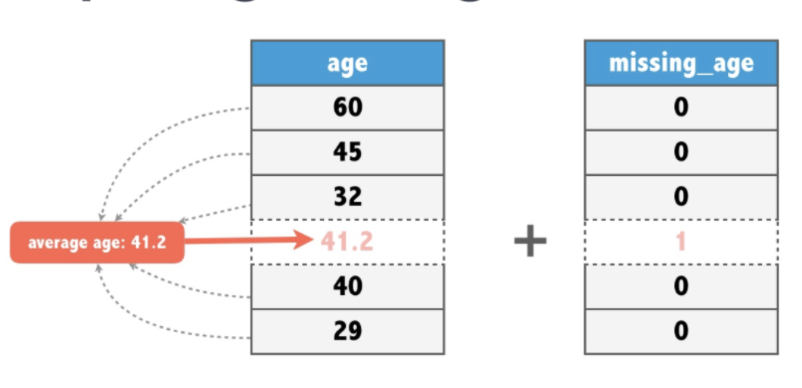

---
```{r setup, include=FALSE}
knitr::opts_chunk$set(echo = TRUE, warning = FALSE, message = FALSE)
```

### Пропущенные значения

С самого первого занятия мы с вами говорили про пропущенные значения. В R они отображаются как `NA`. В реальных данных часто приходится сталкиваться с ними. Например, если проводить опрос людей, то некоторые не захотят говорить о своей заработной плате. Это и есть пропущенное значение. 

### Базовая работа с пропущенными значениями

Мы уже знаем функцию `is.na`. Она выдает логический ответ на вопрос: "Является ли значение пропущенным?". Она может работать с массивами.

```{r}
x <- c(1, NA, 3, NA, NA, 5)
is.na(x)
```

Но есть и другие инструменты. Они находятся в пакете `naniar`. Давайте установим и подгрузим его и остальные пакеты.

```{r}
# install.packages("naniar")
library(naniar)
library(tidyr)
library(dplyr)
```

Наши переменные в наборе данных это массивы. И всегда хочется узнать, есть ли пропущенные значения в этой переменной. Для этого можно использовать функцию `any_na`. Она выдает логический ответ на вопрос: "Есть ли в массиве пропущенные значения?"

```{r collapse=TRUE}
any_na(x) 
y <- 1:5
any_na(y)
```

Если пропущенные значения есть, то хотелось бы знать их количество, а лучше долю.

```{r collapse=TRUE}
n_miss(x) 
prop_miss(x)
```

`NaN` считается пропущенным значением, а бесконечность `Inf` не считается. 

```{r collapse=TRUE}
any_na(NaN)
any_na(Inf)
```

Будет использовать функцию для генерации массива с пропущенными значениями.

```{r}
generate <- function(prop_na, len = 1000){
  x <- round(seq(-100, 100, length.out = len), 4)
  n <- length(x)
  y <- sample(c(NA, x), size = len, replace = TRUE, prob = c(prop_na, rep((1-prop_na)/n, n)))
  return(y)
}
```

Сгенерим набор данных с 3 переменными.

```{r}
df <- tibble(x = generate(0.05),
             y = generate(0.07),
             z = generate(0.02))
```

С помощью функции `n_miss` можно узнать количество пропущенных значений во всем наборе данных или в отдельной переменной.

```{r collapse=TRUE}
n_miss(df)
n_miss(df$x)
```

Обратная функция `n_complete` показывает сколько значений у нас есть о всем наборе данных или в отдельной переменной.

```{r collapse=TRUE}
n_complete(df)
n_complete(df$x)
```

А функции `prop_miss` и `prop_complete` показывают долю пропущенных и имеющихся значений.

```{r collapse=TRUE}
prop_miss(df)
prop_complete(df)

prop_miss(df$x)
prop_complete(df$x)
```

### Различные статистики для пропущенных значений

Не хотелось бы использовать эти функции в случае, когда у нас много переменныех. Есть готовые решения для этого. Функция `miss_var_summary` показывает статистику для переменных, а функция `miss_case_summary` для наблюдений. Давайте попробуем эти функции на датасете `airquality` из пакета `naniar`.

```{r}
glimpse(airquality)
```

Функция `miss_var_summary` выдает *tibble- фрейм* в котором есть переменные:

* `variable` -- переменная
* `n_miss` -- количество пропущенных значений 
* `pct_miss` -- процент пропущенных значений

Такой фрейм отсортирован по столбцу `n_miss`.

```{r}
miss_var_summary(airquality)
```

Функция `miss_case_summary` выдает *tibble- фрейм* в котором есть переменные:

* `case` -- номер наблюдения
* `n_miss` -- количество пропущенных значений 
* `pct_miss` -- процент пропущенных значений

Такой фрейм так же отсортирован по столбцу `n_miss`.

```{r}
miss_case_summary(airquality)
```

Эти функции можно применять с pipe'ом (`%>%`).

```{r}

airquality %>% 
  group_by(Month) %>% 
  miss_var_summary() 

airquality %>% 
  group_by(Month) %>% 
  miss_case_summary()
```

Функции `miss_var_table` и `miss_case_table` дают более общую информацию. Например, первая показывает количество переменных, в которых нет пропущенных значений или есть определенное количество.

```{r}
miss_var_table(airquality)
miss_case_table(airquality)
```

Эти функции так же можно использовать с pipe'ом (`%>%`).

```{r}
airquality %>% 
  group_by(Month) %>% 
  miss_var_table()

airquality %>% 
  group_by(Month) %>% 
  miss_case_table()
```

Также есть функции `miss_var_span` и `miss_var_run`, которые можно изучить дополнительно.

### Визуализация пропущенных значений

#### Функция vis_miss

Эта функция позволяет в прямом смысле посмотреть на ваши данные и на пропущенные значения.

```{r}
vis_miss(airquality)
```

Чтобы как-то сгрупиировать пропущенные значения можно установить параметр `cluster`.

```{r}
vis_miss(airquality, cluster = TRUE)
```

Попробуем использовать эту функцию на датасете `riskfactors`, в котором больше переменных.

```{r}
vis_miss(riskfactors)
vis_miss(riskfactors, cluster = TRUE)
```

Можно так же отсортировать столбцы по количеству пропущенных значений с помощью параметра `sort`.

```{r}
vis_miss(riskfactors, cluster = TRUE, sort = TRUE)
```

#### Функции gg_miss_var и gg_miss_case

Эти функции показывают наглядно количество пропущенных значений в виде гистограмм.

```{r}
gg_miss_var(airquality)
gg_miss_case(airquality)
```

С помощью параметра `facet` можно посмотреть эти графики в разрезе группы.

```{r}
gg_miss_var(airquality, facet = Month)
```

#### Функции gg_miss_upset и gg_miss_fct 

Функция `gg_miss_upset` показывает количество пропущенных значений для различных комбинаций переменных.

```{r}
gg_miss_upset(airquality)
gg_miss_upset(riskfactors)
```

Функция `gg_miss_fct` позволяет увидеть в каких группах и по каким переменным пропущенных значений больше.

```{r}
gg_miss_fct(x = airquality, fct = Month)
gg_miss_fct(x = riskfactors, fct = marital)
```

### Что делать с пропущенными значениями

Рассмотрим разные случаи при работе с пропущенными значениями. 

#### Cлучай №1

Сгенерим набор данных, в котором будет один столбец иметь много пропущенных значений.

```{r}
df <- tibble(x = generate(0),
             y = generate(0),
             z = generate(0.7))

```

C помощью функции `miss_var_summary` и `vis_miss` посмотрим какие переменные имеют пропущенные значения.

```{r}
miss_var_summary(df)
vis_miss(df, cluster = TRUE)
```

Видно, что в переменной `z` $70.2$% значений пропущены. В таких ситуациях лучше удалить всю такую переменную.

```{r}
df <- df %>%
        select(-z)
```

#### Cлучай №2

Сгенерим набор данных, в котором будет небольшое количество пропущенных значений во всех переменных.

```{r}
df <- tibble(x = generate(0.05),
             y = generate(0.07),
             z = generate(0.02))
```

C помощью функции `miss_var_summary` и `vis_miss` посмотрим какие переменные имеют пропущенные значения.

```{r}
miss_var_summary(df)
vis_miss(df, cluster = TRUE)
```

В данному случае удалять переменные не логично. Можно удалить переменные, которые содержат пропущенные значения. Найдем количество таких наблюдений с помощью функции `miss_case_summary`.

```{r}
miss_case_summary(df) %>%
  filter(n_miss > 0) %>%
  count()
```

Таких наблюдений 131. Удалим их все с помощью  функции `drop_na` из пакета `dplyr`.

```{r}
df <- df %>%
        drop_na()
```

#### Cлучай №3

В прошлом случае мы удалили 131 наблюдение. Данные очень ценный ресурс для построения моделей, поэтому нужно стараться не удалять их. Но для этого нужно заменить пропущенные значения какими-то дуругими значениями.

#### Замена средним

```{r}
df <- tibble(x = generate(0.5, 10),
             y = generate(0.3, 10))
df

df$x %>% mean(na.rm = TRUE)
df$x %>% impute_mean()
df %>% impute_mean_if(is.numeric)
df %>% impute_mean_at('x')
df %>% impute_mean_all()
```

#### Замена медианой

```{r}
df$x %>% median(na.rm = TRUE)
df$x %>% impute_median()
df %>% impute_median_if(is.numeric)
df %>% impute_median_at('x')
df %>% impute_median_all()
```

#### Индикатор пропущенной переменной

Если мы заменяем пропущенное значение средним или медианой, мы в какой-то степени ошибаемся, так как истинное значение могло быть совершенно другим. Чтобы это не мешало модели, можно ввести переменную-индикатор, которая будет равняться 1, если значение заменено.



Можно использовать следующую функцию.

```{r}
ImputeInd <- function(df, strategy = 'mean', column){
  if (strategy == 'mean') {
    df1 <- df %>%
      add_label_missings(column, missing = 1,
                         complete = 0) %>%
      rename(!!paste0(column, '_IND', sep = ''):=any_missing) %>%
      impute_mean_at(column)
    return(df1)
  }
  if (strategy == 'median') {
    df1 <- df %>%
      add_label_missings(column, missing = 1,
                         complete = 0) %>%
      rename(!!paste0(column, '_IND', sep = ''):=any_missing) %>%
      impute_median_at(column)
    return(df1)
  }
  stop('Введите правильно стратегию!')
}
```

Можно использовать даже с *pipe* :)

```{r}
df %>%
  ImputeInd(strategy = 'mean', 'x') %>%
  ImputeInd(strategy = 'median', 'y')
```
