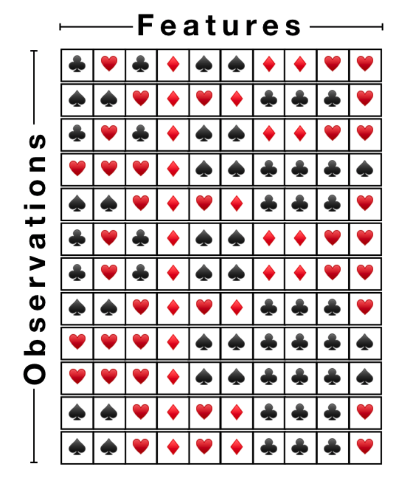
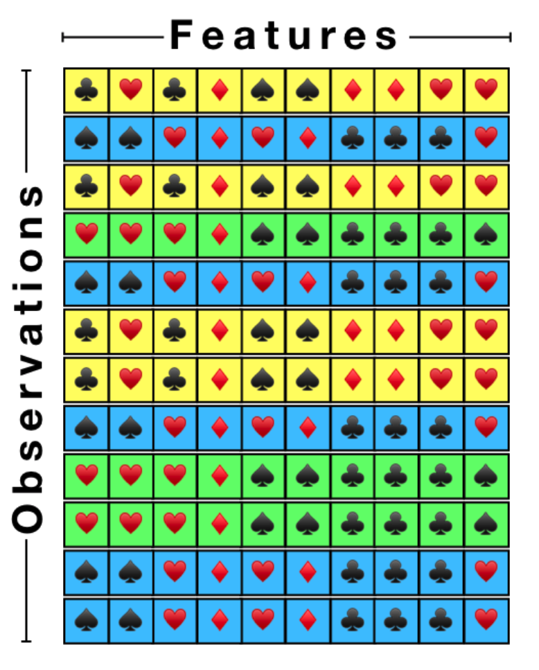
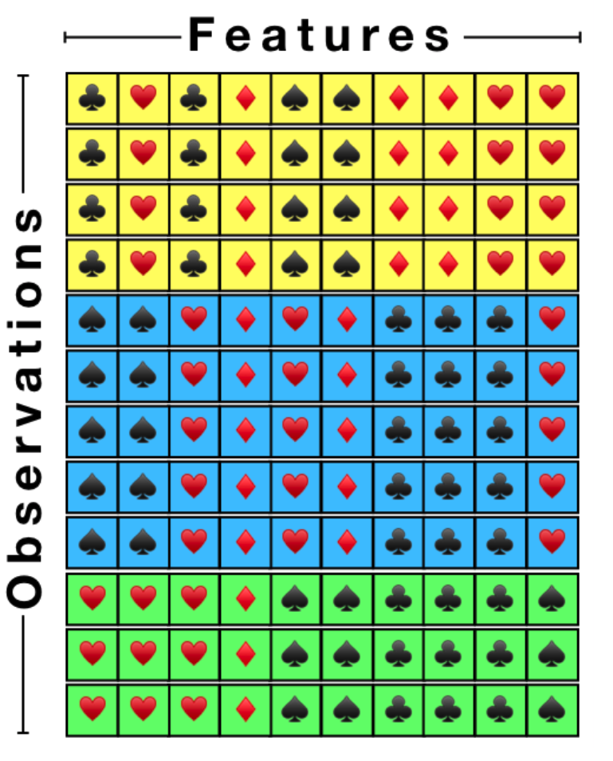
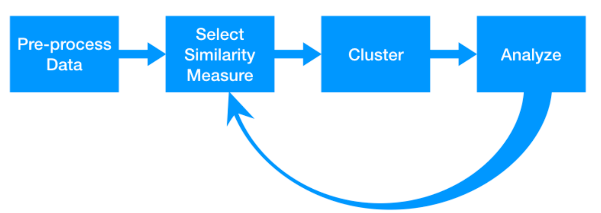

```{r setup, include=FALSE}
knitr::opts_chunk$set(echo = TRUE)
```

## Подгрузка пакетов

```{r message=FALSE, warning=FALSE}
library(tibble)
library(dplyr)
library(ggplot2)
```

## Задача кластеризации

Задача кластеризации подразумевает объединение наблюдений в группы так, чтобы все члены группы были похожи друг на друга, но в то же время они заметно отличались от всех членов других групп.

Давайте посмотрим на пример. Перед вами игрушечный data frame.

<center>
{width=400}
</center>

В каждой строчке у нас наблюдения, а столбцы это переменные, которые описывают наши наблюдения.  Можно представить, что наблюдения это люди, у которых есть пронумерованные карты от 1 до 10. А переменные это описание масти каждой пронумерованной карты. Можете ли вы разбить этих людей на группы? Почему вы так решили?

<center>
{width=400}
</center>

На самом деле этих людей можно разбить на 3 группы (синие, зеленые и желтые). Можно показать их вместе, чтобы было более понятно почему они разбиты именно на эти 3 группы.

<center>
{width=400}
</center>

Люди в каждой группе имеют одинаковые масти пронумерованных карт. Например, в "желтой" группе у всех 2 карта это черви.

## Зачем нам нужна кластеризация?

Кластеризация зачастую это вспомогательная модель, которая может помочь нам достичь нашей цели. Примеры:

1. Ритейл. Магазин решил повысить цены так, чтобы увеличить выручку компании. Но повышать цену на все товары очень глупо, так как покупатели могут просто уйти в другой магазин, тем самым продажи магазина упадут. В итоге мы получим не увеличение выручки, а ее уменьшение. Но товары можно разбить, например, на две группы: эластичные и неэластичные. Продажи неэластичных товаров при увеличении цены падают не так сильно как у эластичных. Здесь задача кластеризации состоит в том, чтобы разбить все товары на 2 группы.

2. 

## Pipeline

<center>
{width=500}
</center>

Чтобы решить задачу кластеризации, нужно выполнить следующие этапы.

1. Подготовить данные -- с частью подготовки данных, в которую входила очистка от выбросов, а также работа с пропущенными значениями, мы уже познакомились. Но есть еще скалирование и отбор переменных, с которыми мы познакомимся в дальнейшем.
2. Выбор критерия "близости" -- в игрушечном примере выше, все было достаточно просто. В группы попали люди, которые имели одинаковые масти у пронумерованных карт. А что если у одного из людей в "синей" группе последняя карта будет не черви, а крести. Он все еще останется в синей группе, так как 9 из 10 мастей совпали? Или же он уже ближе к зеленой группе? А может он образует уже четвертую группу, в которой будет состоять один. Выбор критерия "близости" очень важен, часто нужно понимать ту область из которой пришли данные. Это может очень сильно облегчить выбор правильного критерия.
3. Выбор модели кластеризации - моделей кластеризации достаточно много и все они разные. Важно понимать что за задачу вы решаете и почему именно эта модель подходит вам лучше всего.
4. Анализ полученных результатов -- нужно проверить, что то как кластеризация поделила наши наблюдения на группы (кластеры) нас устраивает и имеет локигу. Обычно в этом помогают знания из предметной области для которой эта задача решается.
5. Если нас не устраивает результат, то возможно стоит вернуться к самому первому этапу. На рисунке нарисовано, что ко второму, но первый этап, на котором проводится отбор признаков может сильно улучшить результат.

## "Похожесть" наблюдений

Насколько похожи два отдельно взятых наблюдения? Наверное, это один из главных вопросов, на который нужно ответить. Обычно в кластеризации для ответа на этот вопрос используют метрики расстояния. Чем меньше расстояние между наблюдениями тем больше они похожи друг на друга.

Давайте вспомним одну из метрик расстояния, которое мы проходили еще в школе. Это евклидово расстояние. Предположим, у нас есть 3 точки с координатами x и y.

```{r}
df <- tibble(
  x = c(1, 2, 3),
  y = c(10, 5, 6),
)
```

Найдем евклидово расстояние между первой и второй точками по формуле:

\[
d(p_1, p_2) = \sqrt{(x_1 - x_2)^2 + (y_1 - y_2)^2}
\]

```{r}
p1 <- df[1, ]
p2 <- df[2, ]

d12 <- sqrt((p1$x - p2$x)^2 + (p1$y - p2$y)^2)
```

В R есть встроенная функция `dist`, которая находит расстояние между всеми объектами.

```{r}
d <- dist(df, method = "euclidean")
d <- as.matrix(d)
d
```

Изобразим их.

```{r}
df %>%
  mutate(name = paste0("p", 1:nrow(df))) %>%
  ggplot(aes(x = x, y = y, label = name)) +
    geom_point() + 
    geom_text(hjust = 0, nudge_x = 0.05) +
    theme_light()
```

Если мы работаем с большим количество координат, то формула будет следующей:

\[
p_i = (p_1^i, ..., p_n^i)
\]

\[
d(p_i, p_j) = \sqrt{(p_1^i - p_1^j)^2 + ... (p_n^i - p_n^j)^2} = \sqrt{\sum_{k=1}^{n}{(p_k^i - p_k^j)^2}}
\]

## Скалирование признаков

Мы будем использовать стандартизацию. С ее помощью наши переменные будут иметь одинаковый масштаб (среднее равно 0, стандартное отлонени равно 1).

\[
feature_{scaled} = \frac{feature - mean(feature)}{sd(feature)}
\]

Функция `scale`. 

```{r}
s <- scale(df)
as.tibble(s)
```

## Иерархическая кластеризация


