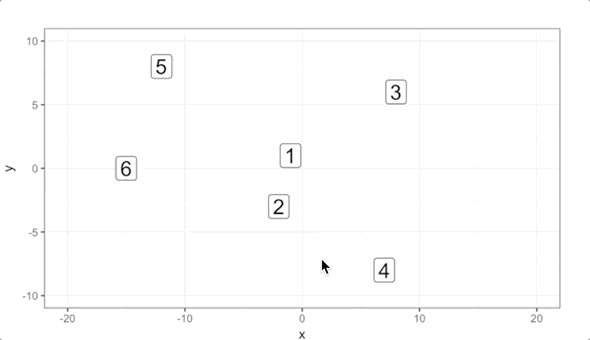

```{r setup, include=FALSE}
knitr::opts_chunk$set(echo = TRUE, warning = FALSE, message = FALSE)
```

## Подгрузка пакетов

```{r message=FALSE, warning=FALSE}
library(tibble)
library(readr)
library(dplyr)
library(ggplot2)
library(tidyr)
```

## Расстояние между наблюдением и группой наблюдений

Мы уже говорили о расстоянии между наблюдениями. Предположим у нас есть 4 наблюдения. Давайте посмотрим на их матрицу расстояний.

```{r}
data <- c(0., 11.7, 16.8, 10.0,
  11.7, 0, 18.0, 20.6,
  16.8, 18.0, 0, 15.8,
  10.0, 20.6, 15.8, 0)
d <- matrix(data, nrow = 4, ncol = 4)
d
```

Видно, что 1 и 4 наблюдения имеют наименьшее расстояние. Предположим они в одной группе. Встает важный вопрос. Какое из наблюдений 2 и 3 ближе к этой группе? Это зависит от того какой критерий расчета расстояния вы выберите. Одним из таких критериев является выбор максимального расстояния.

$d(\{1,4\}, 2) = max(d(1, 2), d(4, 2)) = 20.6$
$d(\{1,4\}, 3) = max(d(1, 3), d(4, 3)) = 16.8$

3 наблюдение ближе. Такие критерии расчета расстояния называют **критериями связи**. Самые популярные критерии связи:

* `complete` -- максимальное значение
* `single` -- минимальное значение
* `average` -- среднее значение

## Алгоритм кластеризации

Алгоритм иерархической кластеризации:

1. Каждое наблюдение становится кластером с одним наблюдением.
2. Между кластерами находятся расстояния по заданной метрике (обычно, евклидова) и заданному критерию связи.
3. Кластеры между которыми минимальное расстояние объединяются в один кластер.
4. Пункты 2 и 3 выполняются до тех пор пока мы не получим то количество кластеров, которое мы хотели получить.
5. Обычно, пункты 2 и 3 выполняются до тех пор пока мы не получим один кластер. А уже потом мы выбираем нужное нам количество кластеров и разворачиваем кластеризацию в обратную сторону.



## Простой пример

Предположим, что у нас есть 6 наблюдений.

```{r}
df <- tibble(
  x = c(-1, -2, 8, 7, -12, -15),
  y = c(1, -3, 6, -8, 8, 0)
)
ggplot(df, aes(x, y)) +
  geom_point()
```

У нас есть 3 параметра, на которые мы можем повлиять:

* Метрика расстояния
* Критерий связи 
* Количество кластеров

От выбора этих параметров зависит результат кластеризации. Давайте выберем евклидову метрику, критерий связи `complete` и 2 кластера.

Находим расстояния.

```{r}
dist_df <- dist(df, method = "euclidean")
```

Строим кластеризацию.

```{r}
hc_model <- hclust(dist_df, method = "complete")
```

Получаем метки кластеров.

```{r}
clusters <- cutree(hc_model, k = 2)
df <- df %>%
  mutate(cluster = clusters)
```

Рисуем полученный результат.

```{r}
ggplot(df, aes(x, y, color = factor(cluster))) +
  geom_point()
```

Давайте попробуем использовать разные параметры. Для этого напишем функцию.

```{r}
PlotHierClust <- function(df, link, k, distance = "euclidean"){
  dist_df <- dist(df, method = distance)
  hc_model <- hclust(dist_df, method = link)
  clusters <- cutree(hc_model, k = k)
  df <- df %>%
    mutate(cluster = clusters)
  p <- ggplot(df, aes(x, y, color = factor(cluster))) +
    geom_point() +
    labs(subtitle = paste("link = ", link, ",k = ", k)) + 
    theme(legend.position="none")
  return(p)
}
```

Давайте возьмем датасет `mtcars`, чтобы лучше увидеть результат выбора параметров.

```{r warning=FALSE, message=FALSE}
library(ggpubr)

df <- mtcars %>%
  select(x = mpg, y = drat)
  
p1 <- PlotHierClust(df, "complete", 4)
p2 <- PlotHierClust(df, "complete", 2)
p3 <- PlotHierClust(df, "single", 4)
p4 <- PlotHierClust(df, "single", 2)
p5 <- PlotHierClust(df, "average", 4)
p6 <- PlotHierClust(df, "average", 2)

ggarrange(p1, p2, p3, p4, p5, p6, nrow = 3, ncol = 2)
```

## Дендограмма

Иерархическую кластеризацию очень удобно визуализировать с помощью дендограмм.

```{r}
plot(hc_model)
```

По вертикальной оси можно видеть дистанцию, между кластерами. Эта дистанция при выборе критерия связи `complete` имеет важное значение. Оно может помочь вам выбрать количество кластеров. Если вы выберете значение 15, это будет означать, что расстояние между наблюдениями внутри кластеров будет меньше 15. Вы можете выбрать этот порог или количество кластеров и отрисовать разноцветную дендограмму.

```{r}
library(dendextend)
dend <- as.dendrogram(hc_model)
plot(dend)
colored_dend <- color_branches(dend, h = 15)
plot(colored_dend)
colored_dend <- color_branches(dend, k = 3)
plot(colored_dend)
```

