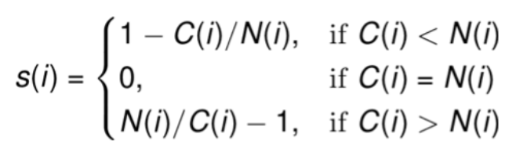

```{r setup, include=FALSE}
knitr::opts_chunk$set(echo = TRUE)
```

## Подгрузка пакетов

```{r message=FALSE, warning=FALSE}
library(tibble)
library(readr)
library(dplyr)
library(ggplot2)
library(tidyr)
```

## Алгоритм

Алгоритм нахождения кластеров:

1. Выбор количества кластеров. Вы должны изначально знать сколько кластеров должно получиться. Это и есть $k$.
2. Случайным образом инициализируются $k$ точек. Эти точки будут центроидами кластеров.
3. Каждое наблюдение присваивается к кластеру, к которому оно ближе всего.
4. Центроиды пересчитываются, их координаты равны средним значениям наблюдений, которые были получены на предыдущем этапе.
5. Пункты 3 и 4 повторяются до тех пор пока центроиды не стабилизируются, то есть наблюдения не будут перетекать из одного кластера в другой.

Давайте посмотрим как работает кластеризация на очень простом примере.

```{r}
source_df <- read_csv("simple_sample.csv")
source_df %>%
  head()
ggplot(source_df, aes(x1, x2)) + 
  geom_point()
```

Видно, что здесь есть 2 кластера. Давай попробуем построить модель.

```{r}
model <- kmeans(source_df, centers = 2)
df <- source_df %>%
  mutate(cluster = factor(model$cluster))
df %>%
  head()
ggplot(df, aes(x1, x2, color=cluster)) +
  geom_point()
```

## Выбор k

Посмотрев на график из предыдущего примера мы сразу поняли, что у нас есть 2 кластера. Это было легко, так как мы смотрели на график в двумерном пространстве. На график в трехмерном пространстве мы тоже можем посмотреть. Но как понять сколько кластеров, если количество переменных в нашем датасете больше 3?

### Elbow method (метод согнутого плеча)

Чтобы понять как работает этот метод, давайте сначала определим **total within-cluster sum of squares**. Это метрика, которая показывает насколько далеко находятся наблюдения от центроидов своего кластера.

\[
TotalWithinSS = \sum_{i=1}^k\sum_{x \in C_i}d(x, \bar x_{C_i})^2
\]

Первая сумма отвечает за каждый кластер ($i$). Вторая сумма перебирает все точки $x$, которые находятся в $i$ кластере. В итоге суммируется расстояние от точки до центроида ее кластера и возводится в квадрат. В построенной моделе уже есть эта метрика.

```{r collapse=TRUE}
print(model$withinss)  # значение для каждого кластера
print(model$tot.withinss)  # суммарное значение
```

Давайте напишем функцию, которая построит нам график на котором будет визуально видна суть этой метрики.

```{r}
PlotWithinSS <- function(df, k){
  model <- kmeans(df, centers = k)
  
  df <- df %>%
    mutate(cluster = model$cluster)
  centers <- model$centers
  centers <- as_tibble(centers) %>%
    setNames(paste0('center.', names(.))) %>%
    mutate(cluster = row_number())
  segment_df <- df %>%
    inner_join(centers, by = 'cluster')
  p <- ggplot(df, aes(x1, x2, color=factor(cluster))) + 
    geom_point() +
    geom_point(aes(center.x1, center.x2), data = centers, color = 'black', size = 2) + 
    geom_segment(aes(x = x1, y = x2, xend = center.x1, yend = center.x2), 
                 data = segment_df, color = 'black', linetype = 2, size = 0.3, alpha = 0.5) + 
    theme(legend.position="none") +
    labs(subtitle = paste("TotalWithinSS = ", round(model$tot.withinss)))
  return(p)
}
```

Например, построим график с 2 кластерами. Пунктирные линии от центра кластера (черной точки) до всех других точек кластера показывают расстояние. Сумма квадратов этих расстояний и есть наша метрика **TotalWithinSS**.

```{r}
PlotWithinSS(df, 2)
```

Само значение этой метрики ничего нам не дает. Но это значение можно сравнивать с другими значениями. Давайте построим несколько графиков с разным количеством кластеров.

Чтобы построить графики рядом друг с другом воспользуемся пакетом `ggpubr`, в котором находится функция `ggarange` 

```{r warning=FALSE, message=FALSE}
library(ggpubr)

p1 <- PlotWithinSS(source_df, 1)
p2 <- PlotWithinSS(source_df, 2)
p3 <- PlotWithinSS(source_df, 3)
p4 <- PlotWithinSS(source_df, 4)

ggarrange(p1, p2, p3, p4, nrow = 2, ncol = 2)
```

Видно, что когда кластер 1, то метрика очень большая, так как дистанция между центров кластера и всеми точками очень велико. Важно заметить, что изменение метрики при переходе от 1 кластера ко 2 велико по сравнению с изменением при переходе от 2 к 3 или от 3 к 4. Давайте построим 10 моделей и изобразим эту динамику на графике.

```{r}
K <- 1:10
TotalWithinSS <- c()
for(k in K){
  model <- kmeans(df, centers = k)
  TotalWithinSS <- c(TotalWithinSS, model$tot.withinss)
}
metrics_df <- tibble(k = K, TotalWithinSS = TotalWithinSS)

ggplot(metrics_df, aes(k, TotalWithinSS)) +
  geom_point() + 
  geom_line(color = 'blue') + 
  scale_x_continuous(breaks = K) + 
  geom_vline(xintercept = 2, linetype = 2)
```

На этом графике прекрасно видно, что кластеров должно быть 2, так как при увеличении количества кластеров значение метрики не так сильно падает. Это в свою очередь означает, что добавление новых кластеров избыточно.

Этот график достаточно прост. Изменение метрики при переходе от 2 до 3 кластеров может быть больше. Здесь уже вам нужно выбирать некоторый порог, который будет сигнализировать достаточно ли этого изменени, чтобы увеличить количество кластеров.

### Silhouette method (метод "силуэта")

Другим способом определения количества кластеров является *Silhouette method*. Этот метод предполагает расчет так называемой ширины "силуэта". Это метрика расчитывается для каждого наблюдения и состоит из двух частей:

1. **Within Cluster Distance** -- расстояние внутри кластера. Для $i$-ого наблюдения $C(i)$.
2. **Closest Neighbor Distance** -- расстояние до ближайшего соседнего кластера. Для $i$-ого наблюдения $N(i)$.

Предположим мы решили выбрать 3 кластера. Давайте посмотрим на отдельном наблюдении на каждую составляющую метрики. 

```{r}
set.seed(42)
model <- kmeans(source_df, centers = 3)
df <- source_df %>%
  mutate(cluster = model$cluster) %>%
  mutate(label = if_else(x1 < -2.5 & x1 > -5., "X", ""))

p <- ggplot(df, aes(x1, x2, color=factor(cluster), label = label)) + 
  geom_point() + 
  geom_text(nudge_y = 0.1, show.legend = F, color = "black")
p
```

Для этого наблюдения **Within Cluster Distance** равна средней дистанции до каждой точки из 1 кластера.

```{r}
segment_df <- df %>%
  filter(label == "X") %>%
  setNames(paste0('X.', names(.))) %>%
  full_join(df, by = character())

p + geom_segment(aes(x = x1, y = x2, xend = X.x1, yend = X.x2), 
               data = segment_df %>% filter(cluster == 1),
               color = 'black', linetype = 2, size = 0.3, alpha = 0.5)

segment_df %>% 
  filter(cluster == 1) %>%
  mutate(distance = sqrt((X.x1 - x1)**2 + (X.x2 - x2)**2)) %>%
  summarise(C = mean(distance))
```

Видно, что ближайший к нашему наблюдению является второй кластер. Поэтому для этого наблюдения **Closest Neighbor Distance** равна средней дистанции до каждой точки из 2 кластера.

```{r}
p + geom_segment(aes(x = x1, y = x2, xend = X.x1, yend = X.x2), 
               data = segment_df %>% filter(cluster == 2),
               color = 'black', linetype = 2, size = 0.3, alpha = 0.5)

segment_df %>% 
  filter(cluster == 2) %>%
  mutate(distance = sqrt((X.x1 - x1)**2 + (X.x2 - x2)**2)) %>%
  summarise(N = mean(distance))
```

Используя 2 эти состовляющие мы можем посчитать ширину "силуэта".

{width=300}

В нашем случае она равна:

```{r}
round(1 - 3.35 / 3.95, 2)
```

Данная метрика может принимать значения от -1 до 1. 

* Значение близкое к 1 предполагает, что это наблюдение хорошо "вписывается" в текущий кластер.
* Значение близкое к 0 предполагает, что это наблюдение находится на границе между двумя кластерами и может принадлежать одному из них.
* Значение близкое к -1 предполагает, что это наблюдение лучше подходит другому кластеру.

В нашем случае наблюдение больше подходит к своему кластеру, хотя достаточно близко и к соседнему. Если взять точку между 2 и 3 кластерами, то там могут получиться и отрицательные значения метрики. 

Сейчас мы посчитали эту метрику только для одного наблюдения. Чтобы понять ситуацию в целом, нужно посчитать эту метрику для каждого наблюдения и усреднить. Для этого нам поможет пакет `cluster`.

```{r warning=FALSE, message=FALSE}
library(cluster)

set.seed(42)
pam3 <- pam(source_df, k = 3)
```

Из объекта мы можем получить значение метрики.

```{r}
pam3$silinfo$widths %>%
  head()
pam3$silinfo$avg.width
```

Можно нарисовать график.

```{r}
plot(silhouette(pam3))
```

Теперь можно построить разные модели и понять для какой эта метрика наилучшая.

```{r}
K <- 2:10
SW <- c()
for(k in K){
  model <- pam(source_df, k = k)
  SW <- c(SW, model$silinfo$avg.width)
}
metrics_df <- tibble(k = K, SW = SW)

ggplot(metrics_df, aes(k, SW)) +
  geom_point() + 
  geom_line(color = 'blue') + 
  scale_x_continuous(breaks = K)
```

И по этой метрике мы видим, что 2 кластера это оптимальный вариант, так как именно модель с 2 кластерами имеет наивысшее значение.

### Методы снижения размерности (PCA, t-SNE)

Еще одним способом нахождения оптимального количества кластеров являются методы снижения размерности. В нашем датасете может быть много переменных (десятки, сотни). Мы не можем визуализировать этот датасет и посмотреть как расположены наши наблюдения относильно друг друга. Методы снижения размерности позволяют уменьшить количество переменных, при этом сохранив максимальное количество информации. 

Одним из таких методов является метод главных компонент *PCA* -- principal component analysis. Это линейный метод, который создает новые переменные (компоненты).Первая компонента, которая получается с помощью этого метода является самой информативной. При этом каждая следующая компонента добавляет информацию, но уже не в таком размере. Мы не будем изучать, что за магия стоит за этим алгоритмом, а просто посмотрим как с ним работать в R.

Чтобы использовать PCA нам понадобится встроенная функция `prcomp`. В качестве датасета возьмем `iris` [[ссылка]](https://ru.wikipedia.org/wiki/Ирисы_Фишера). Этот датасет обычно используется для задач классификации, так мы знаем метку цветка для каждого наблюдения. Но нам он подойдет для оценки того, как справится PCA с этим датасетом.

```{r}
pca_model <- iris %>%
  select(-Species) %>%
  prcomp()
```

В построенной моделе есть некоторая метаинформация, если вы изучите алгоритм более глубоко, то сможете понять, о чем эта информация. В `x` лежит датасет с компонентами. Выберем 2 компоненты и нарисуем график.

```{r}
df <- pca_model$x %>%
  as_tibble() %>%
  select(PC1, PC2) %>%
  mutate(type = iris$Species)

ggplot(df, aes(PC1, PC2, color = type)) +
  geom_point()
```

Если вам интересен PCA и вы хотите более подробно с ним работать, то рекомендую изучить функцию `PCA` из пакета `FactoMineR`, которая рисует красивые и информативные графики, а также дает подробную информацию о построенной модели.

### Другие методы

Можно также почитать про другие методы и пакеты по [[ссылке]](https://rpubs.com/AllaT/clust3) во вкладке "Дополнение: NbClust".

## MNIST

```{r}
mnist_raw <- read_csv("mnist_test.csv", col_names = FALSE)
mnist_raw[1:10, 1:10]

pixels_gathered <- mnist_raw %>% 
  head(12) %>% 
  rename(label = X1) %>% 
  mutate(instance = row_number()) %>%  
  gather(pixel, value, -label, -instance) %>%  
  tidyr::extract(pixel, "pixel", "(\\d+)", convert = TRUE) %>% 
  mutate(pixel = pixel - 2, x = pixel %% 28, y = 28 - pixel %/% 28)

pixels_gathered %>%
  ggplot(aes(x, y, fill = value)) + 
  geom_tile() + 
  facet_wrap(~ instance + label)
```

```{r cache=TRUE}
X <- mnist_raw %>%
  select(-X1)

pca_model <- X %>%
  prcomp()

df <- pca_model$x %>%
  as_tibble() %>%
  select(PC1, PC2) %>%
  mutate(type = mnist_raw$X1)

ggplot(df, aes(PC1, PC2, color = factor(type))) +
  geom_point(alpha = 0.5)
```

```{r cache=TRUE}
library(tsne)
sample_mnist_raw <- mnist_raw %>%
  sample_frac(0.2)

df <- sample_mnist_raw %>%
  select(-X1) %>%
  tsne(k = 2, max_iter = 300)

df %>%
  as_tibble() %>%
  mutate(type = sample_mnist_raw$X1) %>%
  ggplot(aes(V1, V2, color = factor(type))) +
  geom_point()
```


