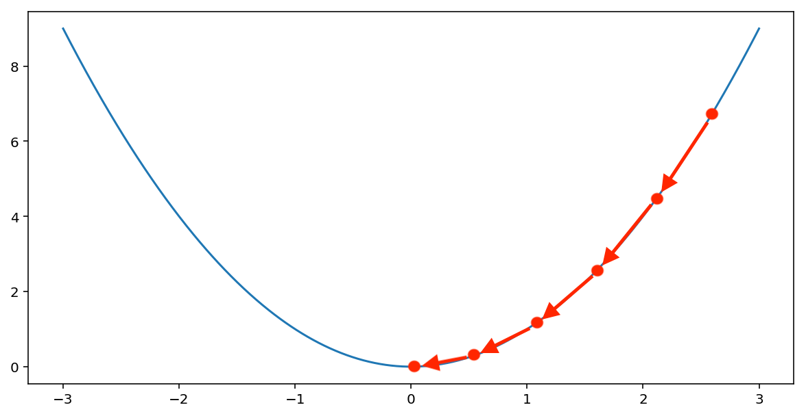
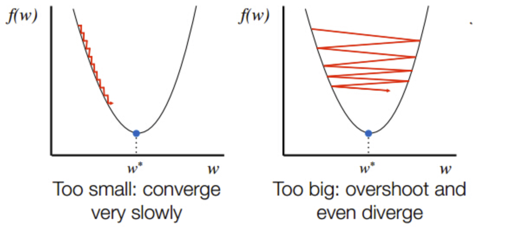

<style>
h1,
h2,
h3,
h4,
h5,
h6  {
  color: #317eac;
}
</style>
---
```{r setup, include=FALSE}
knitr::opts_chunk$set(echo = TRUE, warning = FALSE, message = FALSE)
```

### Что за регрессия такая? 

Одной из задач машинного обучения является задача регрессии. В задачи регрессии мы хотим предсказать переменную $Y$, которая может принимать вещественные значения $Y \in \mathbb{R}$. 

Примеры задачи регрессии:

* Сколько денег заработает магазин в следующем месяце?
* Какая завтра будет температура?
* Сколько человеку лет на фото?

<center>{width=40%}</center>

Хорошо, с регрессией разобрались, а почему линейная? Все просто! Потому что над всеми признаками применяется обычное линейное преобразование (сумма):

$$
y_i = w_0 \cdot 1 + w_1 \cdot x_i^{(1)} + w_2 \cdot x_i^{(2)} + \ldots + w_k \cdot x_i^{(k)}= w^T \cdot X 
$$

### Обучение: придумываем качественные функционалы

Итак, модель построили, осталось обучить. Как было сказано в тетрадке до этого (смотреть [тут](https://ahmedushka7.github.io/R/scripts/hse_data_analysis/sem_linreg/models_intro.html)) для этого надо функционал выбрать, а затем его оптимизировать по весам $w$ так, чтобы он оказался как можно меньше. Ну окей, давайте подберем:

**Делай раз:**

Логично, что наша ошибка это разность между реальным значением $y$ и предсказанным нами _по всем наблюдениям_, то есть для конкретного наблюдения $i$ выглядит это так:

$$
y_i - (w_0 \cdot 1 + w_1 \cdot x_i^{(1)} + w_2 \cdot x_i^{(2)} + \ldots + w_k \cdot x_i^{(k)})
$$
А как же нам тогда ошибку по всем наблюдениям посчитать, чтоб получилось одно число? 

**Делай два:**

`Идея №1:` 

Так давайте просто ошибки по всем наблюдениям сложим и дело с концом. А чтобы мы прославились совсем крутыми математиками, давайте покажем что мы не только складывать умеем, но еще на кол-во делить, чтоб среднее найти: 

$$
error = \frac{1}{n}\sum_{i=1}^{n}y_i - (w_0 \cdot 1 + w_1 \cdot x_i^{(1)} + w_2 \cdot x_i^{(2)} + \ldots + w_k \cdot x_i^{(k)})
$$
Но не все так просто....

Такая функция потерь не очень хороша. Представьте, что на 25 наблюдениях у вас ошибка 10, а на остальных 25 ошибка равна -10. В итоге функция потерь будет равна 0, что означает, что модель идеальна и не допускает ошибок. Положительные и отрицательные ошибки "схлопнули" друг друга. 

`Идея №2:`

Хмм... Тогда давайте подумаем как такие штуки нам мониторить. Придумали! Будем брать модуль или квадрат ошибки. Ну и так как это наши детища, дадим им названия: в первом случае **MAE -- mean absolute error**, а во втором случае **MSE -- mean squared error**. 

$$MAE = \frac{1}{n} \sum_{i=1}^{n} |income_i - w_0 - w_1 education_i|$$
$$MSE = \frac{1}{n} \sum_{i=1}^{n} (income_i - w_0 - w_1 education_i)^2$$

### Обучение: оптимизация функционалов

Функционал выбрали, осталось его оптимизировать. Будем это делать с помощью метода **градиентного спуска**! Для этого вспомним математический анализ, но обещаю, что его будет совсем немного.

Итак, если у нас есть функция, которая зависит от нескольких параметров, то по каждому параметру мы можем взять производную. Вектор из таких производных называется **градиентом**. У градиента есть очень важное свойство: он указывает в направлении **наискорейшего роста функции**! 

$$
\nabla f(x_1, \ldots ,x_k) = \Bigl(\frac{\partial{f(x)}}{\partial{x_j}}\Bigr)_{j=1}^k
$$
Если мы выбираем в качестве функционала $MSE$, то наш градиент будет выглядеть так:

$$
\nabla MSE(w) = \Bigl( \frac{\partial{MSE(w)}}{\partial{w_0}},  \frac{\partial{MSE(w)}}{\partial{w_1}}, \ldots , \frac{\partial{MSE(w)}}{\partial{w_k}} \Bigr )
$$

Так как мы _минимизируем_ функционал, то нам нужно двигаться не в направлении роста функции, а, наоборот, в направлении убывания. Следовательно, мы будем идти не в сторону градиента, а в направлении **антиградиента**. 

Встречайте, градиентный спуск:

1. Присваиваем $w$ рандомные значения (например, нули)
$$
w_0 = w_1 = \ldots = w_k = 0
$$
2. Считаем градиент по ним
$$
\nabla MSE(w) = \Bigl( \frac{\partial{MSE(w)}}{\partial{w_0}}|_{w_0 = 0},  \frac{\partial{MSE(w)}}{\partial{w_1}}|_{w_1 = 0}, \ldots , \frac{\partial{MSE(w)}}{\partial{w_k}}|_{w_k = 0} \Bigr )
$$
3. Обновляем $w$, вычитая из них значение градиента (еще раз: вычитаем, потому что двигаемся в сторону **антиградиента**, так как мы минимизируем функцию!). Причем вычитать будем не просто значение градиента, а помноженное его на **скорость обучения** $\eta$. Обычно она равна $0.001$, то есть довольна маленькая. 

$$
w^{t} = w^{t-1} - \eta_t \cdot \nabla MSE(w^{t-1})
$$

4. Повторяем все тоже самое, пока веса сильно уменьшаются

$$
||{w^{t} - w^{t-1}}|| > \varepsilon
$$

--------


**Простой пример:**

$$y = x^2$$
$$
\nabla y = (\frac{\partial{y}}{\partial{x}}) = 2  x
$$

_Шаг градиентного спуска №1:_

$$x^{0} = 1$$
$$\nabla y(x^{0}) = 2 \cdot 1 = 2$$
$$x^{1} = x^{0} - \eta \cdot \nabla y(x^{0}) = 1 - 0.01 \cdot 2 = 0.98$$ 
Шаг градиентного спуска №2:

$$x^{1} = 0.98$$
$$\nabla y(x^{1}) = 2 \cdot 0.98 = 1.96$$
$$x^{2} = x^{1} - \eta \cdot \nabla y(x^{1}) = 0.98 - 0.01 \cdot 1.96 = 0.9604$$ 

Проделывая так очень много раз в итоге сойдемся к $x = 0$, что и является минимум для функции $y=x^2$. 

<center>{width=60%}</center>

**Замечание:** Сходимость к оптимуму сильно зависит от выбранной скорости обучения. В данном случае мы видим, что ползти мы будем очень медленно. Однако, если мы бы выбрали, например, 1 в качестве значения $\eta$, то тогда на первом шаге уже мы бы перепрыгнули 0 и значение $x$ было бы -1.

<center>{width=80%}</center>
--------
