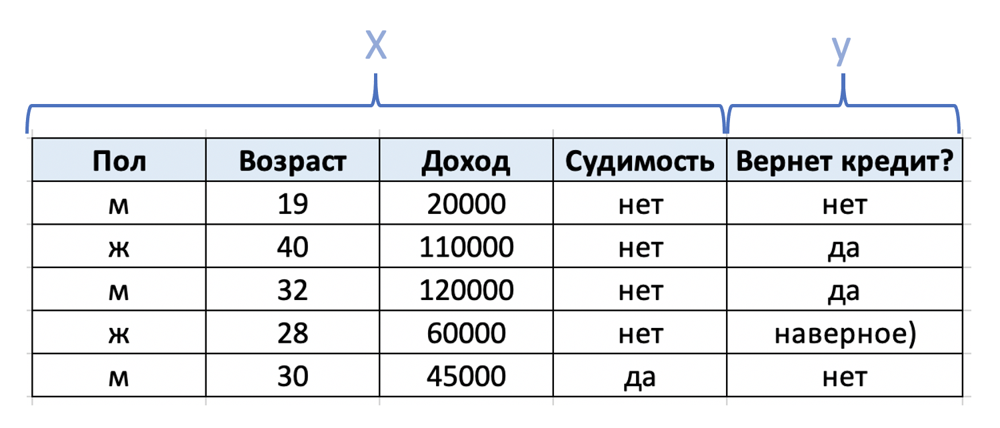
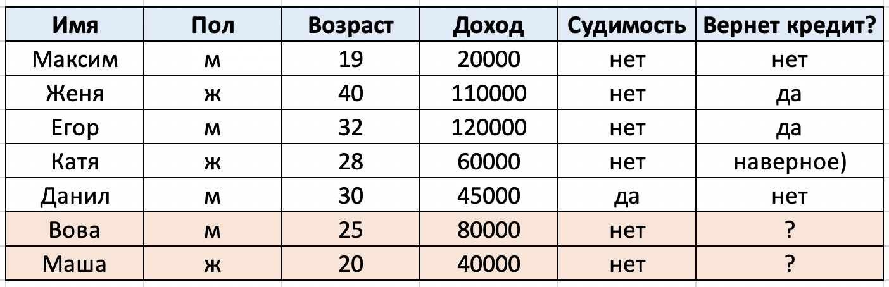
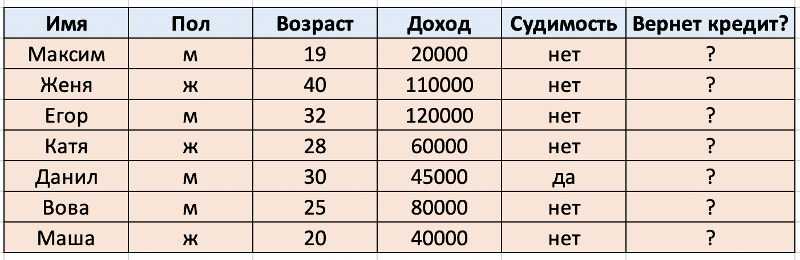
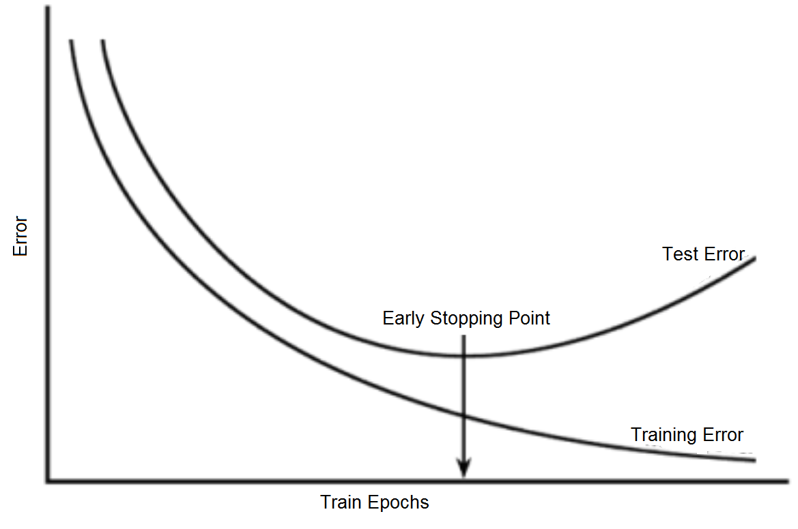
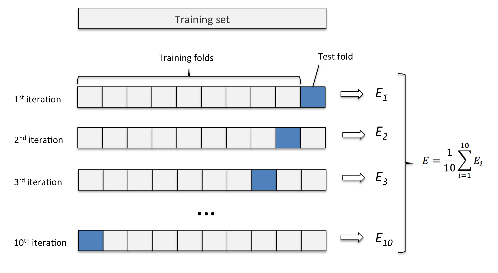

<style>
h1,
h2,
h3,
h4,
h5,
h6  {
  color: #317eac;
}
</style>
---
```{r setup, include=FALSE}
knitr::opts_chunk$set(echo = TRUE, warning = FALSE, message = FALSE)
```

### Два вечных вопроса

Если говорить очень грубо, то вся работа аналитика/дата-саентиста/специалиста машинного обучения и прочих ребят связана с ответами на **два главных вопроса**:

1. Что будет завтра? (Предсказание переменной $y$)
2. Как все устроено? (Как переменная $y$ зависит от переменной $x$)

Отвечая на первый вопрос, мы пытаемся построить модель, которая даст нам максимально точный прогноз на завтра. В этом случае мы задаемся вопросами: какая прибыль магазина будет в следующем месяце? выплатят ли нам кредит? какая завтра будет температура? и так далее... Обычно в данном случае нам не важно, как именно наша модель работает и что она там делает, нам важно высокое качество модели!

Отвечая на второй вопрос, мы пытаемся понять как устроен мир. Мы хотим узнать, что сильнее всего влияет на прогнозируемое значение, какой "вклад" каждый признак несет. Здесь могут быть такие примеры: сколько нам нужно переплатить за квартиру, если мы хотим жить в новостройке, близкой к метро? на сколько вероятнее вылечиться от рака, используя конкретный препарат? выплатит ли нам кредит заемщик, зарабатывающий 100000 рублей в месяц? а если он зарабатывает 80000? и прочее прочее прочее.... Теперь уже нам важно, как наша модель работает, какие предпосылки она требует и какие именно ответы для каждого признака (веса) нам выдает. 

### Немного про обозначения


$y$ $-$ таргет; переменная которую мы хотим спрогнозировать и которая интересует нас больше всего;

$X$ $-$ матрица признаков, влияющих на наш таргет и помогающих нам его спрогнозировать.

$x^{(i)}$ $-$ отдельный признак из матрицы $X$

**Пример:**

<center>{width=60%}</center>

### Обучение с учителем и без

**Обучение с учителем** это когда у нас есть уже выборка, на которой мы знаем ответы. Например, наш банк работает очень долго, и за это время эмпирическим путем мы смогли собрать некую базу клиентов, которые нам кредит вернули и нет. Обучаясь на этих клиентах, модель каким-то чудесным образом (здесь и начинают пригождаться знания линейной алгебры, математического анализа и прочей математики) начинает понимать как устроен мир. Поэтому когда мы отправляем ей нового клиента, который в какой-то степени похож на некоторых клиентов в нашей обучающейся выборке, модели удается спрогнозировать ответ для человека, которого она до этого не видела, так как она уже обучилась на похожих людях и примерно понимает как будет вести себя наш новый клиент. 

**Замечание:** Если вдруг к нам в банк придет какой-то очень непохожий на клиентов, которые у нас были, то модель на нем сработает плохо, ведь до этого она не видела чего-то подобного. Таких непохожих клиентов принято называть _выбросами_, а чтобы таких выбросов было как можно меньше нужно собирать _репрезентативную_ обучающую выборку!

<center>{width=60%}</center>

**Обучение без учителя** это когда выборки с ответами нету и нужно самим догадываться как там все устроено, не обучаясь до этого на примерах. Такая задача в разы сложнее. 


<center>{width=60%}</center>

### Процесс обучения

1. Выбирается функционал (метрика), которая будет нам показывать, насколько хорошо работает модель. Метрик напридумывали очень много в зависимости от типа задач, мы будем знакомиться с ними постепенно на конкретных моделях. 

2. Метрика зависит от параметров, которые нужно оптимизировать. Как? С помощью методов оптимизации, конечно. Например, одним из наиболее популярных методов оптимизации является **градиентный спуск**. Обычно параметры подбираются так, чтобы значение метрики на них было как можно меньше. 

3. По значениям метрики оценивается качество модели. Как это правильно делать? Читай следующий раздел!

### Кросс-валидация, переобучение и другие умные слова

Чтобы адекватно оценивать качество модели по метрике, обучающая выборка разделяется на тренировочную и валидационную части. Обычно такое разбиение проходит в соотношении 70 на 30. На тренировочной части модель обучается, а затем на ней считается значение метрики. После того как модель обучилась, ей закидывают валидационную часть в качестве искусственой тестовой (ведь на настоящей тестовой выборки у нас нет ответов, следовательно и качество на ней проверить мы не можем), и считается значение метрики на ней. 

Если качество вашей модели высокое на тренировочной части, а на валидационной части низкое, то вы столкнулись с **переобучением**. То есть ваша модель настолько хорошо подстроилась под тренировочную выборку, что идеально справляется с прогнозами на ней, но на новых данных работает очень плохо.

Типичный пример переобучения:

<center>{width=60%}</center>

Еще один график, показывающий переобучение:

<center>{width=90%}</center>

Переобучение $-$ это серьезная проблема, для которой существует огромное количество способов решения. 

Назойливые читатели могут сейчас возмутиться. Как же это так можно, просто взять и отсыпать 30\% наблюдений выборки в тестовую часть? А как понять какие 30\% брать? У нас и так данных мало, а мы еще сильнее их урезаем. Надо с этим что-то делать.... И, действительно, надо! А именно $-$ **кросс-валидацию**!

В кросс-валидации выбирается какое-то кол-во _фолдов_ (3/5/10), затем разбивают всю выборку на столько частей, сколько фолдов. Сначала первый фолд берется в качестве тестового, а все остальные в качестве тренировочной части. При таком разбиении считается значения метрики на тренировочной и тестовой части. Затем на следующей итерации в качестве тестового берется уже второй фолд, а все остальные в качестве тренировочных. Опять считаются значения метрик. И так далее. В итоге все данные побывают в тестовой части и это звучит классно! Итоговые значения метрик просто агрегируются в одно. Например, это может быть среднее арифметическое. Более подробно изображено на картинке ниже:




