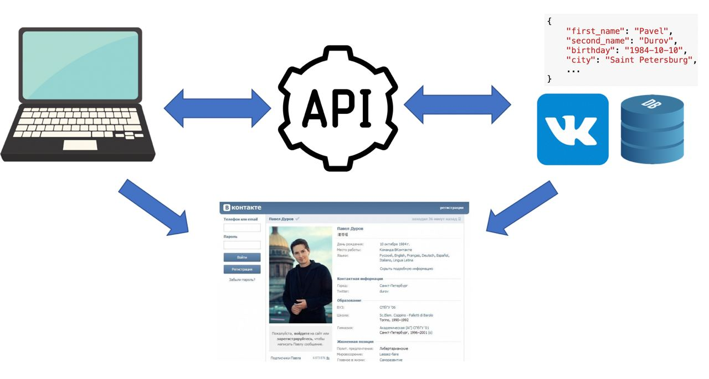
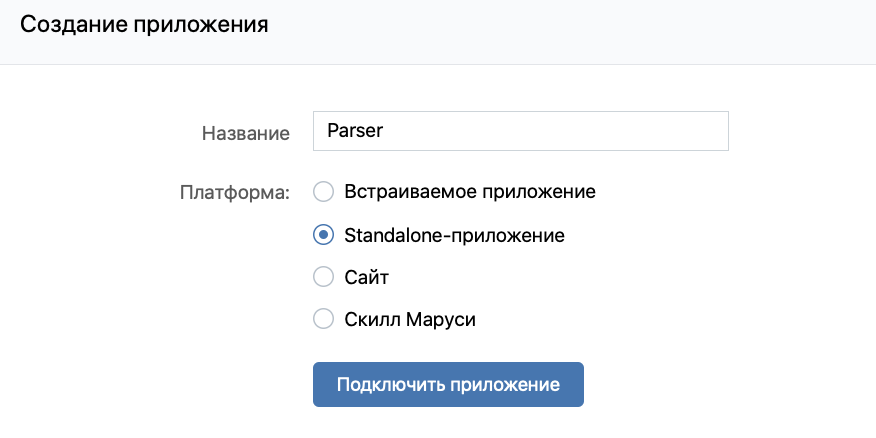
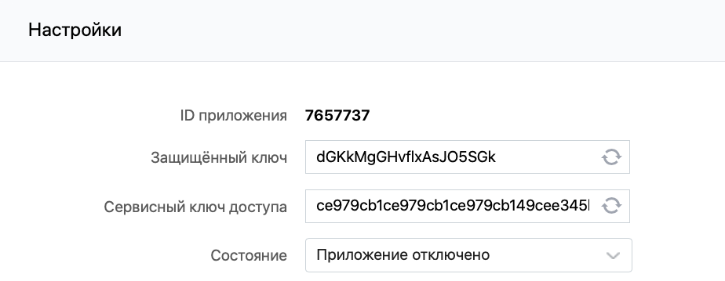

```{r setup, include=FALSE}
knitr::opts_chunk$set(echo = TRUE)
```

## Приготовим пакетики

```{r warning=FALSE, message=FALSE}
packages <- c("httr", "dplyr", "tidyr", "rlist")
# install.packages(packages)
library(httr)
library(dplyr)
library(tidyr)
library(rlist)
```

## Application Programming Interfaces



Давайте разберемся что такое API c помощью картинки. 

1. Обычный парсинг предполагает, что у нас есть какая-то веб-страница, на которой есть информация необходимая нам. Как мы убедимся на следующих занятиях, парсить информацию с таких страниц достаточно сложно.
2. Сама страница рендерится (создается) из данных, которые лежат в базе данных. 

Хотелось бы попросить сервер, в данном случае Vk, получить доступ к их базе данных, чтобы не мучиться с парсингом страницы. Очевидно, что прямой доступ до базы данных никто нам не даст. Для этого и был создан  API. Это некоторая "прослойка", которая позволяет получать данные из баз.

Первое, что нужно сделать перед парсингом, это проверить, есть ли API, которое облегчит вашу жизнь. У больших компаний есть API, например это Vk или Twitter. Важно понимать, что API это не только получение каких-то данных из баз сервера. Это может быть все что угодно. Например, с помощью API Яндекс.Переводчик вы можете перевести текст с одного языка на другой.

Работа с разными API очень схожи, везде есть токены, методы и тому подобное. Поэтому давайте разберём все на одном примере -- VkApi.

## VkAPI

У Vk есть свое API. Вот его [документация](https://vk.com/dev/first_guide).

### Токен

Первое что нужно сделать для работы с любым API это получить токен. Токен это ваш аудентификатор. Грубо говоря, это ваш логин и пароль. Токен нужен, чтобы API понимал кто вы и какие данные вам можно показывать, а какие нельзя. Допустим, есть человек, у которого закрыт аккаунт. Если вы друг этого человека, то вам доступна информация на его странице, а если у вас нет в друзьях этого человека, то у вас нет доступа к информации.

**ВАЖНО! ЕСЛИ У КОГО-ТО ЕСТЬ ВАШ ТОКЕН, ТО ОН ИМЕЕТ ПОЛНЫЙ ДОСТУП К ВАШЕЙ СТРАНИЦЕ. НИКОМУ НЕ ДАВАЙТЕ СВОЙ ТОКЕН.**

1. Создаем свое приложение

Переходим по [ссылке](https://vk.com/apps?act=manage) и создаем свое приложение.



2. Id приложения

В настройках вашего приложения есть его **id**.



3. Генерируем ссылку

В ней прописываем id вашего приложения, а также те доступы, которые будут разрешены с полученным токеном. В нашем случае мы прописываем `scope=friends`, тем самым разрешая получать информацию о друзьях. Вы можете добавить доступы к другим вещам. Смотрите подробнее 4 пункт по [ссылке](https://vk.com/dev/first_guide).

```{r comment=""}
id <- "7657737"
path <- paste("https://oauth.vk.com/authorize?client_id=", id, "&display=page&redirect_uri=https://oauth.vk.com/blank.html&scope=friends&response_type=token&v=5.52", sep = "")
cat(path)
```

4. Получаем токен

Полученную ссылку вводим в браузере. Соглашаемся дать доступ (там будет как раз описано, к чему вы даете доступ). Копируем ссылку, которая получилась в итоге.

```{r}
"https://oauth.vk.com/blank.html#access_token=388bafec47318fdbbb2bda6ef769adb8df50fda7a0a65e7d99caf4577bac6cedc0c67c16e99e0d605e186&expires_in=86400&user_id=73614108"
```

Здесь нужно обратить внимание на следующие вещи:

1. `access_token` -- это ваш токен
2. `expires_in` -- время жизни токена (по дефолту 86400 секунд = 1 сутки)
3. `user_id` -- id человека, которому предоставлен доступ

Запишем токен в отдельную переменную.

```{r}
token <- "388bafec47318fdbbb2bda6ef769adb8df50fda7a0a65e7d99caf4577bac6cedc0c67c16e99e0d605e186"
```

### Делаем свой первый запрос

Что можно делать с помощью API? Весь функционал реализован в [методах](https://vk.com/dev/methods). Их много, вы можете получить информацию о друзьях, посмотреть кто лайкнул пост, отправить кому-то сообщение и многое другое.

Здесь нужно вспомнить, что такое HTTP запросы и метод GET, с помощью которого мы будем получать нужные нам данные.

Давайте посмотрим как формируется url, по которому мы и сделаем запрос.

```{r eval=FALSE}
url <- "https://api.vk.com/method/" + название метода + "?" + параметры метода, разделенные &
```

Давайте попробуем использовать метод `friends.get` [[ссылка]](https://vk.com/dev/friends.get) , который возращает список друзей заданного пользователя. Если не указать пользователя (параметр `user_id`), то он выведет ваших друзей. В параметрах нужно указать версию API (5.52 актуальная), ваш токен и какие-то еще параметры из описания метода.

```{r, comment=""}
method <- "friends.get"
version <- "5.52"
fields <- "first_name,last_name"
token <- "388bafec47318fdbbb2bda6ef769adb8df50fda7a0a65e7d99caf4577bac6cedc0c67c16e99e0d605e186"

url <- paste("https://api.vk.com/method/", method, 
             "?v=", version, "&access_token=", token,
             "&fields=", fields,
             sep = "")
cat(url)
```

Полученную ссылку можно вставить в брузере. На выходе получим JSON с информацией о друзьях. Давайте получим эту информацию внутри R с помощью метода `GET`.

```{r}
response <- GET(url = url)
con <- content(response)
print(class(con))
```

В итоге мы получили `list` с которым можем работать. Давайте посмотрим его структуру. Она очень большая, поэтому давайте введем максимальную глубину и количество первых объектов, которые отображаются.

```{r}
str(con, max.level = 3, list.len = 2)
```

Видим, что у меня 515 друзей, и в `items` лежит информация о каждом из них. Давайте попробуем посмотреть на какого-то друга.

```{r}
con$response$items[[89]]
```

Или на другого друга.

```{r}
con$response$items[[1]]
```

### Обработка данных

Можно увидеть, что поля у всех друзей совпадают, поэтому можно отказаться от `list` и перейти к data frame. Это можно сделать с помощью функции `bind_rows` из пакета `dplyr`, ей нужно лишь передать список списков. А она сама все склеит в один data frame.

```{r}
df <- con$response$items %>%
  bind_rows()

df %>% head()
```

Поле `track_code` нам не нужно, поэтому давайте избавимся от него.

```{r}
df <- df %>%
  select(-track_code)

df %>% head()
```

Появилось какое-то поле `deactivated`, видимо какие-то друзья удалили свои аккаунты. Давайте найдем их и уберем из df.

```{r}
df %>%
  filter(!is.na(deactivated)) %>%
  head()

df <- df %>%
  filter(is.na(deactivated)) %>%
  select(-deactivated)

df %>%
  head()
```

Можно склеить имя и фамилию.

```{r}
df <- df %>%
  unite("name", last_name, first_name, sep = " ")

df %>%
  head()
```

Сейчас это просто data frame моих друзей, но в нем могут храниться и друзья другого человека, поэтому давайте хранить в data frame пару людей.

```{r}
my_id <- 73614108
my_name <- "Зарманбетов Ахмед"
df <- df %>% 
  mutate(friend_id = my_id,
         friend_name = my_name)

df %>%
  head()
```

### Оптимизация кода

Мы написали много разного кода, хотелось бы обернуть это в виде функций, чтобы использовать в дальнейшем.

Для начала давайте напишем функцию, которая вызывает нужный нам метод и выдает результат. Можно не прописывать все параметры (версия, токен, параметры метода), а просто собрать их в виде списка и отдать функции `GET` в аргумент `query`.

```{r}
get_method <- function(method, token, params, version = "5.52"){
  url <- paste('https://api.vk.com/method/', method, sep = '')
  params <- append(params, list(access_token = token, v = version))
  request <- GET(url, query = params)
  info <- content(request)
  return(info)
}
```

Теперь у нас есть аккуратная функция, давайте попробуем вызвать ее.

```{r}
params <- list(fields = "first_name,last_name")
con <- get_method(method = "friends.get", token = token, params = params)
str(con, max.level = 3, list.len = 2)
```

Получили то же самое, но теперь с этой функцией можем вызывать любой метод в 2 строчки.

Теперь давайте напишем функцию, которая обработает `list` и получит data frame.

```{r}
to_df <- function(con, friend_id, friend_name) {
  friends_list <- con$response$items
  friends_list<- list.apply(friends_list, list.flatten) 
  df <- friends_list %>%
    bind_rows() 
  
  if ("deactivated" %in% names(df)) {
    df <- df %>%
      filter(is.na(deactivated))
  }
  
  df <- df %>%
    unite("name", last_name, first_name, sep = " ") %>%
    select(id, name) %>%
    mutate(friend_id = friend_id,
           friend_name = friend_name) 
  return(df)
}
```

Используем ее.

```{r}
df <- to_df(con, friend_id = 73614108, friend_name = "Зарманбетов Ахмед")
df %>%
  head()
```

## Граф друзей

Давайте попробуем решить следуюущую задачу. Нам нужно найти все пары людей из моих друзей, которые дружат друг с другом. Если мы соберем такой датасет, то сможем построить граф.

```{r eval=FALSE}
params <- list(fields = "first_name,last_name")
con <- get_method(method = "friends.get", token = token, params = params)
df <- to_df(con, 73614108, "Зарманбетов Ахмед")
df %>% head()
```

```{r eval=FALSE}
my_friends <- df$id
names(my_friends) <- df$name
my_friends[1]
names(my_friends[1])
```

```{r eval=FALSE}
for (i in 1:length(my_friends)) {
  print(i)
  Sys.sleep(0.5)
  params <- list(user_id = my_friends[i], fields = "name")
  con <- get_method(method = "friends.get", token = token, params = params)
  friend_df <- to_df(con, my_friends[i], names(my_friends[i])) %>%
    filter(id %in% my_friends)
  df <- df %>% 
    union(friend_df)
}
```

```{r}
library(igraph)
```

```{r}
graph_vk <- graph.edgelist(as.matrix(df %>% select(name, friend_name)), directed = FALSE)
V(graph_vk)$color = ifelse(V(graph_vk)$name == 'Зарманбетов Ахмед', 'red', 'orange')
plot(graph_vk)
```

```{r}
plot(graph_vk, vertex.label.cex = 2, vertex.size = 3, vertex.label = str_replace(V(graph_vk)$name, " ", "\n "))
```

```{r}
size <- 10000
png('vk_graph.png', width = size, height = size)
plot(graph_vk, vertex.label.cex = 2, vertex.size = 3, vertex.label = str_replace(V(graph_vk)$name, " ", "\n "))
dev.off()
```


