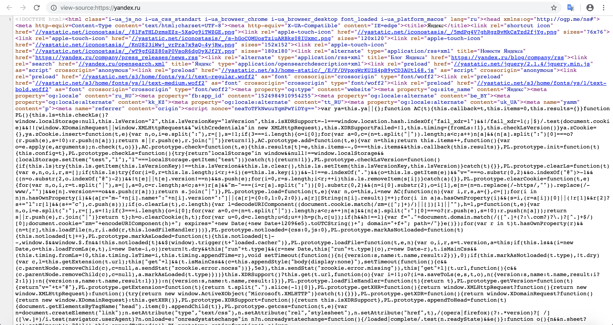
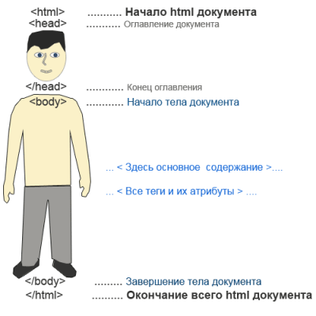
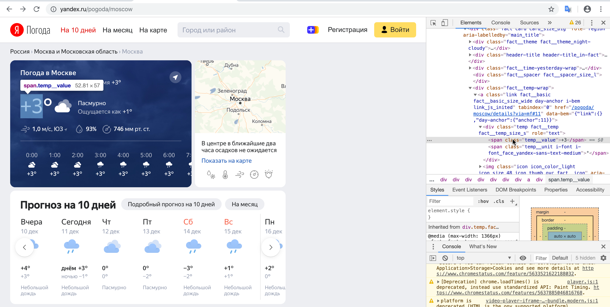
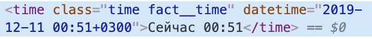

<style>
h1,
h2,
h3,
h4,
h5,
h6  {
  color: #317eac;
}
</style>
---
```{r setup, include=FALSE}
knitr::opts_chunk$set(echo = TRUE, warning = FALSE, message = FALSE, error = TRUE)
```

### HTML

API у веб-сайтов бывает очень редко. А часто оно бывает еще и платным. Поэтому нужно как-то обходится без него. В таких случаях пытаются извлечь информацию с сайта вручную. 

Любой сайт написан на языке HTML. Давайте откроем сайт [яндекса](https://yandex.ru). Мы видим его следующим образом.

<center>

</center>

На самом деле мы можем посмотреть его HTML-код. Для этого нужно в браузере (в Safari не получится) нажать правой кнопкой мыши и выбрать "Просмотр кода страницы". 

<center>

</center>

Можно увидеть вот такой страшный и непонятный код.

<center>

</center>

Это и есть язык верстки сайтов HTML -- Hyper Text Markup Language. Посмотрим как выглядит самый простой html-код.

```
<!DOCTYPE html>
<html>
  <head>
    <meta charset="UTF-8">
    <title>Какая-то страница</title>
  </head>
  <body>
      <H1>Какой-то заголовок</H1>
      <p>Какой-то текст</p>
  </body>
</html>
```

Попробуйте создать текстовый файлик с разрешением _.html_ и посмотреть как он выглядит в браузере.

<center>

</center>

Любой html-код из нескольких частей:

1. `<!DOCTYPE html>` -- это надпись идет в самом начале. В ней указывается, что этот файлик - html, а также указывается его версия.
2. `<html></html>` -- главный тег, внутри которого записывается весь html-код.
3. `<head></head>` -- первый основной тег, внутри которого записывается какая-то мета-информация, которая не будет видна на сайте. Например, кодировка или заголовок страницы.
4. `<body></body>` -- второй основной тег, в котором записывается вся информация, которую видит пользователь на странице.

Как вы могли заметить в html основная концепция заключается в тегах. Есть открывающий тег (<body>) и закрывающий тег (</body>). Между этими тегами могут быть другие теги или что-то другое, например текст. 

Рассмотрим некоторые теги:

* *H1-H6* -- теги для заголовков
* *p* -- тег для абзацев
* *b* -- тег для жирного текста
* *em* -- тег для курсивного текста
* *ul* и *li* -- тег для создания списков

Существует огромное количество тегов. Одним из важных тегов является **div**. Это контейнер (блок) для разметки сайта. Он делит страницу на блоки, внутри которых можно продолжить писать сайт.

<center>

</center>

У тегов также бывают атрибуты. Они записываются в открывающем теге. Вот например тег с атрибутом id равным 1.

```
<div id="1"> </div>
```

Необязательно знать все теги и их атрибуты, главное понимать как они записываются.

### XPath

XPath -- это язык для работы с XML/HTML. Он предназначен, чтобы находить какие-то части внутри html файла. Давайте попробуем спарсить следующий html-документ. Предположим, что тут находятся оценки за какие-то контрольные мероприятия.

```{r}
HTML <- '<!DOCTYPE html>
        <html>
          <head>
            <meta charset="UTF-8">
            <title>Какая-то страница</title>
          </head>
          <body>
              <div class=HW id=1>
                <p>9</p>
              </div>
              <div class=HW id=2>
                <p>10</p>
              </div>
              <div class=HW id=3>
                <p>6</p>
              </div>
              <div class=TEST id=1>
                <p>7</p>
              </div>
          </body>
        </html>'
```

Чтобы работать с html-страницами нам понадобится пакет `rvest`. Давайте скачаем и установим его.

```{r}
# install.packages('rvest')
library(rvest)
```

Первое, что нужно сдеалать это прочитать этот html-документ. Сделать это можно с помощью функции `read_html`. Можно передать ей переменную, в которой находится html или ссылку. 

```{r}
R <- read_html(HTML)
```

Полученный объект является листом. Можно посмотреть его иерархию.

```{r eval=FALSE}
R %>% View()
```

Теперь попробуем вытащить информацию из этого html-документа. Первое, что нам нужно сделать это найти контейнер (контейнеры), в котором находится нужная нам информация. Это можно сделать с помощью функции `html_nodes`. Первый аргумент -- это наш html-документ, а второй аргумент -- XPath. Предположим мы хотим получить информацию по первой домашке. Можно прописать напрямую путь, который ведет к этой информации.

```{r}
html_nodes(R, xpath = 'body/div')
```

С помощью такой команды мы нашли все div, которые находятся в body. Нам нужен первый div, а внутри него нужен p.

```{r}
hw1_html <- html_nodes(R, xpath = 'body/div[1]/p')
hw1_html
```

Вот таким образом мы добрались до оценке по первой домашки. Но это еще не все. Пока что у нас все тот-же html-документ. Нам нужно вытащить из него 9. То есть вытащить текст, который находится в контейнере p. Используем функцию `html_text`.

```{r}
hw1 <- html_text(hw1_html)
```

Вот так мы получили оценку за первую домашку. Она имеет строковый формат. С помощью функции `as.numeric` ее можно перевести в числовой и как-то использовать уже в R.

Пакет `rvest` поддерживает pipe, который вы можете удобно использовать.

```{r}
html_nodes(R, xpath = 'body/div[1]/p') %>%
  html_text()
```

Можно получить оценки за все работы сразу. 

```{r}
html_nodes(R, xpath = 'body/div/p') %>%
  html_text()
```

Подход, когда вы прописываете путь к нужному блоку напрямую не очень хорош. Сайт может немного поменяться и весь ваш парсер сломается. Чтобы такого не просиходило нужно стараться использовать атрибуты контейнеров. Это бывает еще и удобно. Допустим мы хотим получить оценки только по домашкам. Видно, что они лежат в блоках div, у которых атрибут class равен HW. 

* `//div` -- находит в html-документе все контейнеры div (на любом уровне иерархии)
* `//div[@class=1]` -- находит в html-документе все контейнеры div (на любом уровне иерархии) с атрибутом class равным 1
* `//*[@class=1]` -- находит в html-документе все блоки с атрибутом class равным 1

Найдем все конейнеры div, в которых class равен HW.

```{r}
html_nodes(R, xpath = "//div[@class='HW']")
```

Вы можете использовать `html_nodes` несколько раз.

```{r}
html_nodes(R, xpath = "//div[@class='HW']") %>%
  html_nodes(xpath = 'p')
```

Выведем оценки и найдем среднее.

```{r}
html_nodes(R, xpath = "//div[@class='HW']") %>%
  html_nodes(xpath = 'p') %>%
  html_text() %>%
  as.numeric() %>% 
  mean()
```

Можно было также использовать функцию `html_children`, которая выводит все, блоки которые находятся внутри текущих блоков. Но с этой функцией нужно быть аккуратнее.

```{r}
html_nodes(R, xpath = "//div[@class='HW']") %>%
  html_children() %>%
  html_text() %>%
  as.numeric() %>% 
  mean()
```

Вы можете использовать какие-то логические условия. Например выберем первую и вторую домашку.

```{r}
html_nodes(R, xpath = "//div[@class='HW' and (@id=1 or @id=2)]")
```

На [этом сайте](https://devhints.io/xpath) находится прекрасный туториал по языку XPath.

### Парсим погоду

Попробуем парсить погоду в Москве с помощью [Яндекс Погоды](https://yandex.ru/pogoda/moscow). Первое что нужно сделать это загрузить html страницу в R.

```{r}
url <- 'https://yandex.ru/pogoda/moscow'
weather <- read_html(url)
```

Далее нам нужно понять какую информацию мы хотим получить. Давайте зайдем на сайт и посмотрим (используйте любой браузер кроме Safari). 

<center>

</center>

Допусти мы хоти знать температуру и время. Но как можно понять в каком блоке находится эта информация? Можно нажать правой кнопкой мыши на нужную информацию и нажать на "Просмотреть код". Справа или снизу у вас появится окно, в котором будет html-код страницы. Вас перенаправит сразу на тот блок, где находится информация, которую вы запросили.

<center>

</center>

Можно быстро получить XPath до этого контейнера. Нажмите на него правой кнопкой мыши -> Copy -> Copy XPath. Вытащим нужную нам информацию.

```{r}
html_nodes(weather, xpath = '/html/body/div/div[6]/div[1]/div/div[2]/div[1]/div[5]/a/div[1]/span[1]') %>% 
  html_text()
```

Такой код не очень устойчив. Можно заметить, что у блока span есть атрибут class равный temp__value. Попробуем найти нужный блок следующим кодом.

```{r }
html_nodes(weather, xpath = "//span[@class='temp__value']") %>%
  head()
```

Получилось плохо, так блоков с таким классом довольно много. В этом случае можно пытаться сначала взять блок побольше, а потом взять блок внутри него. 

```{r}
html_nodes(weather, xpath = "//div[@class='temp fact__temp fact__temp_size_s']") %>%
  html_nodes(xpath = "span[@class='temp__value']")
``` 

Запомним наше значение.

```{r}
temp <- html_nodes(weather, xpath = "//div[@class='temp fact__temp fact__temp_size_s']") %>%
  html_nodes(xpath = "span[@class='temp__value']") %>%
  html_text() %>%
  as.numeric()

temp
```

Найдем аналогично блок для даты.

<center>

</center>

Видно, что в самом тексте нет полезной информации, кроме времени. Но зато есть полезная информация в атрибуте datetime. С помощью функции `html_attr`.

```{r}
time <- html_nodes(weather, xpath = "//div[@class='fact__time-yesterday-wrap']") %>%
  html_nodes(xpath = "time[@class='time fact__time']") %>%
  html_attr(name = 'datetime')

time
```

С помощью пакетов `stringr` и `lubridate` можно обработать дату.

```{r}
time <- time %>%
  str_sub(start = 1, end = 16) %>%
  ymd_hm()

time
```

Как же автоматизировать процесс вакачивания данных? Допустим мы хотим парсить погоду каждые 2 минуты. Как мы можем сделать это?

```{r eval=FALSE}
temp <- c()
time <- c()
step_minutes <- 2
n <- 2
k <- 0

while(TRUE){
  if(k >= n){
    stop('End')
  }
  k <- k + 1
  
  weather <- read_html(url)
  curr_temp <- html_nodes(weather, xpath = "//div[@class='temp fact__temp fact__temp_size_s']") %>%
    html_nodes(xpath = "span[@class='temp__value']") %>%
    html_text() %>%
    as.numeric()
  
  curr_time <- html_nodes(weather, xpath = "//div[@class='fact__time-yesterday-wrap']") %>%
    html_nodes(xpath = "time[@class='time fact__time']") %>%
    html_attr(name = 'datetime') %>%
    str_sub(start = 1, end = 16) %>%
    ymd_hm()
  
  temp <- c(temp, curr_temp)
  time <- c(time, curr_time)
  
  Sys.sleep(minutes * 60)
}
```

### Таблицы

Бывает, что нужно выкачвть информацию, которая находится в таблице. Чтобы это сделать можно воспользоваться функцией `html_table`.