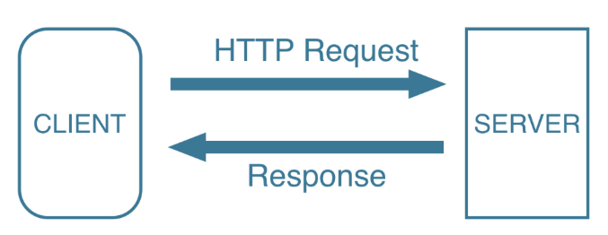
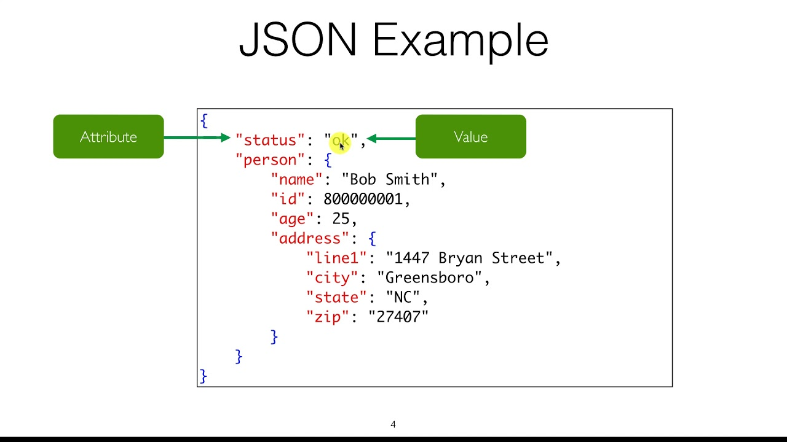

```{r setup, include=FALSE}
knitr::opts_chunk$set(echo = TRUE)
```

## Приготовим пакетики

```{r warning=FALSE, message=FALSE}
packages <- c("readr", "dplyr", "readxl")
# install.packages(packages)
library(readr)
library(readxl)
library(dplyr)
```

## HTTP - HyperText Transfer Protocol

**HTTP** -- это система правил обмена данными между компьютерами. По сути это "язык интернета". Вы сталквиваетесь с протоколом HTTP каждый день, когда сидите в интернете. Допустим, вы открываете какой-то сайт, ваш компьютер - клиент (**client**) делает запрос (**request**) к серверу (**server**). Затем сервер отправляет обратно ответ (**response**), в котором содержатся файлы, с помощью которых получается веб-страница.



Вы можете не только попросить какие-то данные, но и, например, отправить их. Для разных задача есть разные методы для обращения к серверу. Ниже представлены некоторые из них.

1. GET
2. POST
3. HEAD
4. PUT

Нас будет интересовать только получение данных от сервера, поэтому мы сконцентрируем свое внимание на методе GET.

### Простые примеры

#### read_csv

На самом деле вы уже использовали этот метод ранее, когда использовали функцию `read_csv` передавая ей url, где лежит нужная нам csv.

```{r message=FALSE}
url <- 'https://github.com/ahmedushka7/R/raw/master/docs/homeworks/test/data/covid.csv'
df <- read_csv(url)
df %>% head(n = 3)

```

Функция `read_csv` под капотом вызывает метод `GET` и получает csv.

#### download.file

Не всегда можно подгрузить файл из интернета сразу в R. Например, это не работает с excel файлами. 

```{r error=TRUE}
url <- "https://github.com/ahmedushka7/R/blob/master/docs/scripts/hse_data_analysis/sem_7/data_extra/file_excel.xlsx?raw=true"
df <- read_excel(url)
```

Но не очень хочется заходить в браузер, переходить по ссылке, скачивать файл, переносить его из папки с загрузками в нужную директорию, и только потом импортировать его. Особенно грустно, когда таких файлов много и вам постоянно приходится делать это. Хочется скачать его и сразу подгрузить с помощью R.

С помощью функции `file.path` можно создать путь, куда сохранится файл. Она просто расставляет слэши (`/`).

```{r}
url <- "https://github.com/ahmedushka7/R/blob/master/docs/scripts/hse_data_analysis/sem_7/data_extra/file_excel.xlsx?raw=true"
path <- file.path("~", "test.xlsx")
print(path)
```

А теперь используем функцию `download.file`.

```{r}
download.file(url, path)
```

Теперь файл у нас на компьютере и мы можем его подгрузить.

```{r}
df <- read_excel(path)
df
```

Если вы не хотите оставлять файл у себя на компьютере, то можно его удалить.

```{r}
file.remove(path)
```

## Работа с HTTP

### Основы

Если вы хотите делать свои HTTP запросы, то можно использовать библиотеку `httr`. Давайте установим и подгрузим её.

```{r warning=FALSE, message=FALSE}
# install.packages("httr")
library(httr)
```

Давайте попробуем сделать свой первый HTTP запрос. Для этого просто используем функцию `GET`, в которую передадим `url` и запишем результат, который выдаст нам сервер в переменную `response`.

```{r}
url <- "http://www.example.com/"
response <- GET(url)
```

Что такое `response`? Это `list`, в котором хранится некоторая метаинформация о запросе, а также сами данные, которые мы хотели получить.

```{r}
print(response)
```

Из метаинформации стоит обратить на `Status`. Это код, который говорит о том, отработал ли запрос или нет. 

- **200** -- все отлично!
- **404** -- знаменитая ошибка, означающая что страница не найдена
- **5xx** -- семейство ошибок, означающие неполадки со стороны сервера

Все ошибки можно посмотреть по [ссылке](https://ru.wikipedia.org/wiki/Список_кодов_состояния_HTThttps://ru.wikipedia.org/wiki/Список_кодов_состояния_HTTP).

Статус-код можно получить несколькими способами.

```{r collapse=TRUE}
print(response$status_code)  # обращение к листу
print(status_code(response))  # использование функции
```

Другая метаинформация обычно не нужна, поэому хочется получить те данные (контент), которые мы просили. Можно получить их с помощью функции `content`.

```{r}
data <- content(response)
print(data)
```

По дефолту функция `content` сама парсит полученные данные. Но если вы хотите получить "голый" текст, то можете указать второй параметр `as = "text"`.

```{r}
data <- content(response, as = "text")
print(data)
```

Тот ужас, который вы видите перед глазами называется `HTML` страницей. Это код страницы, которую вы видите в браузере. О контенте, который мы получаем и `HTML` мы поговорим позже.

## Что за контент такой?

Ну сделали мы запрос, получили статус код 200, что дальше? Контент, который мы получаем может быть абсолютно разным. Но зачастую, это либо HTML, либо JSON. С HTML мы разберемся на следующем занятии. А вот про JSON поговорим поподробнее.

### JSON


JSON это key-value структура. Есть ключ, а ему соотвествует какое-то значение. По такой структуре очень удобно перемещаться. В R нет JSON, но есть структура данных `list`, которая очень похожа. Если вам все таки потребуется работать с JSON, то попробуйте пакет `jsonlite`. 

### list

Структура данных `list` (список) очень удобна, так как может содержать в себе абсолютно любые другие объекты. В списке может содержаться другой список. Это очень напоминает JSON. Список можно создать с помощью функции `list`.

```{r collapse=TRUE}
my_list <- list(10, "R", c(-12, 13, 14))
print(my_list)
print(class(my_list))
```

Очень удобно здесь использовать функцию `str`, которая может показать структуру списка.

```{r}
str(my_list)
```

В списках можно давать наименования.

```{r}
my_list <- list(number = 10, language = "R", ages = c(20, 30, 44))
str(my_list)
```

В списке могу быть другие списки.

```{r}
my_list = list(flist = list(1, 2), slist = list(3, 4))
str(my_list)
```

Создавать научились, осталось научиться работать с ними. Есть три типа доступа к элементам.

1. `[]` -- берет срез текущего списка, результат список
2. `[[]]` -- переходит в элемент, который содержится в текущем списке
3. `$` -- аналогично `[[]]`, только более просто

```{r}
my_list <- list(number = 10, name = "Ahmed", na = NA, other_list = list(array = rep(1, 4)))
```

```{r}
my_list[1:3] # вернули list с его первыми 3 элементами
```

```{r}
my_list[[1]] # вытащили значение второго элемента
```

```{r}
my_list$number # аналогично, только доступ по имени
```

```{r}
my_list$other_list$array # можно делать даже так
```

Большой функционал для работы с `list` есть в пакете `rlist`.

### Пример

```{r}
url_sw4 <- "http://www.omdbapi.com/?apikey=72bc447a&i=tt0076759&r=json"

response <- GET(url_sw4)
con <- content(response)
str(con)
```

Рейтинг фильма на Metacritic.

```{r}
con$Ratings[[3]]$Value
```


## Проблемы

### Большое количество запросов

Обычно хочется сделать не один HTTP запрос, а очень много. Давайте попробуем сделать 30 запросов на сайт Авито. Будем следить за статус кодом и с помощью функции `Sys.time()` посмотрим как часто будут делаться запросы.

```{r eval=FALSE}
for (i in 1:20) {
  response <- GET(url = "https://www.avito.ru/moskva")
  print(paste("Статус код = ", status_code(response), ", время запроса = ", Sys.time()))
}
```

Если запустить код выше, то будет видно, что запросы делаются буквально каждую секунду. Кажется, что нет ничего плохого в этом, но есть одно но. Сервер не любит, когда один и тот же клиент отправляет много запросов. Если посмотреть на статус код, то сначала он равен 200, а потом будет равен 429 (Too Many Requests). Сервер заблокировал нас на какое-то время.

Нужно умереть пыл и делать запросы не каждую секунду, а с некоторой задержкой. Самый простой способ, это использовать функцию `Sys.sleep`. Она принимает на вход количество секунд, на которое нужно "заснуть". То есть R засыпает на какое-то время и ничего не делает. Давайте делать запрос каждые 4 секунды.

```{r eval=FALSE}
for (i in 1:20) {
  response <- GET(url = "https://www.avito.ru/moskva")
  print(paste("Статус код = ", status_code(response), ", время запроса = ", Sys.time()))
  Sys.sleep(4)
}
```

Более элегантный способ, это использовать функцию `slowly` из пакета `purrr`.

```{r eval=FALSE}
# install.packages("purrr")
library(purrr)
```

Если у вас есть готовая функция, которую вы хотите "замедлить", то можно это сделать следующим образом.

```{r eval=FALSE}
request <- function(url){ # наша функция
  response <- GET(url = url)
}

slowed_request <- slowly(~request, rate = rate_delay(4)) # создаем новую функцию с задержкой в 4 секунды

for (i in 1:20) {
  response <- slowed_request("https://www.avito.ru/moskva")
  print(paste("Статус код = ", status_code(response), ", время запроса = ", Sys.time()))
}
```

### Притвориться человеком

Когда мы делаем HTTP запрос, вместе с ним отправляется некоторая мета информация о нас (клиенте). Можно увидеть эту метаинформацию перейдя на сайт https://httpbin.org/headers. Нас интересует `User-Agent`. Можно увидеть, что там описан браузер, а также устройство с которого мы зашли на сайт. Давайте попробуем сделать аналогичный запрос через R.

```{r}
response <- GET("https://httpbin.org/headers")
cont <- content(response)
cont$headers$`User-Agent`
```

Видно, что `User-Agent` совсем другой. Здесь перечислены некоторые пакеты операционной системы, с помощью которых делается HTTP запрос.

Так как эта информация приходит на сервер, сервер может увидеть, что запрос сделал не человек, а "робот". И просто заблокировать нам доступ (обычно это ошибка 403). К счастью, мы можем менять `User-Agent` так как мы хотим. 

```{r}
response <- GET(url = "https://httpbin.org/headers", 
                user_agent("Hey, my name is Ahmedushka!"))
cont <- content(response)
cont$headers$`User-Agent`
```

Таким образом, мы можем притвориться настоящим человеком.

Установить `User-Agent` можно глобально, он будет применяться ко всем запросам. Это бывает удобно!

```{r}
set_config(add_headers(`User-Agent` = "Hey, my name is Ahmedushka!"))
response <- GET('http://example.com')
cont <- content(response)
cont$headers$`User-Agent`
```

### Парсим через посредников


Даже если вы меняете `User-Agent` и делаете запросы не так часто, сервер может все равно разозлиться, дело в том, что ваш ip адрес остается таким же.

```{r}
response <- GET(url = "https://httpbin.org/ip")
cont <- content(response)
cont$origin
```

Поменять свой ip нельзя, но можно попросить другие серверы с другим ip сделать нужный нам запрос. Для этого есть proxy серверы. Их можно найти на разных сайтах. Вот некоторые из них.

* http://rootjazz.com/proxies/proxies.txt
* https://qna.habr.com/q/591069
* https://getfreeproxylists.blogspot.com

К сожалению, некоторые бесплатные прокси быстро отваливаются, а некоторые и вовсе не работают. Поэтому иногда пишут парсер для поиска хороших прокси, а потом уже с ними парсят то, что нужно.

```{r cache=TRUE, error=TRUE}
response <- GET(url = "https://httpbin.org/ip",
                use_proxy(url = "36.89.148.161", port = 8080))
cont <- content(response)
cont$origin
```
